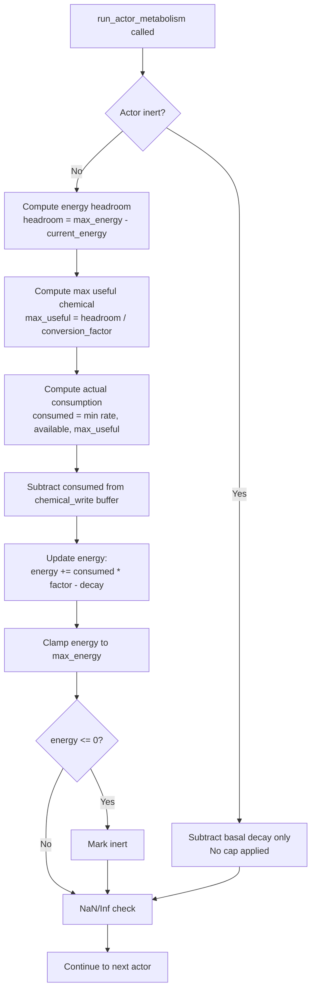

# Design Document: Actor Energy Cap

## Overview

This feature introduces a `max_energy` ceiling on actor energy reserves and converts the metabolism system from supply-driven to demand-driven consumption. The change touches three code paths:

1. **ActorConfig** — new `max_energy: f32` field with serde default and validation.
2. **`run_actor_metabolism`** — consumption computation changes from `min(rate, available)` to `min(rate, available, headroom / conversion_factor)`, followed by a post-metabolism energy clamp.
3. **Config validation** — cross-field checks: `max_energy > 0.0`, `initial_energy <= max_energy`, reject NaN/Inf.

The environment impact is the key behavioral change: a saturated actor extracts less chemical from its cell, leaving more for diffusion and neighboring actors. This creates emergent resource sharing without any explicit cooperation logic.

## Architecture

The change is localized to the WARM metabolism phase within the existing tick orchestration. No new systems, no new phases, no changes to tick ordering.



### Tick Phase Integration

No changes to `TickOrchestrator::step` or `run_actor_phases`. The metabolism function signature remains identical — `ActorConfig` already passes through by reference, and the new `max_energy` field is read from it.

## Components and Interfaces

### Modified: `ActorConfig` (`src/grid/actor_config.rs`)

Add one field:

```rust
pub struct ActorConfig {
    // ... existing fields ...
    /// Maximum energy an Actor can hold. Energy is clamped to this
    /// ceiling after each metabolic tick. Must be > 0.0 and >= initial_energy.
    pub max_energy: f32,
}
```

Default value: `50.0` — chosen to give actors ~260 ticks of idle survival at `base_energy_decay = 0.03` while creating meaningful saturation pressure on sources with `energy_conversion_factor = 1.8` and `consumption_rate = 1.0` (net gain ~1.77/tick → saturates in ~24 ticks from `initial_energy = 8.0`).

### Modified: `run_actor_metabolism` (`src/grid/actor_systems.rs`)

The active-actor branch changes from:

```rust
let available = chemical_read[ci];
let consumed = config.consumption_rate.min(available);
```

To:

```rust
let available = chemical_read[ci];
let headroom = (config.max_energy - actor.energy).max(0.0);
let max_useful = headroom / config.energy_conversion_factor;
let consumed = config.consumption_rate.min(available).min(max_useful);
```

After the energy update line, add the clamp:

```rust
actor.energy = actor.energy.min(config.max_energy);
```

The clamp after the energy update is a safety net — the demand-driven consumption should already prevent overshoot in the common case, but floating-point arithmetic can produce values marginally above `max_energy`. The clamp guarantees the invariant holds.

### Modified: `validate_world_config` (`src/io/config_file.rs`)

Add two checks when `actor` config is present:

1. `max_energy > 0.0 && max_energy.is_finite()` — reject zero, negative, NaN, Inf.
2. `initial_energy <= max_energy` — initial state must respect the cap.

### No changes to:

- `Actor` struct — no new fields needed.
- `run_actor_sensing` — unaffected by energy cap.
- `run_actor_movement` — unaffected by energy cap.
- `run_deferred_removal` — unaffected by energy cap.
- `run_emission` / `SourceRegistry` — sources emit independently of actor state.
- `TickOrchestrator` — phase ordering unchanged.

## Data Models

### ActorConfig (updated)

| Field | Type | Default | Constraint |
|---|---|---|---|
| `consumption_rate` | `f32` | `1.5` | >= 0.0 |
| `energy_conversion_factor` | `f32` | `2.0` | > 0.0 |
| `base_energy_decay` | `f32` | `0.05` | >= 0.0 |
| `initial_energy` | `f32` | `10.0` | > 0.0, <= max_energy |
| `initial_actor_capacity` | `usize` | `64` | > 0 |
| `movement_cost` | `f32` | `0.5` | >= 0.0 |
| `removal_threshold` | `f32` | `-5.0` | <= 0.0 |
| `max_energy` | `f32` | `50.0` | > 0.0, finite, >= initial_energy |

### Metabolism Computation (per active actor per tick)

```
headroom       = max(0.0, max_energy - actor.energy)
max_useful     = headroom / energy_conversion_factor
consumed       = min(consumption_rate, available_chemical, max_useful)
chemical_delta = -consumed                          (subtracted from write buffer)
energy_delta   = consumed * energy_conversion_factor - base_energy_decay
actor.energy   = min(actor.energy + energy_delta, max_energy)
```

### TOML Schema Addition

```toml
[actor]
# ... existing fields ...
max_energy = 50.0   # Maximum energy capacity. Must be > 0, finite, >= initial_energy.
```


## Correctness Properties

*A property is a characteristic or behavior that should hold true across all valid executions of a system — essentially, a formal statement about what the system should do. Properties serve as the bridge between human-readable specifications and machine-verifiable correctness guarantees.*

### Property 1: Invalid max_energy rejected

*For any* `ActorConfig` where `max_energy` is less than or equal to zero, NaN, or infinite, configuration validation shall return an error.

**Validates: Requirements 1.2, 5.3**

### Property 2: Initial energy within cap

*For any* `ActorConfig` where `initial_energy > max_energy` (and both are otherwise valid), configuration validation shall return an error.

**Validates: Requirements 1.3**

### Property 3: Post-metabolism energy invariant

*For any* active (non-inert) Actor with any energy level, and any cell chemical concentration, after `run_actor_metabolism` completes, the Actor's energy shall be less than or equal to `max_energy`.

**Validates: Requirements 2.1, 2.2**

### Property 4: Demand-driven consumption and environmental conservation

*For any* active Actor with energy `e`, on a cell with chemical concentration `c`, with config values `consumption_rate`, `energy_conversion_factor`, and `max_energy`:
- The consumed amount shall equal `min(consumption_rate, c, max(0, (max_energy - e) / energy_conversion_factor))`.
- The chemical removed from the cell's write buffer shall equal exactly the consumed amount.
- When `e >= max_energy`, consumed shall be zero and the cell chemical shall be unchanged.

**Validates: Requirements 3.3, 3.4, 3.5**

### Property 5: Inert actors unaffected by energy cap

*For any* inert Actor with energy `e` on a cell with chemical concentration `c`, after `run_actor_metabolism` completes:
- The Actor's energy shall equal `e - base_energy_decay` (no clamping applied).
- The cell's chemical write buffer shall be unchanged (zero extraction).

**Validates: Requirements 4.1, 4.2**

### Property 6: ActorConfig TOML round-trip

*For any* valid `ActorConfig` (including `max_energy`), serializing to TOML and deserializing back shall produce an equivalent `ActorConfig`.

**Validates: Requirements 5.1**

### Documentation Updates

The `example_config.toml` and `README.md` must be updated to include the `max_energy` field. This is a straightforward text edit — no code logic involved.

- `example_config.toml`: Add `max_energy = 50.0` to the `[actor]` section with a comment explaining the field.
- `README.md`: Add `max_energy` to any actor configuration documentation if present.

## Error Handling

All error paths use the existing error infrastructure — no new error types required.

| Condition | Error Type | Source |
|---|---|---|
| `max_energy <= 0.0` | `ConfigError::Validation` | `validate_world_config` |
| `max_energy` is NaN or Inf | `ConfigError::Validation` | `validate_world_config` |
| `initial_energy > max_energy` | `ConfigError::Validation` | `validate_world_config` |
| Actor energy becomes NaN/Inf post-clamp | `TickError::NumericalError` | `run_actor_metabolism` |

The existing NaN/Inf check in `run_actor_metabolism` already covers the post-clamp case — the check runs after the energy update, which now includes the clamp. No additional error handling code is needed beyond the validation additions.

## Testing Strategy

### Property-Based Testing

Use the `proptest` crate (already idiomatic for Rust simulation projects). Each property test runs a minimum of 100 iterations with generated inputs.

| Property | Generator Strategy |
|---|---|
| Property 1: Invalid max_energy rejected | Generate `f32` values in `(-Inf, 0.0]` ∪ `{NaN, Inf}`, construct `ActorConfig` with that `max_energy` |
| Property 2: Initial energy within cap | Generate valid `max_energy > 0.0`, then `initial_energy` in `(max_energy, max_energy * 10.0]` |
| Property 3: Post-metabolism energy invariant | Generate random `(energy, max_energy, cell_chemical, consumption_rate, conversion_factor, decay)` tuples, run metabolism on a single actor, assert `energy <= max_energy` |
| Property 4: Demand-driven consumption | Same generator as Property 3, additionally verify consumed amount and chemical delta |
| Property 5: Inert actors unaffected | Generate random inert actors with arbitrary energy and cell chemical, run metabolism, verify energy = e - decay and chemical unchanged |
| Property 6: TOML round-trip | Generate random valid `ActorConfig` structs (all fields in valid ranges), serialize to TOML string, deserialize back, assert equality |

### Unit Tests

Unit tests complement property tests for specific examples and edge cases:

- Actor exactly at `max_energy` consumes zero chemical (edge case of Property 4).
- Actor one unit below `max_energy` consumes only enough to reach cap.
- Default `ActorConfig` passes validation (example for Requirement 1.4).
- Omitted `max_energy` in TOML uses default (example for Requirement 5.2).
- Existing metabolism tests updated to pass a valid `max_energy` — regression coverage.

### Test Tagging

Each property test must include a comment referencing its design property:

```rust
// Feature: actor-energy-cap, Property 3: Post-metabolism energy invariant
// Validates: Requirements 2.1, 2.2
```
