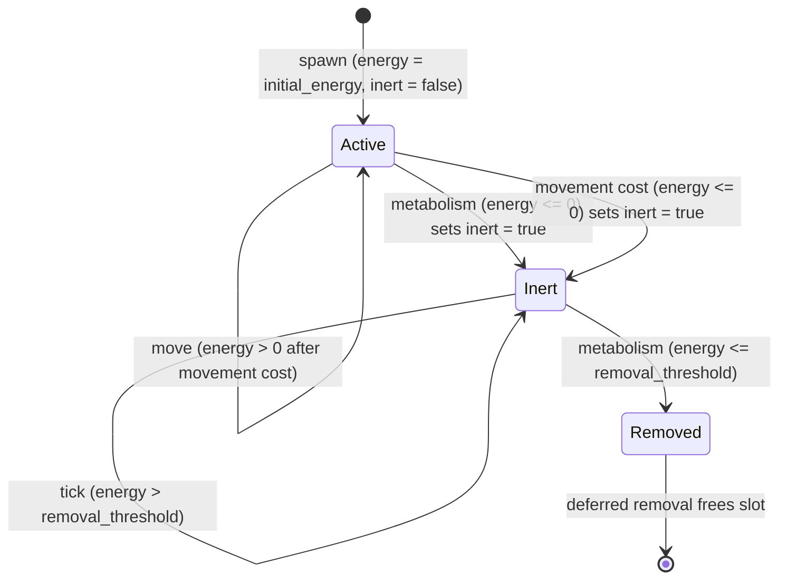

# Design Document: Actor Energy Costs

## Overview

This feature adds movement energy costs and an inert actor state to the simulation. The existing codebase already implements basal metabolic cost (`base_energy_decay` subtracted per tick in `run_actor_metabolism`) and deferred removal of actors with `energy <= 0.0`. Two gaps remain:

1. **Movement is free.** `run_actor_movement` relocates actors without any energy deduction.
2. **Death is instantaneous.** Actors go from alive to removed in a single tick with no intermediate state.

The design adds a `movement_cost` field to `ActorConfig`, deducts energy on successful movement, introduces a `bool` inert flag on `Actor`, and modifies the sensing/metabolism/movement systems to respect inert state. Configuration validation catches invalid values at construction time.

All changes are confined to the WARM-path actor systems. No new allocations, no dynamic dispatch, no new data structures beyond a single `bool` field on `Actor` and two `f32` fields on `ActorConfig`.

## Architecture

### Phase Ordering (unchanged structure, modified behavior)

The tick phase order remains:

```
Sensing → Metabolism → Deferred Removal → Movement
```

Modifications per phase:

| Phase | Current Behavior | New Behavior |
|---|---|---|
| Sensing | All actors sense gradients | Skip inert actors (`movement_targets[slot] = None`) |
| Metabolism | Consume chemicals, subtract `base_energy_decay`, mark `energy <= 0` for removal | Consume chemicals only for non-inert actors. Subtract `base_energy_decay` for all actors. Mark non-inert actors with `energy <= 0` as inert. Mark inert actors with `energy <= removal_threshold` for removal. |
| Deferred Removal | Remove actors in `removal_buffer` | Unchanged |
| Movement | Move actors to target cell, no energy cost | Skip inert actors. Subtract `movement_cost` from energy on successful move. If energy drops to zero or below after movement cost, mark actor as inert (not immediate removal — metabolism handles the decay-to-removal transition next tick). |

### Design Decision: Movement Death → Inert, Not Removal

When movement cost drops an actor to `energy <= 0`, the actor is marked inert rather than added to the removal buffer. Rationale:

- Metabolism already handles the inert → removal transition via `removal_threshold`.
- Keeping one code path for removal (metabolism phase) avoids dual-source removal logic.
- The actor becomes inert at its destination cell, which is biologically coherent — it "collapsed" after expending its last energy to move.

### Design Decision: Inert Actors Still Pay Basal Cost

Inert actors continue to lose energy via `base_energy_decay` each tick. This models biological reality: a dormant organism still has cellular maintenance costs. The `removal_threshold` (a negative value) determines how long an inert actor persists before permanent removal. This creates a window where an inert actor could theoretically be "rescued" by future mechanics (e.g., symbiotic energy transfer from a neighboring actor).

## Components and Interfaces

### Modified: `Actor` (src/grid/actor.rs)

```rust
#[derive(Debug, Clone, Copy, PartialEq)]
pub struct Actor {
    pub cell_index: usize,
    pub energy: f32,
    pub inert: bool,  // NEW: true when energy has hit zero
}
```

Adding `inert: bool` keeps `Actor` at 12 bytes (with padding) — `Copy` and cache-friendly. No heap allocation.

### Modified: `ActorConfig` (src/grid/actor_config.rs)

```rust
#[derive(Debug, Clone, PartialEq)]
pub struct ActorConfig {
    pub consumption_rate: f32,
    pub energy_conversion_factor: f32,
    pub base_energy_decay: f32,
    pub initial_energy: f32,
    pub initial_actor_capacity: usize,
    pub movement_cost: f32,        // NEW: energy per cell traversed
    pub removal_threshold: f32,    // NEW: energy below which inert actors are removed (negative)
}
```

### Modified: `GridError` (src/grid/error.rs)

New variant for actor config validation:

```rust
pub enum GridError {
    // ... existing variants ...
    InvalidActorConfig { field: &'static str, value: f32, reason: &'static str },
}
```

### Modified System Signatures

No signature changes to the public system functions. The behavior changes are internal to the existing function bodies:

- `run_actor_sensing` — adds `if actor.inert { continue; }` guard
- `run_actor_metabolism` — splits logic for inert vs active actors, uses `removal_threshold`
- `run_actor_movement` — adds inert skip, subtracts `movement_cost`, sets `inert = true` on energy depletion

`run_actor_movement` gains two new parameters:

```rust
pub fn run_actor_movement(
    actors: &mut ActorRegistry,
    occupancy: &mut [Option<usize>],
    movement_targets: &[Option<usize>],
    movement_cost: f32,          // NEW
    inert_buffer: &mut Vec<usize>, // NEW: slot indices of actors that went inert during movement
) -> Result<(), TickError>
```

Wait — introducing `inert_buffer` adds complexity. Simpler approach: just set `actor.inert = true` inline during the mutable iteration. We already have `&mut Actor` in the loop. No buffer needed.

Revised: `run_actor_movement` takes `movement_cost: f32` and a `&ActorConfig` reference (or just the `f32` directly). Returns `Result<(), TickError>` for NaN validation.

```rust
pub fn run_actor_movement(
    actors: &mut ActorRegistry,
    occupancy: &mut [Option<usize>],
    movement_targets: &[Option<usize>],
    movement_cost: f32,
) -> Result<(), TickError>
```

### Validation in `Grid::new`

Added to `Grid::new` after existing validation, when `actor_config` is `Some`:

```rust
if ac.movement_cost < 0.0 {
    return Err(GridError::InvalidActorConfig {
        field: "movement_cost", value: ac.movement_cost,
        reason: "must be non-negative",
    });
}
if ac.removal_threshold > 0.0 {
    return Err(GridError::InvalidActorConfig {
        field: "removal_threshold", value: ac.removal_threshold,
        reason: "must be non-positive (negative or zero)",
    });
}
if ac.base_energy_decay < 0.0 {
    return Err(GridError::InvalidActorConfig {
        field: "base_energy_decay", value: ac.base_energy_decay,
        reason: "must be non-negative",
    });
}
```

## Data Models

### Actor State Machine



### Energy Flow Per Tick (for an active actor)

```
energy_start
  - base_energy_decay                    [metabolism phase]
  + consumed * energy_conversion_factor  [metabolism phase]
  - movement_cost (if moved)             [movement phase]
= energy_end
```

For an inert actor:

```
energy_start
  - base_energy_decay                    [metabolism phase]
  (no consumption, no movement)
= energy_end
```

### Configuration Constraints

| Field | Type | Valid Range | Default Suggestion |
|---|---|---|---|
| `movement_cost` | `f32` | `>= 0.0` | `0.5` |
| `removal_threshold` | `f32` | `<= 0.0` | `-5.0` |
| `base_energy_decay` | `f32` | `>= 0.0` | (already exists) |


## Correctness Properties

*A property is a characteristic or behavior that should hold true across all valid executions of a system — essentially, a formal statement about what the system should do. Properties serve as the bridge between human-readable specifications and machine-verifiable correctness guarantees.*

### Property 1: Movement cost applied if and only if actor moved

*For any* active actor with energy `e` and configured `movement_cost` `c`, after running the movement system, the actor's energy should equal `e - c` if the actor's `cell_index` changed, and `e` if it did not.

**Validates: Requirements 1.1, 1.2**

### Property 2: Movement-induced energy depletion sets inert

*For any* active actor whose energy after subtracting `movement_cost` is less than or equal to zero, the movement system should set the actor's `inert` flag to `true`.

**Validates: Requirements 1.4**

### Property 3: Metabolism-induced energy depletion sets inert

*For any* active (non-inert) actor whose energy after metabolism (consumption gain minus `base_energy_decay`) is less than or equal to zero, the metabolism system should set the actor's `inert` flag to `true` and should not add the actor to the removal buffer.

**Validates: Requirements 2.1**

### Property 4: Inert actors do not sense or move

*For any* inert actor, after running the sensing system, the actor's `movement_targets` entry should be `None`. After running the movement system, the actor's `cell_index` should be unchanged.

**Validates: Requirements 2.2, 2.4**

### Property 5: Inert actors lose only basal cost with no chemical consumption

*For any* inert actor at cell `c` with energy `e`, after running the metabolism system, the actor's energy should equal `e - base_energy_decay`, and the chemical concentration at cell `c` should be unchanged by the actor.

**Validates: Requirements 2.3**

### Property 6: Inert actors below removal threshold are scheduled for removal

*For any* inert actor whose energy after basal decay falls below `removal_threshold`, the metabolism system should add the actor to the removal buffer.

**Validates: Requirements 2.5**

### Property 7: NaN/Inf energy triggers numerical error

*For any* actor where an energy deduction produces NaN or infinite energy (e.g., starting energy is NaN, movement_cost is Inf), the system performing the deduction should return `Err(TickError::NumericalError)`.

**Validates: Requirements 3.2**

## Error Handling

### Numerical Errors

Both `run_actor_metabolism` and `run_actor_movement` validate energy after deduction. If `energy.is_nan() || energy.is_infinite()`, they return `TickError::NumericalError` with the system name, cell index, field name, and offending value. This matches the existing pattern in `run_actor_metabolism`.

### Configuration Errors

`Grid::new` validates `ActorConfig` fields when `actor_config` is `Some`. Invalid values produce `GridError::InvalidActorConfig` with the field name, value, and reason string. Validation runs before any allocation, so invalid configs fail fast.

### Removal Errors

No change. `run_deferred_removal` already handles stale `ActorId` via generational index validation, converting to `TickError` in the tick orchestrator.

## Testing Strategy

### Property-Based Testing

Use the `proptest` crate for property-based testing. Each property test runs a minimum of 100 iterations with generated inputs.

Generators needed:
- `ActorConfig` generator: valid configs with `movement_cost >= 0`, `removal_threshold <= 0`, `base_energy_decay >= 0`, reasonable ranges for other fields.
- `Actor` generator: random `cell_index` within grid bounds, random `energy` in a useful range (e.g., `-10.0..100.0`), random `inert` flag.
- Grid setup helper: small grids (e.g., 4x4) with a few actors placed, chemical buffers initialized.

Each property test is tagged with:
```
// Feature: actor-energy-costs, Property N: <property text>
```

### Unit Tests

Unit tests cover specific examples and edge cases:
- Config validation rejects negative `movement_cost`, positive `removal_threshold`, negative `base_energy_decay`.
- Actor at exactly zero energy after metabolism → becomes inert (boundary).
- Actor at exactly `removal_threshold` after basal decay → scheduled for removal (boundary).
- Actor with `movement_cost = 0.0` → moves without energy change.
- Inert actor with no movement target → position unchanged.
- NaN energy input → `TickError::NumericalError` returned.

### Test Organization

Tests live in `#[cfg(test)] mod tests` blocks within the modified source files, following the existing pattern in `actor_systems.rs`. Property tests use `proptest!` macro blocks alongside unit tests.
