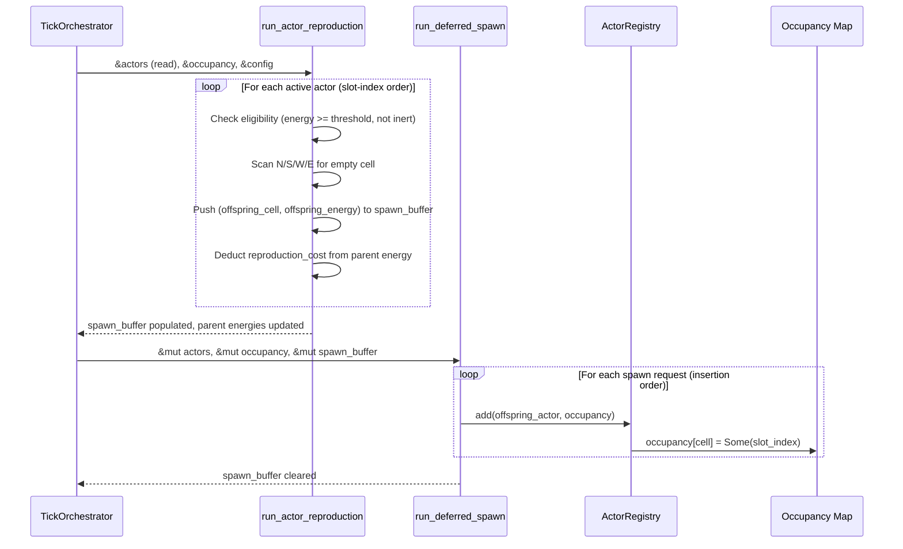

# Design Document: Actor Reproduction (Binary Fission)

## Overview

Binary fission adds a reproduction phase to the simulation tick. When an active Actor's energy meets or exceeds a configurable threshold, it splits: the parent loses energy, and a new offspring Actor is placed in the first available Von Neumann neighbor cell. The system uses deferred spawning (mirroring the existing deferred removal pattern) to avoid mutating the ActorRegistry during iteration.

The reproduction phase slots into the existing tick pipeline between deferred removal and movement. This ensures actors metabolize first (potentially gaining enough energy to reproduce), dead actors are cleaned up, and then reproduction runs before movement relocates anyone.

Key design decisions:
- Reuse the existing `direction_to_target` helper for neighbor cell computation.
- Deferred spawn buffer lives on `Grid`, pre-allocated at construction, mirroring `removal_buffer`.
- Offspring placement updates occupancy eagerly within the spawn buffer processing loop, so later spawns in the same tick see earlier offspring as occupied. This is deterministic because spawn buffer is processed in slot-index order.

## Architecture

The reproduction system follows the same stateless-function-over-borrowed-data pattern as all other actor systems.



### Tick Phase Ordering (Updated)

| Phase | System | Classification |
|---|---|---|
| 0 | Emission + Respawn | WARM |
| 1 | Actor Sensing | WARM |
| 2 | Actor Metabolism | WARM |
| 3 | Deferred Removal | WARM |
| **4** | **Actor Reproduction** | **WARM** |
| **4.5** | **Deferred Spawn** | **WARM** |
| 5 | Actor Movement | WARM |
| 6 | Chemical Diffusion | HOT |
| 7 | Chemical Decay | HOT |
| 8 | Heat Radiation | HOT |

## Components and Interfaces

### New Function: `run_actor_reproduction`

```rust
/// WARM PATH: Executes per tick over all active actors.
/// Scans eligible actors for binary fission, populates spawn_buffer,
/// and deducts reproduction_cost from parent energy.
pub fn run_actor_reproduction(
    actors: &mut ActorRegistry,
    occupancy: &[Option<usize>],
    config: &ActorConfig,
    spawn_buffer: &mut Vec<(usize, f32)>,  // (target_cell_index, offspring_energy)
    w: usize,
    h: usize,
) -> Result<(), TickError>
```

Behavior:
1. Clear `spawn_buffer`.
2. Iterate `actors.iter_mut_with_ids()` (ascending slot-index order).
3. For each actor: skip if `inert`, skip if `energy < reproduction_threshold`.
4. Scan directions 0..4 (N, S, W, E) via `direction_to_target`. For each candidate cell:
   - Check `occupancy[cell].is_none()`.
   - Check that no pending spawn in `spawn_buffer` targets this cell.
   - If both pass, select this cell.
6. If no cell found, skip (reproduction blocked).
7. Deduct `reproduction_cost` from parent energy. Push `(target_cell, offspring_energy)` to `spawn_buffer`.

The spawn buffer collision check (step 5, second bullet) is necessary because occupancy is read-only during the scan. Without it, two adjacent parents could both target the same empty cell. The buffer is small (bounded by eligible actors per tick), so linear scan is acceptable for a WARM path.

### New Function: `run_deferred_spawn`

```rust
/// Process the spawn buffer: insert offspring Actors into the registry
/// and update the occupancy map.
pub fn run_deferred_spawn(
    actors: &mut ActorRegistry,
    occupancy: &mut [Option<usize>],
    spawn_buffer: &mut Vec<(usize, f32)>,
    cell_count: usize,
) -> Result<(), TickError>
```

Behavior:
1. For each `(cell_index, energy)` in `spawn_buffer` (insertion order = deterministic):
   - Construct `Actor { cell_index, energy, inert: false, tumble_direction: 0, tumble_remaining: 0 }`.
   - Call `actors.add(actor, cell_count, occupancy)`.
   - Map `ActorError` to `TickError` (cell occupied at this point is a logic bug).
2. Clear `spawn_buffer`.

### Modified: `ActorConfig`

New fields added to the existing struct:

```rust
/// Energy threshold for binary fission. Actor must have energy >= this value.
/// Must be > 0.0.
pub reproduction_threshold: f32,

/// Total energy deducted from the parent upon fission.
/// Must be > 0.0 and >= offspring_energy.
pub reproduction_cost: f32,

/// Energy assigned to the offspring Actor at creation.
/// Must be > 0.0 and <= max_energy.
pub offspring_energy: f32,

```

Default values:
- `reproduction_threshold`: `20.0` — actors need meaningful energy accumulation before splitting.
- `reproduction_cost`: `12.0` — significant investment, parent retains `energy - 12.0`.
- `offspring_energy`: `10.0` — matches `initial_energy` default, offspring starts viable but not rich.

### Modified: `Grid` struct

New field:

```rust
/// Pre-allocated buffer for deferred Actor spawning during reproduction.
spawn_buffer: Vec<(usize, f32)>,
```

Pre-allocated to `initial_actor_capacity` at construction time (same as `removal_buffer`).

### Modified: `Grid::take_actors` / `Grid::put_actors`

Extended to include `spawn_buffer` in the tuple, following the same borrow-splitting pattern.

### Modified: `Grid::new`

Additional validation for reproduction config fields:
- `reproduction_threshold > 0.0`
- `reproduction_cost > 0.0`
- `offspring_energy > 0.0`
- `reproduction_cost >= offspring_energy`
- `offspring_energy <= max_energy`
- `reproduction_threshold >= reproduction_cost` (parent retains non-negative energy after fission)

### Modified: `run_actor_phases` in `tick.rs`

Insert reproduction + deferred spawn between deferred removal (phase 3) and movement (phase 4).

## Data Models

### Spawn Buffer Entry

A simple tuple `(usize, f32)` — target cell index and offspring energy. No struct needed; this is a transient buffer cleared every tick.

### Actor (unchanged)

The `Actor` struct is not modified. Offspring are constructed from existing fields:

```rust
Actor {
    cell_index: target_cell,
    energy: config.offspring_energy,
    inert: false,
    tumble_direction: 0,
    tumble_remaining: 0,
}
```

### ActorConfig (extended)

```rust
#[derive(Debug, Clone, PartialEq, Serialize, Deserialize)]
#[serde(default)]
pub struct ActorConfig {
    // ... existing fields ...

    /// Energy threshold for binary fission. Must be > 0.0.
    pub reproduction_threshold: f32,
    /// Total energy deducted from parent upon fission. Must be > 0.0, >= offspring_energy.
    pub reproduction_cost: f32,
    /// Energy assigned to offspring at creation. Must be > 0.0, <= max_energy.
    pub offspring_energy: f32,
}
```


## Correctness Properties

*A property is a characteristic or behavior that should hold true across all valid executions of a system — essentially, a formal statement about what the system should do. Properties serve as the bridge between human-readable specifications and machine-verifiable correctness guarantees.*

Properties are derived from the acceptance criteria in the requirements document. Each property is universally quantified ("for all/any") and references the specific requirements it validates.

### Property 1: Eligibility correctness

*For any* set of Actors with varying energy levels and inert states, and a valid ActorConfig, the reproduction system should produce a spawn entry if and only if the Actor is not inert and its energy is greater than or equal to `reproduction_threshold`. Actors that do not meet both conditions should have their state unchanged after the reproduction phase.

**Validates: Requirements 1.1, 1.2, 1.3**

### Property 2: Placement direction correctness

*For any* eligible Actor on a grid of arbitrary dimensions, the offspring cell should be the first unoccupied Von Neumann neighbor in the fixed scan order North (dir=0), South (dir=1), West (dir=2), East (dir=3). If all neighbors are occupied or out of bounds, no spawn entry should be produced and the parent's state should be unchanged.

**Validates: Requirements 2.1, 2.2, 2.3, 7.2**

### Property 3: Energy conservation on fission

*For any* successful binary fission event, the parent Actor's energy after fission should equal its energy before fission minus `reproduction_cost`, and the offspring's energy in the spawn buffer should equal `offspring_energy`.

**Validates: Requirements 3.1, 3.2**

### Property 4: Offspring initial state

*For any* offspring Actor created by deferred spawn, its `inert` flag should be `false`, its `tumble_remaining` should be `0`, and its `cell_index` should match the target cell from the spawn buffer entry.

**Validates: Requirements 4.1, 4.2, 4.3**

### Property 5: No duplicate spawn targets

*For any* grid state where multiple Actors are eligible for reproduction in the same tick, no two entries in the spawn buffer should target the same cell index. This ensures that sequential processing in slot-index order correctly prevents collisions.

**Validates: Requirements 7.3**

### Property 6: Config validation rejects invalid reproduction parameters

*For any* `ActorConfig` where at least one reproduction field violates its constraint (threshold <= 0, cost <= 0, offspring_energy <= 0, cost < offspring_energy, offspring_energy > max_energy, threshold < cost), `Grid::new` should return an error.

**Validates: Requirements 3.3, 3.4, 3.5, 9.1, 9.2, 9.3, 9.4, 9.5, 9.6**

### Property 7: Deferred spawn occupancy consistency

*For any* non-empty spawn buffer, after `run_deferred_spawn` completes, every offspring cell_index should have `occupancy[cell_index] == Some(slot_index)` where `slot_index` is the registry slot of the newly inserted Actor, and the Actor at that slot should match the spawn buffer entry.

**Validates: Requirements 5.2**

## Error Handling

### Reproduction Phase Errors

The reproduction system propagates errors via `Result<(), TickError>`:

- **NaN/Inf energy after deduction**: If subtracting `reproduction_cost` from a parent produces NaN or Inf, return `TickError::NumericalError` with `system: "actor_reproduction"`. This mirrors the existing metabolism NaN check.
- **Spawn buffer cell conflict**: If `run_deferred_spawn` encounters a cell that is already occupied (logic bug — the scan should have prevented this), the `ActorError::CellOccupied` is mapped to `TickError::NumericalError` for uniform error propagation, matching the existing deferred removal pattern.

### Config Validation Errors

All reproduction config validation errors use the existing `GridError::InvalidActorConfig { field, value, reason }` variant. No new error variants are needed.

| Condition | field | reason |
|---|---|---|
| `reproduction_threshold <= 0.0` | `"reproduction_threshold"` | `"must be positive"` |
| `reproduction_cost <= 0.0` | `"reproduction_cost"` | `"must be positive"` |
| `offspring_energy <= 0.0` | `"offspring_energy"` | `"must be positive"` |
| `reproduction_cost < offspring_energy` | `"reproduction_cost"` | `"must be >= offspring_energy"` |
| `offspring_energy > max_energy` | `"offspring_energy"` | `"must be <= max_energy"` |
| `reproduction_threshold < reproduction_cost` | `"reproduction_threshold"` | `"must be >= reproduction_cost so parent retains non-negative energy"` |

## Testing Strategy

### Property-Based Testing

Use the `proptest` crate for property-based testing. Each property test runs a minimum of 100 iterations with generated inputs.

Generators needed:
- **ActorConfig generator**: Produces valid reproduction configs with constrained ranges (threshold in `[1.0, 100.0]`, cost in `[1.0, threshold]`, offspring_energy in `[1.0, cost]`, max_energy >= offspring_energy).
- **Grid state generator**: Produces a small grid (3x3 to 10x10) with a random number of actors placed at random cells, with random energy levels and inert states. Some actors should be above threshold, some below, some inert with high energy.
- **Invalid config generator**: Produces ActorConfig values that violate at least one reproduction constraint.

Each property test is tagged with a comment referencing the design property:
```
// Feature: actor-reproduction, Property N: <property title>
```

### Unit Tests

Unit tests complement property tests for specific examples and edge cases:

- Corner cell reproduction: actor at (0,0) on a 3x3 grid — only South and East are valid neighbors.
- Fully surrounded actor: all 4 neighbors occupied — reproduction blocked, energy unchanged.
- Exact threshold: actor energy == reproduction_threshold — should reproduce.
- Multiple eligible actors competing for the same empty cell — first in slot order wins.
- Inert actor with energy above threshold — skipped.

### Test Organization

Tests live in `src/grid/actor_systems.rs` as `#[cfg(test)] mod tests`, co-located with the reproduction system functions. This follows the existing pattern where metabolism and sensing tests are in the same file.
