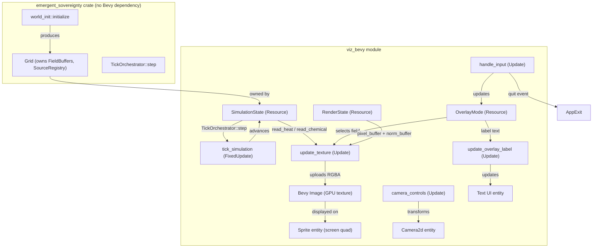
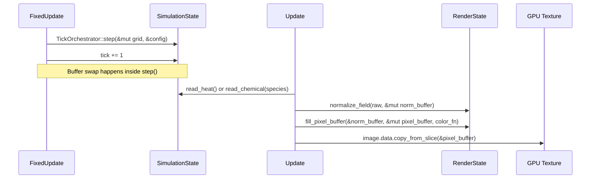

# Design Document: Bevy Grid Visualization

## Overview

This design describes a Bevy-based 2D visualization frontend for the existing headless grid simulation. The Bevy layer is a thin read-only consumer: it owns a `Grid` instance, advances it on a fixed timestep via `TickOrchestrator::step`, reads field buffers, normalizes values, maps them to RGBA colors, and uploads the result to a GPU texture each frame. The core simulation crate has zero Bevy dependencies.

The architecture follows a resource-driven Bevy ECS pattern: simulation state lives in a `SimulationState` resource, rendering state in a `RenderState` resource, and all logic is expressed as stateless Bevy systems operating on these resources plus standard Bevy queries.

## Architecture



### Tick Phasing

| Bevy Schedule | System | Thermal | Description |
|---|---|---|---|
| `FixedUpdate` | `tick_simulation` | WARM | Calls `TickOrchestrator::step`, increments tick counter |
| `Update` | `handle_input` | COLD | Reads keyboard/mouse, updates `OverlayMode`, sends `AppExit` |
| `Update` | `camera_controls` | COLD | Reads mouse wheel/drag, updates camera transform |
| `Update` | `update_texture` | WARM | Normalizes field, maps colors, writes pixel buffer, uploads texture |
| `Update` | `update_overlay_label` | COLD | Syncs label text with current `OverlayMode` |

The simulation tick runs in `FixedUpdate` so it advances at a constant rate regardless of render FPS. Rendering reads from the read buffer, which is only swapped during `FixedUpdate` — no race between tick and render.

## Components and Interfaces

### Bevy Resources

```rust
/// Wraps the simulation state. Inserted as a Bevy resource.
/// WARM: accessed every fixed tick and every render frame.
#[derive(Resource)]
pub struct SimulationState {
    pub grid: Grid,
    pub config: GridConfig,
    pub tick: u64,
    pub running: bool,
}

/// Pre-allocated buffers for the render path. Inserted as a Bevy resource.
/// WARM: accessed every render frame. Zero allocations after init.
#[derive(Resource)]
pub struct RenderState {
    /// RGBA pixel buffer: length = width * height * 4.
    pub pixel_buffer: Vec<u8>,
    /// Normalization scratch buffer: length = width * height.
    pub norm_buffer: Vec<f32>,
}

/// Current overlay selection. Inserted as a Bevy resource.
#[derive(Resource, Debug, Clone, Copy, PartialEq, Eq)]
pub enum ActiveOverlay {
    Heat,
    Chemical(usize),
}

/// Configuration for the Bevy visualization app.
pub struct BevyVizConfig {
    pub seed: u64,
    pub grid_config: GridConfig,
    pub init_config: WorldInitConfig,
    pub initial_overlay: ActiveOverlay,
    pub tick_hz: f64,
    pub zoom_min: f32,
    pub zoom_max: f32,
    pub zoom_speed: f32,
    pub pan_speed: f32,
}
```

### Marker Components

```rust
/// Marker for the grid texture sprite entity.
#[derive(Component)]
pub struct GridSprite;

/// Marker for the overlay label UI text entity.
#[derive(Component)]
pub struct OverlayLabel;

/// Marker for the main camera entity.
#[derive(Component)]
pub struct MainCamera;
```

### System Signatures

```rust
/// FixedUpdate: advance simulation by one tick.
fn tick_simulation(mut sim: ResMut<SimulationState>);

/// Update: read field buffer, normalize, color-map, upload texture.
fn update_texture(
    sim: Res<SimulationState>,
    overlay: Res<ActiveOverlay>,
    mut render: ResMut<RenderState>,
    mut images: ResMut<Assets<Image>>,
    query: Query<&Handle<Image>, With<GridSprite>>,
);

/// Update: keyboard overlay switching + quit.
fn handle_input(
    keys: Res<ButtonInput<KeyCode>>,
    mut overlay: ResMut<ActiveOverlay>,
    sim: Res<SimulationState>,
    mut exit: EventWriter<AppExit>,
);

/// Update: mouse wheel zoom + middle-button pan.
fn camera_controls(
    mut scroll_events: EventReader<MouseWheel>,
    mouse: Res<ButtonInput<MouseButton>>,
    windows: Query<&Window>,
    mut camera_q: Query<(&mut Transform, &mut OrthographicProjection), With<MainCamera>>,
    config: Res<BevyVizConfig>,
);

/// Update: sync overlay label text with ActiveOverlay.
fn update_overlay_label(
    overlay: Res<ActiveOverlay>,
    mut query: Query<&mut Text, With<OverlayLabel>>,
);
```

### Pure Functions (engine-agnostic, testable)

```rust
/// Normalize a raw f32 slice into a pre-allocated output buffer.
/// Returns the max value found. Reuses the existing viz::renderer::normalize_field logic.
pub fn normalize_field(raw: &[f32], out: &mut [f32]) -> f32;

/// Map a normalized [0.0, 1.0] value to RGBA [u8; 4] for the heat gradient.
pub fn heat_color_rgba(normalized: f32) -> [u8; 4];

/// Map a normalized [0.0, 1.0] value to RGBA [u8; 4] for the chemical gradient.
pub fn chemical_color_rgba(normalized: f32) -> [u8; 4];

/// Write color-mapped RGBA data into a pre-allocated pixel buffer.
/// Iterates `norm_buffer`, applies the color function, writes 4 bytes per cell.
pub fn fill_pixel_buffer(
    norm_buffer: &[f32],
    pixel_buffer: &mut [u8],
    color_fn: fn(f32) -> [u8; 4],
);
```

### Module Structure

```
src/
├── grid/           # Existing — unchanged
├── viz/            # Existing terminal viz — unchanged
├── viz_bevy/
│   ├── mod.rs      # Plugin definition, app builder
│   ├── resources.rs # SimulationState, RenderState, ActiveOverlay, BevyVizConfig
│   ├── systems.rs  # All Bevy systems (tick, render, input, camera, label)
│   ├── color.rs    # heat_color_rgba, chemical_color_rgba, fill_pixel_buffer
│   ├── normalize.rs # normalize_field (adapted for &mut [f32] output)
│   └── setup.rs    # Startup system: spawn camera, sprite, label, init resources
├── lib.rs          # Add `pub mod viz_bevy;`
└── main.rs         # Updated to support --bevy flag or separate binary
```

## Data Models

### Pixel Buffer Layout

The pixel buffer is a flat `Vec<u8>` of length `width * height * 4`, stored in row-major order matching the grid's flat index layout:

```
pixel_buffer[cell_index * 4 + 0] = R
pixel_buffer[cell_index * 4 + 1] = G
pixel_buffer[cell_index * 4 + 2] = B
pixel_buffer[cell_index * 4 + 3] = A (always 255)
```

Cell index `i` corresponds to grid position `(x, y)` where `i = y * width + x`. This matches `Grid::index()` and `FieldBuffer::read()` ordering, so no coordinate remapping is needed.

### Normalization Buffer Layout

A flat `Vec<f32>` of length `width * height`, reused each frame. After normalization, `norm_buffer[i]` ∈ [0.0, 1.0] for all `i`.

### Texture Format

Bevy `Image` created with:
- `TextureFormat::Rgba8UnormSrgb`
- Dimensions: `grid.width() × grid.height()`
- `TextureDimension::D2`
- Sampling: nearest-neighbor (no interpolation between cells)

Each frame, `image.data` is overwritten from `pixel_buffer` via `copy_from_slice`.

### State Flow Per Frame




## Correctness Properties

*A property is a characteristic or behavior that should hold true across all valid executions of a system — essentially, a formal statement about what the system should do. Properties serve as the bridge between human-readable specifications and machine-verifiable correctness guarantees.*

The following properties are derived from the acceptance criteria prework analysis. Each property is universally quantified and references the requirement it validates.

### Property 1: Normalization bounds

*For any* non-empty `f32` slice where the maximum absolute value is ≥ 1e-9, normalizing the slice SHALL produce an output where every element is in [0.0, 1.0] and the element corresponding to the maximum input equals 1.0. For slices where all absolute values are < 1e-9, every output element SHALL be 0.0. For slices where all values are identical and non-zero, every output element SHALL be 1.0.

**Validates: Requirements 3.1, 3.2, 3.3**

### Property 2: Color mapper output invariants

*For any* `f32` input value (including values outside [0.0, 1.0]), both `heat_color_rgba` and `chemical_color_rgba` SHALL produce a `[u8; 4]` where the alpha channel (index 3) is 255. Furthermore, for any value `v < 0.0`, the output SHALL equal the output at `0.0`, and for any value `v > 1.0`, the output SHALL equal the output at `1.0`.

**Validates: Requirements 4.3, 4.4**

### Property 3: Chemical color green-channel monotonicity

*For any* two normalized values `a` and `b` where `0.0 ≤ a ≤ b ≤ 1.0`, the green channel of `chemical_color_rgba(a)` SHALL be less than or equal to the green channel of `chemical_color_rgba(b)`, and the red and blue channels SHALL both be 0.

**Validates: Requirements 4.2**

### Property 4: Render pipeline pixel correctness

*For any* non-empty `f32` field buffer, normalizing it and then applying `fill_pixel_buffer` with a given color function SHALL produce a pixel buffer where every 4-byte group equals the color function applied to the corresponding normalized value. The pixel buffer length SHALL equal `field_buffer.len() * 4`.

**Validates: Requirements 5.2**

### Property 5: Overlay key mapping correctness

*For any* digit `d` in 1..=9 and any `num_chemicals` value in 0..=9, if `d - 1 < num_chemicals` then the input mapping SHALL produce `Chemical(d - 1)`, otherwise it SHALL leave the overlay unchanged. Pressing `H` SHALL always produce `Heat`.

**Validates: Requirements 6.2, 6.3**

### Property 6: Label-overlay text sync

*For any* `ActiveOverlay` value, the label text produced by the label formatting function SHALL equal `"Heat"` when the overlay is `Heat`, and `"Chemical N"` when the overlay is `Chemical(N)`.

**Validates: Requirements 6.4**

### Property 7: Zoom direction correctness

*For any* current orthographic scale within the valid range and any non-zero scroll delta, a positive scroll delta (wheel up) SHALL decrease the scale, and a negative scroll delta (wheel down) SHALL increase the scale, provided the result remains within the clamped range.

**Validates: Requirements 8.2, 8.3**

### Property 8: Zoom clamping invariant

*For any* sequence of zoom operations (arbitrary scroll deltas applied in sequence), the orthographic scale SHALL always remain within `[zoom_min, zoom_max]` inclusive.

**Validates: Requirements 8.5**

### Property 9: Tick counter advancement

*For any* positive integer `N`, calling the tick simulation system `N` times on a valid grid SHALL result in the tick counter equaling its initial value plus `N`, provided no tick errors occur.

**Validates: Requirements 2.2**

## Error Handling

### Tick Errors

`TickOrchestrator::step` returns `Result<(), TickError>`. The `tick_simulation` system handles errors by:

1. Logging the error via `tracing::error!`
2. Setting `SimulationState::running = false`
3. Subsequent `FixedUpdate` invocations skip `step()` when `running == false`

No panic. The visualization continues displaying the last valid state.

### Invalid Chemical Species

If the user presses a digit key for a species index ≥ `num_chemicals`, the input system silently ignores it. No error type needed — this is a no-op by design (Requirement 6.3).

### Texture Upload Failures

Bevy's asset system handles GPU texture upload internally. If the `Handle<Image>` becomes invalid (should not happen in normal operation), the `update_texture` system logs a warning and skips the frame. No crash.

### World Initialization Errors

`world_init::initialize` returns `Result<Grid, WorldInitError>`. If initialization fails, the application logs the error and exits with a non-zero status code before entering the Bevy event loop. This matches the existing `main.rs` pattern.

### Error Type

The `viz_bevy` module defines no new error types. It consumes `TickError` from the simulation crate and uses `tracing` for diagnostics. All error paths are non-panicking.

## Testing Strategy

### Dual Testing Approach

Testing uses both unit tests and property-based tests:

- **Unit tests**: Verify specific examples, edge cases, gradient stop values, and integration points.
- **Property tests**: Verify universal properties across randomized inputs using `proptest`.

### Property-Based Testing Configuration

- Library: `proptest` (already in `dev-dependencies`)
- Minimum iterations: 100 per property (proptest default of 256 is sufficient)
- Each property test is tagged with a comment referencing the design property:
  ```rust
  // Feature: bevy-grid-visualization, Property N: <property_text>
  ```
- Each correctness property maps to exactly one `proptest!` test function

### Test Organization

Property tests and unit tests for the pure functions (`normalize_field`, `heat_color_rgba`, `chemical_color_rgba`, `fill_pixel_buffer`) live in `src/viz_bevy/` module test blocks. These functions are engine-agnostic and require no Bevy test harness.

Bevy-dependent behavior (system execution order, entity spawning, resource initialization) is tested via unit tests using Bevy's `World` and `App` test utilities where practical, or verified by manual inspection for UI layout concerns.

### Test Coverage Map

| Property | Function Under Test | Test Type |
|---|---|---|
| Property 1 | `normalize_field` | proptest |
| Property 2 | `heat_color_rgba`, `chemical_color_rgba` | proptest |
| Property 3 | `chemical_color_rgba` | proptest |
| Property 4 | `fill_pixel_buffer` | proptest |
| Property 5 | overlay key mapping logic | proptest |
| Property 6 | overlay label formatting | proptest |
| Property 7 | zoom scale computation | proptest |
| Property 8 | zoom clamping | proptest |
| Property 9 | tick counter logic | proptest |

### Unit Test Examples

- Heat gradient stop values: verify exact RGB at 0.0, 0.25, 0.50, 0.75, 1.0
- Empty buffer normalization: verify all-zero output
- Uniform buffer normalization: verify all-one output
- Quit key mapping: verify `Escape` and `Q` produce exit
- Initial overlay label text matches config
