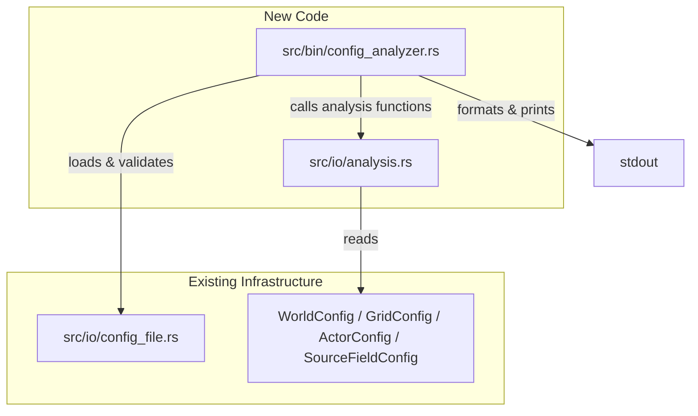

# Design Document: Config Analyzer

## Overview

The config-analyzer is a standalone CLI binary that performs static analysis of simulation TOML configuration files. It computes derived metrics — chemical budgets, energy budgets, carrying capacity, diffusion characteristics, and numerical stability — from the configuration parameters alone, without instantiating or running the simulation.

The tool is a COLD path utility. Standard Rust allocation and dispatch practices apply. It reuses the existing `WorldConfig` parsing and `validate_world_config` validation from `src/io/config_file.rs`.

### Design Decisions

1. **Separate binary, not a subcommand**: Defined as a `[[bin]]` target in `Cargo.toml` to avoid pulling in Bevy dependencies. The main binary is the Bevy visualizer; this tool has no rendering needs.
2. **Analysis module in `src/io/`**: The analysis logic lives in a new `src/io/analysis.rs` module. It operates purely on config structs (no `Grid` instantiation), so it belongs alongside the config parsing code rather than in `grid/`.
3. **Pure functions over struct methods**: Each analysis section is a standalone function taking config references and returning a result struct. This keeps the code testable and composable.
4. **Midpoint estimation**: Where config specifies ranges (e.g., `min_sources..=max_sources`), the analyzer uses the arithmetic midpoint as the expected value. This is a reasonable first-order estimate for uniformly distributed random variables.

## Architecture



The binary entry point (`src/bin/config_analyzer.rs`) handles CLI parsing, config loading, and orchestrates the analysis pipeline. The analysis module (`src/io/analysis.rs`) contains pure computation functions that take config structs and return typed result structs. The binary formats these results into the final report.

## Components and Interfaces

### 1. Binary Entry Point: `src/bin/config_analyzer.rs`

Responsibilities:
- Parse `--config <path>` from CLI args (manual parsing, same pattern as existing `cli.rs`)
- Load and validate config via `load_world_config` + `validate_world_config`
- Call each analysis function
- Format and print the report to stdout
- Use `anyhow` for top-level error handling (application boundary)

```rust
fn main() -> anyhow::Result<()> {
    let config_path = parse_analyzer_args()?;
    let config = load_world_config(&config_path)?;
    validate_world_config(&config)?;
    let report = analyze(&config);
    print_report(&report);
    Ok(())
}
```

### 2. Analysis Module: `src/io/analysis.rs`

Pure functions, each taking config references and returning a typed result struct. No side effects, no I/O.

```rust
pub fn analyze_stability(grid: &GridConfig) -> StabilityReport;
pub fn analyze_chemical_budget(grid: &GridConfig, world_init: &WorldInitConfig, actor: Option<&ActorConfig>) -> ChemicalBudgetReport;
pub fn analyze_energy_budget(grid: &GridConfig, world_init: &WorldInitConfig, actor: &ActorConfig) -> EnergyBudgetReport;
pub fn analyze_carrying_capacity(grid: &GridConfig, world_init: &WorldInitConfig, actor: &ActorConfig) -> CarryingCapacityReport;
pub fn analyze_source_density(grid: &GridConfig, world_init: &WorldInitConfig) -> SourceDensityReport;
pub fn analyze_diffusion(grid: &GridConfig) -> DiffusionReport;
pub fn analyze(config: &WorldConfig) -> FullReport;
```

### 3. Report Formatting

A `format_report(report: &FullReport) -> String` function that produces the final plain-text output. Each section has its own formatting helper. Warning lines are prefixed with `[WARN]`, healthy confirmations with `[OK]`.

## Data Models

All result structs are plain data. No methods beyond `Display` implementations where useful.

```rust
/// Top-level aggregation of all analysis sections.
pub struct FullReport {
    pub grid_width: u32,
    pub grid_height: u32,
    pub cell_count: usize,
    pub seed: u64,
    pub tick_duration: f32,
    pub actors_enabled: bool,
    pub stability: StabilityReport,
    pub chemical_budget: ChemicalBudgetReport,
    pub energy_budget: Option<EnergyBudgetReport>,
    pub carrying_capacity: Option<CarryingCapacityReport>,
    pub source_density: SourceDensityReport,
    pub diffusion: DiffusionReport,
}

pub struct StabilityReport {
    pub diffusion_number: f32,          // diffusion_rate * tick_duration * 8
    pub thermal_stability_number: f32,  // thermal_conductivity * tick_duration * 8
    pub diffusion_stable: bool,
    pub thermal_stable: bool,
}

pub struct ChemicalBudgetReport {
    pub expected_source_count: f32,       // midpoint of source count range
    pub expected_emission_per_tick: f32,  // source_count * midpoint_emission_rate
    pub expected_decay_per_tick: f32,     // cell_count * avg_concentration * decay_rate
    pub expected_actor_consumption: f32,  // actor_count * consumption_rate (0 if no actors)
    pub net_chemical_per_tick: f32,       // input - decay - consumption
    pub in_deficit: bool,
    pub actors_enabled: bool,
}

pub struct EnergyBudgetReport {
    pub net_energy_per_tick: f32,
    pub break_even_concentration: f32,
    pub idle_survival_ticks: f32,
    pub ticks_to_reproduction: Option<f32>,  // None if net energy <= 0
    pub energy_positive: bool,
}

pub struct CarryingCapacityReport {
    pub carrying_capacity: f32,
    pub cell_count: usize,
    pub space_limited: bool,  // true if carrying_capacity > cell_count
}

pub struct SourceDensityReport {
    pub chemical_source_density: f32,     // sources / cells
    pub heat_source_density: f32,
    pub chemical_renewable_fraction: f32,
    pub heat_renewable_fraction: f32,
    pub chemical_respawn_enabled: bool,
    pub chemical_respawn_cooldown_range: Option<(u32, u32)>,
    pub heat_respawn_enabled: bool,
    pub heat_respawn_cooldown_range: Option<(u32, u32)>,
}

pub struct DiffusionReport {
    pub chemical_length_scale: f32,       // sqrt(diffusion_rate * tick_duration)
    pub thermal_length_scale: f32,        // sqrt(thermal_conductivity * tick_duration)
    pub ticks_to_reach_5_cells: f32,      // (5 / length_scale)^2
    pub ticks_to_reach_10_cells: f32,
    pub chemical_half_lives: Vec<f32>,    // ln(2) / decay_rate per species
}
```


## Correctness Properties

*A property is a characteristic or behavior that should hold true across all valid executions of a system — essentially, a formal statement about what the system should do. Properties serve as the bridge between human-readable specifications and machine-verifiable correctness guarantees.*

The analysis module consists of pure functions mapping config structs to report structs via well-defined formulas. This makes it highly amenable to property-based testing: we generate random valid configs and verify the output matches the specified formulas.

### Property 1: Stability analysis correctness

*For any* valid `GridConfig`, the `StabilityReport` returned by `analyze_stability` shall satisfy:
- `diffusion_number == diffusion_rate * tick_duration * 8`
- `thermal_stability_number == thermal_conductivity * tick_duration * 8`
- `diffusion_stable == (diffusion_number < 1.0)`
- `thermal_stable == (thermal_stability_number < 1.0)`

**Validates: Requirements 2.1, 2.2, 2.3, 2.4, 2.5**

### Property 2: Chemical budget correctness

*For any* valid `WorldConfig` (with or without `ActorConfig`), the `ChemicalBudgetReport` returned by `analyze_chemical_budget` shall satisfy:
- `expected_source_count == (min_sources + max_sources) / 2.0`
- `expected_emission_per_tick == expected_source_count * (min_emission_rate + max_emission_rate) / 2.0`
- `expected_decay_per_tick == cell_count * avg_concentration * decay_rate` where `avg_concentration = (min_initial_concentration + max_initial_concentration) / 2.0`
- `expected_actor_consumption == (min_actors + max_actors) / 2.0 * consumption_rate` (or 0 if no actors)
- `net_chemical_per_tick == expected_emission_per_tick - expected_decay_per_tick - expected_actor_consumption`
- `in_deficit == (net_chemical_per_tick < 0.0)`

**Validates: Requirements 3.1, 3.2, 3.3, 3.4, 3.5**

### Property 3: Energy budget correctness

*For any* valid `WorldConfig` with an `ActorConfig`, the `EnergyBudgetReport` returned by `analyze_energy_budget` shall satisfy:
- `idle_survival_ticks == initial_energy / base_energy_decay`
- `energy_positive == (net_energy_per_tick > 0.0)`
- When `net_energy_per_tick > 0.0`: `ticks_to_reproduction == Some((reproduction_threshold - initial_energy) / net_energy_per_tick)`
- When `net_energy_per_tick <= 0.0`: `ticks_to_reproduction == None`

**Validates: Requirements 4.1, 4.3, 4.4, 4.5**

### Property 4: Break-even concentration round-trip

*For any* valid `WorldConfig` with an `ActorConfig`, plugging the `break_even_concentration` from the `EnergyBudgetReport` back into the energy formula `break_even_concentration * (energy_conversion_factor - extraction_cost) - base_energy_decay - base_movement_cost` shall yield a value within floating-point tolerance of zero.

**Validates: Requirements 4.2**

### Property 5: Carrying capacity correctness

*For any* valid `WorldConfig` with an `ActorConfig` where `consumption_rate > 0`, the `CarryingCapacityReport` shall satisfy:
- `carrying_capacity == expected_emission_per_tick / consumption_rate`
- `space_limited == (carrying_capacity > cell_count as f32)`

**Validates: Requirements 5.1, 5.2**

### Property 6: Source density correctness

*For any* valid `WorldConfig`, the `SourceDensityReport` shall satisfy:
- `chemical_source_density == midpoint_chemical_sources / cell_count`
- `heat_source_density == midpoint_heat_sources / cell_count`
- `chemical_renewable_fraction == chemical_source_config.renewable_fraction`
- `heat_renewable_fraction == heat_source_config.renewable_fraction`
- When `respawn_enabled`: `respawn_cooldown_range == Some((min_cooldown, max_cooldown))`
- When `!respawn_enabled`: `respawn_cooldown_range == None`

**Validates: Requirements 6.1, 6.2, 6.3, 6.4, 6.5**

### Property 7: Diffusion characterization correctness

*For any* valid `GridConfig`, the `DiffusionReport` shall satisfy:
- `chemical_length_scale == sqrt(diffusion_rate * tick_duration)`
- `thermal_length_scale == sqrt(thermal_conductivity * tick_duration)`
- `ticks_to_reach_5_cells == (5.0 / chemical_length_scale)^2` (when chemical_length_scale > 0)
- `ticks_to_reach_10_cells == (10.0 / chemical_length_scale)^2` (when chemical_length_scale > 0)
- For each species `i`: `chemical_half_lives[i] == ln(2) / chemical_decay_rates[i]` (when decay_rate > 0)

**Validates: Requirements 7.1, 7.2, 7.3, 7.4**

### Property 8: Report formatting correctness

*For any* valid `WorldConfig`, the formatted report string shall:
- Contain the grid dimensions (`width` x `height`), seed value, and tick duration
- Contain `[WARN]` if and only if any stability number >= 1.0 or net chemical balance < 0 or net energy < 0
- Contain `[OK]` if and only if the corresponding check passes (stability numbers < 1.0)

**Validates: Requirements 8.3, 8.4, 8.5**

## Error Handling

The analyzer is a COLD path tool. Error handling follows the project conventions:

| Error Source | Handling |
|---|---|
| Missing `--config` argument | Print usage to stderr, exit code 1. Use `anyhow` at the `main` boundary. |
| File not found / unreadable | `ConfigError::Io` propagated via `?`, printed by `anyhow`. |
| Invalid TOML syntax | `ConfigError::Parse` propagated via `?`. |
| Validation failure | `ConfigError::Validation` propagated via `?`. |
| Division by zero in analysis | Guarded: when a divisor is zero (e.g., `decay_rate == 0`), report `f32::INFINITY` for half-life or skip the metric with a note. No panics. |

No `unwrap()` or `expect()` in the analysis module or binary. All fallible operations use `Result`.

## Testing Strategy

### Property-Based Tests

Use `proptest` (already in `dev-dependencies`) to generate random valid `GridConfig`, `ActorConfig`, `WorldInitConfig`, and `SourceFieldConfig` instances. Each property test runs a minimum of 100 iterations.

Generators must produce configs that pass `validate_world_config` — constrain ranges so that `min <= max`, rates are positive, and cross-field invariants hold.

Each property test is tagged with a comment:
```rust
// Feature: config-analyzer, Property N: <property_text>
```

Properties to implement:
1. Stability analysis correctness
2. Chemical budget correctness
3. Energy budget correctness
4. Break-even concentration round-trip
5. Carrying capacity correctness
6. Source density correctness
7. Diffusion characterization correctness
8. Report formatting correctness

### Unit Tests

Unit tests complement property tests for:
- Specific example configs (e.g., the `example_config.toml` values)
- Edge cases: zero decay rate (infinite half-life), zero sources, no actors
- CLI argument parsing: missing `--config`, valid `--config <path>`, unknown flags
- Report section presence/absence when actors are disabled

### Test Organization

Tests live in `src/io/analysis.rs` as `#[cfg(test)] mod tests` for unit tests. Property tests live in `tests/config_analyzer_props.rs` as integration tests, importing the analysis functions from the library crate.
