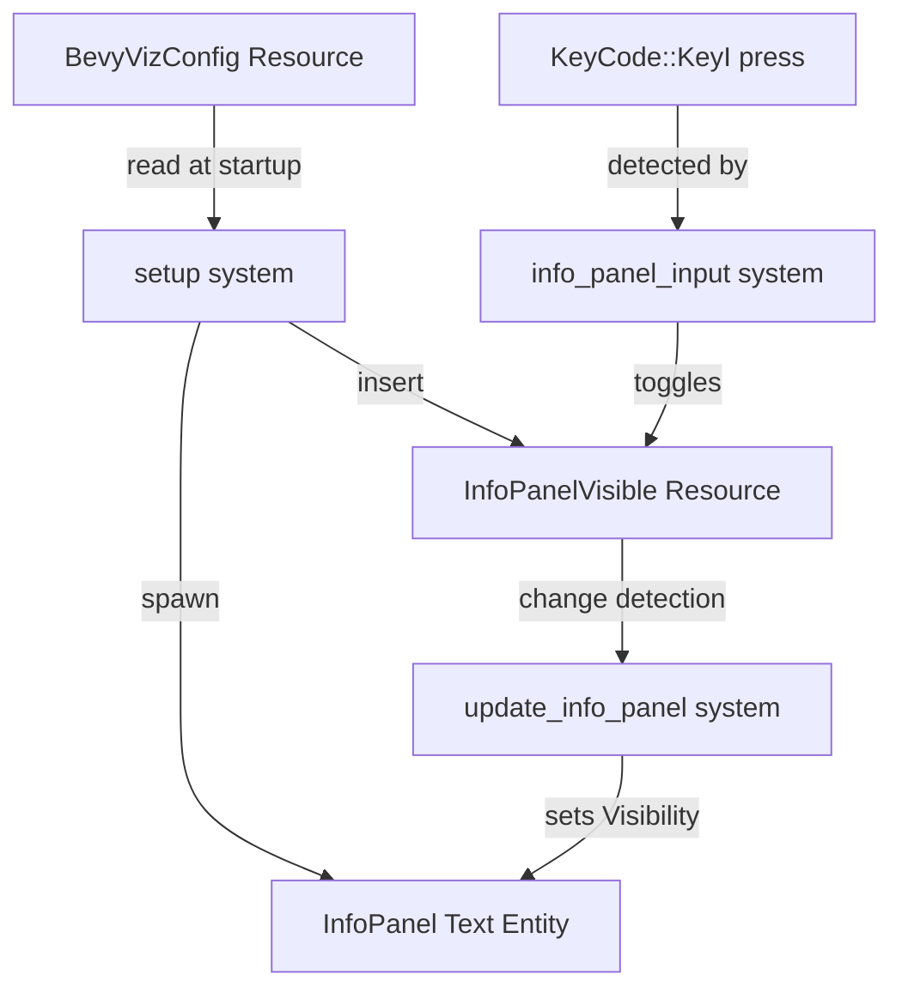

# Design Document: Config Info Panel

## Overview

A COLD-path, toggle-able UI panel in the Bevy visualization layer that displays the simulation seed and world configuration parameters. The design follows the existing ECS patterns established by `OverlayLabel`, `RateLabel`, and `HoverTooltip`: a marker component identifies the text entity, a resource tracks visibility state, a stateless input system toggles the resource on key press, and a stateless update system syncs the text content and visibility with the resource.

The panel text is produced by a pure formatting function (`format_config_info`) that takes configuration data and returns a `String`. This function is testable in isolation without Bevy dependencies.

## Architecture



All systems are registered in the `Update` schedule alongside existing input and label systems. No `FixedUpdate` involvement — this feature has zero hot-path impact.

## Components and Interfaces

### Marker Component

```rust
/// Marker for the config info panel text entity.
/// COLD: Only queried when InfoPanelVisible changes.
#[derive(Component)]
pub struct InfoPanel;
```

Plain data, no methods. Follows the `OverlayLabel` / `RateLabel` / `HoverTooltip` pattern.

### Visibility Resource

```rust
/// Tracks whether the info panel is shown or hidden.
/// COLD: Mutated only on I key press.
#[derive(Resource)]
pub struct InfoPanelVisible(pub bool);
```

Default value: `InfoPanelVisible(false)` — panel hidden at startup.

Toggle is a single field flip: `self.0 = !self.0`. This is the only mutation. The resource is a plain data struct; the toggle operation is performed inline in the input system rather than as a method, keeping the resource free of business logic.

### Pure Formatting Function

```rust
/// Format the full config info panel text from configuration data.
///
/// Pure function — no Bevy dependencies. Testable in isolation.
pub fn format_config_info(
    seed: u64,
    grid_config: &GridConfig,
    init_config: &WorldInitConfig,
    actor_config: Option<&ActorConfig>,
) -> String
```

Sections in output:
1. **Seed** — the `u64` seed value
2. **Grid** — all `GridConfig` fields, floats formatted to consistent precision
3. **World Init** — `WorldInitConfig` fields organized by sub-section (heat sources, chemical sources, initial ranges, actor range)
4. **Actors** — `ActorConfig` fields if present, otherwise "Actors: disabled"

### Input System

```rust
/// COLD PATH: Toggle info panel visibility on I key press.
pub fn info_panel_input(
    keys: Res<ButtonInput<KeyCode>>,
    mut visible: ResMut<InfoPanelVisible>,
)
```

Pattern: identical to `rate_control_input` — read key state, mutate resource. Single `just_pressed` check for `KeyCode::KeyI`.

### Update System

```rust
/// COLD PATH: Sync info panel visibility with the InfoPanelVisible resource.
/// Only runs work when InfoPanelVisible has changed (Bevy change detection).
pub fn update_info_panel(
    visible: Res<InfoPanelVisible>,
    mut query: Query<&mut Visibility, With<InfoPanel>>,
)
```

Pattern: identical to `update_overlay_label` — gate on `visible.is_changed()`, then set `Visibility::Visible` or `Visibility::Hidden` on the entity.

### Startup Spawning

The `setup` system spawns the info panel entity during `Startup`:

```rust
// ── Spawn info panel (hidden by default) ───────────────────────
let info_text = format_config_info(
    config.seed,
    &config.grid_config,
    &config.init_config,
    config.actor_config.as_ref(),
);

commands.spawn((
    Text::new(info_text),
    TextFont { font_size: 14.0, ..default() },
    TextColor(Color::WHITE),
    Node {
        position_type: PositionType::Absolute,
        top: Val::Px(40.0),
        left: Val::Px(10.0),
        ..default()
    },
    BackgroundColor(Color::srgba(0.0, 0.0, 0.0, 0.7)),
    Visibility::Hidden,
    InfoPanel,
));

commands.insert_resource(InfoPanelVisible(false));
```

Position: top-left, offset below the overlay label (`top: 40px`). The overlay label sits at `top: 10px` with `font_size: 24.0`, so 40px clears it. The semi-transparent black background ensures readability over the grid.

### Plugin Registration

Two new systems added to the `Update` schedule in `BevyVizPlugin::build`:

```rust
systems::info_panel_input,
systems::update_info_panel,
```

No ordering constraints needed — both are COLD and independent of existing systems.

## Data Models

No new persistent data models. The feature reads from existing resources:

| Resource | Access | Purpose |
|---|---|---|
| `BevyVizConfig` | Read (startup only) | Source of seed, grid_config, init_config, actor_config |
| `InfoPanelVisible` | Read/Write | Toggle state for panel visibility |

The `InfoPanel` marker component and `InfoPanelVisible` resource are the only new types. Both are plain data with derived traits only.

### Text Content

The panel text is computed once at startup from `BevyVizConfig` and stored in the `Text` component. Since configuration is immutable after initialization, no runtime text updates are needed — only visibility toggling.


## Correctness Properties

*A property is a characteristic or behavior that should hold true across all valid executions of a system — essentially, a formal statement about what the system should do. Properties serve as the bridge between human-readable specifications and machine-verifiable correctness guarantees.*

Properties are derived from the acceptance criteria prework analysis. Criteria related to architectural constraints (5.1–5.4), layout positioning (4.1), and Bevy scheduling guarantees (1.3) are not testable as properties and are excluded. Section header presence (3.1) and field labeling (3.2) are subsumed by the config completeness property.

### Property 1: Toggle inverts visibility

*For any* boolean visibility state, toggling the `InfoPanelVisible` resource SHALL produce the logical negation of the previous state. Toggling twice SHALL restore the original state.

**Validates: Requirements 1.1**

### Property 2: Formatted output contains all config values

*For any* valid `BevyVizConfig` (with arbitrary seed, `GridConfig`, `WorldInitConfig`, and `Option<ActorConfig>`), the string returned by `format_config_info` SHALL contain:
- The seed value as a decimal string
- All `GridConfig` field values (width, height, num_chemicals, diffusion_rate, thermal_conductivity, ambient_heat, tick_duration, num_threads, each chemical_decay_rate)
- All `WorldInitConfig` field values (heat source config ranges, chemical source config ranges, initial heat range, initial concentration range, actor count range)
- All `ActorConfig` field values when `actor_config` is `Some`, or the string "disabled" when `actor_config` is `None`

**Validates: Requirements 2.1, 2.2, 2.3, 2.4, 2.5, 3.1, 3.2**

### Property 3: Float formatting consistency

*For any* valid configuration containing floating-point values, all float values in the output of `format_config_info` SHALL be formatted with a consistent number of decimal places (no mixed precision within the same value category).

**Validates: Requirements 3.3**

## Error Handling

This feature has minimal error surface:

- **No fallible operations**: All data is read from `BevyVizConfig`, which is guaranteed to exist at startup. The formatting function is infallible — it operates on already-validated configuration structs.
- **Missing resource**: If `InfoPanelVisible` is somehow absent, Bevy's `ResMut` will panic. This is acceptable per project conventions for startup-inserted resources (same pattern as `SimRateController`).
- **Key conflict**: The `I` key is not used by any existing binding. If a future feature claims `I`, the conflict must be resolved at design time.
- **README update**: The new `I` key binding must be added to the Bevy mode key binding table in `README.md`.

No `thiserror` enum is needed. No `Result` types are introduced.

## Testing Strategy

### Property-Based Tests

Use the `proptest` crate for property-based testing. Each property test runs a minimum of 100 iterations.

- **Property 1 (Toggle inverts visibility)**: Generate random boolean states, apply toggle, verify negation. Apply toggle twice, verify identity. Trivial but validates the invariant.
  - Tag: `Feature: config-info-panel, Property 1: Toggle inverts visibility`

- **Property 2 (Formatted output contains all config values)**: Generate random `GridConfig`, `WorldInitConfig`, `Option<ActorConfig>`, and `u64` seed via `proptest` strategies. Call `format_config_info`, verify the output string contains string representations of every field value.
  - Tag: `Feature: config-info-panel, Property 2: Formatted output contains all config values`

- **Property 3 (Float formatting consistency)**: Generate random configs, call `format_config_info`, extract all float-formatted substrings, verify they use consistent decimal precision.
  - Tag: `Feature: config-info-panel, Property 3: Float formatting consistency`

### Unit Tests

- Default visibility is `false` (Requirement 1.2)
- `format_config_info` with `actor_config: None` contains "disabled" (Requirement 2.5, edge case)
- `format_config_info` with empty `chemical_decay_rates` vec produces valid output (edge case)
- Semi-transparent background color alpha is between 0.0 and 1.0 exclusive (Requirement 4.2)

### Testing Boundaries

Bevy system integration (entity spawning, `Visibility` component sync, key press detection) is validated by running the application. The pure formatting function and visibility toggle logic carry the automated test coverage.
