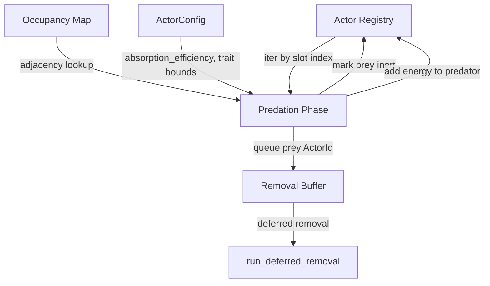

# Design Document: Contact Predation

## Overview

Contact predation adds a new deterministic tick phase where adjacent actors evaluate predation eligibility based on energy dominance and genetic distance. The system introduces a 9th heritable trait (`kin_tolerance`) that gates predation via kin recognition, enabling emergent speciation and kin selection dynamics.

The design follows the existing actor system patterns: a stateless system function operating on the actor registry and occupancy map, with deferred removal for killed prey. The predation phase slots into the tick cycle after deferred spawn (Phase 4.5) and before movement (Phase 5), becoming Phase 4.75.

Key design decisions:
- Predation iterates actors by ascending slot index for determinism.
- Each actor participates in at most one predation event per tick (first-match wins).
- Genetic distance uses normalized Euclidean distance across all 9 traits, divided by √9 to produce [0, 1].
- The `kin_tolerance` trait evolves via the existing proportional gaussian mutation mechanism.

## Architecture

### Tick Phase Ordering

```
Phase 1:   Sensing (WARM)
Phase 2:   Metabolism (WARM)
Phase 3:   Deferred removal (dead actors)
Phase 4:   Reproduction (WARM)
Phase 4.5: Deferred spawn (offspring)
Phase 4.75: Contact Predation (WARM)    ← NEW
Phase 4.8:  Deferred removal (predated) ← NEW
Phase 5:   Movement (WARM)
```

Predation runs after spawn so that newly born offspring are eligible prey/predators in the same tick they appear. It runs before movement so that predation outcomes influence which actors move and where.

### Data Flow



## Components and Interfaces

### New Function: `run_contact_predation`

```rust
// WARM PATH: Executes once per tick over the actor list.
// No heap allocation (removal_buffer pre-allocated). No dynamic dispatch.

/// Execute contact predation for all active actors in deterministic order.
///
/// For each actor in ascending slot-index order:
/// 1. Skip if inert or already participated in predation this tick.
/// 2. Scan 4-neighborhood (N, S, E, W) via occupancy map.
/// 3. For each occupied neighbor, compute genetic distance.
/// 4. If neighbor has strictly lower energy AND genetic distance >= predator's kin_tolerance:
///    - Add prey.energy * absorption_efficiency to predator energy (clamped to max_energy).
///    - Mark prey inert, queue for removal.
///    - Mark both as "participated" for this tick.
///    - Break (one predation per predator per tick).
///
/// "Participated" tracking uses a pre-allocated Vec<bool> indexed by slot.
pub fn run_contact_predation(
    actors: &mut ActorRegistry,
    occupancy: &[Option<usize>],
    config: &ActorConfig,
    removal_buffer: &mut Vec<ActorId>,
    w: usize,
    h: usize,
) -> Result<(), TickError>
```

### New Function: `genetic_distance`

```rust
/// Compute normalized Euclidean distance between two trait vectors.
///
/// Each trait is normalized to [0, 1] using its configured clamp bounds:
///   normalized = (value - min) / (max - min)
/// If max == min for a trait, both actors get 0.0 for that dimension.
///
/// Returns: euclidean_distance / sqrt(TRAIT_COUNT) ∈ [0.0, 1.0]
///
/// This is a pure function with no side effects. No heap allocation.
#[inline]
fn genetic_distance(a: &HeritableTraits, b: &HeritableTraits, config: &ActorConfig) -> f32
```

### Modified Struct: `HeritableTraits`

Add `kin_tolerance: f32` field. The struct grows from 32 to 36 bytes (with padding).

```rust
#[derive(Debug, Clone, Copy, PartialEq)]
pub struct HeritableTraits {
    pub consumption_rate: f32,
    pub base_energy_decay: f32,
    pub levy_exponent: f32,
    pub reproduction_threshold: f32,
    pub max_tumble_steps: u16,
    // 2 bytes padding
    pub reproduction_cost: f32,
    pub offspring_energy: f32,
    pub mutation_rate: f32,
    pub kin_tolerance: f32,  // NEW — 9th heritable trait
}
// Size: 36 bytes (8 × f32 + 1 × u16 + 2 padding)
```

### Modified Struct: `ActorConfig`

New fields:

```rust
/// Fraction of prey energy absorbed by predator on successful predation.
/// Must be in (0.0, 1.0]. Default: 0.5.
pub absorption_efficiency: f32,

/// Seed genome default for kin_tolerance. Default: 0.5.
pub kin_tolerance: f32,

/// Minimum clamp bound for heritable kin_tolerance. Default: 0.0.
pub trait_kin_tolerance_min: f32,

/// Maximum clamp bound for heritable kin_tolerance. Default: 1.0.
pub trait_kin_tolerance_max: f32,
```

### Modified: `TraitStats`

Array size changes from `[SingleTraitStats; 8]` to `[SingleTraitStats; 9]`.

### Participation Tracking

To enforce the "at most one predation per actor per tick" constraint without heap allocation, the predation function uses a two-pass approach:

1. First pass: iterate actors by slot index. For each non-inert actor, scan neighbors. If a valid prey is found (not inert, not already claimed, lower energy, genetic distance >= kin_tolerance), record the predation event.
2. Since we iterate by ascending slot index and break after the first successful predation per predator, and mark prey as inert immediately, the single-pass approach is sufficient: a prey marked inert in an earlier iteration is skipped by later iterations.

This avoids needing a separate `participated: Vec<bool>` buffer. The inert flag on the prey serves as the "already consumed" marker. The predator's participation is enforced by the `break` after the first successful predation.

However, a predator that was also a valid prey for an earlier (higher-slot-index) actor is protected by iteration order: lower slot indices act first. An actor that successfully predates cannot be predated in the same tick because it now has even higher energy. An actor that was predated (marked inert) is skipped.

## Data Models

### Genetic Distance Computation

The 9 traits and their normalization ranges:

| Trait | Config Min Field | Config Max Field |
|---|---|---|
| `consumption_rate` | `trait_consumption_rate_min` | `trait_consumption_rate_max` |
| `base_energy_decay` | `trait_base_energy_decay_min` | `trait_base_energy_decay_max` |
| `levy_exponent` | `trait_levy_exponent_min` | `trait_levy_exponent_max` |
| `reproduction_threshold` | `trait_reproduction_threshold_min` | `trait_reproduction_threshold_max` |
| `max_tumble_steps` | `trait_max_tumble_steps_min` (as f32) | `trait_max_tumble_steps_max` (as f32) |
| `reproduction_cost` | `trait_reproduction_cost_min` | `trait_reproduction_cost_max` |
| `offspring_energy` | `trait_offspring_energy_min` | `trait_offspring_energy_max` |
| `mutation_rate` | `trait_mutation_rate_min` | `trait_mutation_rate_max` |
| `kin_tolerance` | `trait_kin_tolerance_min` | `trait_kin_tolerance_max` |

Formula:

```
For each trait i:
  range_i = max_i - min_i
  if range_i == 0.0:
    norm_a_i = 0.0
    norm_b_i = 0.0
  else:
    norm_a_i = (a.trait_i - min_i) / range_i
    norm_b_i = (b.trait_i - min_i) / range_i

  diff_i = norm_a_i - norm_b_i

distance = sqrt(sum(diff_i^2)) / sqrt(9)
```

The division by √9 normalizes the maximum possible distance (when all traits are at opposite extremes) to 1.0.

### Adjacency Lookup

Reuses the existing `direction_to_target(cell_index, direction, w, h) -> Option<usize>` function from `actor_systems.rs` for 4-neighborhood computation. Directions: 0=N, 1=S, 2=W, 3=E.

### Predation Algorithm (Single-Pass)

```
clear removal_buffer

for each (slot_index, actor) in actors.iter_mut(), ascending slot index:
    if actor.inert: continue

    for dir in [N, S, W, E]:
        neighbor_cell = direction_to_target(actor.cell_index, dir, w, h)
        if neighbor_cell is None: continue

        neighbor_slot = occupancy[neighbor_cell]
        if neighbor_slot is None: continue

        neighbor = actors.get(neighbor_slot)
        if neighbor.inert: continue

        // Energy dominance: this actor must have strictly more energy
        if actor.energy <= neighbor.energy: continue

        // Kin recognition: genetic distance must meet threshold
        dist = genetic_distance(&actor.traits, &neighbor.traits, config)
        if dist < actor.kin_tolerance: continue

        // Predation succeeds
        let gained = neighbor.energy * config.absorption_efficiency
        actor.energy = (actor.energy + gained).min(config.max_energy)

        // Mark prey inert and queue for removal
        // (requires split borrow — see implementation note below)
        mark_prey_inert(neighbor_slot)
        removal_buffer.push(neighbor_actor_id)
        break  // one predation per predator per tick
```

**Split borrow note**: The predator and prey are different slots in the registry. The implementation must handle the split borrow correctly. Since `ActorRegistry` stores actors in a `Vec<ActorSlot>`, we can use index-based access with `split_at_mut` or unsafe indexing with a safety comment. The preferred approach is to collect predation events (predator_slot, prey_slot, energy_gain) in a stack-local `SmallVec`, then apply them in a second pass. This avoids the split borrow entirely and keeps the code safe.

Revised approach using a small buffer:

```rust
// Stack-allocated buffer for predation events this tick.
// Capacity: at most actors.len()/2 events, but typically far fewer.
// Use SmallVec with a reasonable inline capacity.
let mut events: SmallVec<[(usize, usize, f32); 64]> = SmallVec::new();

// Pass 1: identify predation events (read-only iteration)
// Pass 2: apply events (mutate predator energy, mark prey inert, queue removal)
```

This keeps the hot loop free of mutable aliasing concerns while maintaining determinism.


## Correctness Properties

*A property is a characteristic or behavior that should hold true across all valid executions of a system — essentially, a formal statement about what the system should do. Properties serve as the bridge between human-readable specifications and machine-verifiable correctness guarantees.*

### Property 1: Mutation clamp invariant for kin_tolerance

*For any* valid `ActorConfig` and *for any* `HeritableTraits` with values within clamp bounds, after calling `mutate()`, the resulting `kin_tolerance` value SHALL be within `[trait_kin_tolerance_min, trait_kin_tolerance_max]`.

**Validates: Requirements 1.3**

### Property 2: Genetic distance range and formula correctness

*For any* two `HeritableTraits` instances with values within their configured clamp bounds, and *for any* valid `ActorConfig`, `genetic_distance(a, b, config)` SHALL return a value in `[0.0, 1.0]`, and the value SHALL equal `sqrt(sum((norm_a_i - norm_b_i)^2)) / sqrt(9)` where each trait is normalized by `(value - min) / (max - min)` (or 0.0 when `max == min`).

**Validates: Requirements 2.1, 2.2, 2.3**

### Property 3: Genetic distance symmetry

*For any* two `HeritableTraits` instances `a` and `b`, `genetic_distance(a, b, config)` SHALL equal `genetic_distance(b, a, config)`.

**Validates: Requirements 2.1, 2.2**

### Property 4: Genetic distance identity

*For any* `HeritableTraits` instance `a`, `genetic_distance(a, a, config)` SHALL equal `0.0`.

**Validates: Requirements 2.1, 2.2**

### Property 5: Predation eligibility decision

*For any* two adjacent, non-inert actors where the predator has strictly higher energy and `genetic_distance >= predator.kin_tolerance`, predation SHALL occur. *For any* pair where energy is equal, or the predator has lower energy, or genetic distance is below kin_tolerance, or either actor is inert, predation SHALL NOT occur.

**Validates: Requirements 3.1, 3.2, 3.3, 3.4, 3.5, 3.6**

### Property 6: Predation energy conservation

*For any* successful predation event with predator energy `E_pred`, prey energy `E_prey`, and absorption efficiency `α`, the predator's post-predation energy SHALL equal `min(E_pred + E_prey * α, max_energy)`, and the prey SHALL be marked inert.

**Validates: Requirements 4.1, 4.2**

### Property 7: At most one predation per actor per tick

*For any* grid state and *for any* execution of `run_contact_predation`, no actor slot index SHALL appear more than once across all predation events in that tick, whether as predator or prey.

**Validates: Requirements 4.3**

### Property 8: Predation determinism

*For any* grid state, running `run_contact_predation` twice on identical input states SHALL produce identical output states (same predation events, same energy values, same inert flags).

**Validates: Requirements 4.4**

### Property 9: Config validation rejects invalid predation fields

*For any* `absorption_efficiency` value where `value <= 0.0 || value > 1.0`, config validation SHALL reject it. *For any* `trait_kin_tolerance_min >= trait_kin_tolerance_max`, config validation SHALL reject it.

**Validates: Requirements 6.3, 6.4**

## Error Handling

| Error Condition | Handling |
|---|---|
| NaN/Inf energy after predation transfer | Return `TickError::NumericalError` with system="contact_predation" |
| Prey ActorId stale during deferred removal | Propagated as `TickError` (logic bug — should not occur) |
| Zero-range trait clamp (max == min) | Treat normalized value as 0.0 for both actors (no error) |
| No adjacent actors / no eligible prey | No-op, continue to next actor |
| Predator energy at max_energy | Energy gain clamped, predation still occurs (prey still removed) |

All errors in the predation phase use `Result<(), TickError>` for uniform error propagation, consistent with existing actor systems. No panics, no `unwrap()`.

## Testing Strategy

### Property-Based Tests

Use the `proptest` crate (already available in the Rust ecosystem, zero-cost in release builds). Each property test runs a minimum of 100 iterations with generated inputs.

| Property | Test Approach | Generator |
|---|---|---|
| P1: Mutation clamp | Generate random HeritableTraits within bounds, mutate, check kin_tolerance in range | Random f32 within clamp bounds for all traits |
| P2: Distance range/formula | Generate two random trait vectors, compute distance, verify against reference impl | Random f32 within clamp bounds |
| P3: Distance symmetry | Generate two random trait vectors, verify distance(a,b) == distance(b,a) | Random f32 within clamp bounds |
| P4: Distance identity | Generate one random trait vector, verify distance(a,a) == 0.0 | Random f32 within clamp bounds |
| P5: Eligibility decision | Generate actor pairs with varying energy/distance/inert, verify predation decision | Random energy, traits, inert flags |
| P6: Energy conservation | Generate predation scenarios, verify post-predation energy | Random energy values, absorption_efficiency |
| P7: One predation per actor | Generate small grids with multiple adjacent actors, run predation, verify uniqueness | Random grid layouts with 2-10 actors |
| P8: Determinism | Generate grid state, run predation twice, compare | Random grid states |
| P9: Config validation | Generate invalid config values, verify rejection | Random f32 outside valid ranges |

Tag format: `// Feature: contact-predation, Property N: <title>`

### Unit Tests

Unit tests complement property tests for specific examples and edge cases:

- Two adjacent actors with equal energy → no predation
- Two adjacent actors where genetic distance is exactly at the kin_tolerance boundary
- Predator at max_energy → energy clamped, prey still removed
- Actor with all neighbors inert → no predation
- Grid boundary actors (fewer than 4 neighbors) → correct adjacency handling
- Config with `absorption_efficiency = 1.0` (upper bound) → full energy transfer
- Config with `trait_kin_tolerance_min == trait_kin_tolerance_max` → genetic distance dimension contributes 0.0
