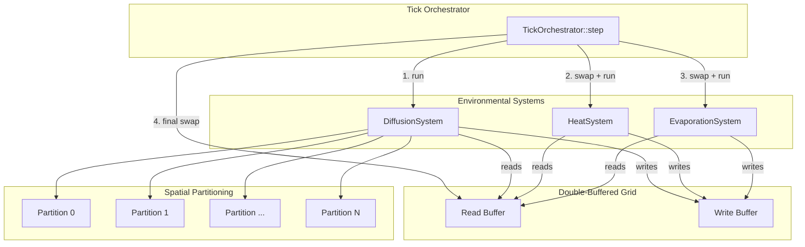

# Design Document: Environment Grid

## Overview

The Environment Grid is the Layer 0 substrate of the Emergent Sovereignty simulation. It provides a headless, high-performance, multi-threaded 2D grid where each cell holds persistent physical state — chemical gradients, heat, and moisture. Three independent systems (Diffusion, Heat Radiation, Evaporation) operate on this grid each tick, reading from one buffer and writing to another via double-buffering. The grid uses a Structure-of-Arrays (SoA) memory layout for cache efficiency and spatial partitioning for data-parallel execution across CPU cores.

All design decisions prioritize:
- Deterministic, reproducible simulation results
- Zero heap allocation on the hot path
- Cache-friendly sequential memory access
- Safe concurrency via Rust's ownership model and `rayon` for data parallelism

## Architecture

The system follows a data-oriented design with clear separation between data storage (the grid buffers) and processing logic (the systems). There is no ECS framework dependency at this layer — the grid is a standalone substrate that a future ECS layer will query into.



### Execution Flow per Tick

1. **DiffusionSystem** reads chemical concentrations from the read buffer, computes diffusion, writes to the write buffer. Parallelized across spatial partitions via `rayon`.
2. **Swap** read and write buffers (index swap, no data copy).
3. **HeatSystem** reads heat from the (now-swapped) read buffer, computes radiation, writes to the write buffer. Parallelized.
4. **Swap** buffers.
5. **EvaporationSystem** reads heat and moisture from the read buffer, computes evaporation, writes moisture to the write buffer. Parallelized.
6. **Swap** buffers. The grid is now ready for the next tick.

This sequential system ordering with intermediate swaps ensures each system sees the output of the previous one, maintaining determinism.

## Components and Interfaces

### GridConfig

Configuration struct provided at initialization time. Immutable after creation.

```rust
pub struct GridConfig {
    pub width: u32,
    pub height: u32,
    pub num_chemicals: usize,        // fixed number of chemical species
    pub diffusion_rate: f32,         // chemical diffusion coefficient
    pub thermal_conductivity: f32,   // heat radiation coefficient
    pub evaporation_coefficient: f32,// moisture evaporation coefficient
    pub ambient_heat: f32,           // boundary condition for heat
    pub tick_duration: f32,          // simulated time per tick
    pub num_threads: usize,          // number of spatial partitions / threads
}
```

### FieldBuffer\<T\>

A double-buffered, contiguous array for a single physical field. The core data primitive.

```rust
pub struct FieldBuffer<T: Copy> {
    buffers: [Vec<T>; 2],
    current: usize, // index of the read buffer (0 or 1)
}

impl<T: Copy> FieldBuffer<T> {
    pub fn new(len: usize, default: T) -> Self;
    pub fn read(&self) -> &[T];
    pub fn write(&mut self) -> &mut [T];
    pub fn swap(&mut self); // self.current ^= 1
}
```

`swap()` is a single XOR on an index — no data movement.

### Grid

The top-level data structure. Owns all field buffers and spatial partition metadata.

```rust
pub struct Grid {
    config: GridConfig,
    chemicals: Vec<FieldBuffer<f32>>, // one FieldBuffer per chemical species
    heat: FieldBuffer<f32>,
    moisture: FieldBuffer<f32>,
    partitions: Vec<Partition>,
}

impl Grid {
    pub fn new(config: GridConfig, defaults: CellDefaults) -> Result<Self, GridError>;
    pub fn width(&self) -> u32;
    pub fn height(&self) -> u32;
    pub fn cell_count(&self) -> usize;

    // Coordinate access
    pub fn index(&self, x: u32, y: u32) -> Result<usize, GridError>;

    // Read access (current read buffer)
    pub fn read_heat(&self) -> &[f32];
    pub fn read_moisture(&self) -> &[f32];
    pub fn read_chemical(&self, species: usize) -> Result<&[f32], GridError>;

    // Write access (current write buffer)
    pub fn write_heat(&mut self) -> &mut [f32];
    pub fn write_moisture(&mut self) -> &mut [f32];
    pub fn write_chemical(&mut self, species: usize) -> Result<&mut [f32], GridError>;

    // Buffer management
    pub fn swap_heat(&mut self);
    pub fn swap_moisture(&mut self);
    pub fn swap_chemicals(&mut self);

    pub fn partitions(&self) -> &[Partition];
}
```

### CellDefaults

Default values for initializing all cells.

```rust
pub struct CellDefaults {
    pub chemical_concentrations: Vec<f32>, // one per chemical species
    pub heat: f32,
    pub moisture: f32,
}
```

### Partition

Describes a rectangular region of the grid assigned to one thread.

```rust
pub struct Partition {
    pub start_row: u32,
    pub end_row: u32, // exclusive
    pub start_col: u32,
    pub end_col: u32, // exclusive
}

impl Partition {
    pub fn cell_indices(&self, grid_width: u32) -> impl Iterator<Item = usize>;
}
```

Partitions are row-band slices (full width, subset of rows) to preserve row-major access patterns. For a grid of height H and N threads, each partition gets approximately H/N rows.

### Environmental System Traits

Each system is a stateless function that operates on grid buffers. No trait object dispatch on the hot path — these are concrete functions called directly by the orchestrator.

```rust
pub fn run_diffusion(grid: &mut Grid, config: &GridConfig) -> Result<(), TickError>;
pub fn run_heat(grid: &mut Grid, config: &GridConfig) -> Result<(), TickError>;
pub fn run_evaporation(grid: &mut Grid, config: &GridConfig) -> Result<(), TickError>;
```

Internally, each function:
1. Obtains read and write slice references from the grid
2. Uses `rayon::par_iter` over partitions
3. For each cell in the partition, computes the update from the read slice and writes to the write slice

### TickOrchestrator

Drives the per-tick execution sequence.

```rust
pub struct TickOrchestrator;

impl TickOrchestrator {
    pub fn step(grid: &mut Grid, config: &GridConfig) -> Result<(), TickError>;
}
```

`step()` calls each system in order with buffer swaps between them, and performs NaN/infinity validation after each system.

### Error Types

```rust
pub enum GridError {
    InvalidDimensions { width: u32, height: u32 },
    OutOfBounds { x: u32, y: u32, width: u32, height: u32 },
    InvalidChemicalSpecies { species: usize, num_chemicals: usize },
}

pub enum TickError {
    NumericalError {
        system: &'static str,
        cell_index: usize,
        field: &'static str,
        value: f32,
    },
}
```

## Data Models

### Memory Layout

All field data is stored as flat `Vec<f32>` arrays in row-major order. This is the Structure-of-Arrays (SoA) pattern:

```
chemicals[0]: [c0_cell0, c0_cell1, c0_cell2, ..., c0_cellN]
chemicals[1]: [c1_cell0, c1_cell1, c1_cell2, ..., c1_cellN]
heat:         [h_cell0,  h_cell1,  h_cell2,  ..., h_cellN ]
moisture:     [m_cell0,  m_cell1,  m_cell2,  ..., m_cellN ]
```

Each `FieldBuffer` holds two such arrays (read + write). Total memory for a W×H grid with C chemicals:

```
Memory = 2 × (C + 2) × W × H × sizeof(f32)
```

For a 1024×1024 grid with 8 chemicals: `2 × 10 × 1M × 4 = 80 MB`.

### Coordinate Mapping

```
index(x, y) = y * width + x
```

Row-major order ensures that iterating `y` in the outer loop and `x` in the inner loop produces sequential memory access.

### Neighbor Lookup

For 8-connectivity, the neighbor offsets are:

```
(-1,-1) (0,-1) (1,-1)
(-1, 0)        (1, 0)
(-1, 1) (0, 1) (1, 1)
```

Boundary cells have fewer than 8 neighbors. The diffusion and heat systems handle this by checking bounds and applying boundary conditions for missing neighbors.

### Diffusion Formula

For each cell at index `i` with concentration `c[i]`, and each neighbor `j`:

```
flow_j = diffusion_rate × (c[j] - c[i]) × tick_duration
new_c[i] = c[i] + Σ(flow_j for all neighbors j)
```

This is a discrete Laplacian (finite difference) approximation. The diffusion rate must be bounded to ensure stability: `diffusion_rate × tick_duration × 8 < 1.0` (for 8 neighbors).

### Heat Radiation Formula

Identical structure to diffusion, but boundary neighbors use `ambient_heat` instead of zero:

```
flow_j = thermal_conductivity × (h[j] - h[i]) × tick_duration
```

Where `h[j] = ambient_heat` for out-of-bounds neighbors.

### Evaporation Formula

Per-cell, no neighbor interaction:

```
loss = evaporation_coefficient × heat[i] × moisture[i] × tick_duration
new_moisture[i] = max(0.0, moisture[i] - loss)
```

### Spatial Partition Layout

Row-band partitioning for N threads on a grid of height H:

```
rows_per_partition = H / N  (last partition absorbs remainder)
Partition k: rows [k * rows_per_partition, (k+1) * rows_per_partition)
```

Each partition spans the full grid width, preserving row-major access within each partition.

## Correctness Properties

*A property is a characteristic or behavior that should hold true across all valid executions of a system — essentially, a formal statement about what the system should do. Properties serve as the bridge between human-readable specifications and machine-verifiable correctness guarantees.*

The following properties were derived from the acceptance criteria via prework analysis. Redundant criteria were consolidated (e.g., cell count and SoA layout merged; read/write access and indexing merged; moisture decrease and clamping merged; partition coverage and disjointness merged; tick orchestration steps merged).

### Property 1: Field buffer sizing and contiguity

*For any* valid width W and height H and chemical count C, the Grid SHALL expose C+2 field buffers (C chemical buffers + heat + moisture), each of which is a contiguous slice of exactly W×H elements.

**Validates: Requirements 1.1, 1.3, 8.1**

### Property 2: Cell defaults initialization

*For any* valid grid dimensions and caller-supplied default values (chemical concentrations, heat, moisture), every element in every read-buffer field slice SHALL equal the corresponding default value immediately after initialization.

**Validates: Requirements 1.2**

### Property 3: Double-buffer distinctness and swap round-trip

*For any* grid and any field, writing a value V to index I in the write buffer and then calling swap SHALL make V readable at index I in the read buffer. Additionally, the read and write slices SHALL never alias the same memory region.

**Validates: Requirements 1.5, 6.2**

### Property 4: Coordinate access round-trip

*For any* valid coordinate (x, y) on a grid of width W, `index(x, y)` SHALL equal `y * W + x`. Furthermore, writing a value to the write buffer at that index, swapping, and reading at the same coordinate SHALL return the written value.

**Validates: Requirements 2.1, 2.2, 2.4**

### Property 5: Out-of-bounds coordinate rejection

*For any* coordinate (x, y) where x ≥ width or y ≥ height, the Grid SHALL return an `OutOfBounds` error.

**Validates: Requirements 2.3**

### Property 6: System runs preserve the read buffer

*For any* grid state, running any environmental system (diffusion, heat, evaporation) SHALL leave the read buffer byte-identical to its state before the system ran.

**Validates: Requirements 3.1, 4.1**

### Property 7: Chemical diffusion conserves mass

*For any* grid state where all boundary cells have zero concentration, the total sum of each chemical species across all cells SHALL be equal (within floating-point tolerance) before and after running the Diffusion_System. For grids with non-zero boundary concentrations, the total after SHALL be less than or equal to the total before (mass leaks out through open boundaries, never in).

**Validates: Requirements 3.4**

### Property 8: Heat radiation conserves energy with ambient accounting

*For any* grid state, the total heat after running the Heat_System SHALL equal the total heat before plus the net heat flux from ambient boundary neighbors (computed as `thermal_conductivity × (ambient_heat - boundary_cell_heat) × tick_duration` summed over all missing-neighbor slots), within floating-point tolerance.

**Validates: Requirements 4.4**

### Property 9: Evaporation monotonically decreases moisture and clamps to zero

*For any* grid state where all heat values are non-negative, after running the Evaporation_System, every cell's moisture SHALL satisfy `0.0 ≤ moisture_after ≤ moisture_before`.

**Validates: Requirements 5.1, 5.3**

### Property 10: Spatial partitions cover all cells with no overlap

*For any* grid dimensions (W, H) and thread count N, the generated partitions SHALL satisfy: (a) the union of all cell indices across all partitions equals {0, 1, ..., W×H−1}, and (b) no cell index appears in more than one partition.

**Validates: Requirements 7.1, 7.4**

### Property 11: Spatial partitions are balanced

*For any* grid dimensions (W, H) and thread count N, the difference in cell count between the largest and smallest partition SHALL be at most W (one row).

**Validates: Requirements 7.2**

### Property 12: Full tick equals sequential system execution

*For any* grid state and configuration, running `TickOrchestrator::step` SHALL produce identical output to manually running diffusion → swap → heat → swap → evaporation → swap in sequence.

**Validates: Requirements 9.1, 9.2**

### Property 13: Deterministic execution

*For any* grid state and configuration, running a tick twice from identical initial states SHALL produce bit-identical results.

**Validates: Requirements 9.3**

### Property 14: NaN/infinity detection

*For any* grid state containing at least one NaN or infinity value in any field, running a tick SHALL return a `TickError::NumericalError` identifying the offending system, cell index, and field.

**Validates: Requirements 9.4**

## Error Handling

### Grid Construction Errors

- **InvalidDimensions**: Returned when width or height is zero. The caller receives a `GridError::InvalidDimensions` with the offending values. No partial allocation occurs.
- **InvalidChemicalSpecies**: Returned when accessing a chemical species index ≥ `num_chemicals`. Prevents out-of-bounds access into the chemicals vector.

### Coordinate Access Errors

- **OutOfBounds**: Returned when (x, y) falls outside [0, width) × [0, height). The error includes the coordinate and grid dimensions for diagnostics.

### Tick Errors

- **NumericalError**: After each system completes its write pass, the orchestrator scans the write buffer for NaN or infinity values. If found, the tick halts immediately and returns a `TickError::NumericalError` with:
  - `system`: which system produced the error ("diffusion", "heat", or "evaporation")
  - `cell_index`: the flat index of the offending cell
  - `field`: which field is invalid ("chemical_N", "heat", or "moisture")
  - `value`: the invalid f32 value

The NaN scan runs over the write buffer before the swap, so the read buffer remains in a valid last-known-good state. This allows the caller to inspect or dump the grid state for debugging.

### Design Decisions

1. **No panics on the hot path.** All error conditions return `Result` types. The only panics are from logic bugs (debug assertions).
2. **Fail fast on numerical errors.** A single NaN can propagate through diffusion to corrupt the entire grid within a few ticks. Early detection is critical.
3. **Read buffer as recovery point.** Since the tick halts before swapping on error, the read buffer always contains the last valid state.

## Testing Strategy

### Property-Based Testing

We will use the `proptest` crate for property-based testing in Rust. Each correctness property from the design maps to a single `proptest` test function.

**Configuration:**
- Minimum 100 test cases per property (`PROPTEST_CASES=100` or `ProptestConfig { cases: 100, .. }`)
- Each test is tagged with a comment: `// Feature: environment-grid, Property N: <title>`
- Custom `Arbitrary` strategies for generating:
  - Valid `GridConfig` values (small grids for speed, e.g., 2–64 width/height)
  - Random cell field values (non-negative f32 for physical quantities)
  - Random coordinates (both valid and invalid)
  - Stable diffusion rates (bounded so `rate × dt × 8 < 1.0`)

**Property test list (one test per property):**

| Property | Test Description |
|----------|-----------------|
| P1 | Generate random valid configs, verify all field buffer lengths = w×h |
| P2 | Generate random configs + defaults, verify all read buffer elements match defaults |
| P3 | Generate random grid, write random value, swap, verify read-back; verify slice non-aliasing |
| P4 | Generate random valid coordinates, verify index formula and write/swap/read round-trip |
| P5 | Generate random out-of-bounds coordinates, verify error returned |
| P6 | Generate random grid state, snapshot read buffer, run system, verify read buffer unchanged |
| P7 | Generate random grid with zero-boundary concentrations, run diffusion, verify mass conservation |
| P8 | Generate random grid, run heat, compute expected boundary flux, verify energy conservation |
| P9 | Generate random grid with non-negative heat, run evaporation, verify 0 ≤ after ≤ before for all cells |
| P10 | Generate random dimensions + thread counts, verify partition coverage and disjointness |
| P11 | Generate random dimensions + thread counts, verify max-min partition size ≤ width |
| P12 | Generate random grid, run full tick vs manual sequential, verify identical output |
| P13 | Generate random grid, run tick twice from same state, verify bit-identical results |
| P14 | Generate random grid, inject NaN/inf, run tick, verify NumericalError returned |

### Unit Testing

Unit tests complement property tests by covering specific examples and edge cases:

- **Grid initialization edge cases**: 1×1 grid, 1×N grid, N×1 grid, zero dimensions
- **Boundary diffusion examples**: Single hot cell in corner, edge, center — verify expected neighbor flow
- **Heat radiation with ambient**: Verify boundary cells exchange heat with ambient correctly for a known small grid
- **Evaporation formula verification**: Known heat/moisture/coefficient → verify exact moisture loss
- **Partition edge cases**: Grid height < thread count, grid height = 1, prime-number dimensions
- **NaN injection**: NaN in heat, moisture, each chemical species — verify correct error fields

### Test Organization

```
tests/
  property/
    grid_init.rs        — P1, P2
    double_buffer.rs    — P3
    coordinate_access.rs — P4, P5
    diffusion.rs        — P6 (diffusion), P7
    heat.rs             — P6 (heat), P8
    evaporation.rs      — P9
    partitioning.rs     — P10, P11
    tick.rs             — P12, P13, P14
  unit/
    grid_init.rs
    diffusion.rs
    heat.rs
    evaporation.rs
    partitioning.rs
```
