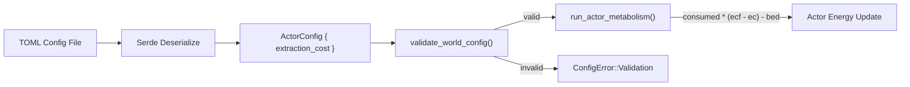

# Design Document: Extraction Cost

## Overview

This feature adds a configurable energy cost per unit of chemical consumed (`extraction_cost`) to the actor metabolism system. The current metabolism equation treats consumption as free — actors gain `consumed * energy_conversion_factor - base_energy_decay` per tick. This allows actors to profit from arbitrarily small chemical concentrations, causing them to sit indefinitely on depleted sources.

The fix modifies the metabolism equation to:

```
energy_delta = consumed * (energy_conversion_factor - extraction_cost) - base_energy_decay
```

This creates a natural break-even concentration:

```
break_even = base_energy_decay / (energy_conversion_factor - extraction_cost)
```

Below this concentration, consuming chemical costs more energy than it provides, incentivizing actors to migrate.

The change touches four areas: `ActorConfig` (new field), `validate_world_config` (new validation rules), `run_actor_metabolism` (equation update + demand-driven consumption fix), and documentation (example config, info panel, README, steering file).

## Architecture

This is a minimal, surgical change to the existing metabolism pipeline. No new systems, no new components, no new modules.



The data flow is unchanged — `ActorConfig` is constructed once at startup (COLD path), validated once, then passed by shared reference to `run_actor_metabolism` every tick (WARM path). The new field is read alongside existing fields in the same cache line.

## Components and Interfaces

### Modified: `ActorConfig` (`src/grid/actor_config.rs`)

Add one field:

```rust
/// Energy cost per unit of chemical consumed. Reduces net energy gain
/// from consumption. Must be in [0.0, energy_conversion_factor).
/// Default: 0.2
pub extraction_cost: f32,
```

Added to the `Default` impl with value `0.2`. Serde derives handle TOML deserialization automatically via `#[serde(default)]` on the struct.

### Modified: `validate_world_config` (`src/io/config_file.rs`)

Two new checks in the actor config validation block:

1. `extraction_cost >= 0.0` — negative extraction cost is nonsensical.
2. `extraction_cost < energy_conversion_factor` — if `extraction_cost >= energy_conversion_factor`, the net gain per unit consumed is zero or negative, meaning eating always costs more than it provides. This is a configuration error, not a simulation state.

### Modified: `run_actor_metabolism` (`src/grid/actor_systems.rs`)

Two lines change in the active actor branch:

1. **Demand-driven cap**: `max_useful = headroom / config.energy_conversion_factor` becomes `max_useful = headroom / (config.energy_conversion_factor - config.extraction_cost)`. This is safe because validation guarantees the denominator is positive.

2. **Energy update**: `consumed * config.energy_conversion_factor - config.base_energy_decay` becomes `consumed * (config.energy_conversion_factor - config.extraction_cost) - config.base_energy_decay`.

The inert branch is untouched — inert actors do not consume.

### Modified: `format_config_info` (`src/viz_bevy/setup.rs`)

Add one line in the actor config display block:

```rust
writeln!(out, "extraction_cost: {:.4}", ac.extraction_cost).ok();
```

### Modified: Documentation files

- `example_config.toml`: Add `extraction_cost = 0.2` with explanatory comment.
- `README.md`: Add row to ActorConfig parameter table.
- `.kiro/steering/config-documentation.md`: Add row to `[actor]` — `ActorConfig` table.

## Data Models

### `ActorConfig` (updated)

```rust
#[derive(Debug, Clone, PartialEq, Serialize, Deserialize)]
#[serde(default)]
pub struct ActorConfig {
    pub consumption_rate: f32,          // existing
    pub energy_conversion_factor: f32,  // existing
    pub base_energy_decay: f32,         // existing
    pub initial_energy: f32,            // existing
    pub max_energy: f32,                // existing
    pub initial_actor_capacity: usize,  // existing
    pub movement_cost: f32,             // existing
    pub removal_threshold: f32,         // existing
    pub extraction_cost: f32,           // NEW: default 0.2
}
```

No new structs. No schema changes. The field is a plain `f32` on an existing plain data struct.

### Validation invariants

| Invariant | Expression |
|---|---|
| Non-negative | `extraction_cost >= 0.0` |
| Below conversion factor | `extraction_cost < energy_conversion_factor` |
| Net gain positive | `energy_conversion_factor - extraction_cost > 0.0` (implied by above) |

### Metabolism equation

| Variable | Expression |
|---|---|
| `net_factor` | `energy_conversion_factor - extraction_cost` |
| `max_useful` | `(max_energy - actor.energy).max(0.0) / net_factor` |
| `consumed` | `min(consumption_rate, available, max_useful)` |
| `energy_delta` | `consumed * net_factor - base_energy_decay` |
| `break_even` | `base_energy_decay / net_factor` |


## Correctness Properties

*A property is a characteristic or behavior that should hold true across all valid executions of a system — essentially, a formal statement about what the system should do. Properties serve as the bridge between human-readable specifications and machine-verifiable correctness guarantees.*

### Property 1: TOML round-trip for extraction_cost

*For any* valid `f32` value in the range `[0.0, energy_conversion_factor)`, serializing an `ActorConfig` with that `extraction_cost` to TOML and deserializing it back should produce an `ActorConfig` with the same `extraction_cost` value.

**Validates: Requirements 1.2**

### Property 2: Negative extraction_cost rejected

*For any* negative `f32` value used as `extraction_cost` in an otherwise valid `ActorConfig`, `validate_world_config` should return a validation error.

**Validates: Requirements 2.1**

### Property 3: extraction_cost >= energy_conversion_factor rejected

*For any* pair `(extraction_cost, energy_conversion_factor)` where `extraction_cost >= energy_conversion_factor` and `energy_conversion_factor > 0.0`, `validate_world_config` should return a validation error.

**Validates: Requirements 2.2**

### Property 4: Valid extraction_cost accepted

*For any* `ActorConfig` where `extraction_cost` is in `[0.0, energy_conversion_factor)` and all other fields are valid, `validate_world_config` should accept the configuration without error.

**Validates: Requirements 2.3**

### Property 5: Active actor energy delta matches formula

*For any* valid `ActorConfig` (with `extraction_cost` in valid range), any active actor with energy in `[0.0, max_energy]`, and any non-negative chemical concentration, after running `run_actor_metabolism`, the actor's energy change should equal `consumed * (energy_conversion_factor - extraction_cost) - base_energy_decay` (before clamping to `max_energy`).

**Validates: Requirements 3.1, 3.3**

### Property 6: Inert actors unaffected by extraction_cost

*For any* valid `ActorConfig` with any `extraction_cost` value, and any inert actor, after running `run_actor_metabolism`, the actor's energy change should equal exactly `-base_energy_decay`, independent of `extraction_cost`.

**Validates: Requirements 3.2**

### Property 7: Energy never exceeds max_energy after metabolism

*For any* valid `ActorConfig` and any active actor with energy in `[0.0, max_energy]` and any non-negative chemical concentration, after running `run_actor_metabolism`, the actor's energy should be `<= max_energy`.

**Validates: Requirements 4.1, 4.2**

### Property 8: Info panel contains extraction_cost

*For any* `ActorConfig` with any valid `extraction_cost` value, the string returned by `format_config_info` should contain the substring `"extraction_cost:"` followed by the formatted value.

**Validates: Requirements 5.2**

## Error Handling

No new error types are introduced. The feature uses existing error infrastructure:

- **`ConfigError::Validation`**: Used by `validate_world_config` for the two new validation checks (negative extraction_cost, extraction_cost >= energy_conversion_factor). Same pattern as existing `removal_threshold` and `max_energy` checks.
- **`TickError::NumericalError`**: The existing NaN/Inf check in `run_actor_metabolism` covers the new arithmetic. No additional numerical error handling needed — validation guarantees the denominator `(energy_conversion_factor - extraction_cost)` is positive.

Division by zero is impossible in the metabolism equation because `energy_conversion_factor - extraction_cost > 0.0` is enforced by validation. If somehow an unvalidated config reaches the metabolism system, the existing NaN/Inf guard catches it.

## Testing Strategy

### Unit Tests

- Default value: `ActorConfig::default().extraction_cost == 0.2`
- TOML omission: deserialize TOML without `extraction_cost`, verify default
- Validation rejection: specific examples for negative values and values >= `energy_conversion_factor`
- Validation acceptance: specific example for a valid value
- Metabolism with extraction cost: specific numeric example verifying the formula
- Inert actor: verify extraction_cost has no effect on inert energy decay
- Info panel: verify `format_config_info` output contains the field

### Property-Based Tests

Use the `proptest` crate (already idiomatic for Rust projects of this type). Each property test runs a minimum of 100 iterations.

Each property test is tagged with a comment:

```rust
// Feature: extraction-cost, Property N: <property title>
```

Properties 1–8 from the Correctness Properties section above are each implemented as a single `proptest` test function. Generators produce random valid `ActorConfig` values, random actor energy levels, and random chemical concentrations within valid ranges.

Key generator constraints:
- `energy_conversion_factor` in `(0.0, 100.0]` (positive, finite)
- `extraction_cost` in `[0.0, energy_conversion_factor)` for valid configs
- `extraction_cost` in `(-100.0, 0.0)` for negative rejection tests
- Actor energy in `[0.0, max_energy]`
- Chemical concentration in `[0.0, 100.0]`
