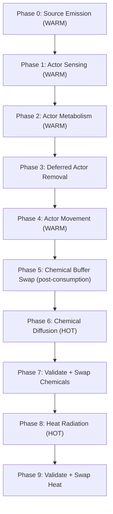

# Design Document: Grid Actors

## Overview

This design introduces mobile Actors into the existing deterministic grid simulation. Actors are reactive agents that live on top of the substrate (chemical + heat fields), sense local gradients, consume resources, move, and die. The design preserves all existing invariants: deterministic tick ordering, double-buffered read/write discipline, zero hot-path allocation, and no dynamic dispatch in the core tick path.

The Actor subsystem mirrors the existing SourceRegistry pattern — generational slot-based storage with a free list — extended with an occupancy map for O(1) collision detection. Actor phases slot into the tick orchestrator between source emission and diffusion, reading from read buffers and writing to write buffers.

## Architecture

The Actor subsystem is a peer module to the existing `source` module inside `src/grid/`. It does not depend on any rendering crate.

```
src/grid/
├── actor.rs          # Actor, ActorId, ActorSlot, ActorError, ActorRegistry
├── actor_config.rs   # ActorConfig struct
├── actor_systems.rs  # run_sensing, run_metabolism, run_movement (system functions)
├── mod.rs            # Extended Grid struct (+ ActorRegistry, occupancy_map)
├── tick.rs           # Extended TickOrchestrator::step with actor phases
├── ...               # Existing modules unchanged
```

### Tick Phase Ordering



Buffer discipline per phase:

| Phase | Reads From | Writes To | Notes |
|---|---|---|---|
| Source Emission | Read buffers | Write buffers | Existing behavior, swaps affected buffers |
| Actor Sensing | Read buffers (chemical) | Scratch (movement targets) | Pure read, no mutation |
| Actor Metabolism | Read buffers (chemical) | Write buffers (chemical), Actor energy | Consumption subtracted from write buffer |
| Deferred Removal | — | ActorRegistry, Occupancy_Map | Structural mutation after iteration |
| Actor Movement | Occupancy_Map | Occupancy_Map, Actor cell_index | In-place occupancy updates |
| Chemical Swap | — | — | Swap so diffusion reads post-consumption state |
| Diffusion | Read buffers | Write buffers | Existing behavior |
| Heat Radiation | Read buffers | Write buffers | Existing behavior |

Rationale for ordering:
- Emission runs first so Actors sense post-emission state.
- Sensing before metabolism so movement targets are computed from pre-consumption gradients.
- Metabolism before movement so dead Actors are removed before movement resolution.
- Chemical swap after Actor consumption so diffusion operates on post-consumption concentrations.
- Movement after removal so dead Actors don't block living ones.

## Components and Interfaces

### Actor (plain data struct)

```rust
/// A mobile biological agent occupying one grid cell.
/// Plain data — no methods beyond construction. Derives only what's needed.
#[derive(Debug, Clone, Copy, PartialEq)]
pub struct Actor {
    pub cell_index: usize,
    pub energy: f32,
}
```

### ActorId (generational index)

```rust
/// Opaque handle for a registered Actor. Generation prevents ABA on slot reuse.
#[derive(Debug, Clone, Copy, PartialEq, Eq, Hash)]
pub struct ActorId {
    pub(crate) index: usize,
    pub(crate) generation: u64,
}
```

### ActorSlot (internal)

```rust
pub(crate) struct ActorSlot {
    pub(crate) actor: Option<Actor>,
    pub(crate) generation: u64,
}
```

### ActorError

```rust
#[derive(Debug, Clone, PartialEq, thiserror::Error)]
pub enum ActorError {
    #[error("cell index {cell_index} out of bounds (grid has {cell_count} cells)")]
    CellOutOfBounds { cell_index: usize, cell_count: usize },

    #[error("cell {cell_index} is already occupied")]
    CellOccupied { cell_index: usize },

    #[error("invalid actor id (index={index}, generation={generation})")]
    InvalidActorId { index: usize, generation: u64 },
}
```

### ActorRegistry

```rust
pub struct ActorRegistry {
    slots: Vec<ActorSlot>,
    free_list: Vec<usize>,
    active_count: usize,
}
```

Methods mirror SourceRegistry:
- `new() -> Self`
- `with_capacity(cap: usize) -> Self` — pre-allocates `cap` slots
- `add(actor: Actor, cell_count: usize, occupancy: &mut [Option<usize>]) -> Result<ActorId, ActorError>`
- `remove(id: ActorId, occupancy: &mut [Option<usize>]) -> Result<(), ActorError>`
- `get(id: ActorId) -> Result<&Actor, ActorError>`
- `get_mut(id: ActorId) -> Result<&mut Actor, ActorError>`
- `len() -> usize`
- `is_empty() -> bool`
- `iter() -> impl Iterator<Item = (usize, &Actor)>` — yields `(slot_index, &Actor)` in slot order
- `iter_mut() -> impl Iterator<Item = (usize, &mut Actor)>` — yields `(slot_index, &mut Actor)` in slot order

Key difference from SourceRegistry: `add` and `remove` take `&mut [Option<usize>]` (the occupancy map) to maintain consistency atomically.

### ActorConfig

```rust
#[derive(Debug, Clone, PartialEq)]
pub struct ActorConfig {
    /// Chemical units consumed per tick from the current cell.
    pub consumption_rate: f32,
    /// Energy gained per unit of chemical consumed.
    pub energy_conversion_factor: f32,
    /// Energy subtracted from every Actor each tick (basal metabolic cost).
    pub base_energy_decay: f32,
    /// Energy assigned to newly spawned Actors.
    pub initial_energy: f32,
    /// Pre-allocated slot capacity for the ActorRegistry.
    pub initial_actor_capacity: usize,
}
```

### Occupancy Map

Stored as a field on `Grid`:

```rust
pub struct Grid {
    // ... existing fields ...
    actors: ActorRegistry,
    occupancy: Vec<Option<usize>>,  // cell_index → slot_index
    removal_buffer: Vec<ActorId>,   // pre-allocated for deferred death
}
```

`occupancy` is `Vec<Option<usize>>` of length `cell_count`, allocated once at grid construction. `removal_buffer` is `Vec<ActorId>` with capacity `initial_actor_capacity`.

### System Functions

All system functions are free functions (stateless), matching the existing pattern (`run_diffusion`, `run_heat`, `run_emission`).

```rust
// WARM PATH: Iterates actors in slot order, reads chemical read buffer.
// No allocation. No dynamic dispatch.
pub fn run_actor_sensing(
    actors: &ActorRegistry,
    chemical_read: &[f32],
    grid_width: u32,
    grid_height: u32,
    movement_targets: &mut [Option<usize>],  // slot_index → target cell_index
)

// WARM PATH: Iterates actors in slot order, writes to chemical write buffer.
// No allocation. No dynamic dispatch.
pub fn run_actor_metabolism(
    actors: &mut ActorRegistry,
    chemical_read: &[f32],
    chemical_write: &mut [f32],
    config: &ActorConfig,
    removal_buffer: &mut Vec<ActorId>,  // pre-allocated, cleared before use
)

// WARM PATH: Iterates actors in slot order, updates occupancy map.
// No allocation. No dynamic dispatch.
pub fn run_actor_movement(
    actors: &mut ActorRegistry,
    occupancy: &mut [Option<usize>],
    movement_targets: &[Option<usize>],
)
```

### Movement Target Buffer

A `Vec<Option<usize>>` of length equal to ActorRegistry slot capacity, pre-allocated at grid construction. Index `i` holds the target cell_index for the Actor in slot `i`, or `None` if the Actor should stay.

### Grid Extensions

New methods on `Grid`:

```rust
impl Grid {
    pub fn actors(&self) -> &ActorRegistry { ... }
    pub fn actors_mut(&mut self) -> &mut ActorRegistry { ... }
    pub fn occupancy(&self) -> &[Option<usize>] { ... }
    pub fn add_actor(&mut self, actor: Actor) -> Result<ActorId, ActorError> { ... }
    pub fn remove_actor(&mut self, id: ActorId) -> Result<(), ActorError> { ... }
}
```

## Data Models

### Memory Layout

All Actor data is stored in a single contiguous `Vec<ActorSlot>`. Each `ActorSlot` is:

```
ActorSlot {
    actor: Option<Actor>,  // 1 byte tag + 4 (usize) + 4 (f32) = ~16 bytes with padding
    generation: u64,       // 8 bytes
}
// Total: ~24 bytes per slot (with alignment)
```

For 10,000 actors: ~240 KB — fits comfortably in L2 cache on Apple Silicon.

The occupancy map is `Vec<Option<usize>>`: 16 bytes per cell (Option<usize> with niche optimization = 8 bytes on 64-bit). For a 100×100 grid: 80 KB.

The movement target buffer is `Vec<Option<usize>>`: same size as actor slot count, not cell count. For 10,000 actors: 80 KB.

The removal buffer is `Vec<ActorId>`: 16 bytes per entry. Pre-allocated to actor capacity.

### Sensing: Von Neumann Neighborhood

Von Neumann (4 orthogonal neighbors) chosen over Moore (8 neighbors including diagonals) because:
1. Simpler gradient computation — 4 comparisons vs 8.
2. Movement is already restricted to orthogonal (one cell per tick on a rectangular grid).
3. Diagonal sensing would suggest diagonal movement, which v1 does not support.
4. Fewer cache misses per Actor — 4 reads vs 8 from the chemical buffer.

Neighbor offsets from cell `(x, y)`:

| Direction | dx | dy | Index formula |
|---|---|---|---|
| North | 0 | -1 | `(y-1) * width + x` |
| South | 0 | +1 | `(y+1) * width + x` |
| West | -1 | 0 | `y * width + (x-1)` |
| East | +1 | 0 | `y * width + (x+1)` |

Out-of-bounds neighbors (at grid edges) are treated as concentration 0.0, creating a natural boundary repulsion effect.

### Movement Conflict Resolution

When multiple Actors target the same cell in a single tick:
- Actors are processed in ascending slot-index order.
- The first Actor to claim the cell via the occupancy map wins.
- Subsequent Actors targeting the same cell find it occupied and stay put.

This is deterministic because slot-index order is fixed.

### Metabolism Pseudocode

```
for each active actor (slot order):
    available = chemical_read[actor.cell_index]
    consumed = min(config.consumption_rate, available)
    chemical_write[actor.cell_index] -= consumed
    chemical_write[actor.cell_index] = max(0.0, chemical_write[actor.cell_index])
    actor.energy += consumed * config.energy_conversion_factor
    actor.energy -= config.base_energy_decay
    if actor.energy <= 0.0:
        removal_buffer.push(actor_id)
```

Note: `chemical_write` must be initialized from `chemical_read` (copy-read-to-write) before metabolism runs, same pattern as emission.

### Sensing Pseudocode

```
for each active actor (slot order):
    (x, y) = cell_index_to_xy(actor.cell_index, grid_width)
    current_val = chemical_read[actor.cell_index]
    best_gradient = 0.0
    best_target = None
    for each (dx, dy) in [(0,-1), (0,1), (-1,0), (1,0)]:
        (nx, ny) = (x + dx, y + dy)
        if nx < 0 or nx >= width or ny < 0 or ny >= height:
            continue  // boundary: treat as 0.0, gradient = 0.0 - current_val ≤ 0
        neighbor_val = chemical_read[ny * width + nx]
        gradient = neighbor_val - current_val
        if gradient > best_gradient:
            best_gradient = gradient
            best_target = Some(ny * width + nx)
    movement_targets[slot_index] = best_target
```

Tie-breaking: if multiple neighbors share the same maximum gradient, the first one encountered in the iteration order (N, S, W, E) wins. This is deterministic.


## Correctness Properties

*A property is a characteristic or behavior that should hold true across all valid executions of a system — essentially, a formal statement about what the system should do. Properties serve as the bridge between human-readable specifications and machine-verifiable correctness guarantees.*

The following properties were derived from the acceptance criteria through systematic prework analysis. Redundant criteria were consolidated — for example, occupancy consistency (3.2, 3.3, 3.5, 6.4, 10.1) collapses into a single invariant, and the three error-path criteria (11.2, 11.3, 11.4) each become distinct properties because they test different error variants.

### Property 1: Occupancy invariant

*For any* sequence of add, remove, and move operations on an ActorRegistry with an occupancy map, the following must hold after every operation: (a) for every active Actor with slot index `s` and cell_index `c`, `occupancy[c] == Some(s)`; (b) for every cell where `occupancy[c] == Some(s)`, slot `s` contains an active Actor with cell_index `c`; (c) no two active Actors share the same cell_index.

**Validates: Requirements 3.2, 3.3, 3.4, 3.5, 6.4, 10.1**

### Property 2: Add rejects out-of-bounds cell index

*For any* cell_index >= cell_count and any valid Actor energy value, adding an Actor to the ActorRegistry shall return `ActorError::CellOutOfBounds`.

**Validates: Requirements 2.3, 11.2**

### Property 3: Add rejects occupied cell

*For any* valid cell_index that already has an active Actor, adding a second Actor at that cell_index shall return `ActorError::CellOccupied` and leave the registry and occupancy map unchanged.

**Validates: Requirements 3.4, 11.3**

### Property 4: Remove rejects stale ActorId

*For any* ActorId that has already been removed (stale generation), calling remove again shall return `ActorError::InvalidActorId` and leave the registry unchanged.

**Validates: Requirements 2.4, 11.4**

### Property 5: Add-remove round trip

*For any* valid Actor added to an empty registry, adding then removing it shall return the registry to an empty state with `len() == 0`, `is_empty() == true`, and the occupancy map entry cleared.

**Validates: Requirements 2.7, 3.3**

### Property 6: Sensing selects maximum positive gradient neighbor

*For any* grid state (chemical read buffer) and any Actor position, the sensing system shall select the Von Neumann neighbor with the maximum positive gradient relative to the current cell. If no neighbor has a positive gradient, the movement target shall be None. Ties are broken by direction priority order (N, S, W, E).

**Validates: Requirements 5.1, 5.3, 5.4, 5.5**

### Property 7: Movement distance invariant

*For any* Actor before and after the movement phase, the Manhattan distance between the old cell_index and the new cell_index shall be at most 1.

**Validates: Requirements 6.2**

### Property 8: Movement conflict — lower slot wins

*For any* two Actors targeting the same unoccupied cell, the Actor with the lower slot index shall occupy the target cell, and the Actor with the higher slot index shall remain in its original cell.

**Validates: Requirements 6.3, 6.6**

### Property 9: Metabolism energy balance

*For any* Actor with cell_index `c`, chemical read buffer value `available = chemical_read[c]`, consumption_rate `r`, energy_conversion_factor `f`, and base_energy_decay `d`: after metabolism, the Actor's energy delta shall equal `min(r, available) * f - d`, and the chemical write buffer at `c` shall decrease by `min(r, available)`.

**Validates: Requirements 7.1, 7.2, 7.3, 7.4**

### Property 10: Chemical non-negativity after consumption

*For any* grid state and any set of Actors, after the metabolism phase completes, every value in the chemical write buffer shall be >= 0.0.

**Validates: Requirements 7.5, 10.5**

### Property 11: Dead actors are removed after metabolism

*For any* Actor whose energy drops to <= 0.0 after metabolism, that Actor shall not be present in the ActorRegistry after the deferred removal phase, and its occupancy map entry shall be cleared.

**Validates: Requirements 7.6, 8.1, 8.2**

### Property 12: Tick determinism

*For any* initial Grid state (including Actors, field buffers, sources, and configuration), running `TickOrchestrator::step` twice from identical initial states shall produce identical final states (all field buffers, all Actor positions and energies, occupancy map).

**Validates: Requirements 4.4, 10.4**

### Property 13: Zero-actor tick equivalence

*For any* Grid state with zero registered Actors, running the extended `TickOrchestrator::step` (with Actor phases) shall produce identical field buffer output to running the original tick sequence (emission → diffusion → heat → swaps).

**Validates: Requirements 4.5, 10.6**

## Error Handling

### ActorError

Defined in `actor.rs` using `thiserror`. Variants:

| Variant | Trigger | Recovery |
|---|---|---|
| `CellOutOfBounds { cell_index, cell_count }` | `add()` with invalid cell_index | Caller corrects index or skips |
| `CellOccupied { cell_index }` | `add()` to occupied cell | Caller picks different cell |
| `InvalidActorId { index, generation }` | `remove()`/`get()` with stale id | Caller discards stale handle |

### TickError Extensions

The existing `TickError` enum gains a new variant:

```rust
NumericalError {
    system: &'static str,  // "actor_metabolism"
    cell_index: usize,
    field: &'static str,   // "energy" or "chemical_0"
    value: f32,
}
```

This reuses the existing variant shape — no new enum variant needed, just new `system`/`field` string values passed to the existing `NumericalError`.

### Error Propagation

- All Actor system functions return `Result<(), TickError>`.
- `TickOrchestrator::step` propagates errors via `?` — same pattern as existing diffusion/heat phases.
- No `unwrap()` or `expect()` in any Actor system function.
- Actor energy is validated for NaN/Inf after metabolism, before deferred removal.

### Panic Policy

Zero panics in simulation logic. All fallible operations use `Result`. `debug_assert!` is used for invariant checks (occupancy consistency, buffer lengths) that compile away in release builds.

## Testing Strategy

### Property-Based Testing

Library: **`proptest`** (Rust). Mature, well-maintained, supports custom strategies and shrinking.

Configuration: minimum 256 iterations per property test (higher than the 100 minimum — Actor state space is large enough to warrant it).

Each property test is tagged with a comment:

```rust
// Feature: grid-actors, Property N: <property title>
// Validates: Requirements X.Y, X.Z
```

Property tests cover Properties 1–13 from the Correctness Properties section. Each property maps to exactly one `proptest` test function.

**Generators needed:**
- `arb_actor(cell_count)` — generates Actor with valid cell_index in `0..cell_count` and energy in a reasonable range (0.01..1000.0).
- `arb_actor_config()` — generates ActorConfig with positive rates in reasonable ranges.
- `arb_chemical_buffer(cell_count)` — generates a Vec<f32> of non-negative values.
- `arb_grid_dims()` — generates (width, height) in 2..64 range for tractable test grids.
- `arb_add_remove_sequence(cell_count, max_ops)` — generates a sequence of add/remove operations for registry invariant testing.

### Unit Testing

Unit tests complement property tests for:
- Specific edge cases: boundary cells (corners, edges), zero-energy actors, zero-concentration cells.
- Error condition examples: specific invalid ActorId values, specific out-of-bounds indices.
- Integration smoke tests: one full tick with a small grid (4×4) and 2–3 actors, verifying expected final state.
- Regression tests: any bug found during development gets a minimal reproducing unit test.

### Benchmark Testing

Using `criterion`:
- `bench_actor_sensing` — 1000 actors on a 100×100 grid.
- `bench_actor_metabolism` — 1000 actors on a 100×100 grid.
- `bench_actor_movement` — 1000 actors on a 100×100 grid.
- `bench_full_tick_with_actors` — full tick with 1000 actors on 100×100 grid vs. tick without actors.

These benchmarks verify that Actor phases meet WARM path performance expectations and that zero-actor overhead is negligible.

## Future Extension Points (Design Only)

These are not implemented in v1. The v1 data model and phase structure are designed to accommodate them without breaking changes.

### Actor Reproduction

Add a reproduction phase after movement. An Actor with energy above a threshold splits: energy is halved, a new Actor is added to an adjacent unoccupied cell via `ActorRegistry::add`. The `ActorConfig` gains `reproduction_threshold: f32`. No structural changes to the registry or occupancy map — `add` already handles validation.

### Actor Emission

Actors emit chemical or heat into their current cell's write buffer during a new emission sub-phase. The `Actor` struct gains an `emission_rate: f32` field. This mirrors source emission but is per-actor and position-dependent.

### Multiple Chemical Species Sensing

The sensing function gains a `species: usize` parameter (currently hardcoded to 0). `ActorConfig` gains `sensed_species: usize`. No structural changes — the chemical read buffer is already indexed by species.

### Probabilistic Behavior

Introduce seeded per-actor RNG derived from `(global_seed, tick_number, slot_index)` via `ChaCha8Rng`. This preserves determinism. Probabilistic movement would select among positive-gradient neighbors weighted by gradient magnitude instead of taking the maximum. The sensing function signature gains an `&mut ChaCha8Rng` parameter.

### Evolutionary Parameters

Actor-local config overrides (mutation of consumption_rate, energy_conversion_factor) stored as optional fields on `Actor`. These drift via small perturbations at reproduction time, seeded deterministically. Species emerge as clusters of actors with similar parameter vectors — no top-down Species struct.
