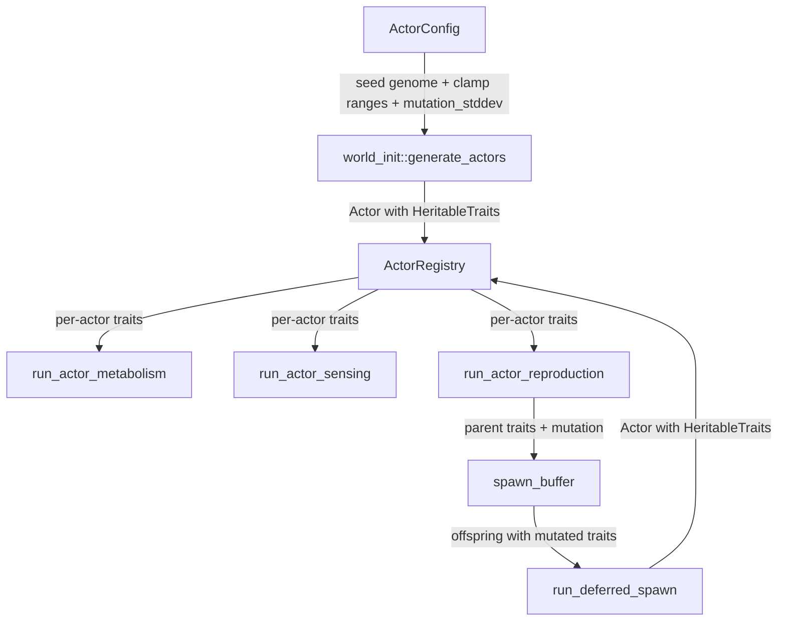

# Design Document: Heritable Actor Traits

## Overview

This feature introduces per-actor heritable traits — a small, `Copy` struct of four `f32` fields embedded directly in the `Actor` struct. These traits replace the corresponding global `ActorConfig` fields for the four behavioral parameters that should vary between individuals: `consumption_rate`, `base_energy_decay`, `levy_exponent`, and `reproduction_threshold`. All other `ActorConfig` fields remain global physics/bookkeeping constants.

During binary fission, offspring inherit the parent's trait values with independent gaussian mutations per field, clamped to configurable ranges. Mutation RNG is deterministic, seeded from the simulation master seed, parent slot index, and tick number.

The design is minimal: one new 16-byte struct, one new field on `Actor`, mutation config fields on `ActorConfig`, and targeted edits to three existing systems (metabolism, sensing, reproduction) plus world init and deferred spawn.

## Architecture

The change is localized to the actor subsystem. No new modules are introduced.



Data flow:
1. `ActorConfig` provides the seed genome (initial trait values) and mutation parameters (stddev, clamp ranges).
2. `generate_actors` creates seed actors with traits copied from `ActorConfig`.
3. Systems read per-actor trait values from `actor.traits` instead of `config.consumption_rate`, etc.
4. `run_actor_reproduction` copies parent traits into the spawn buffer alongside cell index and energy.
5. `run_deferred_spawn` applies gaussian mutation, clamps, and inserts the offspring with mutated traits.

### Design Decisions

**Mutation in deferred spawn, not in reproduction scan.** The reproduction system iterates actors mutably and builds a spawn buffer. Applying mutation there would require threading the tick RNG through the reproduction loop, which already has a complex control flow. Instead, mutation is applied in `run_deferred_spawn`, which processes the spawn buffer sequentially and can derive a per-offspring RNG seed cleanly. This keeps the reproduction system focused on eligibility and placement.

**Clamp ranges on ActorConfig, not on HeritableTraits.** The clamp ranges are configuration, not per-actor state. Storing them on `ActorConfig` keeps `HeritableTraits` at exactly 16 bytes and avoids duplicating range data across thousands of actors.

**No separate `TraitClampRange` struct.** Four pairs of `(min, max)` fields directly on `ActorConfig` (e.g., `trait_consumption_rate_min`, `trait_consumption_rate_max`) are simpler than a nested struct and play well with serde's flat TOML deserialization.

## Components and Interfaces

### `HeritableTraits` (new struct in `src/grid/actor.rs`)

```rust
/// Per-actor heritable trait values. Inherited from parent during fission
/// with gaussian mutation. 16 bytes, no padding.
#[derive(Debug, Clone, Copy, PartialEq)]
pub struct HeritableTraits {
    pub consumption_rate: f32,
    pub base_energy_decay: f32,
    pub levy_exponent: f32,
    pub reproduction_threshold: f32,
}
```

### `Actor` (modified)

```rust
#[derive(Debug, Clone, Copy, PartialEq)]
pub struct Actor {
    pub cell_index: usize,
    pub energy: f32,
    pub inert: bool,
    pub tumble_direction: u8,
    pub tumble_remaining: u16,
    pub traits: HeritableTraits,  // NEW
}
```

### `ActorConfig` (modified — new fields)

New fields for mutation control and clamp ranges:

```rust
// Mutation
pub mutation_stddev: f32,           // default: 0.05

// Clamp ranges
pub trait_consumption_rate_min: f32,       // default: 0.1
pub trait_consumption_rate_max: f32,       // default: 10.0
pub trait_base_energy_decay_min: f32,      // default: 0.001
pub trait_base_energy_decay_max: f32,      // default: 1.0
pub trait_levy_exponent_min: f32,          // default: 1.01
pub trait_levy_exponent_max: f32,          // default: 3.0
pub trait_reproduction_threshold_min: f32, // default: 1.0
pub trait_reproduction_threshold_max: f32, // default: 100.0
```

### `HeritableTraits::from_config` (constructor)

```rust
impl HeritableTraits {
    /// Create traits from global config defaults (seed genome).
    pub fn from_config(config: &ActorConfig) -> Self {
        Self {
            consumption_rate: config.consumption_rate,
            base_energy_decay: config.base_energy_decay,
            levy_exponent: config.levy_exponent,
            reproduction_threshold: config.reproduction_threshold,
        }
    }
}
```

### `HeritableTraits::mutate` (mutation method)

```rust
impl HeritableTraits {
    /// Apply gaussian mutation to all four traits, clamping to config ranges.
    /// Uses a seeded RNG for deterministic replay.
    pub fn mutate(&mut self, config: &ActorConfig, rng: &mut impl Rng) {
        use rand_distr::{Distribution, Normal};

        if config.mutation_stddev == 0.0 {
            return;
        }

        let normal = Normal::new(0.0, config.mutation_stddev as f64)
            .expect("mutation_stddev validated non-negative at config load");

        self.consumption_rate = (self.consumption_rate + normal.sample(rng) as f32)
            .clamp(config.trait_consumption_rate_min, config.trait_consumption_rate_max);

        self.base_energy_decay = (self.base_energy_decay + normal.sample(rng) as f32)
            .clamp(config.trait_base_energy_decay_min, config.trait_base_energy_decay_max);

        self.levy_exponent = (self.levy_exponent + normal.sample(rng) as f32)
            .clamp(config.trait_levy_exponent_min, config.trait_levy_exponent_max);

        self.reproduction_threshold = (self.reproduction_threshold + normal.sample(rng) as f32)
            .clamp(config.trait_reproduction_threshold_min, config.trait_reproduction_threshold_max);
    }
}
```

### Spawn Buffer Type Change

The spawn buffer type changes from `Vec<(usize, f32)>` (cell_index, energy) to `Vec<(usize, f32, HeritableTraits)>` to carry the parent's traits through to deferred spawn.

This affects:
- `Grid.spawn_buffer` field type
- `run_actor_reproduction` — pushes `(cell, offspring_energy, parent_traits)` 
- `run_deferred_spawn` — receives traits, applies mutation, creates offspring
- `Grid::take_actors` / `Grid::put_actors` signatures

### Modified System Signatures

**`run_actor_reproduction`** — no new parameters needed. Reads `actor.traits.reproduction_threshold` instead of `config.reproduction_threshold`. Copies `actor.traits` into spawn buffer.

**`run_deferred_spawn`** — gains `config: &ActorConfig` and `tick: u64` and `seed: u64` parameters for mutation RNG derivation.

```rust
pub fn run_deferred_spawn(
    actors: &mut ActorRegistry,
    occupancy: &mut [Option<usize>],
    spawn_buffer: &mut Vec<(usize, f32, HeritableTraits)>,
    cell_count: usize,
    config: &ActorConfig,
    seed: u64,
    tick: u64,
) -> Result<(), TickError>
```

**`run_actor_metabolism`** — no signature change. Reads `actor.traits.consumption_rate` and `actor.traits.base_energy_decay` instead of config fields.

**`run_actor_sensing`** — no signature change. Reads `actor.traits.base_energy_decay` and `actor.traits.levy_exponent` instead of config fields. The break-even computation moves inside the per-actor loop since `base_energy_decay` now varies per actor.

### Mutation RNG Seeding

Per-offspring deterministic seed derivation in `run_deferred_spawn`:

```rust
for (i, &(cell_index, energy, parent_traits)) in spawn_buffer.iter().enumerate() {
    let mut offspring_traits = parent_traits;
    let offspring_seed = seed
        .wrapping_mul(6_364_136_223_846_793_005)
        .wrapping_add(tick)
        .wrapping_add(i as u64);
    let mut mutation_rng = SmallRng::seed_from_u64(offspring_seed);
    offspring_traits.mutate(config, &mut mutation_rng);
    // ... create Actor with offspring_traits
}
```

The seed combines the simulation master seed, tick number, and spawn buffer index. The spawn buffer index is deterministic because reproduction iterates actors in slot-index order and placement scans directions in fixed N/S/W/E order.

## Data Models

### HeritableTraits

| Field | Type | Source (seed actors) | Source (offspring) | Clamp Range |
|---|---|---|---|---|
| `consumption_rate` | `f32` | `ActorConfig.consumption_rate` | parent + gaussian mutation | `[trait_consumption_rate_min, trait_consumption_rate_max]` |
| `base_energy_decay` | `f32` | `ActorConfig.base_energy_decay` | parent + gaussian mutation | `[trait_base_energy_decay_min, trait_base_energy_decay_max]` |
| `levy_exponent` | `f32` | `ActorConfig.levy_exponent` | parent + gaussian mutation | `[trait_levy_exponent_min, trait_levy_exponent_max]` |
| `reproduction_threshold` | `f32` | `ActorConfig.reproduction_threshold` | parent + gaussian mutation | `[trait_reproduction_threshold_min, trait_reproduction_threshold_max]` |

Memory: 4 × 4 bytes = 16 bytes. `Copy`, no heap allocation. Stored inline in `Actor`.

### ActorConfig New Fields

| Field | Type | Default | Validation |
|---|---|---|---|
| `mutation_stddev` | `f32` | `0.05` | `>= 0.0` |
| `trait_consumption_rate_min` | `f32` | `0.1` | `> 0.0`, `< trait_consumption_rate_max` |
| `trait_consumption_rate_max` | `f32` | `10.0` | `> trait_consumption_rate_min` |
| `trait_base_energy_decay_min` | `f32` | `0.001` | `> 0.0`, `< trait_base_energy_decay_max` |
| `trait_base_energy_decay_max` | `f32` | `1.0` | `> trait_base_energy_decay_min` |
| `trait_levy_exponent_min` | `f32` | `1.01` | `> 1.0`, `< trait_levy_exponent_max` |
| `trait_levy_exponent_max` | `f32` | `3.0` | `> trait_levy_exponent_min` |
| `trait_reproduction_threshold_min` | `f32` | `1.0` | `> 0.0`, `< trait_reproduction_threshold_max` |
| `trait_reproduction_threshold_max` | `f32` | `100.0` | `> trait_reproduction_threshold_min` |

### Spawn Buffer

Before: `Vec<(usize, f32)>` — `(cell_index, energy)`
After: `Vec<(usize, f32, HeritableTraits)>` — `(cell_index, energy, parent_traits)`


## Correctness Properties

*A property is a characteristic or behavior that should hold true across all valid executions of a system — essentially, a formal statement about what the system should do. Properties serve as the bridge between human-readable specifications and machine-verifiable correctness guarantees.*

### Property 1: Seed actor traits match config

*For any* valid `ActorConfig`, all seed actors created by `generate_actors` should have `HeritableTraits` where each field equals the corresponding `ActorConfig` field (`consumption_rate`, `base_energy_decay`, `levy_exponent`, `reproduction_threshold`).

**Validates: Requirements 2.1**

### Property 2: Mutation clamp invariant

*For any* `HeritableTraits` value and *any* `ActorConfig` with valid clamp ranges and *any* `mutation_stddev >= 0.0`, after calling `mutate()`, every trait field must be within its configured clamp range: `consumption_rate ∈ [trait_consumption_rate_min, trait_consumption_rate_max]`, and likewise for the other three fields.

**Validates: Requirements 3.4, 4.2**

### Property 3: Zero-stddev identity

*For any* `HeritableTraits` value and *any* `ActorConfig` with `mutation_stddev == 0.0`, calling `mutate()` should produce traits exactly equal to the input (no change).

**Validates: Requirements 3.1, 6.3**

### Property 4: Non-zero mutation produces variation

*For any* `ActorConfig` with `mutation_stddev > 0.0` and *any* parent `HeritableTraits`, over a sufficient number of fission events (≥100), at least one offspring should have traits that differ from the parent.

**Validates: Requirements 3.2, 3.3**

### Property 5: Replay determinism

*For any* simulation master seed, tick number, and spawn buffer contents, running `run_deferred_spawn` twice with identical inputs should produce actors with identical `HeritableTraits` values.

**Validates: Requirements 7.1, 7.2**

### Property 6: Metabolism uses per-actor traits

*For any* two actors with different `consumption_rate` or `base_energy_decay` trait values placed on cells with identical chemical concentrations, running `run_actor_metabolism` should produce different energy deltas proportional to their trait differences. For inert actors, the energy decay should equal the actor's per-actor `base_energy_decay`, not the global config value.

**Validates: Requirements 5.1, 5.4**

### Property 7: Sensing uses per-actor traits

*For any* two actors with different `levy_exponent` trait values, when both initiate a Lévy flight tumble with the same RNG state, they should receive different tumble step counts (when the exponents are sufficiently different). *For any* two actors with different `base_energy_decay` trait values, their break-even concentration thresholds should differ.

**Validates: Requirements 5.2, 5.5**

### Property 8: Reproduction uses per-actor threshold

*For any* actor whose energy is above its per-actor `reproduction_threshold` but below the global `ActorConfig.reproduction_threshold` (or vice versa), the reproduction system should use the per-actor value to determine fission eligibility.

**Validates: Requirements 5.3**

## Error Handling

### Config Validation Errors

New validation checks added to `validate_world_config` and `Grid::new`:

| Check | Error |
|---|---|
| `mutation_stddev < 0.0` | `ConfigError::Validation` / `GridError::InvalidActorConfig` |
| `trait_*_min >= trait_*_max` for any trait | `ConfigError::Validation` / `GridError::InvalidActorConfig` |
| `trait_levy_exponent_min <= 1.0` | `ConfigError::Validation` / `GridError::InvalidActorConfig` |
| `trait_consumption_rate_min <= 0.0` | `ConfigError::Validation` / `GridError::InvalidActorConfig` |
| `trait_base_energy_decay_min <= 0.0` | `ConfigError::Validation` / `GridError::InvalidActorConfig` |
| `trait_reproduction_threshold_min <= 0.0` | `ConfigError::Validation` / `GridError::InvalidActorConfig` |
| Default config values outside clamp ranges | `ConfigError::Validation` |

### Runtime Errors

No new runtime error variants. The existing `TickError::NumericalError` covers NaN/Inf checks on offspring energy. Trait values are clamped, not validated at runtime — clamping is cheaper and cannot fail.

### Panic Safety

The `Normal::new()` call in `mutate()` uses `expect()` because `mutation_stddev` is validated non-negative at config load time. This is acceptable per the Rust Best Practices steering rule (one-time initialization with justifying comment).

## Testing Strategy

### Property-Based Testing

Library: `proptest` (Rust's standard PBT crate, well-maintained, supports `f32` strategies with configurable ranges).

Each property test runs a minimum of 256 iterations (proptest default config, increased from 100 for better coverage of floating-point edge cases).

Tests are tagged with: `// Feature: heritable-actor-traits, Property N: <title>`

| Property | Test Approach | Generator Strategy |
|---|---|---|
| P1: Seed traits match config | Generate random `ActorConfig` with valid ranges, run `HeritableTraits::from_config`, assert field equality | `proptest` arbitrary `f32` in valid ranges for each config field |
| P2: Mutation clamp invariant | Generate random traits + random config with valid clamp ranges + random stddev, call `mutate()`, assert all fields within bounds | Arbitrary `f32` traits, arbitrary clamp ranges where min < max, stddev in `[0.0, 100.0]` |
| P3: Zero-stddev identity | Generate random traits + config with stddev=0, call `mutate()`, assert traits unchanged | Arbitrary traits, config with `mutation_stddev = 0.0` |
| P4: Non-zero mutation variation | Generate random traits + config with stddev > 0, call `mutate()` 100 times, assert at least one differs | Arbitrary traits, stddev in `(0.001, 10.0)` |
| P5: Replay determinism | Generate random seed/tick/spawn_buffer, run mutation twice, assert identical output | Arbitrary `u64` seed/tick, arbitrary spawn buffer entries |
| P6: Metabolism per-actor traits | Generate two actors with different traits on same cell, run metabolism, assert different energy deltas | Arbitrary trait values, fixed chemical concentration |
| P7: Sensing per-actor traits | Generate two actors with different levy_exponent, call `sample_tumble_steps` with same RNG, assert different results (for sufficiently different exponents). Generate two actors with different base_energy_decay, compute break-even, assert different thresholds | Arbitrary exponents in `[1.1, 3.0]`, arbitrary decay values |
| P8: Reproduction per-actor threshold | Generate actor with energy between per-actor and global thresholds, run reproduction, assert eligibility matches per-actor threshold | Arbitrary energy, per-actor threshold, global threshold where they disagree |

### Unit Tests

Unit tests cover specific examples and edge cases not well-suited to property testing:

- Default `ActorConfig` clamp range values match spec (4.3–4.6)
- Default `mutation_stddev` is `0.05` (6.2)
- `HeritableTraits` size is exactly 16 bytes (1.3)
- Config validation rejects negative `mutation_stddev` (6.4)
- Config validation rejects `trait_*_min >= trait_*_max`
- Config validation rejects `trait_levy_exponent_min <= 1.0`
- Spawn buffer type correctly carries `HeritableTraits` through reproduction → deferred spawn pipeline
