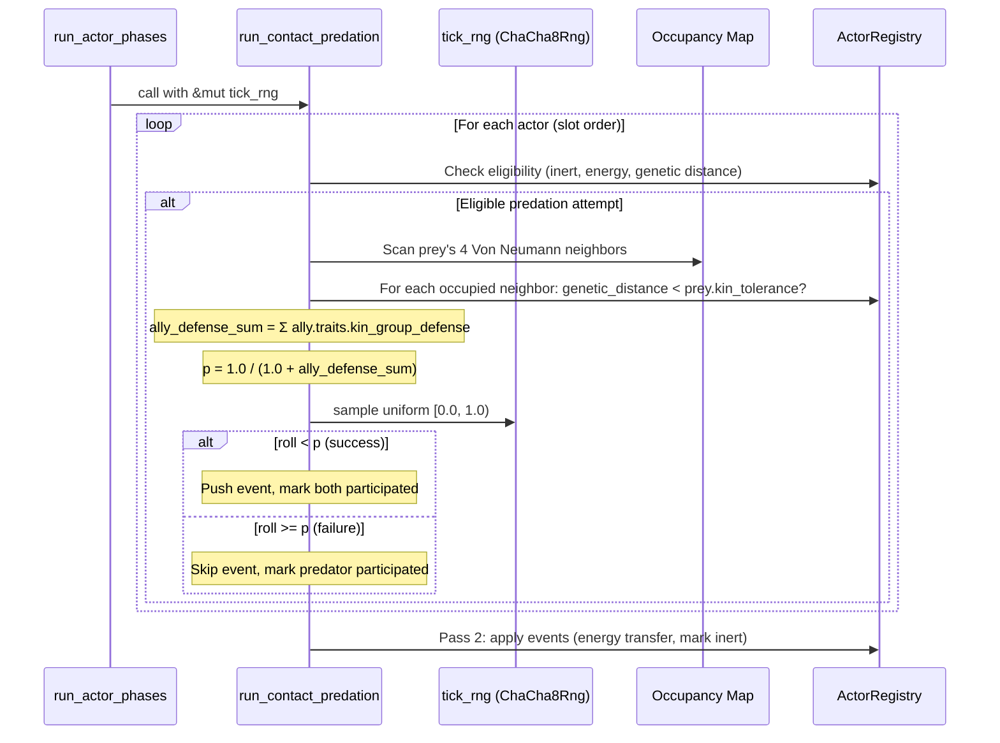

# Design Document: Kin-Group Defense

## Overview

This feature converts contact predation from a deterministic outcome to a probabilistic one, where the prey's genetically allied neighbors reduce the predator's success chance proportionally to their heritable `kin_group_defense` trait values. The mechanic is always active and degrades gracefully — zero allies yields 100% success, identical to current behavior.

The core formula: `success_probability = 1.0 / (1.0 + ally_defense_sum)`, where `ally_defense_sum` is the sum of each allied neighbor's `kin_group_defense` trait value. Allied neighbors are non-inert actors in the prey's Von Neumann 4-neighborhood (excluding the predator) whose genetic distance to the prey is below the prey's `kin_tolerance`.

With 0 allies → 100% success. With 3 allies each at `kin_group_defense = 1.0` → 25%. With 3 allies each at `kin_group_defense = 0.0` → 100% (no defense investment). The heritable trait creates evolutionary pressure: prey lineages that invest in defense protect kin, while lineages that invest nothing provide no protection.

## Architecture

The change touches four areas:

1. **Data model**: `HeritableTraits` gains `kin_group_defense: f32`. `ActorConfig` gains seed default + clamp bounds. `TRAIT_COUNT` increments to 12.
2. **Predation logic**: `run_contact_predation` gains `rng` parameter, computes ally defense sum, rolls dice.
3. **Mutation**: `HeritableTraits::mutate` adds a line for `kin_group_defense`.
4. **Visualization**: `TraitStats` array grows to 12, stats/inspector panels display the new trait.

No new systems, modules, or data structures are introduced.

### Thermal Classification

The predation system is **WARM** (runs every tick over a small subset of actors — only those with adjacent neighbors meeting eligibility). The ally scan adds at most 3 occupancy lookups + 3 genetic distance computations per predation attempt. All stack-allocated. The `kin_group_defense` field read is a single `f32` load per ally — negligible.

### Two-Pass Architecture

The existing two-pass structure is preserved:

```
Pass 1 (read-only): For each actor in slot order:
  ├── Check eligibility (inert, participated, energy dominance, genetic distance)
  ├── Scan prey's Von Neumann neighbors for allies
  ├── Sum allies' kin_group_defense trait values → ally_defense_sum
  ├── Compute success_probability = 1.0 / (1.0 + ally_defense_sum)
  ├── Sample RNG → success or failure
  └── If success: push (predator_slot, prey_slot, energy_gain) to events
      Mark predator + prey as participated
      If failure: mark predator as participated only

Pass 2 (mutation): For each event:
  ├── Apply energy gain to predator (clamped to max_energy)
  ├── NaN/Inf check
  └── Mark prey inert, queue for removal
```

Failed predation attempts skip the event push. The predator is marked `participated` so it cannot attempt again this tick. The prey is NOT marked as participated on failure — it remains eligible to be defended or preyed upon by other predators.

### RNG Integration

The function signature gains `rng: &mut impl Rng`. The call site in `run_actor_phases` passes the existing `tick_rng`. RNG samples are consumed in ascending slot-index order (the natural iteration order of `actors.iter()`), one sample per predation attempt, ensuring deterministic replay.



## Components and Interfaces

### Modified Struct: `HeritableTraits`

**File:** `src/grid/actor.rs`

Add `kin_group_defense: f32` field after `kin_tolerance`:

```rust
pub struct HeritableTraits {
    pub consumption_rate: f32,
    pub base_energy_decay: f32,
    pub levy_exponent: f32,
    pub reproduction_threshold: f32,
    pub max_tumble_steps: u16,
    pub reproduction_cost: f32,
    pub offspring_energy: f32,
    pub mutation_rate: f32,
    pub kin_tolerance: f32,
    pub kin_group_defense: f32,  // NEW
    pub optimal_temp: f32,
    pub reproduction_cooldown: u16,
}
```

### Modified Method: `HeritableTraits::from_config`

```rust
pub fn from_config(config: &ActorConfig) -> Self {
    Self {
        // ... existing fields ...
        kin_tolerance: config.kin_tolerance,
        kin_group_defense: config.kin_group_defense,  // NEW
        optimal_temp: config.optimal_temp,
        reproduction_cooldown: config.reproduction_cooldown,
    }
}
```

### Modified Method: `HeritableTraits::mutate`

Add after the `kin_tolerance` mutation line:

```rust
self.kin_group_defense = (self.kin_group_defense * (1.0 + normal.sample(rng) as f32))
    .clamp(config.trait_kin_group_defense_min, config.trait_kin_group_defense_max);
```

### Modified Struct: `ActorConfig`

**File:** `src/grid/actor_config.rs`

Add three fields in the contact predation config section:

```rust
/// Seed genome default for heritable kin_group_defense trait.
/// Controls how much defense an actor contributes to allied neighbors
/// during predation. 0.0 = no defense contribution, 1.0 = full defense point.
/// Must be within [trait_kin_group_defense_min, trait_kin_group_defense_max].
/// Default: 0.5.
#[serde(default = "default_kin_group_defense")]
pub kin_group_defense: f32,

/// Minimum clamp bound for heritable kin_group_defense. Default: 0.0.
#[serde(default = "default_trait_kin_group_defense_min")]
pub trait_kin_group_defense_min: f32,

/// Maximum clamp bound for heritable kin_group_defense. Default: 1.0.
#[serde(default = "default_trait_kin_group_defense_max")]
pub trait_kin_group_defense_max: f32,
```

Default functions:

```rust
fn default_kin_group_defense() -> f32 { 0.5 }
fn default_trait_kin_group_defense_min() -> f32 { 0.0 }
fn default_trait_kin_group_defense_max() -> f32 { 1.0 }
```

Validation in `ActorConfig::validate()`: `kin_group_defense` must be within `[trait_kin_group_defense_min, trait_kin_group_defense_max]`. `trait_kin_group_defense_min` must be `< trait_kin_group_defense_max`.

### Modified Constant and Function: `genetic_distance`

**File:** `src/grid/actor_systems.rs`

```rust
const TRAIT_COUNT: usize = 12;  // was 11

pub(crate) fn genetic_distance(a: &HeritableTraits, b: &HeritableTraits, config: &ActorConfig) -> f32 {
    let traits: [(f32, f32, f32, f32); TRAIT_COUNT] = [
        // ... existing 11 entries ...
        (a.kin_group_defense, b.kin_group_defense, config.trait_kin_group_defense_min, config.trait_kin_group_defense_max),
    ];
    // ... rest unchanged ...
}
```

The new entry is inserted after `kin_tolerance` and before `optimal_temp` to maintain logical grouping.

### Modified Function: `run_contact_predation`

**File:** `src/grid/actor_systems.rs`

```rust
pub fn run_contact_predation(
    actors: &mut ActorRegistry,
    occupancy: &[Option<usize>],
    config: &ActorConfig,
    removal_buffer: &mut Vec<ActorId>,
    w: usize,
    h: usize,
    rng: &mut impl Rng,       // NEW
) -> Result<usize, TickError>
```

### New Helper Function: `sum_allied_defense`

**File:** `src/grid/actor_systems.rs`

```rust
/// Sum the `kin_group_defense` trait values of non-inert actors in the prey's
/// Von Neumann 4-neighborhood (excluding the predator) whose genetic distance
/// to the prey is below the prey's `kin_tolerance`.
///
/// Returns the sum as f32. Maximum possible value is 3.0 (3 allies × max 1.0 each).
/// Pure function. No heap allocation. Stack-only.
fn sum_allied_defense(
    prey_cell: usize,
    prey_traits: &HeritableTraits,
    predator_slot: usize,
    occupancy: &[Option<usize>],
    actors: &ActorRegistry,
    config: &ActorConfig,
    w: usize,
    h: usize,
) -> f32
```

Implementation:
1. Iterate directions 0..4 using `direction_to_target(prey_cell, dir, w, h)`.
2. For each valid neighbor cell, look up `occupancy[cell]`.
3. Skip `None` (empty cell), skip if slot == `predator_slot`, skip if actor is inert.
4. Compute `genetic_distance(neighbor.traits, prey_traits, config)`.
5. If distance < `prey_traits.kin_tolerance`, add `neighbor.traits.kin_group_defense` to the running sum.
6. Return the sum.

### Modified Call Site: `run_actor_phases`

**File:** `src/grid/tick.rs`

```rust
predation_count = run_contact_predation(
    &mut actors,
    &occupancy,
    &actor_config,
    &mut removal_buffer,
    w,
    h,
    &mut tick_rng,  // NEW
)?;
```

### Visualization Changes

**File:** `src/viz_bevy/resources.rs`
- `TraitStats.traits` array size: `[SingleTraitStats; 12]` (was 11).

**File:** `src/viz_bevy/systems.rs`
- `compute_trait_stats_from_actors`: Add `kin_group_defense` Vec, collect values, compute stats at index 11 (after `kin_tolerance` at index 8, shifting `optimal_temp` to 10 and `repro_cooldown` to 11). Actually — to minimize disruption, append `kin_group_defense` as the 12th element (index 11) after `repro_cooldown`.

Wait — the current ordering in `compute_trait_stats_from_actors` is:
```
[0] consumption_rate
[1] base_energy_decay
[2] levy_exponent
[3] reproduction_threshold
[4] max_tumble_steps
[5] reproduction_cost
[6] offspring_energy
[7] mutation_rate
[8] kin_tolerance
[9] optimal_temp
[10] repro_cooldown
```

Appending `kin_group_defense` at index 11 keeps existing indices stable:
```
[11] kin_group_defense
```

**File:** `src/viz_bevy/setup.rs`
- `TRAIT_NAMES` array size: `[&str; 12]`, append `"kin_group_defense"`.
- `format_actor_info`: Add `writeln!` for `actor.traits.kin_group_defense`.
- `format_config_info`: Add lines for `kin_group_defense`, `trait_kin_group_defense` range.

## Data Models

No new data models are introduced. The feature extends existing structures:

- **`HeritableTraits`** — Gains `kin_group_defense: f32`. Read during ally defense computation and genetic distance.
- **`ActorConfig`** — Gains `kin_group_defense` (seed default), `trait_kin_group_defense_min`, `trait_kin_group_defense_max` (clamp bounds).
- **`Actor`** — No structural change. `cell_index`, `energy`, `inert`, `traits` are read during ally computation.
- **Occupancy map** (`Vec<Option<usize>>`) — Read to resolve cell → actor slot lookups for neighbor scanning.
- **Pass 1 event tuple** — Remains `(usize, usize, f32)`: `(predator_slot, prey_slot, energy_gain)`. Failed predation attempts produce no event entry.

## Correctness Properties

*A property is a characteristic or behavior that should hold true across all valid executions of a system — essentially, a formal statement about what the system should do. Properties serve as the bridge between human-readable specifications and machine-verifiable correctness guarantees.*

### Property 1: Allied neighbor identification correctness

*For any* grid configuration with a predator and prey placed at known positions, and arbitrary actors in the prey's Von Neumann neighborhood, the `sum_allied_defense` function should return the sum of `kin_group_defense` values only for neighbors that are (a) not the predator, (b) not inert, (c) within the prey's `kin_tolerance` genetic distance threshold, and (d) in valid in-bounds cells.

**Validates: Requirements 1.1, 1.5, 1.6, 1.7**

### Property 2: Defense probability formula correctness

*For any* predation attempt with a known ally defense sum, the success probability should equal `1.0 / (1.0 + ally_defense_sum)`, and the predation outcome should succeed if and only if the RNG sample is less than this probability.

**Validates: Requirements 1.2, 1.3, 1.4**

### Property 3: Deterministic replay

*For any* grid state (actor positions, energies, traits) and seed, running `run_contact_predation` twice with identical inputs (including RNG seeded identically) should produce identical predation outcomes (same events, same count).

**Validates: Requirements 3.1, 3.2, 3.3**

### Property 4: Genetic distance includes kin_group_defense

*For any* two actors that are identical in all heritable traits except `kin_group_defense`, the `genetic_distance` function should return a non-zero value proportional to the difference in `kin_group_defense`.

**Validates: Requirements 2.4**

### Property 5: Mutation preserves kin_group_defense clamp bounds

*For any* parent `HeritableTraits` and any RNG seed, after calling `mutate`, the offspring's `kin_group_defense` should be within `[trait_kin_group_defense_min, trait_kin_group_defense_max]`.

**Validates: Requirements 2.5**

### Property 6: Predator energy clamped after successful predation

*For any* successful predation event, the predator's energy after applying the energy gain should be at most `config.max_energy`.

**Validates: Requirements 6.2**

## Error Handling

- **NaN/Inf energy**: If the predator's energy after gain is NaN or infinite, `run_contact_predation` returns `TickError::NumericalError`. This is unchanged from the existing design.
- **No new error paths**: The ally scan and probability computation use only `f32` arithmetic on bounded values (`kin_group_defense` ∈ [0.0, 1.0], max 3 allies → `ally_defense_sum` ∈ [0.0, 3.0], `success_probability` ∈ [0.25, 1.0]). No division by zero is possible since the denominator is `1.0 + ally_defense_sum ≥ 1.0`.
- **Config validation**: `ActorConfig::validate()` must check that `kin_group_defense` is within its clamp bounds and that `trait_kin_group_defense_min < trait_kin_group_defense_max`.

## Testing Strategy

### Property-Based Tests

Use the `proptest` crate (already available in the project's test dependencies). Each property test runs a minimum of 100 iterations.

| Property | Test Description | Generator Strategy |
|---|---|---|
| Property 1 | Generate random grid with prey + 0–3 neighbors with random traits. Verify `sum_allied_defense` output matches manual computation. | Random grid dimensions (3–10), random actor positions, random `kin_group_defense` ∈ [0.0, 1.0], random `kin_tolerance` ∈ [0.0, 1.0]. Include boundary positions. |
| Property 2 | Generate random `ally_defense_sum` ∈ [0.0, 3.0] and a fixed RNG seed. Verify outcome matches `sample < 1.0 / (1.0 + sum)`. | Random f32 in [0.0, 3.0], random u64 seed. |
| Property 3 | Generate random grid state, run `run_contact_predation` twice with cloned inputs. Assert identical return values and actor states. | Random grid with 2–20 actors, random energies, random traits. |
| Property 4 | Generate two `HeritableTraits` identical except `kin_group_defense`. Verify `genetic_distance > 0.0`. | Random base traits, random distinct `kin_group_defense` values. |
| Property 5 | Generate random parent traits and RNG seed. Call `mutate`. Assert `kin_group_defense` ∈ [min, max]. | Random traits within bounds, random seed. |
| Property 6 | Generate predation scenario where energy gain would exceed `max_energy`. Verify post-predation energy ≤ `max_energy`. | Random predator energy near max, random prey energy, random `absorption_efficiency`. |

### Unit Tests

- **Zero allies**: Prey with no neighbors → `sum_allied_defense` returns 0.0, success probability = 1.0.
- **All allies at 0.0 defense**: 3 allies with `kin_group_defense = 0.0` → sum = 0.0, probability = 1.0.
- **All allies at 1.0 defense**: 3 allies with `kin_group_defense = 1.0` → sum = 3.0, probability = 0.25.
- **Mixed defense values**: 2 allies at 0.5 → sum = 1.0, probability = 0.5.
- **Predator excluded from allies**: Predator in Von Neumann neighborhood is not counted.
- **Inert neighbor excluded**: Inert actor in neighborhood is not counted.
- **Genetic distance above kin_tolerance**: Neighbor with high genetic distance is not counted.
- **Corner cell**: Actor at (0,0) has only 2 Von Neumann neighbors.
- **Config validation**: Invalid clamp bounds rejected.

### Test Tagging

Each property test must include a comment referencing the design property:

```rust
// Feature: kin-group-defense, Property 1: Allied neighbor identification correctness
// Validates: Requirements 1.1, 1.5, 1.6, 1.7
```
