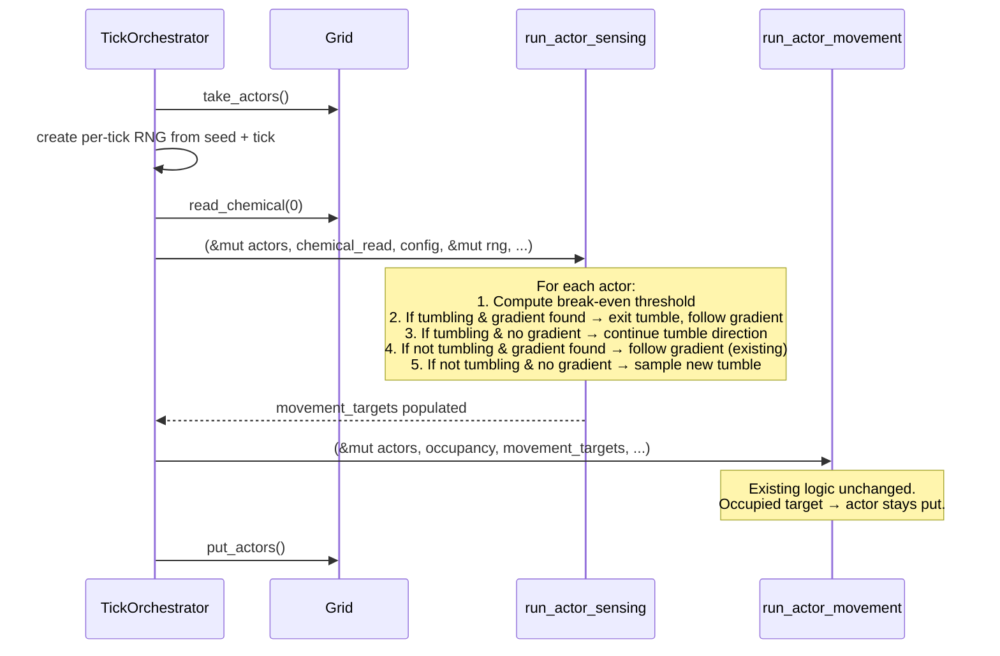
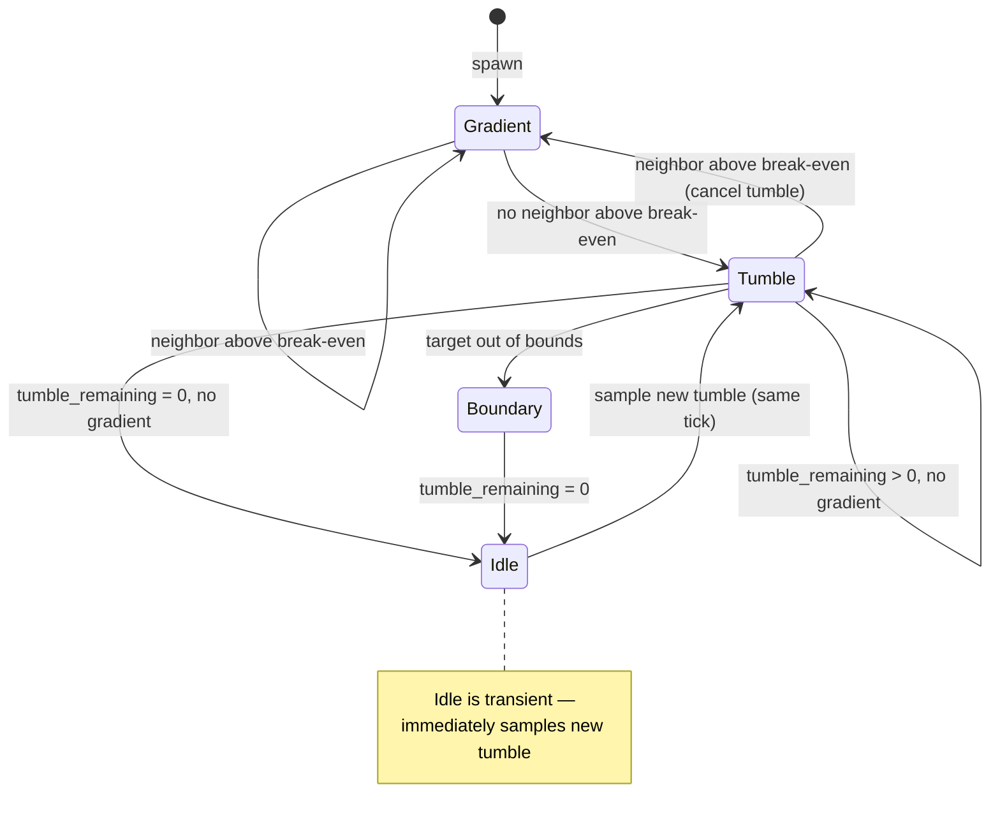

# Design Document: Lévy Flight Foraging

## Overview

This feature adds Lévy flight-based random foraging to actor movement. When the sensing system determines no neighbor has a chemical concentration above the metabolic break-even threshold, the actor enters a tumble: it picks a random cardinal direction and commits to it for a number of steps drawn from a discrete power-law distribution. This produces the biologically optimal search pattern — many short exploratory moves punctuated by occasional long ballistic runs.

The implementation touches four layers:
1. **Actor data model** — two new plain-data fields for tumble state
2. **Sensing system** — break-even threshold evaluation, tumble initiation/continuation/termination, power-law sampling
3. **Tick orchestrator** — per-tick deterministic RNG creation and threading
4. **Configuration** — two new `ActorConfig` fields, validation, documentation

The design preserves all existing invariants: deterministic execution, zero heap allocation in WARM paths, stateless system functions, slot-index iteration order.

## Architecture



The sensing system becomes the sole decision point for tumble state transitions. The movement system remains unchanged — it just reads `movement_targets` and moves actors, unaware of whether the target came from gradient-following or tumble.

### Tick-Level RNG Threading

The `TickOrchestrator::step` signature gains a `tick: u64` parameter. The Grid stores the simulation `seed: u64` (set at construction). Inside `run_actor_phases`, a per-tick RNG is created:

```rust
let mut tick_rng = ChaCha8Rng::seed_from_u64(seed.wrapping_add(tick));
```

`ChaCha8Rng` from the `rand_chacha` crate is deterministic, fast, and `Send + Sync`. The `wrapping_add` ensures unique seeds per tick without overflow panics. This RNG is passed by `&mut` to `run_actor_sensing`.

### Callers Updated

Both callers of `TickOrchestrator::step` must pass the tick number:
- **Bevy** (`viz_bevy/systems.rs`): `TickOrchestrator::step(&mut sim.grid, &sim.config, sim.tick)`
- **Headless** (any `main.rs` loop): pass the loop counter

## Components and Interfaces

### Modified: `Actor` struct (`src/grid/actor.rs`)

```rust
#[derive(Debug, Clone, Copy, PartialEq)]
pub struct Actor {
    pub cell_index: usize,
    pub energy: f32,
    pub inert: bool,
    /// Encoded tumble direction: 0=North, 1=South, 2=West, 3=East.
    /// Only meaningful when tumble_remaining > 0.
    pub tumble_direction: u8,
    /// Steps remaining in current Lévy flight tumble run. 0 = not tumbling.
    pub tumble_remaining: u16,
}
```

Two bytes of additional per-actor storage. No alignment impact — the struct already has padding from the `f32` + `bool` layout. Default initialization: `tumble_direction: 0, tumble_remaining: 0`.

### Modified: `ActorConfig` (`src/grid/actor_config.rs`)

```rust
/// Power-law exponent α for Lévy flight step distribution.
/// Higher values → shorter average runs. Must be > 1.0. Default: 1.5.
pub levy_exponent: f32,
/// Maximum steps in a single tumble run. Clamps the power-law sample.
/// Must be >= 1. Default: 20.
pub max_tumble_steps: u16,
```

### Modified: `Grid` struct (`src/grid/mod.rs`)

```rust
pub struct Grid {
    // ... existing fields ...
    /// Master simulation seed, stored for per-tick RNG derivation.
    seed: u64,
}
```

The seed is set during `Grid::new()` (new parameter) or via `world_init::initialize()`. Accessor: `pub fn seed(&self) -> u64`.

### Modified: `run_actor_sensing` (`src/grid/actor_systems.rs`)

New signature:

```rust
pub fn run_actor_sensing(
    actors: &mut ActorRegistry,       // was &ActorRegistry — now mutable for tumble state
    chemical_read: &[f32],
    grid_width: u32,
    grid_height: u32,
    movement_targets: &mut [Option<usize>],
    config: &ActorConfig,             // NEW: for break-even threshold + lévy params
    rng: &mut impl Rng,               // NEW: for tumble sampling
)
```

### Modified: `TickOrchestrator::step` (`src/grid/tick.rs`)

New signature:

```rust
pub fn step(grid: &mut Grid, config: &GridConfig, tick: u64) -> Result<(), TickError>
```

### New helper: `sample_tumble_steps`

```rust
/// Sample a step count from the discrete power-law distribution.
/// P(steps = k) ∝ k^(-α), clamped to [1, max_steps].
/// Uses inverse transform sampling: steps = floor(u^(-1/(α-1))), u ~ Uniform(0,1).
fn sample_tumble_steps(rng: &mut impl Rng, alpha: f32, max_steps: u16) -> u16 {
    let u: f32 = rng.gen_range(0.0_f32..1.0_f32);
    // Avoid u=0 which would produce infinity
    let u = u.max(f32::EPSILON);
    let exponent = -1.0 / (alpha - 1.0);
    let raw = u.powf(exponent).floor() as u32;
    raw.clamp(1, max_steps as u32) as u16
}
```

This is a pure function, no allocation, no branching beyond the clamp. Suitable for WARM path.

### New helper: `direction_to_target`

```rust
/// Convert a tumble direction (0=N, 1=S, 2=W, 3=E) to a target cell index.
/// Returns None if the direction would go out of bounds.
fn direction_to_target(cell_index: usize, direction: u8, w: usize, h: usize) -> Option<usize> {
    let x = cell_index % w;
    let y = cell_index / w;
    match direction {
        0 if y > 0     => Some((y - 1) * w + x),  // North
        1 if y + 1 < h => Some((y + 1) * w + x),  // South
        2 if x > 0     => Some(y * w + (x - 1)),   // West
        3 if x + 1 < w => Some(y * w + (x + 1)),   // East
        _ => None,                                   // Out of bounds
    }
}
```

### Sensing System Logic (pseudocode)

```
for each active actor (slot-index order):
    if actor.inert → target = None, continue

    compute break_even = config.base_energy_decay / (config.energy_conversion_factor - config.extraction_cost)

    // Check if any neighbor is above break-even AND has positive gradient
    best_gradient_target = existing gradient logic, but only considering neighbors above break_even

    if best_gradient_target is Some:
        // Gradient found — follow it, cancel any tumble
        actor.tumble_remaining = 0
        target = best_gradient_target
    else if actor.tumble_remaining > 0:
        // Mid-tumble, no gradient — continue tumble direction
        target = direction_to_target(actor.cell_index, actor.tumble_direction, w, h)
        if target is None:
            // Hit boundary — end tumble
            actor.tumble_remaining = 0
        else:
            actor.tumble_remaining -= 1
    else:
        // No gradient, not tumbling — initiate new tumble
        actor.tumble_direction = rng.gen_range(0..4)
        actor.tumble_remaining = sample_tumble_steps(rng, config.levy_exponent, config.max_tumble_steps)
        target = direction_to_target(actor.cell_index, actor.tumble_direction, w, h)
        if target is None:
            // Spawned facing a boundary — end tumble immediately
            actor.tumble_remaining = 0
        else:
            actor.tumble_remaining -= 1

    movement_targets[slot_index] = target
```

### Movement System — No Changes

The movement system is unchanged. When a tumbling actor's target cell is occupied, the actor stays put. On the next tick, the sensing system will re-evaluate: if the target in `tumble_direction` is still blocked (out of bounds or occupied is handled differently — occupied cells are handled by movement, not sensing), the actor will attempt the same direction again (tumble_remaining was already decremented). This is acceptable — the actor "bumps" against the obstacle until the tumble expires or a gradient appears.

Note on Requirement 4.4 (reset tumble on blocked move): The current design decrements `tumble_remaining` in the sensing phase regardless of whether the move succeeds. A blocked move wastes a tumble step. This is simpler than feeding movement results back to sensing and is biologically reasonable — the actor "tried" to move and failed. The tumble still expires naturally.

## Data Models

### Actor State Machine



In practice, the "Idle" state is never observed externally because a new tumble is sampled in the same tick when `tumble_remaining` reaches 0 and no gradient exists.

### Break-Even Threshold

```
break_even = base_energy_decay / (energy_conversion_factor - extraction_cost)
```

With default config values: `0.05 / (2.0 - 0.2) = 0.0278`. Any cell with concentration ≤ 0.0278 is not worth consuming — the actor would lose energy. With the tuned example config: `0.03 / (1.8 - 0.2) = 0.01875`.

### Power-Law Step Distribution

For α = 1.5 (default), the inverse transform `k = floor(u^(-2))` produces:
- P(k=1) ≈ 0.414 (41% of tumbles are single-step)
- P(k=2) ≈ 0.164
- P(k=3) ≈ 0.089
- P(k≥10) ≈ 0.068
- P(k=20) ≈ accumulated tail probability clamped to max

This heavy-tailed distribution means most tumbles are short (1-3 steps) with occasional long runs (10-20 steps), matching the Lévy flight optimality result.

### New Dependency: `rand_chacha`

Add `rand_chacha = "0.3"` to `Cargo.toml`. The `rand` crate is already a dependency (used in `world_init`). `ChaCha8Rng` provides deterministic, portable, fast PRNG suitable for simulation use.


## Correctness Properties

*A property is a characteristic or behavior that should hold true across all valid executions of a system — essentially, a formal statement about what the system should do. Properties serve as the bridge between human-readable specifications and machine-verifiable correctness guarantees.*

The following properties were derived from the acceptance criteria through prework analysis. Redundant criteria were consolidated: gradient-priority (2.3 + 4.3), no-gradient tumble trigger (2.2 + 3.1), step distribution range (3.2 + 5.1 + 5.2), and determinism (6.1 + 6.3).

### Property 1: Gradient takes priority over tumble

*For any* actor (tumbling or not) on any grid where at least one Von Neumann neighbor has chemical concentration above the break-even threshold and a positive gradient relative to the current cell, the sensing system should select the maximum-gradient neighbor as the movement target and set `tumble_remaining` to 0.

**Validates: Requirements 2.3, 4.3**

### Property 2: No worthwhile gradient triggers tumble

*For any* active, non-tumbling actor (tumble_remaining = 0) on any grid where all Von Neumann neighbors AND the current cell have concentration at or below the break-even threshold, the sensing system should initiate a new tumble: setting `tumble_direction` to a value in {0, 1, 2, 3} and `tumble_remaining` to a value in [0, max_tumble_steps - 1] (after the first step is consumed), and the movement target should be the adjacent cell in the chosen direction (or None if that direction is out of bounds).

**Validates: Requirements 2.2, 3.1, 3.3**

### Property 3: Tumble continuation decrements remaining

*For any* actor with `tumble_remaining > 0` on any grid where no neighbor has concentration above the break-even threshold, the sensing system should set the movement target to the adjacent cell in `tumble_direction` (or None if out of bounds, resetting tumble_remaining to 0) and decrement `tumble_remaining` by 1.

**Validates: Requirements 4.1, 4.2**

### Property 4: Step distribution range invariant

*For any* valid `levy_exponent` (α > 1.0) and `max_tumble_steps` (≥ 1) and any RNG state, `sample_tumble_steps` should return a value in the range [1, max_tumble_steps].

**Validates: Requirements 3.2, 5.1, 5.2**

### Property 5: Deterministic tumble sequences

*For any* seed, tick number, grid state, and actor configuration, running the sensing system twice from identical initial states should produce identical tumble state mutations and movement targets.

**Validates: Requirements 6.1, 6.3**

### Property 6: ActorConfig TOML round-trip

*For any* valid ActorConfig (including `levy_exponent` and `max_tumble_steps`), serializing to TOML and deserializing should produce an equivalent ActorConfig.

**Validates: Requirements 7.3**

### Property 7: Validation accepts valid and rejects invalid Lévy config

*For any* `levy_exponent` value and `max_tumble_steps` value, the config validator should accept the configuration if and only if `levy_exponent > 1.0` AND `max_tumble_steps >= 1`.

**Validates: Requirements 8.1, 8.2, 8.3**

## Error Handling

All actor system functions return `Result<(), TickError>`. The Lévy flight changes do not introduce new error variants:

- **NaN/Inf energy**: Already caught by existing metabolism and movement NaN checks. Tumble state is integer-only (`u8`, `u16`) — no floating-point corruption risk.
- **Out-of-bounds cell index**: `direction_to_target` returns `None` for boundary cells. The movement system already validates target indices via occupancy map bounds.
- **Invalid config**: `validate_world_config` rejects `levy_exponent <= 1.0` and `max_tumble_steps == 0` at load time, before the simulation starts.
- **Division by zero in break-even**: `energy_conversion_factor - extraction_cost` is guaranteed positive by existing validation (`extraction_cost < energy_conversion_factor`). No new division-by-zero risk.

No `unwrap()` or `expect()` in any modified simulation logic. The `sample_tumble_steps` function uses `f32::EPSILON` floor on the uniform sample to avoid `0.0^negative` producing infinity.

## Testing Strategy

### Unit Tests

- **Actor default initialization**: Verify `tumble_direction = 0`, `tumble_remaining = 0` on new actors.
- **`sample_tumble_steps` edge cases**: α near 1.0 (e.g., 1.01), α large (e.g., 10.0), max_steps = 1, max_steps = u16::MAX.
- **`direction_to_target` boundary cases**: All four directions at grid corners and edges.
- **Break-even threshold computation**: Verify formula with known config values.
- **Sensing with tumble**: Actor at center of 3×3 grid, all cells below break-even → verify tumble initiated. Actor mid-tumble, gradient appears → verify tumble cancelled. Actor mid-tumble facing boundary → verify tumble reset.
- **Config validation**: `levy_exponent = 1.0` rejected, `levy_exponent = 0.5` rejected, `max_tumble_steps = 0` rejected, valid values accepted.
- **TOML deserialization**: Verify `levy_exponent` and `max_tumble_steps` deserialize from TOML, defaults used when omitted.
- **Info panel**: Verify `format_config_info` output contains `levy_exponent` and `max_tumble_steps`.

### Property-Based Tests

Use the `proptest` crate (already available in the Rust ecosystem, zero-config for Cargo projects). Each property test runs a minimum of 100 iterations.

Each property test is tagged with a comment referencing the design property:
```rust
// Feature: levy-foraging, Property N: <property title>
```

- **Property 1** (gradient priority): Generate random grid states with at least one above-threshold neighbor, random actor tumble states. Assert sensing produces gradient target and tumble_remaining = 0.
- **Property 2** (no-gradient triggers tumble): Generate random grid states with all cells at/below threshold, non-tumbling actors. Assert tumble is initiated with valid direction and step count.
- **Property 3** (tumble continuation): Generate random mid-tumble actors on grids with no above-threshold cells. Assert tumble_remaining decrements and target matches direction.
- **Property 4** (step distribution range): Generate random α ∈ (1.0, 20.0] and max_steps ∈ [1, 1000]. Assert output ∈ [1, max_steps].
- **Property 5** (determinism): Generate random seed, tick, grid state. Run sensing twice from cloned state. Assert identical outputs.
- **Property 6** (TOML round-trip): Generate random valid ActorConfig. Serialize to TOML, deserialize, assert equality.
- **Property 7** (validation): Generate random levy_exponent and max_tumble_steps. Assert validation result matches `exponent > 1.0 && steps >= 1`.
