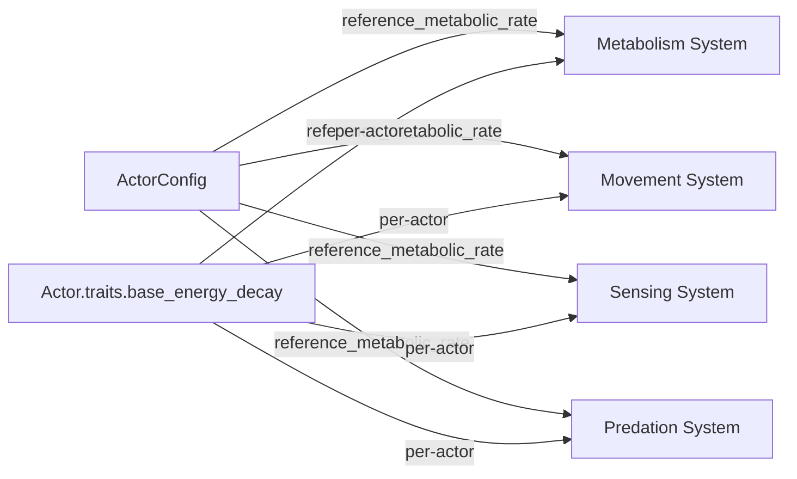

# Design Document: Metabolic Scaling

## Overview

This feature modifies four existing actor systems — metabolism, movement, sensing, and predation — to scale their behavior by a per-actor **metabolic ratio**: `actor.traits.base_energy_decay / config.reference_metabolic_rate`. No new systems, no new components, no new heritable traits. One new config field (`reference_metabolic_rate`) is added to `ActorConfig`.

The metabolic ratio is a dimensionless multiplier computed inline in each system's per-actor loop. It requires one division per actor per system invocation. All scaling is linear (multiply or divide by the ratio), keeping the math simple and the hot-path overhead minimal.

### Evolutionary Dynamics

The scaling creates three distinct ecological niches:

| Strategy | Metabolic Rate | Consumption | Movement | Predation | Niche |
|---|---|---|---|---|---|
| **Settler** | Low (< ref) | Low efficiency | Expensive | Weak | Survives in barren zones, outlasts competitors |
| **Generalist** | Mid (≈ ref) | Moderate | Moderate | Moderate | Flexible, occupies transitional zones |
| **Forager/Predator** | High (> ref) | High efficiency | Cheap | Strong | Dominates near sources, aggressive hunter |

The key tradeoff: `base_energy_decay` is still subtracted every tick as basal cost. High-metabolism actors burn energy fast. If they can't find food or prey, they die faster than settlers. This creates genuine bidirectional pressure — neither extreme is universally optimal.

## Architecture

No architectural changes. The feature modifies inline computations within four existing stateless system functions. The data flow remains identical:



Each system computes `metabolic_ratio = actor.traits.base_energy_decay / config.reference_metabolic_rate` independently. This is one `f32` division per actor — no shared mutable state, no cross-system coupling.

### Tick Phase Impact

All four affected systems run in the existing tick phases:

| Phase | System | Change |
|---|---|---|
| Precomputation (WARM) | `run_actor_sensing` | Break-even uses scaled conversion factor |
| Parallel Update (WARM) | `run_actor_metabolism` | Energy gain multiplied by metabolic ratio |
| Parallel Update (WARM) | `run_actor_movement` | Movement cost divided by metabolic ratio |
| Parallel Update (WARM) | `run_contact_predation` | Absorption efficiency multiplied by metabolic ratio, clamped to 1.0 |

No new phases. No phase reordering. No new cross-partition communication.

## Components and Interfaces

### Modified: `ActorConfig` (`src/grid/actor_config.rs`)

One new field:

```rust
/// Metabolic rate at which all scaling multipliers equal 1.0.
/// Actors with base_energy_decay above this value gain enhanced
/// consumption, cheaper movement, and stronger predation.
/// Actors below this value get the inverse.
/// Must be > 0.0 and finite. Default: 0.05.
pub reference_metabolic_rate: f32,
```

### Modified: `run_actor_metabolism` (`src/grid/actor_systems.rs`)

Current formula:
```
energy += consumed * (energy_conversion_factor - extraction_cost) - base_energy_decay
```

New formula:
```
metabolic_ratio = actor.traits.base_energy_decay / config.reference_metabolic_rate
effective_conversion = (energy_conversion_factor - extraction_cost) * metabolic_ratio
energy += consumed * effective_conversion - base_energy_decay
```

The `max_useful` cap also uses `effective_conversion`:
```
max_useful = headroom / effective_conversion
```

### Modified: `run_actor_movement` (`src/grid/actor_systems.rs`)

Current formula:
```
proportional = base_movement_cost * (actor.energy / reference_energy)
actual = max(proportional, base_movement_cost * 0.1)
```

New formula:
```
metabolic_ratio = actor.traits.base_energy_decay / config.reference_metabolic_rate
proportional = base_movement_cost * (actor.energy / reference_energy) / metabolic_ratio
actual = max(proportional, base_movement_cost * 0.1)
```

The floor remains at `base_movement_cost * 0.1` regardless of metabolic ratio. This prevents zero-cost movement for extremely high-metabolism actors.

### Modified: `run_actor_sensing` (`src/grid/actor_systems.rs`)

Current break-even:
```
break_even = base_energy_decay / (energy_conversion_factor - extraction_cost)
```

New break-even:
```
metabolic_ratio = actor.traits.base_energy_decay / config.reference_metabolic_rate
effective_conversion = (energy_conversion_factor - extraction_cost) * metabolic_ratio
break_even = base_energy_decay / effective_conversion
```

Which simplifies to:
```
break_even = config.reference_metabolic_rate / (energy_conversion_factor - extraction_cost)
```

This is interesting: the break-even becomes independent of the individual actor's metabolic rate after simplification. High-metabolism actors have higher basal cost but proportionally higher conversion efficiency, so the break-even point is the same. The behavioral difference comes from the fact that high-metabolism actors extract more energy per consumed unit, so they accumulate energy faster in rich patches and deplete faster in poor ones.

### Modified: `run_contact_predation` (`src/grid/actor_systems.rs`)

Current absorption:
```
gained = neighbor.energy * config.absorption_efficiency
```

New absorption:
```
metabolic_ratio = actor.traits.base_energy_decay / config.reference_metabolic_rate
effective_absorption = (config.absorption_efficiency * metabolic_ratio).min(1.0)
gained = neighbor.energy * effective_absorption
```

The `min(1.0)` clamp prevents energy creation — a predator cannot absorb more than 100% of prey energy regardless of metabolic rate.

### Modified: Config Validation (`src/io/config_file.rs`)

Add validation:
```rust
if actor.reference_metabolic_rate <= 0.0 || !actor.reference_metabolic_rate.is_finite() {
    return Err(ConfigError::Validation {
        reason: format!(
            "reference_metabolic_rate ({}) must be > 0.0 and finite",
            actor.reference_metabolic_rate,
        ),
    });
}
```

### Modified: Visualization (`src/viz_bevy/setup.rs`)

Add to `format_config_info` in the Actors section:
```rust
writeln!(out, "reference_metabolic_rate: {:.4}", ac.reference_metabolic_rate).ok();
```

### Modified: `example_config.toml`

Add field with comment:
```toml
# Metabolic rate at which scaling multipliers equal 1.0.
# Actors with base_energy_decay above this extract more energy, move cheaper,
# and predate more effectively — but burn energy faster.
# Must be > 0.0. Default: 0.05
reference_metabolic_rate = 0.05
```

### Modified: Config Documentation Steering File

Add row to the `[actor]` table:
```
| `reference_metabolic_rate` | `f32` | `0.05` | Metabolic rate at which all scaling multipliers equal 1.0. Higher base_energy_decay → better consumption, cheaper movement, stronger predation. Must be > 0.0 and finite. |
```

## Data Models

No new data models. The only structural change is one new `f32` field on `ActorConfig`:

```rust
// In ActorConfig:
#[serde(default = "default_reference_metabolic_rate")]
pub reference_metabolic_rate: f32,

// Default function:
fn default_reference_metabolic_rate() -> f32 { 0.05 }
```

The `HeritableTraits` struct is unchanged — `base_energy_decay` already exists as a heritable trait. No new traits are introduced. The `TraitStats` array size remains 9. The `TRAIT_COUNT` constant in `genetic_distance` remains 9.


## Correctness Properties

*A property is a characteristic or behavior that should hold true across all valid executions of a system — essentially, a formal statement about what the system should do. Properties serve as the bridge between human-readable specifications and machine-verifiable correctness guarantees.*

### Property 1: Config validation rejects invalid reference_metabolic_rate

*For any* `ActorConfig` where `reference_metabolic_rate` is zero, negative, NaN, or Infinity, `validate_world_config` should return an `Err`.

**Validates: Requirements 1.2, 1.3**

### Property 2: Metabolism formula correctness

*For any* active actor with a valid metabolic rate and any non-negative chemical concentration, after running `run_actor_metabolism`, the actor's energy change should equal `consumed * (energy_conversion_factor - extraction_cost) * (base_energy_decay / reference_metabolic_rate) - base_energy_decay`, where `consumed = min(consumption_rate, available, headroom / effective_conversion)` and the result is clamped to `max_energy`.

**Validates: Requirements 2.1, 2.4**

### Property 3: Consumption efficiency monotonicity

*For any* two actors that are identical except for their `base_energy_decay` values, where actor A has a higher `base_energy_decay` than actor B, and both consume the same amount of chemical, actor A should gain more energy from consumption (before subtracting basal cost) than actor B.

**Validates: Requirements 2.2, 2.3, 6.2**

### Property 4: Movement formula correctness

*For any* active actor with a valid metabolic rate that successfully moves to a new cell, the energy deducted should equal `max(base_movement_cost * (energy / reference_energy) / metabolic_ratio, base_movement_cost * 0.1)`.

**Validates: Requirements 3.1**

### Property 5: Movement cost monotonicity

*For any* two actors that are identical except for their `base_energy_decay` values, where actor A has a higher `base_energy_decay` than actor B, and both have the same energy level, actor A should pay less or equal movement cost than actor B.

**Validates: Requirements 3.2, 3.3, 6.3**

### Property 6: Movement cost floor

*For any* actor with any valid metabolic rate and energy level, the movement cost deducted after a successful move should never be less than `base_movement_cost * 0.1`.

**Validates: Requirements 3.4**

### Property 7: Predation formula correctness

*For any* predation event where predator has a valid metabolic rate, the energy gained by the predator should equal `prey.energy * min(absorption_efficiency * metabolic_ratio, 1.0)`.

**Validates: Requirements 4.1**

### Property 8: Predation absorption clamp

*For any* predation event, regardless of the predator's metabolic rate, the energy gained by the predator should never exceed the prey's energy at the time of predation.

**Validates: Requirements 4.4**

### Property 9: Predation monotonicity

*For any* two predators that are identical except for their `base_energy_decay` values, where predator A has a higher `base_energy_decay` than predator B, and both predate on prey with the same energy, predator A should gain greater or equal energy from the predation event.

**Validates: Requirements 4.2, 4.3, 6.4**

### Property 10: Break-even formula correctness

*For any* actor with a valid metabolic rate, the break-even concentration used by the sensing system should equal `reference_metabolic_rate / (energy_conversion_factor - extraction_cost)`.

**Validates: Requirements 5.1**

### Property 11: No NaN or Infinity from valid inputs

*For any* actor with `base_energy_decay` within `[trait_base_energy_decay_min, trait_base_energy_decay_max]` and a valid `reference_metabolic_rate > 0`, the metabolic ratio and all derived scaling values (effective conversion, scaled movement cost, effective absorption) should be finite and non-NaN.

**Validates: Requirements 6.6**

## Error Handling

No new error types or error paths are introduced. The existing error handling in each system function is sufficient:

- **Metabolism**: Existing NaN/Inf check on `actor.energy` after the energy update catches any numerical instability from the scaling computation.
- **Movement**: Existing NaN/Inf check on `actor.energy` after movement cost deduction catches issues.
- **Predation**: Existing NaN/Inf check on predator energy after absorption catches issues.
- **Config validation**: New validation rule for `reference_metabolic_rate > 0.0 && is_finite()` uses the existing `ConfigError::Validation` variant.

The `min(1.0)` clamp on effective absorption efficiency in predation prevents energy creation. The `max(floor)` on movement cost prevents zero-cost movement. Both are defensive guards, not error paths.

Division by `reference_metabolic_rate` is safe because config validation guarantees it is strictly positive and finite. Division by zero is structurally impossible for valid configs.

## Testing Strategy

### Property-Based Testing

Use the `proptest` crate for property-based testing. Each property test runs a minimum of 100 iterations with generated inputs.

Property tests focus on the scaling formulas in isolation — they test the mathematical relationships between inputs and outputs without requiring full simulation infrastructure. Generators produce random valid `ActorConfig` values and random valid `HeritableTraits` values within configured clamp ranges.

Each property test is tagged with a comment referencing its design document property:
```
// Feature: metabolic-scaling, Property N: [property title]
```

### Unit Testing

Unit tests complement property tests by covering:

- Specific examples: an actor at exactly the reference metabolic rate should produce identical results to the pre-feature formula.
- Edge cases: actors at the minimum and maximum clamp bounds for `base_energy_decay`.
- The absorption efficiency clamp: a predator with very high metabolic rate hitting the 1.0 ceiling.
- Config validation: specific invalid values (0.0, -1.0, NaN, Infinity) for `reference_metabolic_rate`.
- The break-even simplification: verify the sensing break-even equals `reference_metabolic_rate / (ecf - ec)` regardless of individual actor metabolic rate.

### Test Organization

Tests live in the existing `#[cfg(test)] mod tests` blocks within each modified file:

- `src/grid/actor_systems.rs` — metabolism, movement, sensing, predation formula tests
- `src/io/config_file.rs` — config validation tests
- `src/grid/actor_config.rs` — default value tests
