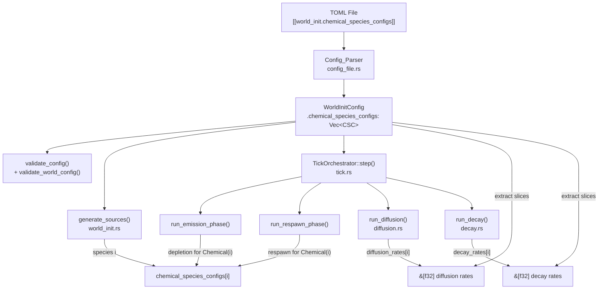

# Design Document: Per-Species Chemical Configuration

## Overview

This feature replaces the fragmented per-species chemical configuration (single `chemical_source_config` in `WorldInitConfig`, flat `chemical_decay_rates` Vec and scalar `diffusion_rate` in `GridConfig`) with a unified `ChemicalSpeciesConfig` struct bundling source config, decay rate, and diffusion rate per species. The default `num_chemicals` changes from 1 to 2.

All affected code paths are COLD (config parsing, world init) or WARM (emission, respawn), except diffusion and decay which are HOT. The HOT paths receive pre-extracted `&[f32]` slices for diffusion and decay rates — no struct indexing in inner loops.

Actors continue to interact exclusively with chemical species 0. No actor system changes.

The old `chemical_source_config`, `chemical_decay_rates`, and `diffusion_rate` fields are removed entirely — no backwards compatibility.

## Architecture



Key architectural changes:
1. `WorldInitConfig.chemical_source_config` → `WorldInitConfig.chemical_species_configs: Vec<ChemicalSpeciesConfig>`
2. `GridConfig.diffusion_rate` removed — now per-species in `ChemicalSpeciesConfig`
3. `GridConfig.chemical_decay_rates` removed — now per-species in `ChemicalSpeciesConfig`
4. HOT paths (`run_diffusion`, `run_decay`) receive pre-extracted `&[f32]` slices, not config struct references

## Components and Interfaces

### New: `ChemicalSpeciesConfig` (`src/grid/world_init.rs`)

```rust
#[derive(Debug, Clone, PartialEq, Serialize, Deserialize)]
#[serde(default)]
pub struct ChemicalSpeciesConfig {
    /// Source generation parameters for this species.
    pub source_config: SourceFieldConfig,
    /// Exponential decay rate per tick. [0.0, 1.0].
    /// Applied as concentration *= (1.0 - decay_rate).
    pub decay_rate: f32,
    /// Diffusion coefficient (discrete Laplacian scaling).
    /// Must be non-negative and finite.
    /// Stability: diffusion_rate * tick_duration * 8 < 1.0.
    pub diffusion_rate: f32,
}

impl Default for ChemicalSpeciesConfig {
    fn default() -> Self {
        Self {
            source_config: SourceFieldConfig {
                max_sources: 3,
                ..SourceFieldConfig::default()
            },
            decay_rate: 0.05,
            diffusion_rate: 0.05,
        }
    }
}
```

### Modified: `WorldInitConfig` (`src/grid/world_init.rs`)

```rust
#[derive(Debug, Clone, PartialEq, Serialize, Deserialize)]
#[serde(default)]
pub struct WorldInitConfig {
    pub heat_source_config: SourceFieldConfig,
    // REMOVED: pub chemical_source_config: SourceFieldConfig,
    pub chemical_species_configs: Vec<ChemicalSpeciesConfig>,
    // ... remaining fields unchanged
}

impl Default for WorldInitConfig {
    fn default() -> Self {
        Self {
            heat_source_config: SourceFieldConfig::default(),
            chemical_species_configs: vec![
                ChemicalSpeciesConfig::default(),
                ChemicalSpeciesConfig::default(),
            ],
            // ... remaining defaults unchanged
        }
    }
}
```

### Modified: `GridConfig` (`src/grid/config.rs`)

```rust
#[derive(Debug, Clone, PartialEq, Serialize, Deserialize)]
#[serde(default)]
pub struct GridConfig {
    pub width: u32,
    pub height: u32,
    pub num_chemicals: usize,
    // REMOVED: pub diffusion_rate: f32,
    pub thermal_conductivity: f32,
    pub ambient_heat: f32,
    pub tick_duration: f32,
    pub num_threads: usize,
    // REMOVED: pub chemical_decay_rates: Vec<f32>,
}

impl Default for GridConfig {
    fn default() -> Self {
        Self {
            // ... unchanged fields ...
            num_chemicals: 2,  // was 1
            // diffusion_rate and chemical_decay_rates removed
        }
    }
}
```

### Modified: `validate_config()` (`src/grid/world_init.rs`)

Iterates `chemical_species_configs` and validates each entry's `source_config`, `decay_rate`, and `diffusion_rate`. Error messages include the species index.

New `WorldInitError` variant for per-species errors:

```rust
#[error("chemical species {species}: {source}")]
ChemicalSpeciesConfigError {
    species: usize,
    source: Box<WorldInitError>,
}
```

Plus new variants for the new fields:

```rust
#[error("chemical species {species}: decay_rate ({value}) must be in [0.0, 1.0]")]
InvalidDecayRate { species: usize, value: f32 },

#[error("chemical species {species}: diffusion_rate ({value}) must be non-negative and finite")]
InvalidDiffusionRate { species: usize, value: f32 },
```

### Modified: `validate_world_config()` (`src/io/config_file.rs`)

- Replaces the `chemical_decay_rates.len() == num_chemicals` check with `chemical_species_configs.len() == num_chemicals`.
- Removes the old decay rates length check entirely.

### Modified: `generate_sources()` (`src/grid/world_init.rs`)

The chemical source generation loop indexes `config.chemical_species_configs[species].source_config` per iteration instead of a single `chem_cfg`.

### Modified: `run_diffusion()` (`src/grid/diffusion.rs`)

Signature change:

```rust
pub fn run_diffusion(
    grid: &mut Grid,
    config: &GridConfig,
    diffusion_rates: &[f32],  // NEW: per-species rates
) -> Result<(), TickError>
```

The `DiffuseParams.rate` field is set per-species inside the species loop. Species with `diffusion_rates[i] == 0.0` are skipped entirely (no read, no write).

This is a HOT path. The `&[f32]` slice is stack-passed, contiguous, and indexed by species — no heap allocation, no struct indirection in the inner loop.

### Modified: `run_decay()` (`src/grid/decay.rs`)

Signature change:

```rust
pub fn run_decay(
    grid: &mut Grid,
    config: &GridConfig,
    decay_rates: &[f32],  // NEW: per-species rates
) -> Result<(), TickError>
```

Replaces `config.chemical_decay_rates[species]` with `decay_rates[species]`. Same skip-zero behavior preserved.

This is a HOT path. Same rationale as diffusion — contiguous slice, no allocation.

### Modified: `TickOrchestrator::step()` (`src/grid/tick.rs`)

Signature change:

```rust
pub fn step(
    grid: &mut Grid,
    config: &GridConfig,
    tick: u64,
    heat_source_config: &SourceFieldConfig,
    chemical_species_configs: &[ChemicalSpeciesConfig],
) -> Result<usize, TickError>
```

Before calling `run_diffusion` and `run_decay`, extracts per-species rates into stack-allocated `SmallVec`:

```rust
let diffusion_rates: SmallVec<[f32; 8]> = chemical_species_configs
    .iter()
    .map(|c| c.diffusion_rate)
    .collect();
let decay_rates: SmallVec<[f32; 8]> = chemical_species_configs
    .iter()
    .map(|c| c.decay_rate)
    .collect();
```

`SmallVec<[f32; 8]>` is stack-allocated for up to 8 species (covers all realistic use cases). Extracted once per tick in the WARM orchestrator, then passed as `&[f32]` to HOT paths.

### Modified: `run_emission_phase()` (`src/grid/tick.rs`)

Signature change: `chemical_config: &SourceFieldConfig` → `chemical_species_configs: &[ChemicalSpeciesConfig]`.

Depletion event processing: when `event.field == SourceField::Chemical(i)`, index `chemical_species_configs[i].source_config` for `respawn_enabled` and cooldown range.

### Modified: `run_respawn_phase()` (`src/grid/source.rs`)

Signature change: `chemical_config: &SourceFieldConfig` → `chemical_species_configs: &[ChemicalSpeciesConfig]`.

Config lookup per entry: when `entry.field == SourceField::Chemical(i)`, index `chemical_species_configs[i].source_config`.

### Modified: `tick_simulation()` (`src/viz_bevy/systems.rs`)

Call site update: pass `&viz_config.init_config.chemical_species_configs` instead of `&viz_config.init_config.chemical_source_config`.

### Modified: `format_config_info()` (`src/viz_bevy/setup.rs`)

- Remove `diffusion_rate` and `chemical_decay_rates` from the grid section.
- Replace the single chemical source config block with a loop over `chemical_species_configs`, displaying source config + decay_rate + diffusion_rate per species, labeled by species index.

### Modified: `example_config.toml`

- Remove `diffusion_rate` and `chemical_decay_rates` from `[grid]`.
- Replace `[world_init.chemical_source_config]` with `[[world_init.chemical_species_configs]]` entries.
- Update `num_chemicals` to match the number of entries.

### Modified: `config-documentation.md` steering file

- Remove `diffusion_rate` and `chemical_decay_rates` from the `[grid]` section.
- Add `[[world_init.chemical_species_configs]]` section documenting `ChemicalSpeciesConfig` fields.
- Remove old `[world_init.chemical_source_config]` section.

## Data Models

### New: `ChemicalSpeciesConfig`

| Field | Type | Default | Description |
|---|---|---|---|
| `source_config` | `SourceFieldConfig` | `{ max_sources: 3, ..default }` | Source generation parameters for this species |
| `decay_rate` | `f32` | `0.05` | Exponential decay rate per tick. `[0.0, 1.0]` |
| `diffusion_rate` | `f32` | `0.05` | Diffusion coefficient. Non-negative, finite. Stability: `rate * tick_duration * 8 < 1.0` |

### Removed from `GridConfig`

| Field | Replacement |
|---|---|
| `diffusion_rate: f32` | `ChemicalSpeciesConfig.diffusion_rate` per species |
| `chemical_decay_rates: Vec<f32>` | `ChemicalSpeciesConfig.decay_rate` per species |

### Changed default: `GridConfig.num_chemicals`

| Before | After |
|---|---|
| `1` | `2` |

### Config Lookup Pattern (WARM paths)

All WARM-path code that needs a species-specific config uses:

```rust
let config = match entry.field {
    SourceField::Heat => heat_config,
    SourceField::Chemical(i) => &chemical_species_configs[i].source_config,
};
```

### HOT Path Rate Extraction

Diffusion and decay rates are extracted once per tick in the WARM orchestrator:

```rust
// WARM: extracted once per tick, stack-allocated for <= 8 species
let diffusion_rates: SmallVec<[f32; 8]> = chemical_species_configs
    .iter().map(|c| c.diffusion_rate).collect();

// Passed to HOT path as contiguous slice
run_diffusion(grid, config, &diffusion_rates)?;
```

The species index is always valid because:
1. `validate_world_config` ensures `chemical_species_configs.len() == num_chemicals`.
2. Source registration validates `species < num_chemicals` at `add()` time.
3. Respawn entries inherit their `field` from depleted sources, which were validated at registration.

## Correctness Properties

*A property is a characteristic or behavior that should hold true across all valid executions of a system — essentially, a formal statement about what the system should do. Properties serve as the bridge between human-readable specifications and machine-verifiable correctness guarantees.*

### Property 1: TOML serialization round-trip

*For any* valid `WorldInitConfig` with N chemical species (N ≥ 1), where each `ChemicalSpeciesConfig` has valid source_config, decay_rate, and diffusion_rate, serializing to TOML and deserializing back SHALL produce an equivalent `WorldInitConfig` (all `chemical_species_configs` entries preserved in order with identical field values).

**Validates: Requirements 2.1**

### Property 2: Length mismatch validation rejects mismatched configs

*For any* `num_chemicals` value N and any `chemical_species_configs` of length M where M ≠ N, `validate_world_config` SHALL return a validation error.

**Validates: Requirements 3.1**

### Property 3: Per-entry validation identifies species index

*For any* `WorldInitConfig` where exactly one `ChemicalSpeciesConfig` entry at index i has an invalid field (source_config range violation, decay_rate outside [0.0, 1.0], or diffusion_rate negative/non-finite), `validate_config` SHALL return an error that identifies species index i.

**Validates: Requirements 3.2, 3.3, 3.4, 3.5**

### Property 4: Source generation respects per-species config

*For any* valid `WorldInitConfig` with N chemical species where each species has a distinct `[min_sources, max_sources]` range in its `source_config`, after `generate_sources` completes, the number of sources registered for `SourceField::Chemical(i)` SHALL fall within `chemical_species_configs[i].source_config.min_sources..=chemical_species_configs[i].source_config.max_sources`.

**Validates: Requirements 4.1, 4.2**

### Property 5: Respawn uses per-species config parameters

*For any* chemical species i with a mature respawn entry, the replacement source spawned by `run_respawn_phase` SHALL have an `emission_rate` within `chemical_species_configs[i].source_config.min_emission_rate..=max_emission_rate` and a `reservoir` (initial_capacity) within `chemical_species_configs[i].source_config.min_reservoir_capacity..=max_reservoir_capacity`.

**Validates: Requirements 5.1, 5.2, 5.3**

### Property 6: Per-species diffusion rates applied correctly

*For any* grid with N ≥ 2 chemical species where species 0 has `diffusion_rate = 0.0` and species 1 has `diffusion_rate > 0.0`, after `run_diffusion`, species 0 concentrations SHALL be unchanged while species 1 concentrations SHALL differ from the pre-diffusion state (given non-uniform initial concentrations).

**Validates: Requirements 6.1, 6.3**

### Property 7: Per-species decay rates applied correctly

*For any* grid with N ≥ 2 chemical species where species 0 has `decay_rate = 0.0` and species 1 has `decay_rate > 0.0`, after `run_decay`, species 0 concentrations SHALL be unchanged while species 1 concentrations SHALL be reduced by the factor `(1.0 - decay_rate)`.

**Validates: Requirements 7.1, 7.3**

### Property 8: Info panel displays all species configs

*For any* valid `WorldInitConfig` with N chemical species (N ≥ 1), the output of `format_config_info` SHALL contain N distinct chemical species config sections, each labeled with its species index (0 through N-1), and SHALL include the decay_rate and diffusion_rate for each species.

**Validates: Requirements 10.2**

## Error Handling

All error handling follows existing project patterns:

- `WorldInitError::ChemicalSpeciesConfigError { species, source }` — wraps per-entry source_config validation failures with the species index. Uses `thiserror`. Inner `source` is `Box<WorldInitError>` to avoid infinite-size type.
- `WorldInitError::InvalidDecayRate { species, value }` — decay_rate outside [0.0, 1.0].
- `WorldInitError::InvalidDiffusionRate { species, value }` — diffusion_rate negative or non-finite.
- `ConfigError::Validation { reason: String }` — reused for the length mismatch check in `validate_world_config`.
- No `unwrap()` or `expect()` in simulation logic. Species index validity is guaranteed by startup validation (see Data Models section).
- All errors are `Send + Sync + 'static` per project requirements.

## Testing Strategy

### Unit Tests

- Default `WorldInitConfig` produces exactly two chemical species config entries with correct defaults (Req 1.4, 1.5).
- Default `GridConfig` has `num_chemicals = 2` and no `diffusion_rate` or `chemical_decay_rates` fields (Req 1.3, 1.5).
- TOML with omitted `[[world_init.chemical_species_configs]]` falls back to default (Req 2.2).
- TOML with old `[world_init.chemical_source_config]`, `diffusion_rate`, or `chemical_decay_rates` keys is rejected (Req 2.3).
- Example config file parses successfully with the new format (Req 10.1).
- Decay rate outside [0.0, 1.0] produces validation error with species index (Req 3.4).
- Negative or NaN diffusion rate produces validation error with species index (Req 3.5).

### Property-Based Tests

Use the `proptest` crate. Minimum 100 iterations per property.

Each property test is tagged with: **Feature: per-species-chemical-config, Property {N}: {title}**

- **Property 1**: Generate arbitrary valid `WorldInitConfig` with 1–4 species (each with valid source_config, decay_rate in [0.0, 1.0], diffusion_rate in [0.0, 0.1]), serialize to TOML, deserialize, assert equality.
- **Property 2**: Generate arbitrary `num_chemicals` (1–8) and a `chemical_species_configs` vec of different length, run `validate_world_config`, assert error.
- **Property 3**: Generate a valid multi-species config, corrupt one random entry at a random index (source_config field, decay_rate, or diffusion_rate), run `validate_config`, assert error mentions the species index.
- **Property 4**: Generate valid configs with 2–4 species having distinct source count ranges, run `generate_sources`, count sources per species, assert within range.
- **Property 5**: Set up a grid with a mature respawn entry for a random species, run `run_respawn_phase`, verify the new source's parameters fall within that species' config ranges.
- **Property 6**: Create a 10×10 grid with 2 species, set species 0 diffusion_rate=0.0 and species 1 diffusion_rate>0.0, populate with non-uniform concentrations, run `run_diffusion`, assert species 0 unchanged and species 1 changed.
- **Property 7**: Create a 10×10 grid with 2 species, set species 0 decay_rate=0.0 and species 1 decay_rate in (0.0, 1.0), populate with positive concentrations, run `run_decay`, assert species 0 unchanged and species 1 reduced by factor.
- **Property 8**: Generate valid configs with 1–4 species, call `format_config_info`, assert the output contains species-indexed labels, decay_rate, and diffusion_rate for each.
