# Design Document: Reproduction Cooldown

## Overview

This feature adds a reproduction cooldown mechanic to prevent runaway population growth. The core problem: `offspring_energy` evolves toward its max and `reproduction_cost` toward its min, enabling actors to reproduce every tick and saturate the grid faster than predation can cull.

The fix is a per-actor cooldown timer gated by a heritable `reproduction_cooldown` trait. After reproducing, an actor must wait `reproduction_cooldown` ticks before it can reproduce again. Because the cooldown is heritable and mutable, evolutionary pressure shapes reproductive timing — actors that reproduce too fast burn energy without recovery; actors that wait too long lose competitive advantage.

The change touches:
- `HeritableTraits` (new `reproduction_cooldown: u16` field)
- `Actor` (new `cooldown_remaining: u16` runtime state)
- `run_actor_reproduction` (cooldown check + timer set)
- `ActorConfig` (seed default + clamp bounds)
- `genetic_distance` (`TRAIT_COUNT` 10 → 11)
- `HeritableTraits::mutate` (new mutation line for `reproduction_cooldown`)
- `HeritableTraits::from_config` (initialize from config)
- `run_deferred_spawn` (offspring `cooldown_remaining` initialized to 0)
- Config validation, TOML parsing, visualization stats, panels, documentation

All simulation-layer changes are in the HOT path (`run_actor_reproduction`) or WARM path (`run_deferred_spawn`, `genetic_distance`). The cooldown check is a single `u16` comparison and decrement — zero allocation, no branching beyond what already exists.

## Architecture

```mermaid
flowchart TD
    subgraph Config["Configuration Layer"]
        AC[ActorConfig] -->|seed default + clamp bounds| HT[HeritableTraits::from_config]
        AC -->|validation| VWC[validate_world_config]
    end

    subgraph Sim["Simulation Layer (per tick)"]
        REP[run_actor_reproduction] -->|check cooldown_remaining| SKIP{cooldown > 0?}
        SKIP -->|yes: decrement, skip| NEXT[next actor]
        SKIP -->|no: check energy| ELIG{energy >= threshold?}
        ELIG -->|yes| FISSION[queue offspring, set parent cooldown_remaining]
        ELIG -->|no| NEXT
        FISSION --> SB[spawn_buffer]
        SB --> DS[run_deferred_spawn]
        DS -->|mutate traits, cooldown_remaining=0| OFFSPRING[new Actor]
    end

    subgraph Viz["Visualization Layer"]
        STATS[compute_trait_stats_from_actors] -->|collect reproduction_cooldown| TS[TraitStats traits array index 10]
        FMT[format_trait_stats] -->|display repro_cooldown row| PANEL[Stats Panel]
        FAI[format_actor_info] -->|display trait + timer| INSPECTOR[Actor Inspector]
        FCI[format_config_info] -->|display 3 new fields| CFGPANEL[Config Info Panel]
    end
```



## Components and Interfaces

### Modified: `HeritableTraits` (src/grid/actor.rs)

New field appended after `optimal_temp`:

```rust
/// Minimum ticks between successive reproductions.
pub reproduction_cooldown: u16,
```

### Modified: `HeritableTraits::from_config`

Adds initialization:

```rust
reproduction_cooldown: config.reproduction_cooldown,
```

### Modified: `HeritableTraits::mutate`

Follows the same pattern as `max_tumble_steps` — proportional mutation in f32 space, round, clamp to u16 bounds:

```rust
let cooldown_f32 = self.reproduction_cooldown as f32 * (1.0 + normal.sample(rng) as f32);
self.reproduction_cooldown = cooldown_f32
    .round()
    .clamp(config.trait_reproduction_cooldown_min as f32, config.trait_reproduction_cooldown_max as f32)
    as u16;
```

### Modified: `Actor` (src/grid/actor.rs)

New runtime field:

```rust
/// Ticks remaining before this actor can reproduce again. 0 = eligible.
pub cooldown_remaining: u16,
```

### Modified: `run_actor_reproduction` (src/grid/actor_systems.rs)

The cooldown check is inserted as the first eligibility gate after the inert check. When `cooldown_remaining > 0`, decrement and skip. When an actor successfully reproduces, set `cooldown_remaining = actor.traits.reproduction_cooldown`.

```rust
// After inert check:
if actor.cooldown_remaining > 0 {
    actor.cooldown_remaining -= 1;
    continue;
}
// ... existing energy checks ...

// After successful fission:
actor.cooldown_remaining = actor.traits.reproduction_cooldown;
```

Design rationale: decrementing inside the reproduction system (rather than a separate system) avoids an extra iteration over all actors. The cooldown is tightly coupled to reproduction eligibility, so co-locating the logic is cleaner.

### Modified: `run_deferred_spawn` (src/grid/actor_systems.rs)

Offspring are created with `cooldown_remaining: 0` — newborns can reproduce as soon as they accumulate enough energy. This is biologically consistent: the cooldown represents the parent's recovery, not the offspring's maturity.

### Modified: `genetic_distance` (src/grid/actor_systems.rs)

`TRAIT_COUNT` changes from 10 to 11. The traits array gains one entry:

```rust
(a.reproduction_cooldown as f32, b.reproduction_cooldown as f32, config.trait_reproduction_cooldown_min as f32, config.trait_reproduction_cooldown_max as f32),
```

### Modified: `ActorConfig` (src/grid/actor_config.rs)

Three new fields with serde defaults:

```rust
/// Seed genome default for heritable reproduction_cooldown trait.
/// Minimum ticks between successive reproductions. Default: 5.
#[serde(default = "default_reproduction_cooldown")]
pub reproduction_cooldown: u16,

/// Minimum clamp bound for heritable reproduction_cooldown. Default: 0.
#[serde(default = "default_trait_reproduction_cooldown_min")]
pub trait_reproduction_cooldown_min: u16,

/// Maximum clamp bound for heritable reproduction_cooldown. Default: 100.
#[serde(default = "default_trait_reproduction_cooldown_max")]
pub trait_reproduction_cooldown_max: u16,
```

Default functions:

```rust
fn default_reproduction_cooldown() -> u16 { 5 }
fn default_trait_reproduction_cooldown_min() -> u16 { 0 }
fn default_trait_reproduction_cooldown_max() -> u16 { 100 }
```

### Modified: `validate_world_config` (src/io/config_file.rs)

Adds validation for the new u16 clamp range (min < max) and seed value within range. Follows the same pattern as `max_tumble_steps` validation, except `trait_reproduction_cooldown_min` is allowed to be 0 (unlike `max_tumble_steps` which requires >= 1).

### Modified: Visualization (src/viz_bevy/)

- `TraitStats.traits`: `[SingleTraitStats; 10]` → `[SingleTraitStats; 11]`
- `compute_trait_stats_from_actors`: add 11th buffer for `reproduction_cooldown`, collect values, compute stats at index 10
- `TRAIT_NAMES`: append `"repro_cooldown"` (11 entries)
- `format_actor_info`: add `reproduction_cooldown` trait line and `cooldown_remaining` timer line
- `format_config_info`: add `reproduction_cooldown`, `trait_reproduction_cooldown_min`, `trait_reproduction_cooldown_max`

## Data Models

### `HeritableTraits` (updated)

```rust
pub struct HeritableTraits {
    pub consumption_rate: f32,
    pub base_energy_decay: f32,
    pub levy_exponent: f32,
    pub reproduction_threshold: f32,
    pub max_tumble_steps: u16,
    pub reproduction_cost: f32,
    pub offspring_energy: f32,
    pub mutation_rate: f32,
    pub kin_tolerance: f32,
    pub optimal_temp: f32,
    pub reproduction_cooldown: u16,  // NEW
}
```

### `Actor` (updated)

```rust
pub struct Actor {
    pub cell_index: usize,
    pub energy: f32,
    pub inert: bool,
    pub tumble_direction: u8,
    pub tumble_remaining: u16,
    pub traits: HeritableTraits,
    pub cooldown_remaining: u16,  // NEW — runtime state, not heritable
}
```

### `ActorConfig` additions

| Field | Type | Default | Description |
|---|---|---|---|
| `reproduction_cooldown` | `u16` | `5` | Seed genome default for heritable reproduction cooldown (ticks). |
| `trait_reproduction_cooldown_min` | `u16` | `0` | Minimum clamp bound. Allows evolution to zero cooldown. |
| `trait_reproduction_cooldown_max` | `u16` | `100` | Maximum clamp bound. |


## Correctness Properties

*A property is a characteristic or behavior that should hold true across all valid executions of a system — essentially, a formal statement about what the system should do. Properties serve as the bridge between human-readable specifications and machine-verifiable correctness guarantees.*

Property 1: from_config initializes reproduction_cooldown from config
*For any* valid `ActorConfig`, `HeritableTraits::from_config(config).reproduction_cooldown` SHALL equal `config.reproduction_cooldown`.
**Validates: Requirements 1.2**

Property 2: Mutation clamp invariant for reproduction_cooldown
*For any* `HeritableTraits` and valid `ActorConfig`, after calling `mutate`, `reproduction_cooldown` SHALL be within `[trait_reproduction_cooldown_min, trait_reproduction_cooldown_max]`. This includes the edge case where min equals max, in which case the value SHALL equal min.
**Validates: Requirements 1.3, 1.6**

Property 3: Cooldown decrement and reproduction skip
*For any* non-inert actor with `cooldown_remaining > 0`, after one pass of `run_actor_reproduction`, the actor's `cooldown_remaining` SHALL be decremented by exactly 1, and no offspring SHALL be queued for that actor in the spawn buffer.
**Validates: Requirements 2.3**

Property 4: Cooldown set after successful reproduction
*For any* non-inert actor with `cooldown_remaining == 0` and sufficient energy that successfully reproduces, after `run_actor_reproduction`, the parent's `cooldown_remaining` SHALL equal its `traits.reproduction_cooldown`.
**Validates: Requirements 2.2**

Property 5: Genetic distance sensitivity to reproduction_cooldown
*For any* two actors with identical heritable traits except `reproduction_cooldown`, `genetic_distance` SHALL return a value greater than 0.0 when their `reproduction_cooldown` values differ (and the clamp range is non-degenerate).
**Validates: Requirements 3.1**

Property 6: Config validation rejects invalid reproduction_cooldown configurations
*For any* `ActorConfig` where `trait_reproduction_cooldown_max <= trait_reproduction_cooldown_min` OR `reproduction_cooldown` is outside `[trait_reproduction_cooldown_min, trait_reproduction_cooldown_max]`, `validate_world_config` SHALL return an error.
**Validates: Requirements 4.2, 4.3**

Property 7: format_config_info contains reproduction_cooldown fields
*For any* `ActorConfig`, the string returned by `format_config_info` SHALL contain the substrings `"reproduction_cooldown"`, `"trait_reproduction_cooldown_min"`, and `"trait_reproduction_cooldown_max"`.
**Validates: Requirements 4.5**

Property 8: format_actor_info contains reproduction_cooldown and cooldown_remaining
*For any* `Actor`, the string returned by `format_actor_info` SHALL contain the substrings `"reproduction_cooldown"` and `"cooldown_remaining"`.
**Validates: Requirements 5.4**

Property 9: Stats collection includes reproduction_cooldown
*For any* non-empty set of actors, `compute_trait_stats_from_actors` SHALL produce a `TraitStats` where `traits[10]` (the 11th element) reflects the min, max, and mean of the actors' `reproduction_cooldown` values.
**Validates: Requirements 5.2**

## Error Handling

All error handling follows existing patterns:

- **Config validation errors**: `validate_world_config` returns `ConfigError::Validation` with a descriptive reason string. No new error variants needed — the existing `ConfigError` enum handles this.
- **Numerical errors in reproduction**: The existing `NaN`/`Inf` check on parent energy after deduction remains unchanged. The cooldown timer is a `u16` decrement from a value > 0, so underflow is impossible.
- **Mutation edge cases**: When `trait_reproduction_cooldown_min == trait_reproduction_cooldown_max`, the clamp produces a fixed value. When `mutation_rate == 0.0`, the early return in `mutate` skips all mutation including cooldown. Both are handled by existing control flow.

No new error types or error paths are introduced.

## Testing Strategy

### Property-Based Testing

Library: `proptest` (already used in the project).

Each property test runs a minimum of 100 iterations. Tests are tagged with their design property reference.

- **Property 1** (from_config): Generate random valid `ActorConfig` with `reproduction_cooldown` within clamp bounds. Assert `HeritableTraits::from_config` produces matching value.
  - Tag: `Feature: reproduction-cooldown, Property 1: from_config initializes reproduction_cooldown`

- **Property 2** (mutation clamp): Generate random `HeritableTraits` and valid `ActorConfig`. Call `mutate` with a seeded RNG. Assert `reproduction_cooldown` is within clamp bounds.
  - Tag: `Feature: reproduction-cooldown, Property 2: Mutation clamp invariant`

- **Property 3** (cooldown decrement): Generate a single non-inert actor with `cooldown_remaining` in `[1, u16::MAX]`, place on a grid, run `run_actor_reproduction`. Assert `cooldown_remaining` decreased by 1 and spawn buffer is empty.
  - Tag: `Feature: reproduction-cooldown, Property 3: Cooldown decrement and skip`

- **Property 4** (cooldown set): Generate a non-inert actor with `cooldown_remaining == 0`, energy well above threshold, on a grid with at least one empty neighbor. Run `run_actor_reproduction`. Assert parent `cooldown_remaining == traits.reproduction_cooldown` and spawn buffer is non-empty.
  - Tag: `Feature: reproduction-cooldown, Property 4: Cooldown set after reproduction`

- **Property 5** (genetic distance): Generate two identical `HeritableTraits`, then set different `reproduction_cooldown` values. Assert `genetic_distance > 0.0`.
  - Tag: `Feature: reproduction-cooldown, Property 5: Genetic distance sensitivity`

- **Property 6** (config validation): Generate `ActorConfig` with invalid reproduction_cooldown configurations (max <= min, or seed outside range). Assert `validate_world_config` returns `Err`.
  - Tag: `Feature: reproduction-cooldown, Property 6: Config validation rejects invalid configs`

- **Property 7** (config info format): Generate random valid `ActorConfig`. Call `format_config_info`. Assert output contains the three field name substrings.
  - Tag: `Feature: reproduction-cooldown, Property 7: format_config_info contains fields`

- **Property 8** (actor info format): Generate random `Actor`. Call `format_actor_info`. Assert output contains `"reproduction_cooldown"` and `"cooldown_remaining"`.
  - Tag: `Feature: reproduction-cooldown, Property 8: format_actor_info contains fields`

- **Property 9** (stats collection): Generate a set of actors with known `reproduction_cooldown` values. Run `compute_trait_stats_from_actors`. Assert `traits[10].min`, `traits[10].max`, `traits[10].mean` match expected values.
  - Tag: `Feature: reproduction-cooldown, Property 9: Stats collection includes reproduction_cooldown`

### Unit Tests

Unit tests complement property tests for specific examples and edge cases:

- Offspring spawned via `run_deferred_spawn` have `cooldown_remaining == 0`
- Actor with `cooldown_remaining == 1` becomes eligible (cooldown reaches 0) after one reproduction pass, then reproduces on the next pass if energy is sufficient
- Default `ActorConfig` has `reproduction_cooldown == 5`, `trait_reproduction_cooldown_min == 0`, `trait_reproduction_cooldown_max == 100`
- TOML round-trip: serialize a config with custom reproduction_cooldown values, deserialize, verify equality
