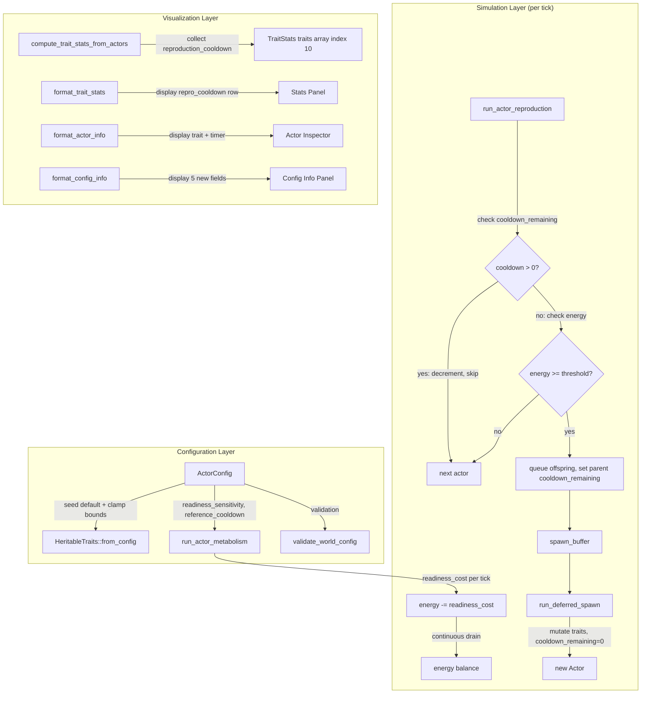

# Design Document: Reproduction Cooldown

## Overview

This feature adds a reproduction cooldown mechanic coupled with a continuous reproductive readiness metabolic cost. The core problems:

1. `offspring_energy` evolves toward max and `reproduction_cost` toward min, enabling actors to reproduce every tick and saturate the grid faster than predation can cull.
2. No mechanism forces a trade-off between offspring quantity and offspring quality — actors can simultaneously invest heavily per offspring AND reproduce rapidly.

The fix has two parts:

- **Cooldown timer**: A per-actor heritable `reproduction_cooldown` trait gates reproduction frequency. After fission, the parent waits `reproduction_cooldown` ticks before becoming eligible again.
- **Readiness cost**: A continuous per-tick metabolic drain in `run_actor_metabolism` that scales with reproductive investment (`reproduction_cost + offspring_energy`) and inversely with cooldown duration. This models the biological cost of maintaining reproductive machinery at high readiness.

The readiness cost formula:
```
readiness_cost = readiness_sensitivity * (reproduction_cost + offspring_energy) / max(reproduction_cooldown, 1) / reference_cooldown
```

This creates a three-dimensional evolutionary trade-off:
- Short cooldown + cheap offspring = moderate drain, lots of weak kids (r-strategy)
- Short cooldown + expensive offspring = huge drain, unsustainable unless resource-rich
- Long cooldown + expensive offspring = low drain, few strong kids (K-strategy)
- Long cooldown + cheap offspring = minimal drain, but slow and weak — outcompeted

The change touches:
- `HeritableTraits` (new `reproduction_cooldown: u16` field)
- `Actor` (new `cooldown_remaining: u16` runtime state)
- `run_actor_reproduction` (cooldown check + timer set)
- `run_actor_metabolism` (readiness cost computation)
- `ActorConfig` (seed default, clamp bounds, `readiness_sensitivity`, `reference_cooldown`)
- `genetic_distance` (`TRAIT_COUNT` 10 → 11)
- `HeritableTraits::mutate` (new mutation line for `reproduction_cooldown`)
- `HeritableTraits::from_config` (initialize from config)
- `run_deferred_spawn` (offspring `cooldown_remaining` initialized to 0)
- Config validation, TOML parsing, visualization stats, panels, documentation

The cooldown check in `run_actor_reproduction` is a single `u16` comparison and decrement — zero allocation. The readiness cost in `run_actor_metabolism` is three multiplications and one division added to the existing energy balance — zero allocation, no new branches beyond what exists.

## Architecture



## Components and Interfaces

### Modified: `HeritableTraits` (src/grid/actor.rs)

New field appended after `optimal_temp`:

```rust
/// Minimum ticks between successive reproductions.
pub reproduction_cooldown: u16,
```

The compile-time size assertion must be updated to reflect the new struct size.

### Modified: `HeritableTraits::from_config`

Adds initialization:

```rust
reproduction_cooldown: config.reproduction_cooldown,
```

### Modified: `HeritableTraits::mutate`

Follows the same pattern as `max_tumble_steps` — proportional mutation in f32 space, round, clamp to u16 bounds:

```rust
let cooldown_f32 = self.reproduction_cooldown as f32 * (1.0 + normal.sample(rng) as f32);
self.reproduction_cooldown = cooldown_f32
    .round()
    .clamp(config.trait_reproduction_cooldown_min as f32, config.trait_reproduction_cooldown_max as f32)
    as u16;
```

### Modified: `Actor` (src/grid/actor.rs)

New runtime field:

```rust
/// Ticks remaining before this actor can reproduce again. 0 = eligible.
pub cooldown_remaining: u16,
```

### Modified: `run_actor_metabolism` (src/grid/actor_systems.rs)

The readiness cost is computed for active (non-inert) actors and subtracted alongside `base_energy_decay` and `thermal_cost`. This is the key mechanism that creates the r/K trade-off.

```rust
// Reproductive readiness cost: continuous metabolic drain for maintaining
// reproductive machinery. Scales with investment and inversely with cooldown.
let reproductive_investment = actor.traits.reproduction_cost + actor.traits.offspring_energy;
let cooldown_factor = 1.0 / (actor.traits.reproduction_cooldown.max(1) as f32);
let readiness_cost = config.readiness_sensitivity * reproductive_investment
    * cooldown_factor / config.reference_cooldown;

actor.energy += consumed * effective_conversion
    - actor.traits.base_energy_decay
    - thermal_cost
    - readiness_cost;
```

Design rationale: placing the readiness cost in metabolism rather than reproduction means it's a continuous drain every tick, not just at fission time. An actor with cooldown 1 and high offspring_energy pays the readiness cost every single tick, even when it can't find a neighbor to spawn into. This prevents the "sit on a rich patch and spam" strategy.

No new branches. No allocations. The existing NaN/Inf check covers the readiness cost path.

### Modified: `run_actor_reproduction` (src/grid/actor_systems.rs)

The cooldown check is inserted as the first eligibility gate after the inert check. When `cooldown_remaining > 0`, decrement and skip. When an actor successfully reproduces, set `cooldown_remaining = actor.traits.reproduction_cooldown`.

```rust
// After inert check:
if actor.cooldown_remaining > 0 {
    actor.cooldown_remaining -= 1;
    continue;
}
// ... existing energy checks ...

// After successful fission:
actor.cooldown_remaining = actor.traits.reproduction_cooldown;
```

Design rationale: decrementing inside the reproduction system (rather than a separate system) avoids an extra iteration over all actors. The cooldown is tightly coupled to reproduction eligibility, so co-locating the logic is cleaner.

### Modified: `run_deferred_spawn` (src/grid/actor_systems.rs)

Offspring are created with `cooldown_remaining: 0` — newborns can reproduce as soon as they accumulate enough energy. This is biologically consistent: the cooldown represents the parent's recovery, not the offspring's maturity.

### Modified: `genetic_distance` (src/grid/actor_systems.rs)

`TRAIT_COUNT` changes from 10 to 11. The traits array gains one entry:

```rust
(a.reproduction_cooldown as f32, b.reproduction_cooldown as f32, config.trait_reproduction_cooldown_min as f32, config.trait_reproduction_cooldown_max as f32),
```

### Modified: `ActorConfig` (src/grid/actor_config.rs)

Five new fields with serde defaults:

```rust
/// Seed genome default for heritable reproduction_cooldown trait.
/// Minimum ticks between successive reproductions. Default: 5.
#[serde(default = "default_reproduction_cooldown")]
pub reproduction_cooldown: u16,

/// Minimum clamp bound for heritable reproduction_cooldown. Default: 1.
#[serde(default = "default_trait_reproduction_cooldown_min")]
pub trait_reproduction_cooldown_min: u16,

/// Maximum clamp bound for heritable reproduction_cooldown. Default: 100.
#[serde(default = "default_trait_reproduction_cooldown_max")]
pub trait_reproduction_cooldown_max: u16,

/// Global sensitivity coefficient for reproductive readiness metabolic cost.
/// Higher values increase the per-tick energy drain for maintaining reproductive
/// machinery. 0.0 disables the mechanic. Must be >= 0.0 and finite. Default: 0.01.
#[serde(default = "default_readiness_sensitivity")]
pub readiness_sensitivity: f32,

/// Neutral cooldown for readiness cost normalization. At this cooldown value,
/// the readiness multiplier equals 1.0 / reference_cooldown. Actors with shorter
/// cooldowns pay more; actors with longer cooldowns pay less.
/// Must be > 0.0 and finite. Default: 5.0.
#[serde(default = "default_reference_cooldown")]
pub reference_cooldown: f32,
```

Default functions:

```rust
fn default_reproduction_cooldown() -> u16 { 5 }
fn default_trait_reproduction_cooldown_min() -> u16 { 1 }
fn default_trait_reproduction_cooldown_max() -> u16 { 100 }
fn default_readiness_sensitivity() -> f32 { 0.01 }
fn default_reference_cooldown() -> f32 { 5.0 }
```

### Modified: `validate_world_config` (src/io/config_file.rs)

Adds validation:
- `trait_reproduction_cooldown_min < trait_reproduction_cooldown_max`
- `reproduction_cooldown` within `[trait_reproduction_cooldown_min, trait_reproduction_cooldown_max]`
- `trait_reproduction_cooldown_min >= 1`
- `readiness_sensitivity >= 0.0` and finite
- `reference_cooldown > 0.0` and finite

Follows the same pattern as existing `max_tumble_steps` and `thermal_sensitivity` validation.

### Modified: Visualization (src/viz_bevy/)

- `TraitStats.traits`: `[SingleTraitStats; 10]` → `[SingleTraitStats; 11]`
- `compute_trait_stats_from_actors`: add 11th buffer for `reproduction_cooldown`, collect values, compute stats at index 10
- `TRAIT_NAMES`: append `"repro_cooldown"` (11 entries)
- `format_actor_info`: add `reproduction_cooldown` trait line and `cooldown_remaining` timer line
- `format_config_info`: add `reproduction_cooldown`, `trait_reproduction_cooldown_min`, `trait_reproduction_cooldown_max`, `readiness_sensitivity`, `reference_cooldown`

## Data Models

### `HeritableTraits` (updated)

```rust
pub struct HeritableTraits {
    pub consumption_rate: f32,
    pub base_energy_decay: f32,
    pub levy_exponent: f32,
    pub reproduction_threshold: f32,
    pub max_tumble_steps: u16,
    pub reproduction_cost: f32,
    pub offspring_energy: f32,
    pub mutation_rate: f32,
    pub kin_tolerance: f32,
    pub optimal_temp: f32,
    pub reproduction_cooldown: u16,  // NEW
}
```

### `Actor` (updated)

```rust
pub struct Actor {
    pub cell_index: usize,
    pub energy: f32,
    pub inert: bool,
    pub tumble_direction: u8,
    pub tumble_remaining: u16,
    pub traits: HeritableTraits,
    pub cooldown_remaining: u16,  // NEW — runtime state, not heritable
}
```

### `ActorConfig` additions

| Field | Type | Default | Description |
|---|---|---|---|
| `reproduction_cooldown` | `u16` | `5` | Seed genome default for heritable reproduction cooldown (ticks). |
| `trait_reproduction_cooldown_min` | `u16` | `1` | Minimum clamp bound. Minimum 1 tick between reproductions. |
| `trait_reproduction_cooldown_max` | `u16` | `100` | Maximum clamp bound. |
| `readiness_sensitivity` | `f32` | `0.01` | Global coefficient for reproductive readiness metabolic cost. `0.0` disables. |
| `reference_cooldown` | `f32` | `5.0` | Neutral cooldown for readiness cost normalization. |

### Readiness Cost Worked Example

Default config: `readiness_sensitivity = 0.01`, `reference_cooldown = 5.0`.

| Actor Strategy | reproduction_cost | offspring_energy | reproduction_cooldown | readiness_cost/tick |
|---|---|---|---|---|
| r-strategist (cheap, fast) | 5.0 | 3.0 | 2 | `0.01 * 8.0 / 2 / 5.0 = 0.008` |
| r-strategist (expensive, fast) | 12.0 | 10.0 | 2 | `0.01 * 22.0 / 2 / 5.0 = 0.022` |
| K-strategist (expensive, slow) | 12.0 | 10.0 | 20 | `0.01 * 22.0 / 20 / 5.0 = 0.0022` |
| Balanced | 12.0 | 10.0 | 5 | `0.01 * 22.0 / 5 / 5.0 = 0.0088` |

The expensive fast-reproducer pays 10× the readiness cost of the expensive slow-reproducer. With `base_energy_decay` at default 0.05, the fast-reproducer's readiness cost is ~44% of its basal metabolism — a significant but not immediately lethal penalty. It needs substantially higher consumption to sustain the strategy.

## Correctness Properties

Property 1: from_config initializes reproduction_cooldown from config
*For any* valid `ActorConfig`, `HeritableTraits::from_config(config).reproduction_cooldown` SHALL equal `config.reproduction_cooldown`.
**Validates: Requirements 1.2**

Property 2: Mutation clamp invariant for reproduction_cooldown
*For any* `HeritableTraits` and valid `ActorConfig`, after calling `mutate`, `reproduction_cooldown` SHALL be within `[trait_reproduction_cooldown_min, trait_reproduction_cooldown_max]`. This includes the edge case where min equals max, in which case the value SHALL equal min.
**Validates: Requirements 1.3, 1.6**

Property 3: Cooldown decrement and reproduction skip
*For any* non-inert actor with `cooldown_remaining > 0`, after one pass of `run_actor_reproduction`, the actor's `cooldown_remaining` SHALL be decremented by exactly 1, and no offspring SHALL be queued for that actor in the spawn buffer.
**Validates: Requirements 2.3**

Property 4: Cooldown set after successful reproduction
*For any* non-inert actor with `cooldown_remaining == 0` and sufficient energy that successfully reproduces, after `run_actor_reproduction`, the parent's `cooldown_remaining` SHALL equal its `traits.reproduction_cooldown`.
**Validates: Requirements 2.2**

Property 5: Readiness cost follows formula
*For any* active (non-inert) actor with known `reproduction_cost`, `offspring_energy`, and `reproduction_cooldown`, and any valid `ActorConfig` with `readiness_sensitivity > 0.0`, the energy delta from `run_actor_metabolism` SHALL include a readiness cost component equal to `readiness_sensitivity * (reproduction_cost + offspring_energy) / max(reproduction_cooldown, 1) / reference_cooldown`.
**Validates: Requirements 3.1, 3.2**

Property 6: Zero readiness_sensitivity produces zero readiness cost
*For any* set of actors with arbitrary reproductive traits, when `config.readiness_sensitivity == 0.0`, the energy change from `run_actor_metabolism` SHALL be identical to the energy change computed without any readiness cost term.
**Validates: Requirements 3.5**

Property 7: Inert actors receive no readiness cost
*For any* inert actor, the energy change from `run_actor_metabolism` SHALL equal exactly `-base_energy_decay` with no readiness cost or thermal cost component.
**Validates: Requirements 3.6**

Property 8: Genetic distance sensitivity to reproduction_cooldown
*For any* two actors with identical heritable traits except `reproduction_cooldown`, `genetic_distance` SHALL return a value greater than 0.0 when their `reproduction_cooldown` values differ (and the clamp range is non-degenerate).
**Validates: Requirements 4.1**

Property 9: Config validation rejects invalid reproduction_cooldown configurations
*For any* `ActorConfig` where `trait_reproduction_cooldown_max < trait_reproduction_cooldown_min` OR `reproduction_cooldown` is outside `[trait_reproduction_cooldown_min, trait_reproduction_cooldown_max]`, `validate_world_config` SHALL return an error.
**Validates: Requirements 5.2, 5.3**

Property 10: Config validation rejects invalid readiness parameters
*For any* `ActorConfig` where `readiness_sensitivity < 0.0` OR `readiness_sensitivity` is non-finite OR `reference_cooldown <= 0.0` OR `reference_cooldown` is non-finite, `validate_world_config` SHALL return an error.
**Validates: Requirements 5.4, 5.5**

Property 11: format_config_info contains all new fields
*For any* `ActorConfig`, the string returned by `format_config_info` SHALL contain the substrings `"reproduction_cooldown"`, `"trait_reproduction_cooldown_min"`, `"trait_reproduction_cooldown_max"`, `"readiness_sensitivity"`, and `"reference_cooldown"`.
**Validates: Requirements 5.7**

Property 12: format_actor_info contains reproduction_cooldown and cooldown_remaining
*For any* `Actor`, the string returned by `format_actor_info` SHALL contain the substrings `"reproduction_cooldown"` and `"cooldown_remaining"`.
**Validates: Requirements 6.4**

Property 13: Stats collection includes reproduction_cooldown
*For any* non-empty set of actors, `compute_trait_stats_from_actors` SHALL produce a `TraitStats` where `traits[10]` (the 11th element) reflects the min, max, and mean of the actors' `reproduction_cooldown` values.
**Validates: Requirements 6.2**

## Error Handling

All error handling follows existing patterns:

- **Config validation errors**: `validate_world_config` returns `ConfigError::Validation` with a descriptive reason string. No new error variants needed — the existing `ConfigError` enum handles this.
- **Numerical errors in metabolism**: The existing `NaN`/`Inf` check on actor energy in `run_actor_metabolism` covers the readiness cost computation. The readiness cost is a product of finite, non-negative values (enforced by config validation and trait clamps), so NaN/Inf can only arise from pre-existing energy corruption.
- **Numerical errors in reproduction**: The existing `NaN`/`Inf` check on parent energy after deduction remains unchanged. The cooldown timer is a `u16` decrement from a value > 0, so underflow is impossible.
- **Mutation edge cases**: When `trait_reproduction_cooldown_min == trait_reproduction_cooldown_max`, the clamp produces a fixed value. When `mutation_rate == 0.0`, the early return in `mutate` skips all mutation including cooldown. Both are handled by existing control flow.
- **Division by zero in readiness cost**: `max(reproduction_cooldown, 1)` prevents division by zero. `reference_cooldown > 0.0` is enforced by config validation.

No new error types or error paths are introduced.

## Testing Strategy

### Property-Based Testing

Library: `proptest` (already used in the project).

Each property test runs a minimum of 100 iterations. Tests are tagged with their design property reference.

- **Property 1** (from_config): Generate random valid `ActorConfig` with `reproduction_cooldown` within clamp bounds. Assert `HeritableTraits::from_config` produces matching value.

- **Property 2** (mutation clamp): Generate random `HeritableTraits` and valid `ActorConfig`. Call `mutate` with a seeded RNG. Assert `reproduction_cooldown` is within clamp bounds.

- **Property 3** (cooldown decrement): Generate a single non-inert actor with `cooldown_remaining` in `[1, u16::MAX]`, place on a grid, run `run_actor_reproduction`. Assert `cooldown_remaining` decreased by 1 and spawn buffer is empty.

- **Property 4** (cooldown set): Generate a non-inert actor with `cooldown_remaining == 0`, energy well above threshold, on a grid with at least one empty neighbor. Run `run_actor_reproduction`. Assert parent `cooldown_remaining == traits.reproduction_cooldown` and spawn buffer is non-empty.

- **Property 5** (readiness cost formula): Generate a single active actor with known traits, a config with `readiness_sensitivity > 0.0`, and known chemical/heat values. Run `run_actor_metabolism`. Compute expected energy delta manually. Assert actual energy matches expected within f32 epsilon.

- **Property 6** (zero sensitivity): Generate actors with `readiness_sensitivity = 0.0`. Run `run_actor_metabolism` twice — once with the readiness code path, once computing baseline without it. Assert identical energy results.

- **Property 7** (inert no readiness): Generate an inert actor. Run `run_actor_metabolism`. Assert energy delta equals `-base_energy_decay` exactly.

- **Property 8** (genetic distance): Generate two identical `HeritableTraits`, then set different `reproduction_cooldown` values. Assert `genetic_distance > 0.0`.

- **Property 9** (config validation cooldown): Generate `ActorConfig` with invalid reproduction_cooldown configurations (max < min, or seed outside range). Assert `validate_world_config` returns `Err`.

- **Property 10** (config validation readiness): Generate `ActorConfig` with invalid readiness parameters (negative sensitivity, zero/negative reference_cooldown, NaN/Inf). Assert `validate_world_config` returns `Err`.

- **Property 11** (config info format): Generate random valid `ActorConfig`. Call `format_config_info`. Assert output contains the five field name substrings.

- **Property 12** (actor info format): Generate random `Actor`. Call `format_actor_info`. Assert output contains `"reproduction_cooldown"` and `"cooldown_remaining"`.

- **Property 13** (stats collection): Generate a set of actors with known `reproduction_cooldown` values. Run `compute_trait_stats_from_actors`. Assert `traits[10].min`, `traits[10].max`, `traits[10].mean` match expected values.

### Unit Tests

Unit tests complement property tests for specific examples and edge cases:

- Offspring spawned via `run_deferred_spawn` have `cooldown_remaining == 0`
- Actor with `cooldown_remaining == 1` becomes eligible (cooldown reaches 0) after one reproduction pass, then reproduces on the next pass if energy is sufficient
- Default `ActorConfig` has `reproduction_cooldown == 5`, `trait_reproduction_cooldown_min == 1`, `trait_reproduction_cooldown_max == 100`
- Readiness cost worked example: actor with `reproduction_cost=12.0`, `offspring_energy=10.0`, `reproduction_cooldown=5`, `readiness_sensitivity=0.01`, `reference_cooldown=5.0` → `readiness_cost = 0.01 * 22.0 / 5 / 5.0 = 0.0088`
- TOML round-trip: serialize a config with custom reproduction_cooldown and readiness values, deserialize, verify equality
