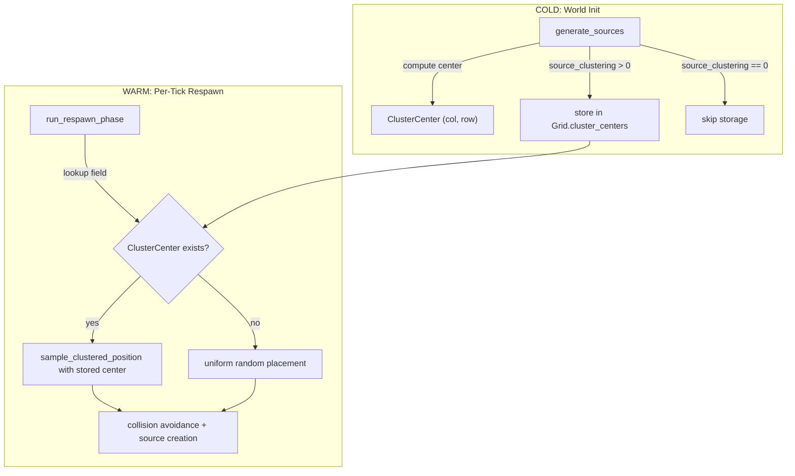

# Design Document: Respawn Cluster Persistence

## Overview

Sources generated with `source_clustering > 0.0` cluster around a randomly-chosen center per `SourceField` variant during world initialization. The current `run_respawn_phase` discards that spatial information and places replacement sources uniformly at random, scattering them over time.

This design introduces a lightweight `ClusterCenterMap` stored on `Grid` that records the `(col, row)` center for each `SourceField` variant when `source_clustering > 0.0`. The respawn phase reads this map and delegates to the existing `sample_clustered_position` helper (promoted to `pub(crate)`) to place replacements near the original cluster center. When no center is stored (i.e., `source_clustering == 0.0` at init time), respawn falls back to uniform placement — identical to current behavior.

No new TOML fields. No new crates. No changes to HOT-path code. The only runtime change is in the WARM-path `run_respawn_phase` function.

## Architecture



### Data Flow

1. During `generate_sources`, after sampling a cluster center for a batch, the center is written into `Grid.cluster_centers` keyed by `SourceField`.
2. During `run_respawn_phase`, for each mature respawn entry, the function looks up the `SourceField` in the cluster center map.
3. If found, it calls `sample_clustered_position` with the stored center and the field's `source_clustering` value.
4. If not found, it falls back to uniform random cell selection (existing behavior).
5. Collision avoidance (occupied-cell rejection) remains unchanged.

### Visibility Change

`sample_clustered_position` in `src/grid/world_init.rs` is currently a private `fn`. It must be promoted to `pub(crate)` so that `run_respawn_phase` in `src/grid/source.rs` can call it.

## Components and Interfaces

### New: `ClusterCenter` (src/grid/source.rs)

Plain data struct, co-located with `SourceField`:

```rust
/// Persistent cluster center for a source field type.
/// Stored on Grid during world init when source_clustering > 0.0.
#[derive(Debug, Clone, Copy, PartialEq, Eq)]
pub struct ClusterCenter {
    pub col: u32,
    pub row: u32,
}
```

### New: `ClusterCenterMap` type alias (src/grid/source.rs)

```rust
/// Maps each SourceField variant to its cluster center.
/// SmallVec<[(SourceField, ClusterCenter); 4]> — stack-allocated for
/// typical cardinality (1 heat + 1–3 chemical species).
pub type ClusterCenterMap = SmallVec<[(SourceField, ClusterCenter); 4]>;
```

Using `SmallVec` with linear scan because:
- Expected cardinality is 2–5 entries (1 heat + 1–4 chemical species).
- `SourceField` does not derive `Hash`, so `HashMap` would require adding a derive.
- Linear scan over ≤5 entries is faster than hash lookup for this size.
- Stack-allocated for the common case (no heap allocation).
- Deterministic iteration order (insertion order) — satisfies Requirement 3.3.

Lookup helper (free function or method on a newtype — free function is simpler):

```rust
/// Look up the cluster center for a given field, if one was stored.
pub fn lookup_cluster_center(
    map: &ClusterCenterMap,
    field: SourceField,
) -> Option<ClusterCenter> {
    map.iter()
        .find(|(f, _)| *f == field)
        .map(|(_, c)| *c)
}
```

### Modified: `Grid` (src/grid/mod.rs)

Add one field:

```rust
/// Per-field-type cluster centers, populated during generate_sources
/// when source_clustering > 0.0. Used by run_respawn_phase.
cluster_centers: ClusterCenterMap,
```

Initialize as `SmallVec::new()` in `Grid::new`.

Add accessor:

```rust
pub fn cluster_centers(&self) -> &ClusterCenterMap { &self.cluster_centers }
pub fn cluster_centers_mut(&mut self) -> &mut ClusterCenterMap { &mut self.cluster_centers }
```

### Modified: `generate_sources` (src/grid/world_init.rs)

After sampling each batch's cluster center, store it:

```rust
// Heat batch
let heat_center_col = rng.random_range(0..width);
let heat_center_row = rng.random_range(0..height);
if heat_cfg.source_clustering > 0.0 {
    grid.cluster_centers_mut().push((
        SourceField::Heat,
        ClusterCenter { col: heat_center_col, row: heat_center_row },
    ));
}

// Chemical batch (per species)
let chem_center_col = rng.random_range(0..width);
let chem_center_row = rng.random_range(0..height);
if chem_cfg.source_clustering > 0.0 {
    grid.cluster_centers_mut().push((
        SourceField::Chemical(species),
        ClusterCenter { col: chem_center_col, row: chem_center_row },
    ));
}
```

### Modified: `sample_clustered_position` (src/grid/world_init.rs)

Change visibility from `fn` to `pub(crate) fn`. No logic changes.

### Modified: `run_respawn_phase` (src/grid/source.rs)

New signature:

```rust
pub fn run_respawn_phase(
    grid: &mut Grid,
    rng: &mut impl Rng,
    current_tick: u64,
    heat_config: &SourceFieldConfig,
    chemical_config: &SourceFieldConfig,
    _num_chemicals: usize,
)
```

The signature stays the same — `grid` already provides access to `cluster_centers()`, `width()`, and `height()`. The function reads `source_clustering` from the appropriate `SourceFieldConfig`.

Inside the respawn loop, replace the uniform cell selection with:

```rust
let center = lookup_cluster_center(grid.cluster_centers(), entry.field);
let cell_index = match center {
    Some(c) => {
        // Clustered respawn: sample near original center.
        // Retry on collision with occupied cells.
        loop {
            let candidate = sample_clustered_position(
                rng, c.col, c.row,
                grid.width(), grid.height(),
                config.source_clustering,
            );
            if !occupied.contains(&candidate) {
                break candidate;
            }
            // Dense grid fallback still applies if all cells occupied.
        }
    }
    None => {
        // No cluster center → uniform random (existing logic).
        // ... existing sparse/dense branch ...
    }
};
```

The dense-grid saturation check (`occupied.len() >= cell_count`) remains before this block, unchanged.

### Modified: `run_emission_phase` (src/grid/tick.rs)

No changes needed. `run_respawn_phase` is already called with `grid`, `heat_config`, and `chemical_config` which carry `source_clustering`.

## Data Models

### ClusterCenter

| Field | Type | Description |
|---|---|---|
| `col` | `u32` | Column coordinate of the cluster center. |
| `row` | `u32` | Row coordinate of the cluster center. |

8 bytes per entry. Copy type. No heap allocation.

### ClusterCenterMap

`SmallVec<[(SourceField, ClusterCenter); 4]>` — inline capacity for 4 entries (covers 1 heat + 3 chemical species without heap allocation). Each entry is `(SourceField, ClusterCenter)`:

- `SourceField::Heat` = 1 `usize` discriminant (8 bytes on 64-bit)
- `SourceField::Chemical(usize)` = 1 `usize` discriminant + 1 `usize` payload (16 bytes)
- `ClusterCenter` = 8 bytes

Total per entry: ~24 bytes. Inline buffer for 4 entries: ~96 bytes on the stack. Acceptable for a `Grid`-level field.


## Correctness Properties

*A property is a characteristic or behavior that should hold true across all valid executions of a system — essentially, a formal statement about what the system should do. Properties serve as the bridge between human-readable specifications and machine-verifiable correctness guarantees.*

### Property 1: Cluster center storage biconditional

*For any* grid dimensions, seed, number of chemical species, and pair of `SourceFieldConfig` values, after `generate_sources` completes, a `ClusterCenter` entry exists in the `ClusterCenterMap` for a given `SourceField` variant if and only if the corresponding `SourceFieldConfig` has `source_clustering > 0.0` and at least one source was generated for that field type.

**Validates: Requirements 1.1, 1.2, 1.3**

### Property 2: Clustered respawn placement uses stored center

*For any* grid with a stored `ClusterCenter` for a `SourceField` and `source_clustering > 0.0`, when a respawn entry matures for that field, the replacement source's cell index SHALL equal the output of `sample_clustered_position` called with the stored center coordinates, grid dimensions, and `source_clustering` value (given the same RNG state).

**Validates: Requirements 2.1**

### Property 3: Unclustered respawn falls back to uniform placement

*For any* grid where no `ClusterCenter` is stored for a `SourceField` (i.e., `source_clustering == 0.0` at init), when a respawn entry matures for that field, the replacement source's cell index SHALL be selected by uniform-random sampling over unoccupied cells, identical to the pre-feature behavior.

**Validates: Requirements 2.2**

### Property 4: Respawn collision avoidance

*For any* grid state with existing sources occupying some cells, when a respawn entry matures, the replacement source's cell index SHALL not equal any cell index already occupied by an active source of the same `SourceField` type.

**Validates: Requirements 2.3**

### Property 5: End-to-end determinism

*For any* seed, grid configuration, and sequence of ticks, running the full simulation (init + N ticks with depletions and respawns) twice with identical inputs SHALL produce identical `ClusterCenterMap` contents and identical respawned source positions at every tick.

**Validates: Requirements 3.1, 3.2**

## Error Handling

No new error types are introduced. The feature operates within existing error boundaries:

| Condition | Handling | Existing Error Type |
|---|---|---|
| `Grid::add_source` fails during respawn | Logged and skipped (existing defensive `.ok()` pattern) | `SourceError` |
| All cells occupied for a field type | Respawn deferred to next tick (existing saturation check) | N/A (not an error) |
| `sample_clustered_position` produces out-of-bounds index | Cannot happen — toroidal wrapping guarantees valid indices | N/A |

No panics. No `unwrap()`. The `ClusterCenterMap` lookup returns `Option<ClusterCenter>` — the `None` case falls through to uniform placement.

## Testing Strategy

### Property-Based Tests

Use the `proptest` crate. Minimum 100 iterations per property.

- **Property 1** (center storage biconditional): Generate random grid configs with `source_clustering` in `{0.0} ∪ (0.0, 1.0]`, random seeds, and 1–4 chemical species. Run `generate_sources`, then for each `SourceField` variant, assert that a center exists in the map iff `source_clustering > 0.0` for that field's config.
  - Tag: **Feature: respawn-cluster-persistence, Property 1: Cluster center storage biconditional**

- **Property 2** (clustered respawn): Set up a grid with a known cluster center stored for Heat, `source_clustering = 0.8`. Seed an RNG, call `run_respawn_phase` with a mature entry. Independently call `sample_clustered_position` with the same RNG state and center. Assert the respawned source's cell index matches.
  - Tag: **Feature: respawn-cluster-persistence, Property 2: Clustered respawn placement uses stored center**

- **Property 3** (unclustered fallback): Set up a grid with no cluster center stored (source_clustering == 0.0). Seed an RNG, call `run_respawn_phase`. Independently compute the expected uniform-random cell index with the same RNG state. Assert match.
  - Tag: **Feature: respawn-cluster-persistence, Property 3: Unclustered respawn falls back to uniform placement**

- **Property 4** (collision avoidance): Generate a grid with N existing sources occupying known cells. Trigger respawn. Assert the new source's cell index is not in the occupied set. Test with both clustered and unclustered configs.
  - Tag: **Feature: respawn-cluster-persistence, Property 4: Respawn collision avoidance**

- **Property 5** (determinism): Generate random seeds and configs. Run the full init + 10-tick simulation twice. Compare all source positions and cluster center maps tick-by-tick.
  - Tag: **Feature: respawn-cluster-persistence, Property 5: End-to-end determinism**

### Unit Tests

- `Grid::new` initializes `cluster_centers` as empty.
- `lookup_cluster_center` returns `None` for an empty map.
- `lookup_cluster_center` returns the correct center for Heat vs Chemical(0) vs Chemical(1).
- `sample_clustered_position` is callable from `source.rs` (visibility test — compile-time).
- Golden-seed regression: given a specific seed, config with `source_clustering = 0.7` and `respawn_enabled = true`, verify exact source positions after init and after one respawn cycle.
