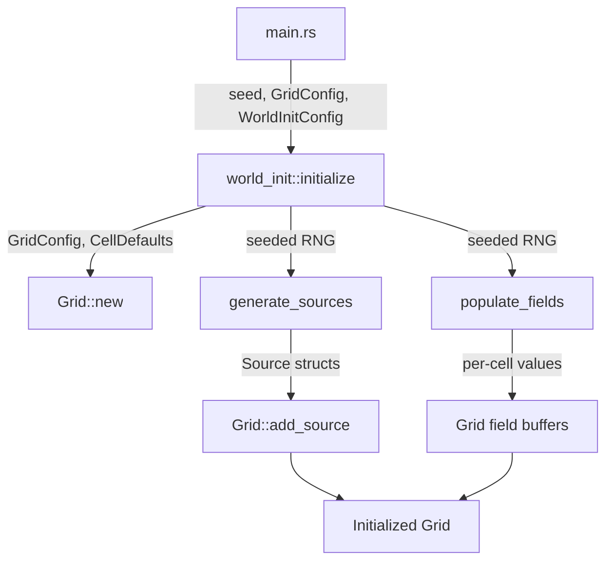

# Design Document: Seeded World Initialization

## Overview

This feature introduces a COLD-path initialization system that procedurally generates the initial state of the simulation grid from a deterministic seed. The system produces source placements (positions + emission rates) and per-cell field values (heat, chemical concentrations) using a seeded PRNG. It integrates into the existing `Grid` construction pipeline, replacing the hardcoded setup in `main.rs`.

The design is a pure function: `(Seed, GridConfig, WorldInitConfig) → Result<Grid, WorldInitError>`. No global state, no mutation of physics parameters, no runtime overhead after initialization completes.

## Architecture



The initialization function lives in a new `src/grid/world_init.rs` module. It:

1. Validates `WorldInitConfig` ranges.
2. Constructs a `Grid` via `Grid::new()` with zero/ambient defaults.
3. Seeds an RNG from the provided `u64` seed.
4. Derives sub-RNGs for source generation and field population (fork the RNG to isolate generation phases, ensuring adding a new phase doesn't retroactively change earlier outputs).
5. Generates and registers sources via `Grid::add_source()`.
6. Writes initial field values directly into the grid's read buffers.

### RNG Forking Strategy

To maintain determinism stability when the initialization sequence evolves, the master RNG is forked into independent child RNGs for each generation phase:

```
master_rng = ChaCha8Rng::seed_from_u64(seed)
├── source_rng = ChaCha8Rng::from_rng(&mut master_rng)
└── field_rng  = ChaCha8Rng::from_rng(&mut master_rng)
```

This ensures that changes to source generation logic (e.g., adding a new source type) do not alter the field initialization output for the same seed, and vice versa. `ChaCha8Rng` is chosen for deterministic, portable, and fast PRNG with no platform-dependent behavior.

## Components and Interfaces

### `WorldInitConfig`

Configuration struct controlling the procedural generation ranges. Plain data, no methods beyond a `Default` impl.

```rust
/// Ranges and constraints for procedural world generation.
/// All ranges are inclusive: [min, max].
#[derive(Debug, Clone, PartialEq)]
pub struct WorldInitConfig {
    /// Range for number of heat sources to place.
    pub min_heat_sources: u32,
    pub max_heat_sources: u32,

    /// Range for number of chemical sources per species.
    pub min_chemical_sources: u32,
    pub max_chemical_sources: u32,

    /// Range for source emission rates (applies to both heat and chemical).
    pub min_emission_rate: f32,
    pub max_emission_rate: f32,

    /// Range for initial per-cell heat values.
    pub min_initial_heat: f32,
    pub max_initial_heat: f32,

    /// Range for initial per-cell chemical concentrations (per species).
    pub min_initial_concentration: f32,
    pub max_initial_concentration: f32,
}
```

### `WorldInitError`

Domain error type using `thiserror`. Wraps validation failures and propagated `SourceError`/`GridError`.

```rust
#[derive(Debug, thiserror::Error)]
pub enum WorldInitError {
    #[error("invalid range: {field} min ({min}) > max ({max})")]
    InvalidRange {
        field: &'static str,
        min: f64,
        max: f64,
    },

    #[error("grid construction failed: {0}")]
    GridError(#[from] GridError),

    #[error("source registration failed: {0}")]
    SourceError(#[from] SourceError),
}
```

### Public API

```rust
/// Generate a fully initialized Grid from a seed and configuration.
///
/// COLD PATH: Runs once at startup. Allocations permitted.
///
/// Returns a Grid ready for immediate tick execution.
pub fn initialize(
    seed: u64,
    grid_config: GridConfig,
    init_config: &WorldInitConfig,
) -> Result<Grid, WorldInitError>
```

### Internal Functions

```rust
/// Validate all WorldInitConfig ranges. Returns first error found.
fn validate_config(config: &WorldInitConfig) -> Result<(), WorldInitError>

/// Generate and register sources into the grid using the provided RNG.
fn generate_sources(
    grid: &mut Grid,
    rng: &mut impl Rng,
    config: &WorldInitConfig,
    num_chemicals: usize,
) -> Result<(), WorldInitError>

/// Write seeded initial values into grid field read buffers.
fn populate_fields(
    grid: &mut Grid,
    rng: &mut impl Rng,
    config: &WorldInitConfig,
    num_chemicals: usize,
)
```

## Data Models

### WorldInitConfig

| Field | Type | Description |
|---|---|---|
| `min_heat_sources` | `u32` | Minimum number of heat sources |
| `max_heat_sources` | `u32` | Maximum number of heat sources |
| `min_chemical_sources` | `u32` | Minimum chemical sources per species |
| `max_chemical_sources` | `u32` | Maximum chemical sources per species |
| `min_emission_rate` | `f32` | Lower bound for emission rate sampling |
| `max_emission_rate` | `f32` | Upper bound for emission rate sampling |
| `min_initial_heat` | `f32` | Lower bound for per-cell initial heat |
| `max_initial_heat` | `f32` | Upper bound for per-cell initial heat |
| `min_initial_concentration` | `f32` | Lower bound for per-cell initial chemical concentration |
| `max_initial_concentration` | `f32` | Upper bound for per-cell initial chemical concentration |

### Grid State After Initialization

After `initialize()` returns, the Grid contains:
- `chemicals`: One `FieldBuffer<f32>` per species, read buffers populated with seeded values in `[min_initial_concentration, max_initial_concentration]`.
- `heat`: `FieldBuffer<f32>` with read buffer populated with seeded values in `[min_initial_heat, max_initial_heat]`.
- `sources`: `SourceRegistry` containing the generated heat and chemical sources with positions in `[0, cell_count)` and emission rates in `[min_emission_rate, max_emission_rate]`.

### Dependency on Existing Types

The module imports and uses:
- `GridConfig`, `CellDefaults` from `grid::config`
- `Grid` from `grid`
- `Source`, `SourceField`, `SourceError` from `grid::source`
- `GridError` from `grid::error`

No new dependencies on physics modules (`diffusion`, `heat`, `tick`). Dependency flows: `world_init` → `grid`, `grid::config`, `grid::source`, `grid::error`. No cycles.


## Correctness Properties

*A property is a characteristic or behavior that should hold true across all valid executions of a system — essentially, a formal statement about what the system should do. Properties serve as the bridge between human-readable specifications and machine-verifiable correctness guarantees.*

The following properties are derived from the acceptance criteria via prework analysis. Each property is universally quantified and suitable for property-based testing with randomized inputs.

### Property 1: Deterministic initialization

*For any* seed, GridConfig, and valid WorldInitConfig, calling `initialize` twice with the same arguments SHALL produce identical Grid states — identical source registries (same count, positions, fields, emission rates in slot order) and identical field buffer contents (heat and all chemical species, cell-by-cell).

**Validates: Requirements 1.2**

### Property 2: Seed sensitivity

*For any* two distinct seeds with the same GridConfig and valid WorldInitConfig, the resulting Grid states SHALL differ in at least one observable value (a source parameter or a field buffer cell value).

**Validates: Requirements 1.3**

### Property 3: Source counts within configured ranges

*For any* seed and valid WorldInitConfig, the number of heat sources in the initialized Grid SHALL be in `[min_heat_sources, max_heat_sources]`, and the number of chemical sources for each species SHALL be in `[min_chemical_sources, max_chemical_sources]`.

**Validates: Requirements 2.1, 2.2**

### Property 4: Source parameters within bounds

*For any* source in an initialized Grid, the source's `cell_index` SHALL be in `[0, cell_count)` and the source's `emission_rate` SHALL be in `[min_emission_rate, max_emission_rate]`.

**Validates: Requirements 2.3, 2.4**

### Property 5: Field values within configured ranges

*For any* cell in an initialized Grid, the heat value SHALL be in `[min_initial_heat, max_initial_heat]`, and each chemical concentration SHALL be in `[min_initial_concentration, max_initial_concentration]`. These values SHALL be readable from the Grid's read buffers immediately after initialization.

**Validates: Requirements 3.1, 3.2, 3.3**

### Property 6: Grid valid for tick execution

*For any* seed and valid WorldInitConfig, the Grid returned by `initialize` SHALL be accepted by `TickOrchestrator::step` without error on the first tick.

**Validates: Requirements 4.3**

### Property 7: Invalid config rejection

*For any* WorldInitConfig where at least one range has min > max (heat sources, chemical sources, emission rate, initial heat, or initial concentration), `initialize` SHALL return a `WorldInitError::InvalidRange`.

**Validates: Requirements 5.1, 5.2, 5.3, 5.4, 5.5**

## Error Handling

### WorldInitError

All errors use `thiserror` with structured variants. No panics, no `unwrap()`.

| Error Variant | Trigger | Recovery |
|---|---|---|
| `InvalidRange { field, min, max }` | Any WorldInitConfig range where min > max | Caller corrects config |
| `GridError(GridError)` | `Grid::new()` fails (e.g., zero dimensions) | Propagated via `?` from Grid construction |
| `SourceError(SourceError)` | `Grid::add_source()` fails (should not occur if generation logic is correct, but defensive) | Propagated via `?` |

### Error Flow

```
initialize()
├── validate_config() → WorldInitError::InvalidRange
├── Grid::new()       → WorldInitError::GridError
└── generate_sources()
    └── grid.add_source() → WorldInitError::SourceError
```

`populate_fields()` is infallible — it writes to pre-allocated buffers with indices derived from grid dimensions, so no bounds errors are possible.

## Testing Strategy

### Property-Based Testing

Use the `proptest` crate for property-based testing. Each property from the Correctness Properties section maps to a single `proptest!` test function.

Configuration:
- Minimum 100 iterations per property test (`PROPTEST_CASES=100` or `ProptestConfig::with_cases(100)`)
- Each test tagged with a comment: `// Feature: seeded-world-init, Property N: <title>`

Generators needed:
- `arb_seed() -> u64` — any u64
- `arb_grid_config() -> GridConfig` — small grids (2–20 width/height), 1–3 chemical species, valid physics params
- `arb_valid_world_init_config() -> WorldInitConfig` — all ranges valid (min ≤ max), reasonable bounds
- `arb_invalid_world_init_config() -> WorldInitConfig` — at least one range has min > max

### Unit Tests

Unit tests complement property tests for specific examples and edge cases:

- Specific seed produces expected source count (smoke test)
- Zero-range config (min == max) produces uniform values
- Single-cell grid (1×1) with sources
- Config with 0 sources (min == max == 0) produces grid with no sources
- Error propagation from `Grid::new()` with zero dimensions

### Test Organization

Tests live in `src/grid/world_init.rs` as `#[cfg(test)] mod tests`. Property tests use `proptest!` macro. Unit tests use standard `#[test]`.

### PBT Library

- Crate: `proptest` (add to `[dev-dependencies]`)
- No custom PBT framework. Use `proptest`'s built-in strategies and combinators.
