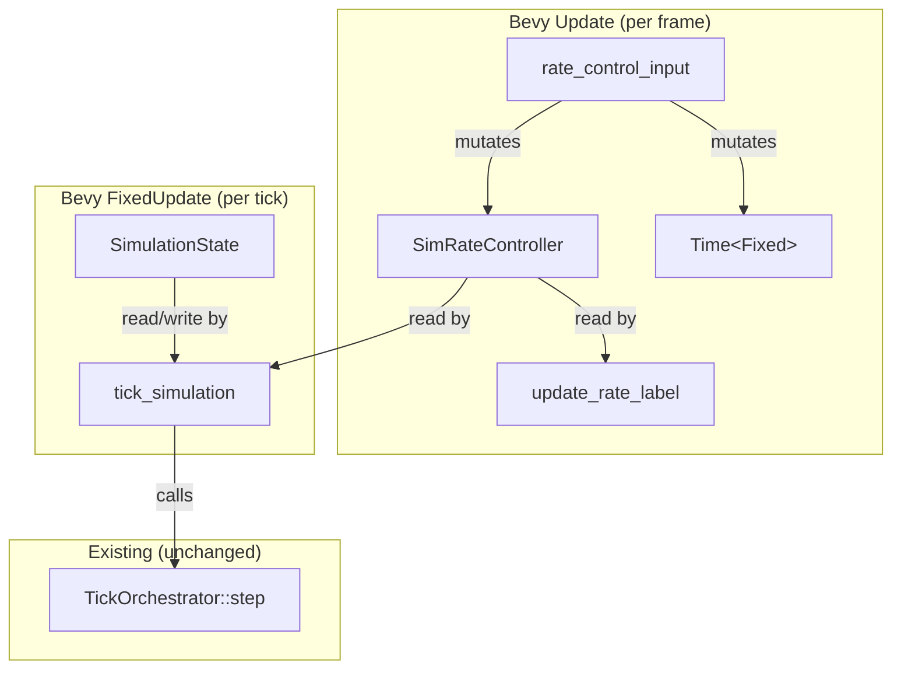

# Design Document: Simulation Rate Control

## Overview

This feature introduces interactive simulation rate control to the Bevy visualization layer. The core simulation (`TickOrchestrator`, `Grid`, field buffers) remains untouched. All changes are confined to `src/viz_bevy/` and `src/bin/bevy_viz.rs`.

The approach:
1. A new Bevy resource (`SimRateController`) holds pacing state: current tick rate, pause flag, and initial rate for reset.
2. A new `Update` system reads keyboard input (Space, Up, Down, R) and mutates `SimRateController` + `Time<Fixed>`.
3. The existing `tick_simulation` system gains a pause guard that reads `SimRateController.paused`.
4. A new UI text entity displays rate/pause/halt status, updated reactively via Bevy change detection.

No new crates are required. The feature uses only `bevy::prelude` types already in scope.

## Architecture



### System Execution Order

| Schedule | System | Classification | Description |
|---|---|---|---|
| `Update` | `rate_control_input` | COLD | Reads keyboard, mutates `SimRateController` and `Time<Fixed>` |
| `Update` | `update_rate_label` | COLD | Syncs rate label text with `SimRateController` state |
| `FixedUpdate` | `tick_simulation` (modified) | WARM | Adds pause guard before existing tick logic |

### Key Design Decisions

1. **Separate resource, not extending `SimulationState`**: `SimulationState.running` is an error-halt flag owned by the tick system. Pause is a user-intent flag owned by the input system. Mixing them creates ambiguous state. Two orthogonal flags, two resources.

2. **Mutating `Time<Fixed>` directly**: Bevy's `Time<Fixed>` is a `Resource` that can be mutated at runtime via `ResMut<Time<Fixed>>`. Changing its period immediately affects the next `FixedUpdate` scheduling cycle. No plugin rebuild needed.

3. **Multiplicative rate steps (×2 / ÷2)**: Doubling/halving produces a clean geometric progression (0.5, 1, 2, 4, 8, …, 480). This feels natural for simulation speed control and avoids floating-point drift from additive increments.

4. **Clamping bounds [0.5, 480.0] Hz**: 0.5 Hz = 2 seconds per tick (slow enough to observe individual tick effects). 480 Hz = sub-2ms per tick (fast enough for bulk fast-forward without exceeding typical frame budgets).

## Components and Interfaces

### `SimRateController` (Bevy Resource)

```rust
#[derive(Resource)]
pub struct SimRateController {
    /// Current simulation ticks per second.
    pub tick_hz: f64,
    /// Whether the user has paused the simulation.
    pub paused: bool,
    /// Initial tick_hz from startup config, used for reset.
    pub initial_tick_hz: f64,
}

impl SimRateController {
    pub const MIN_HZ: f64 = 0.5;
    pub const MAX_HZ: f64 = 480.0;

    pub fn new(tick_hz: f64) -> Self {
        Self {
            tick_hz,
            paused: false,
            initial_tick_hz: tick_hz,
        }
    }

    /// Double the tick rate, clamping to MAX_HZ.
    pub fn speed_up(&mut self) {
        self.tick_hz = (self.tick_hz * 2.0).min(Self::MAX_HZ);
    }

    /// Halve the tick rate, clamping to MIN_HZ.
    pub fn slow_down(&mut self) {
        self.tick_hz = (self.tick_hz / 2.0).max(Self::MIN_HZ);
    }

    /// Reset to the initial tick rate.
    pub fn reset(&mut self) {
        self.tick_hz = self.initial_tick_hz;
    }

    /// Toggle pause state.
    pub fn toggle_pause(&mut self) {
        self.paused = !self.paused;
    }
}
```

### `rate_control_input` (System)

```rust
/// COLD PATH: Reads rate-control keys, mutates SimRateController and Time<Fixed>.
///
/// Key bindings:
///   Space     → toggle pause
///   Up Arrow  → speed up (×2)
///   Down Arrow → slow down (÷2)
///   R         → reset to initial rate
///
/// Requirements: 2.1, 3.1, 3.2, 3.3, 4.1, 4.2, 4.3, 5.1, 5.2
pub fn rate_control_input(
    keys: Res<ButtonInput<KeyCode>>,
    mut rate: ResMut<SimRateController>,
    mut fixed_time: ResMut<Time<Fixed>>,
) {
    let mut rate_changed = false;

    if keys.just_pressed(KeyCode::Space) {
        rate.toggle_pause();
    }

    if keys.just_pressed(KeyCode::ArrowUp) {
        rate.speed_up();
        rate_changed = true;
    }

    if keys.just_pressed(KeyCode::ArrowDown) {
        rate.slow_down();
        rate_changed = true;
    }

    if keys.just_pressed(KeyCode::KeyR) {
        rate.reset();
        rate_changed = true;
    }

    if rate_changed {
        let period = Duration::from_secs_f64(1.0 / rate.tick_hz);
        fixed_time.set_timestep(period);
    }
}
```

### `update_rate_label` (System)

```rust
/// COLD PATH: Syncs the rate label text with SimRateController state.
///
/// Display logic:
///   - Error-halted (`SimulationState.running == false`): "HALTED"
///   - User-paused: "{tick_hz:.1} Hz — PAUSED"
///   - Running: "{tick_hz:.1} Hz"
///
/// Requirements: 6.1, 6.2, 7.2
pub fn update_rate_label(
    rate: Res<SimRateController>,
    sim: Res<SimulationState>,
    mut query: Query<&mut Text, With<RateLabel>>,
) {
    if !rate.is_changed() && !sim.is_changed() {
        return;
    }

    let label = if !sim.running {
        "HALTED".to_string()
    } else if rate.paused {
        format!("{:.1} Hz — PAUSED", rate.tick_hz)
    } else {
        format!("{:.1} Hz", rate.tick_hz)
    };

    for mut text in &mut query {
        **text = label.clone();
    }
}
```

### Modified `tick_simulation`

```rust
/// Advance the simulation by one tick.
///
/// Runs in `FixedUpdate`. Skips when:
///   1. `SimulationState.running == false` (error-halted), OR
///   2. `SimRateController.paused == true` (user-paused)
///
/// Requirements: 2.2, 2.3, 2.4, 7.1
pub fn tick_simulation(
    mut sim: ResMut<SimulationState>,
    rate: Res<SimRateController>,
) {
    if !sim.running || rate.paused {
        return;
    }
    // ... existing tick logic unchanged ...
}
```

### `RateLabel` (Marker Component)

```rust
/// Marker for the simulation rate display text entity.
#[derive(Component)]
pub struct RateLabel;
```

### Setup Changes

During `setup`, after inserting `SimulationState`:

```rust
// Insert rate controller from config.
commands.insert_resource(SimRateController::new(config.tick_hz));

// Spawn rate label (top-right, below scale bar area).
commands.spawn((
    Text::new(format!("{:.1} Hz", config.tick_hz)),
    TextFont { font_size: 18.0, ..default() },
    TextColor(Color::WHITE),
    Node {
        position_type: PositionType::Absolute,
        top: Val::Px(10.0),
        right: Val::Px(50.0),
        ..default()
    },
    RateLabel,
));
```

## Data Models

### `SimRateController` Fields

| Field | Type | Description | Invariant |
|---|---|---|---|
| `tick_hz` | `f64` | Current ticks per second | `0.5 <= tick_hz <= 480.0` |
| `paused` | `bool` | User-initiated pause flag | Independent of `SimulationState.running` |
| `initial_tick_hz` | `f64` | Startup tick rate for reset | Immutable after construction |

### State Transition Table

| Current State | Input | Next State |
|---|---|---|
| Running @ X Hz | Space | Paused @ X Hz |
| Paused @ X Hz | Space | Running @ X Hz |
| Running @ X Hz | Up Arrow | Running @ min(X×2, 480) Hz |
| Running @ X Hz | Down Arrow | Running @ max(X÷2, 0.5) Hz |
| Paused @ X Hz | Up Arrow | Paused @ min(X×2, 480) Hz |
| Paused @ X Hz | Down Arrow | Paused @ max(X÷2, 0.5) Hz |
| Any @ X Hz | R | Same pause state @ initial Hz |
| Error-halted | Any rate key | No effect on tick advancement |


## Correctness Properties

*A property is a characteristic or behavior that should hold true across all valid executions of a system — essentially, a formal statement about what the system should do. Properties serve as the bridge between human-readable specifications and machine-verifiable correctness guarantees.*

### Property 1: SimRateController invariants hold after any operation sequence

*For any* initial `tick_hz` in `[MIN_HZ, MAX_HZ]` and *for any* sequence of `speed_up`, `slow_down`, `reset`, and `toggle_pause` operations applied to a `SimRateController`, the resulting `tick_hz` SHALL remain in `[0.5, 480.0]` AND `initial_tick_hz` SHALL equal the value passed at construction.

**Validates: Requirements 1.1, 1.3**

### Property 2: Pause toggle is an involution

*For any* `SimRateController` state, calling `toggle_pause` twice SHALL restore `paused` to its original value, and `tick_hz` and `initial_tick_hz` SHALL be unchanged.

**Validates: Requirements 2.1**

### Property 3: Tick advances if and only if running and not paused

*For any* `SimulationState` with `running` in `{true, false}` and *for any* `SimRateController` with `paused` in `{true, false}`, the tick counter increments after one `tick_simulation` invocation if and only if `running == true` AND `paused == false`.

**Validates: Requirements 2.2, 2.3, 2.4, 7.1**

### Property 4: speed_up doubles tick rate with upper clamp

*For any* `SimRateController` with `tick_hz` in `[MIN_HZ, MAX_HZ]`, calling `speed_up` SHALL set `tick_hz` to `min(old_tick_hz * 2.0, 480.0)`.

**Validates: Requirements 3.1, 3.2**

### Property 5: slow_down halves tick rate with lower clamp

*For any* `SimRateController` with `tick_hz` in `[MIN_HZ, MAX_HZ]`, calling `slow_down` SHALL set `tick_hz` to `max(old_tick_hz / 2.0, 0.5)`.

**Validates: Requirements 4.1, 4.2**

### Property 6: Reset restores initial rate

*For any* `SimRateController` after *any* sequence of `speed_up`, `slow_down`, and `toggle_pause` operations, calling `reset` SHALL set `tick_hz` equal to `initial_tick_hz`, and `paused` SHALL be unchanged.

**Validates: Requirements 5.1**

### Property 7: Label formatting correctness

*For any* combination of `SimRateController` state (`tick_hz`, `paused`) and `SimulationState.running`:
- If `running == false`, the label text SHALL be `"HALTED"`
- If `running == true` and `paused == true`, the label text SHALL contain the `tick_hz` value and the substring `"PAUSED"`
- If `running == true` and `paused == false`, the label text SHALL contain the `tick_hz` value and SHALL NOT contain `"PAUSED"` or `"HALTED"`

**Validates: Requirements 6.1, 7.2**

## Error Handling

This feature introduces no new fallible operations in the simulation core. All changes are in COLD Bevy systems.

| Scenario | Handling |
|---|---|
| `tick_hz` at boundary when speed_up/slow_down called | Clamped silently to `[MIN_HZ, MAX_HZ]`. No error. |
| `Time<Fixed>` mutation with very small period | Bounded by MIN_HZ = 0.5 → max period = 2s. Bounded by MAX_HZ = 480 → min period ≈ 2.08ms. Both within safe Bevy scheduling range. |
| Error-halt during pause | `tick_simulation` checks `running` first. Error-halt takes precedence. Label shows "HALTED". |
| Rate change while paused | `tick_hz` and `Time<Fixed>` update immediately. When unpaused, the new rate takes effect. |

No `unwrap()` or `expect()` introduced. No `Result` types needed — all operations are infallible clamped arithmetic.

## Testing Strategy

### Property-Based Tests

Use the `proptest` crate for property-based testing. Each property test runs a minimum of 100 iterations.

Properties 1–6 test `SimRateController` methods directly — pure functions on a plain data struct, no Bevy harness needed.

Property 7 tests the label formatting function. Extract the label logic into a pure function `fn format_rate_label(tick_hz: f64, paused: bool, running: bool) -> String` so it can be tested without Bevy.

Each property test must be tagged with a comment:
```rust
// Feature: simulation-rate-control, Property N: <property_text>
```

### Unit Tests

Unit tests complement property tests for specific examples and edge cases:

- Verify `SimRateController::new(10.0)` initializes all fields correctly
- Verify `speed_up` at exactly `MAX_HZ` is a no-op
- Verify `slow_down` at exactly `MIN_HZ` is a no-op
- Verify `reset` after multiple speed changes restores exact initial value
- Verify label shows "HALTED" when `running == false` regardless of pause state
- Verify key bindings map to correct operations (integration test with Bevy `ButtonInput` if feasible)

### Test Classification

| Test Type | Scope | Framework |
|---|---|---|
| Property tests (P1–P7) | `SimRateController` methods, label formatting | `proptest` |
| Unit tests | Edge cases, specific examples | `#[cfg(test)]` standard |
| Integration tests | Key binding → resource mutation (optional) | Bevy test harness |
