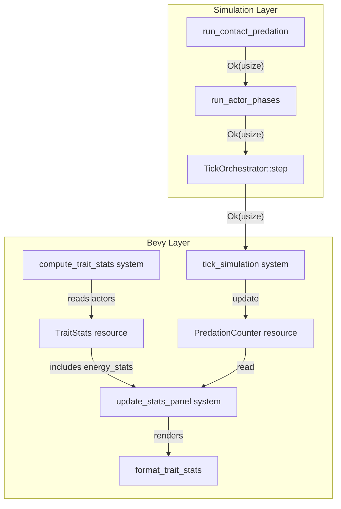

# Design Document: Simulation Stats HUD

## Overview

This feature adds two visualization enhancements to the Bevy HUD:

1. A predation event counter (per-tick + cumulative) displayed in the stats panel header line.
2. Actor energy population statistics displayed as an additional row in the trait stats panel.

Both are COLD-path concerns. The core change to the simulation layer is minimal: `run_contact_predation` returns a `usize` count alongside its `Result`, and this count propagates up through `run_actor_phases` → `TickOrchestrator::step` → `tick_simulation` Bevy system → a new `PredationCounter` resource.

Energy stats piggyback on the existing `compute_trait_stats_from_actors` iteration — one additional `Vec<f32>` collected in the same pass, computed into a `SingleTraitStats`, and stored in an expanded `TraitStats`.

## Architecture



### Data Flow: Predation Count

1. `run_contact_predation` counts `events.len()` after pass 2 and returns `Ok(count)` instead of `Ok(())`.
2. `run_actor_phases` captures the count and returns `Ok(count)` instead of `Ok(())`.
3. `TickOrchestrator::step` captures the count and returns `Ok(count)` instead of `Ok(())`. When actors are absent, returns `Ok(0)`.
4. `tick_simulation` Bevy system reads the returned count and updates `PredationCounter`.
5. `format_trait_stats` reads `PredationCounter` to render the header line.

### Data Flow: Energy Stats

1. `compute_trait_stats_from_actors` collects `actor.energy` into a 10th `Vec<f32>` during its single-pass iteration.
2. Computes `SingleTraitStats` for energy using the existing `compute_single_stats`.
3. Stores the result in a new `energy_stats: Option<SingleTraitStats>` field on `TraitStats`.
4. `format_trait_stats` appends the energy row after the 9 heritable trait rows.

## Components and Interfaces

### Modified: `run_contact_predation`

**File:** `src/grid/actor_systems.rs`

Current signature:
```rust
pub fn run_contact_predation(...) -> Result<(), TickError>
```

New signature:
```rust
pub fn run_contact_predation(...) -> Result<usize, TickError>
```

Returns `events.len()` — the number of successful predation events this tick.

### Modified: `run_actor_phases`

**File:** `src/grid/tick.rs`

Current signature:
```rust
fn run_actor_phases(grid: &mut Grid, _config: &GridConfig, tick: u64) -> Result<(), TickError>
```

New signature:
```rust
fn run_actor_phases(grid: &mut Grid, _config: &GridConfig, tick: u64) -> Result<usize, TickError>
```

Captures the `usize` from `run_contact_predation` and returns it.

### Modified: `TickOrchestrator::step`

**File:** `src/grid/tick.rs`

Current signature:
```rust
pub fn step(...) -> Result<(), TickError>
```

New signature:
```rust
pub fn step(...) -> Result<usize, TickError>
```

Returns the predation count from `run_actor_phases`, or `0` when actors are absent.

### New: `PredationCounter` Resource

**File:** `src/viz_bevy/resources.rs`

```rust
/// Tracks per-tick and cumulative predation events for HUD display.
///
/// COLD: Updated once per tick in `tick_simulation`. Read by `update_stats_panel`.
#[derive(Resource)]
pub struct PredationCounter {
    /// Predation events in the most recent tick.
    pub last_tick: usize,
    /// Cumulative predation events since simulation start.
    pub total: u64,
}
```

### Modified: `TraitStats` Resource

**File:** `src/viz_bevy/resources.rs`

Add a new field:
```rust
pub struct TraitStats {
    pub actor_count: usize,
    pub tick: u64,
    pub traits: Option<[SingleTraitStats; 9]>,
    /// Population energy statistics. `None` when `actor_count == 0`.
    pub energy_stats: Option<SingleTraitStats>,
}
```

Energy stats are stored separately from the trait array because energy is not a heritable trait — it's a dynamic state variable. This avoids changing the array size (which would require updating all indexing code) and keeps the semantic distinction clear.

### Modified: `compute_trait_stats_from_actors`

**File:** `src/viz_bevy/systems.rs`

Adds a 10th `Vec<f32>` for energy collection in the same single-pass loop. Computes `SingleTraitStats` for energy and populates `TraitStats::energy_stats`.

### Modified: `tick_simulation`

**File:** `src/viz_bevy/systems.rs`

Reads the `usize` from `TickOrchestrator::step` and updates `PredationCounter`:
```rust
match TickOrchestrator::step(...) {
    Ok(predation_count) => {
        sim.tick += 1;
        counter.last_tick = predation_count;
        counter.total += predation_count as u64;
    }
    Err(err) => { ... }
}
```

### Modified: `format_trait_stats`

**File:** `src/viz_bevy/setup.rs`

Current header: `Tick: N  |  Actors: N`

New header: `Tick: N  |  Actors: N  |  Predations: N (total: N)`

Accepts `&PredationCounter` as an additional parameter. Appends an "energy" row after the 9 trait rows when `energy_stats` is `Some`.

### Modified: `update_stats_panel`

**File:** `src/viz_bevy/systems.rs`

Adds `Res<PredationCounter>` to its system parameters and passes it to `format_trait_stats`.

## Data Models

### `PredationCounter`

| Field | Type | Description |
|---|---|---|
| `last_tick` | `usize` | Predation events in the most recent completed tick. |
| `total` | `u64` | Cumulative predation events since tick 0. `u64` to avoid overflow on long runs. |

### `TraitStats` (extended)

| Field | Type | Description |
|---|---|---|
| `actor_count` | `usize` | Number of non-inert actors (unchanged). |
| `tick` | `u64` | Simulation tick at computation time (unchanged). |
| `traits` | `Option<[SingleTraitStats; 9]>` | Heritable trait stats (unchanged). |
| `energy_stats` | `Option<SingleTraitStats>` | **New.** Energy population stats. `None` when no living actors. |


## Correctness Properties

*A property is a characteristic or behavior that should hold true across all valid executions of a system — essentially, a formal statement about what the system should do. Properties serve as the bridge between human-readable specifications and machine-verifiable correctness guarantees.*

### Property 1: Predation count accuracy

*For any* valid actor configuration (arbitrary actors placed on a grid with arbitrary energy levels, genetic traits, and occupancy), the `usize` returned by `run_contact_predation` should equal the number of actors that were newly marked inert during that invocation.

**Validates: Requirements 1.1**

### Property 2: Predation counter accumulation

*For any* sequence of per-tick predation counts `[c_0, c_1, ..., c_n]`, after applying all updates to a `PredationCounter` initialized at zero, `last_tick` should equal `c_n` and `total` should equal `sum(c_0..c_n)`.

**Validates: Requirements 2.1, 2.2, 2.3**

### Property 3: Header format includes predation values

*For any* `TraitStats` and `PredationCounter` with arbitrary non-negative values, the string returned by `format_trait_stats` should contain the substring `Predations: {last_tick} (total: {total})` with the exact numeric values from the counter.

**Validates: Requirements 3.1**

### Property 4: Energy stats correctness

*For any* set of actors (with arbitrary energy values and inert/non-inert status), the `energy_stats` field of the `TraitStats` returned by `compute_trait_stats_from_actors` should satisfy: (a) when no non-inert actors exist, `energy_stats` is `None`; (b) when non-inert actors exist, `energy_stats.min` equals the minimum energy among non-inert actors, `energy_stats.max` equals the maximum, and `energy_stats.mean` equals the arithmetic mean.

**Validates: Requirements 4.1, 4.2, 4.3**

### Property 5: Energy row in formatted output

*For any* `TraitStats` where `energy_stats` is `Some`, the string returned by `format_trait_stats` should contain a line starting with `energy` followed by the min, p25, p50, p75, max, and mean values from the `SingleTraitStats`.

**Validates: Requirements 4.4**

## Error Handling

This feature introduces no new error paths. The predation count is a `usize` derived from `events.len()` — infallible. The return type changes from `Result<(), TickError>` to `Result<usize, TickError>`, preserving all existing error propagation.

Energy stats computation uses the same `compute_single_stats` function as heritable traits. The only new failure mode would be an empty actor set, which is already handled by the `None` path in `TraitStats`.

`PredationCounter::total` uses `u64` to avoid overflow. At 2048 ticks/sec with 1000 predations/tick, overflow would take ~285 million years.

## Testing Strategy

### Property-Based Tests

Use the `proptest` crate (already available in the Rust ecosystem, zero-alloc test generation). Each property test runs a minimum of 100 iterations.

- **Property 1** (predation count accuracy): Generate random `ActorRegistry` configurations with varying energy levels and positions. Run `run_contact_predation` and compare the returned count against a post-hoc count of newly-inerted actors.
  - Tag: `Feature: simulation-stats-hud, Property 1: Predation count accuracy`

- **Property 2** (counter accumulation): Generate random `Vec<usize>` of per-tick counts. Apply sequential updates to a `PredationCounter`. Assert `last_tick == counts.last()` and `total == counts.iter().sum()`.
  - Tag: `Feature: simulation-stats-hud, Property 2: Predation counter accumulation`

- **Property 3** (header format): Generate random `PredationCounter` values. Call `format_trait_stats` and assert the output contains the expected substring.
  - Tag: `Feature: simulation-stats-hud, Property 3: Header format includes predation values`

- **Property 4** (energy stats correctness): Generate random actor lists with varying energy and inert status. Call `compute_trait_stats_from_actors` and verify `energy_stats` against independently computed min/max/mean.
  - Tag: `Feature: simulation-stats-hud, Property 4: Energy stats correctness`

- **Property 5** (energy row format): Generate random `SingleTraitStats` for energy. Call `format_trait_stats` and assert the output contains an "energy" row with correct values.
  - Tag: `Feature: simulation-stats-hud, Property 5: Energy row in formatted output`

### Unit Tests

- Edge case: empty actor registry → `energy_stats` is `None`, predation count is 0.
- Edge case: single actor → `energy_stats` has min == max == mean, no predation possible.
- Edge case: paused simulation → `PredationCounter` unchanged after `tick_simulation` call.
- Edge case: all actors inert → `energy_stats` is `None`.

### Integration

- Verify the full chain: `run_contact_predation` → `run_actor_phases` → `TickOrchestrator::step` returns the correct count for a known actor configuration (Requirements 1.2, 1.3).
