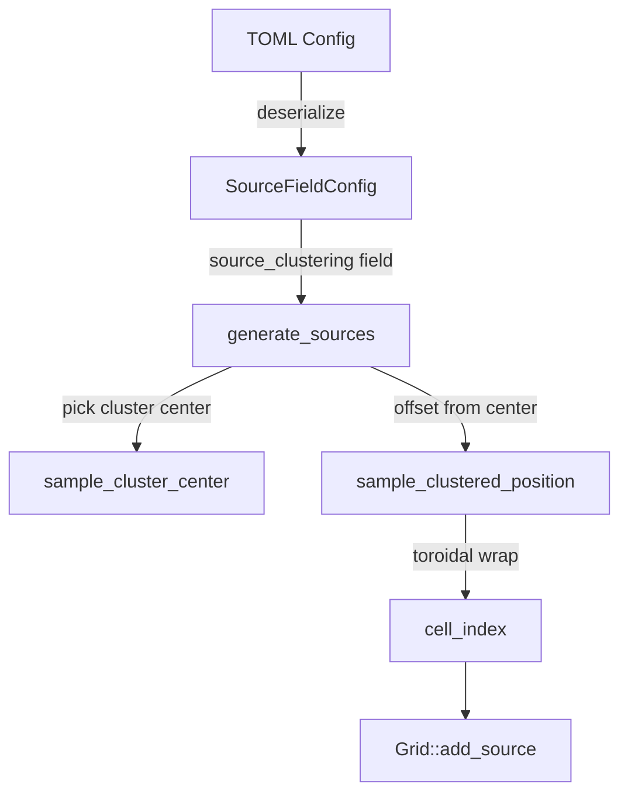

# Design Document: Source Clustering

## Overview

This feature adds a `source_clustering: f32` field to `SourceFieldConfig` that controls the spatial distribution of sources during world initialization. The parameter ranges from `0.0` (uniform random placement, current behavior) to `1.0` (tight clustering around randomly-chosen centers). The implementation modifies only the COLD-path `generate_sources` function in `src/grid/world_init.rs` — no runtime systems are affected.

The clustering algorithm uses a simple two-phase approach: first pick a cluster center uniformly at random, then offset each source from that center using a 2D discrete distribution whose spread is controlled by `source_clustering`. At `0.0`, the offset distribution has infinite spread (equivalent to uniform). At `1.0`, all sources land on or immediately adjacent to the center.

## Architecture

The change is localized to world initialization (COLD path). No new modules or crates are introduced.



### Data Flow

1. `source_clustering` is deserialized from TOML into `SourceFieldConfig` (already shared by heat and chemical configs).
2. `validate_source_field_config` checks `source_clustering ∈ [0.0, 1.0]` and is finite.
3. `generate_sources` reads `source_clustering` and delegates to a position-sampling helper.
4. The helper picks a cluster center once per batch, then samples each source position as an offset from that center.

## Components and Interfaces

### Modified: `SourceFieldConfig` (src/grid/world_init.rs)

Add one field:

```rust
/// Spatial clustering of sources. 0.0 = uniform random, 1.0 = tight clusters.
/// Controls the standard deviation of a 2D geometric distribution used to
/// offset sources from a randomly-chosen cluster center.
/// Range: [0.0, 1.0]. Default: 0.0.
pub source_clustering: f32,
```

Default value: `0.0` (backward compatible — existing behavior unchanged).

### Modified: `validate_source_field_config` (src/grid/world_init.rs)

Add validation:
- `source_clustering` must be in `[0.0, 1.0]`.
- `source_clustering` must be finite (rejects NaN and ±Inf).

New label fields added to `SourceFieldLabels` for error messages.

### New: `sample_clustered_position` (src/grid/world_init.rs)

Private helper function:

```rust
/// Sample a cell index for a source, clustered around `center_col, center_row`.
///
/// When `source_clustering == 0.0`, returns a uniform random cell index.
/// When `source_clustering > 0.0`, samples a 2D offset from a geometric
/// distribution and applies toroidal wrapping.
///
/// The spread parameter `sigma` is derived as:
///   sigma = max_dim * (1.0 - source_clustering)
/// where max_dim = max(width, height). At clustering=0.0, sigma equals the
/// grid dimension (effectively uniform). At clustering=1.0, sigma=0 and all
/// sources land on the center.
fn sample_clustered_position(
    rng: &mut impl Rng,
    center_col: u32,
    center_row: u32,
    width: u32,
    height: u32,
    source_clustering: f32,
) -> usize
```

Algorithm:
1. If `source_clustering == 0.0`: return `rng.random_range(0..cell_count)` (uniform, identical to current behavior).
2. Compute `sigma = max(width, height) as f32 * (1.0 - source_clustering)`.
3. If `sigma < 0.5`: place directly on center (avoids degenerate normal with near-zero sigma).
4. Otherwise: sample `dx ~ Normal(0, sigma)`, `dy ~ Normal(0, sigma)`, round to nearest integer.
5. Compute `col = (center_col as i32 + dx).rem_euclid(width as i32) as u32`.
6. Compute `row = (center_row as i32 + dy).rem_euclid(height as i32) as u32`.
7. Return `row as usize * width as usize + col as usize`.

The normal distribution provides smooth, bell-curve-shaped clusters. Toroidal wrapping ensures no edge bias.

### Modified: `generate_sources` (src/grid/world_init.rs)

For each source batch (heat, and each chemical species):
1. Pick a cluster center: `center_col = rng.random_range(0..width)`, `center_row = rng.random_range(0..height)`.
2. For each source in the batch, call `sample_clustered_position` instead of `rng.random_range(0..cell_count)`.

The cluster center is sampled once per batch. This means all heat sources cluster together, and all chemical sources of a given species cluster together — but heat and chemical clusters are independent.

### Modified: `format_config_info` (src/viz_bevy/setup.rs)

Add a line for each source config section displaying `source_clustering`.

### Modified: `example_config.toml`

Add `source_clustering` to both `[world_init.heat_source_config]` and `[world_init.chemical_source_config]` with comments.

### Modified: `config-documentation.md`

Add `source_clustering` row to the `SourceFieldConfig` table.

## Data Models

No new data models. The only structural change is one `f32` field added to the existing `SourceFieldConfig` struct:

```rust
#[derive(Debug, Clone, PartialEq, Serialize, Deserialize)]
#[serde(default)]
pub struct SourceFieldConfig {
    // ... existing fields ...

    /// Spatial clustering of sources. 0.0 = uniform random, 1.0 = tight clusters.
    /// Range: [0.0, 1.0]. Default: 0.0.
    pub source_clustering: f32,
}
```

The `Default` impl sets `source_clustering: 0.0`.

### Serialization

`source_clustering` is serialized/deserialized via `serde` as part of the existing `SourceFieldConfig` derive. No custom serialization logic needed. The `deny_unknown_fields` on `WorldConfig` already rejects unknown keys — adding the field to the struct is sufficient.


## Correctness Properties

*A property is a characteristic or behavior that should hold true across all valid executions of a system — essentially, a formal statement about what the system should do. Properties serve as the bridge between human-readable specifications and machine-verifiable correctness guarantees.*

### Property 1: Tight clustering at maximum

*For any* grid dimensions (width, height), any source count ≥ 1, and `source_clustering = 1.0`, all placed sources SHALL have the same cell index (the cluster center).

**Validates: Requirements 1.3, 2.4**

### Property 2: Monotonic spread

*For any* grid dimensions and two clustering values `a < b` both in `[0.0, 1.0]`, the computed spread parameter `sigma(a)` SHALL be strictly greater than or equal to `sigma(b)`. This ensures higher clustering always produces tighter groupings.

**Validates: Requirements 1.4**

### Property 3: All positions are valid cell indices

*For any* grid dimensions, any `source_clustering` in `[0.0, 1.0]`, and any cluster center position, the output cell index of `sample_clustered_position` SHALL be in `[0, width * height)`.

**Validates: Requirements 2.2**

### Property 4: Deterministic placement

*For any* seed, grid config, and `source_clustering` value, calling `generate_sources` twice with identical inputs SHALL produce identical source cell indices in the same order.

**Validates: Requirements 2.3, 6.1**

### Property 5: Validation rejects out-of-range values

*For any* `source_clustering` value that is less than `0.0`, greater than `1.0`, NaN, or infinite, `validate_source_field_config` SHALL return an error.

**Validates: Requirements 3.1, 3.2, 3.3**

### Property 6: TOML serialization round-trip

*For any* valid `SourceFieldConfig` with `source_clustering` in `[0.0, 1.0]`, serializing to TOML and deserializing back SHALL produce an equivalent `source_clustering` value.

**Validates: Requirements 4.1**

## Error Handling

All error handling follows the existing `WorldInitError` and `ConfigError` patterns. No new error types are introduced.

| Condition | Error Type | Message Pattern |
|---|---|---|
| `source_clustering < 0.0` | `WorldInitError::InvalidConfig` | `"{prefix} source_clustering must be in [0.0, 1.0]"` |
| `source_clustering > 1.0` | `WorldInitError::InvalidConfig` | `"{prefix} source_clustering must be in [0.0, 1.0]"` |
| `source_clustering` is NaN/Inf | `WorldInitError::InvalidConfig` | `"{prefix} source_clustering must be finite"` |

The `{prefix}` is `"heat"` or `"chemical"` depending on which `SourceFieldConfig` failed, consistent with existing label-based error messages.

No panics. No `unwrap()`. All validation occurs in the COLD path before any sources are placed.

## Testing Strategy

### Property-Based Tests

Use the `proptest` crate (already available in the Rust ecosystem, zero-overhead for this COLD-path code).

Each property test runs a minimum of 100 iterations with generated inputs.

- **Property 1** (tight clustering): Generate random grid dimensions in `[2..200]` and source counts in `[1..20]`. Assert all cell indices equal the center.
  - Tag: **Feature: source-clustering, Property 1: Tight clustering at maximum**

- **Property 2** (monotonic spread): Generate random grid dimensions and pairs `(a, b)` where `0.0 <= a < b <= 1.0`. Assert `sigma(a) >= sigma(b)`.
  - Tag: **Feature: source-clustering, Property 2: Monotonic spread**

- **Property 3** (valid indices): Generate random grid dimensions in `[1..500]`, random clustering in `[0.0..=1.0]`, random center positions. Assert output `< width * height`.
  - Tag: **Feature: source-clustering, Property 3: All positions are valid cell indices**

- **Property 4** (determinism): Generate random seeds, grid configs, and clustering values. Run `generate_sources` twice, compare source cell indices.
  - Tag: **Feature: source-clustering, Property 4: Deterministic placement**

- **Property 5** (validation rejects): Generate values outside `[0.0, 1.0]` plus NaN/Inf. Assert `validate_source_field_config` returns `Err`.
  - Tag: **Feature: source-clustering, Property 5: Validation rejects out-of-range values**

- **Property 6** (round-trip): Generate valid `SourceFieldConfig` instances with random `source_clustering` in `[0.0, 1.0]`. Serialize to TOML string, deserialize back, assert equality.
  - Tag: **Feature: source-clustering, Property 6: TOML serialization round-trip**

### Unit Tests

- Default `SourceFieldConfig` has `source_clustering == 0.0`.
- TOML without `source_clustering` deserializes to `0.0`.
- `format_config_info` output contains `"source_clustering"` for both heat and chemical sections.
- Specific known-seed regression test: given seed X and clustering Y, verify exact cell indices match expected values (golden test for determinism across code changes).
