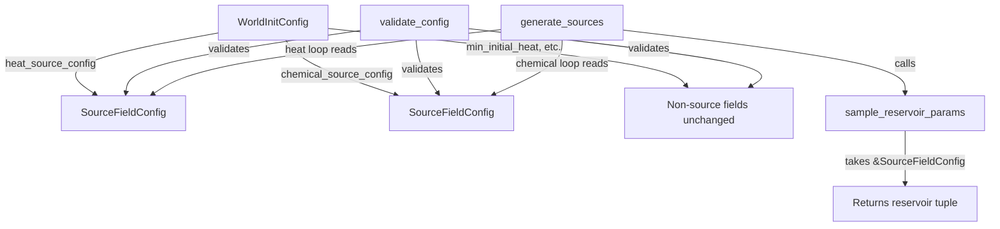

# Design Document: Source Config Decoupling

## Overview

This refactor extracts all source-generation parameters from `WorldInitConfig` into a reusable `SourceFieldConfig` struct. `WorldInitConfig` then holds one `SourceFieldConfig` per fundamental (heat, chemical), replacing the flat shared fields. The `validate_config` and `generate_sources` functions are updated to operate on `SourceFieldConfig` references, and `sample_reservoir_params` takes a `SourceFieldConfig` instead of the top-level config.

This is a COLD-path-only change. `SourceFieldConfig` is consumed exclusively during initialization. No hot-path code is affected. No new allocations, no new dynamic dispatch, no changes to `Source`, `SourceField`, `SourceRegistry`, or `run_emission`.

The design is intentionally minimal: one new struct, field migration on the existing struct, and signature changes on three internal functions. Adding a future fundamental (e.g., moisture sources) requires only adding another `SourceFieldConfig` field to `WorldInitConfig` and a generation loop in `generate_sources`.

## Architecture



No new modules. All changes are within `src/grid/world_init.rs`. The `main.rs` call site updates its `WorldInitConfig` construction.

## Components and Interfaces

### New: `SourceFieldConfig`

Plain data struct. No methods beyond `Default`. Derives `Debug, Clone, PartialEq`.

```rust
/// Per-field-type configuration for source generation.
/// Reusable for any fundamental (heat, chemical, future types).
/// All ranges are inclusive: [min, max].
#[derive(Debug, Clone, PartialEq)]
pub struct SourceFieldConfig {
    /// Range for number of sources to place.
    pub min_sources: u32,
    pub max_sources: u32,
    /// Range for source emission rates (units per tick).
    pub min_emission_rate: f32,
    pub max_emission_rate: f32,
    /// Fraction of sources that are renewable. [0.0, 1.0].
    pub renewable_fraction: f32,
    /// Range for initial reservoir capacity of non-renewable sources.
    pub min_reservoir_capacity: f32,
    pub max_reservoir_capacity: f32,
    /// Range for deceleration threshold of non-renewable sources. [0.0, 1.0].
    pub min_deceleration_threshold: f32,
    pub max_deceleration_threshold: f32,
}
```

### Modified: `WorldInitConfig`

Remove the 11 shared source fields. Add two `SourceFieldConfig` fields. Non-source fields (`min_initial_heat`, `max_initial_heat`, `min_initial_concentration`, `max_initial_concentration`, `min_actors`, `max_actors`) remain unchanged.

```rust
pub struct WorldInitConfig {
    pub heat_source_config: SourceFieldConfig,
    pub chemical_source_config: SourceFieldConfig,

    // Unchanged fields:
    pub min_initial_heat: f32,
    pub max_initial_heat: f32,
    pub min_initial_concentration: f32,
    pub max_initial_concentration: f32,
    pub min_actors: u32,
    pub max_actors: u32,
}
```

### Modified: `validate_config`

Signature unchanged (`&WorldInitConfig -> Result<(), WorldInitError>`). Internally, extract a helper `validate_source_field_config(config: &SourceFieldConfig, field_label: &'static str) -> Result<(), WorldInitError>` and call it twice — once for `"heat"`, once for `"chemical"`. The non-source range validations (initial_heat, initial_concentration, actors) remain as-is.

### Modified: `sample_reservoir_params`

Change signature from `(&mut impl Rng, &WorldInitConfig, f64)` to `(&mut impl Rng, &SourceFieldConfig, f64)`. The body is identical — it already only reads the reservoir/threshold fields.

### Modified: `generate_sources`

The heat loop reads from `config.heat_source_config`. The chemical loop reads from `config.chemical_source_config`. Each loop derives `renewable_prob` from its own `SourceFieldConfig::renewable_fraction`.

## Data Models

### SourceFieldConfig

| Field | Type | Constraints | Default |
|---|---|---|---|
| `min_sources` | `u32` | `<= max_sources` | (set by `WorldInitConfig::default()`) |
| `max_sources` | `u32` | `>= min_sources` | (set by `WorldInitConfig::default()`) |
| `min_emission_rate` | `f32` | `<= max_emission_rate` | `0.1` |
| `max_emission_rate` | `f32` | `>= min_emission_rate` | `5.0` |
| `renewable_fraction` | `f32` | `[0.0, 1.0]` | `0.3` |
| `min_reservoir_capacity` | `f32` | `> 0.0`, `<= max_reservoir_capacity` | `50.0` |
| `max_reservoir_capacity` | `f32` | `>= min_reservoir_capacity` | `200.0` |
| `min_deceleration_threshold` | `f32` | `[0.0, 1.0]`, `<= max_deceleration_threshold` | `0.1` |
| `max_deceleration_threshold` | `f32` | `[0.0, 1.0]`, `>= min_deceleration_threshold` | `0.5` |

Note: `min_sources` / `max_sources` have no single default on `SourceFieldConfig` itself because the count differs per fundamental. `WorldInitConfig::default()` sets heat to `[1, 5]` and chemical to `[1, 3]`. `SourceFieldConfig` does not implement `Default` — the source count has no universal default.

### WorldInitConfig (after refactor)

| Field | Type | Description |
|---|---|---|
| `heat_source_config` | `SourceFieldConfig` | All heat source generation parameters |
| `chemical_source_config` | `SourceFieldConfig` | All chemical source generation parameters |
| `min_initial_heat` | `f32` | Unchanged |
| `max_initial_heat` | `f32` | Unchanged |
| `min_initial_concentration` | `f32` | Unchanged |
| `max_initial_concentration` | `f32` | Unchanged |
| `min_actors` | `u32` | Unchanged |
| `max_actors` | `u32` | Unchanged |


## Correctness Properties

*A property is a characteristic or behavior that should hold true across all valid executions of a system — essentially, a formal statement about what the system should do. Properties serve as the bridge between human-readable specifications and machine-verifiable correctness guarantees.*

### Property 1: Validation rejects invalid sub-configs independently

*For any* `WorldInitConfig` where exactly one of `heat_source_config` or `chemical_source_config` contains an invalid range (min > max for any range pair, or out-of-bounds renewable_fraction/threshold), `validate_config` should return an error whose message identifies the field type ("heat" or "chemical") of the invalid sub-config, and should not be affected by the validity of the other sub-config.

**Validates: Requirements 2.1, 2.2, 2.3, 2.4, 2.5, 2.6, 2.7, 2.8**

### Property 2: Generated source parameters fall within their corresponding SourceFieldConfig ranges

*For any* valid `WorldInitConfig` with distinct heat and chemical config ranges, and any seed, every source produced by `generate_sources` shall have: (a) source count within `[min_sources, max_sources]` of its field's config, (b) emission rate within `[min_emission_rate, max_emission_rate]` of its field's config, and (c) for finite sources, reservoir capacity within `[min_reservoir_capacity, max_reservoir_capacity]` and deceleration threshold within `[min_deceleration_threshold, max_deceleration_threshold]` of its field's config.

**Validates: Requirements 3.1, 3.2, 3.3**

### Property 3: Default config backward compatibility

*For any* seed, initializing a grid with `WorldInitConfig::default()` (new struct layout) and the same `GridConfig` shall produce a `Grid` with identical source count, source positions, source emission rates, source reservoir parameters, and field buffer contents as the previous flat-field default config would have produced.

**Validates: Requirements 4.1, 4.2, 4.3, 4.4**

## Error Handling

No new error variants are needed. The existing `WorldInitError::InvalidRange` and `WorldInitError::InvalidConfig` variants are sufficient. The `field` string in `InvalidRange` will be prefixed with the field type label (e.g., `"heat_emission_rate"`, `"chemical_reservoir_capacity"`) to identify which sub-config failed. The `reason` string in `InvalidConfig` will similarly include the field type.

All error types remain `Send + Sync + 'static`. No panics, no `unwrap()`, no `expect()` in the modified code.

## Testing Strategy

### Property-Based Tests

Use the `proptest` crate (already idiomatic for Rust property testing). Each property test runs a minimum of 100 iterations.

- **Property 1** test: Generate arbitrary `SourceFieldConfig` pairs where one is intentionally invalid (use `proptest` strategies to produce out-of-range values for one sub-config while keeping the other valid). Assert `validate_config` returns `Err` with the correct field type label.
  - Tag: **Feature: source-config-decoupling, Property 1: Validation rejects invalid sub-configs independently**

- **Property 2** test: Generate arbitrary valid `WorldInitConfig` with deliberately non-overlapping heat and chemical ranges (e.g., heat emission `[1.0, 2.0]`, chemical emission `[8.0, 9.0]`). Run `generate_sources` with a random seed. Assert every heat source's parameters fall within heat ranges and every chemical source's parameters fall within chemical ranges.
  - Tag: **Feature: source-config-decoupling, Property 2: Generated source parameters fall within their corresponding SourceFieldConfig ranges**

- **Property 3** test: For any seed, construct the old-equivalent default config via the new struct, run `initialize`, and verify the output matches a reference run. Since the default values are numerically identical, this reduces to verifying that `WorldInitConfig::default()` fields match the expected values and that `initialize` is deterministic (already covered by existing seeded-world-init properties, so this can be a focused unit test).
  - Tag: **Feature: source-config-decoupling, Property 3: Default config backward compatibility**

### Unit Tests

- Verify `WorldInitConfig::default()` field values match the expected constants (heat count `[1,5]`, chemical count `[1,3]`, shared params `[0.1, 5.0]`, etc.).
- Verify `validate_config` accepts a fully valid default config.
- Verify `validate_config` rejects configs with each specific invalid condition (one test per condition from Requirement 2).
- Verify compilation and integration by constructing a `WorldInitConfig` in the same pattern as `main.rs`.
