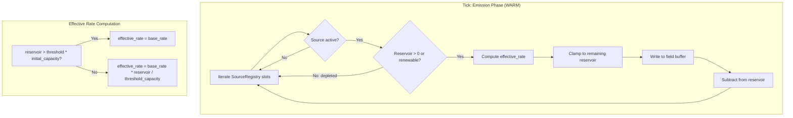
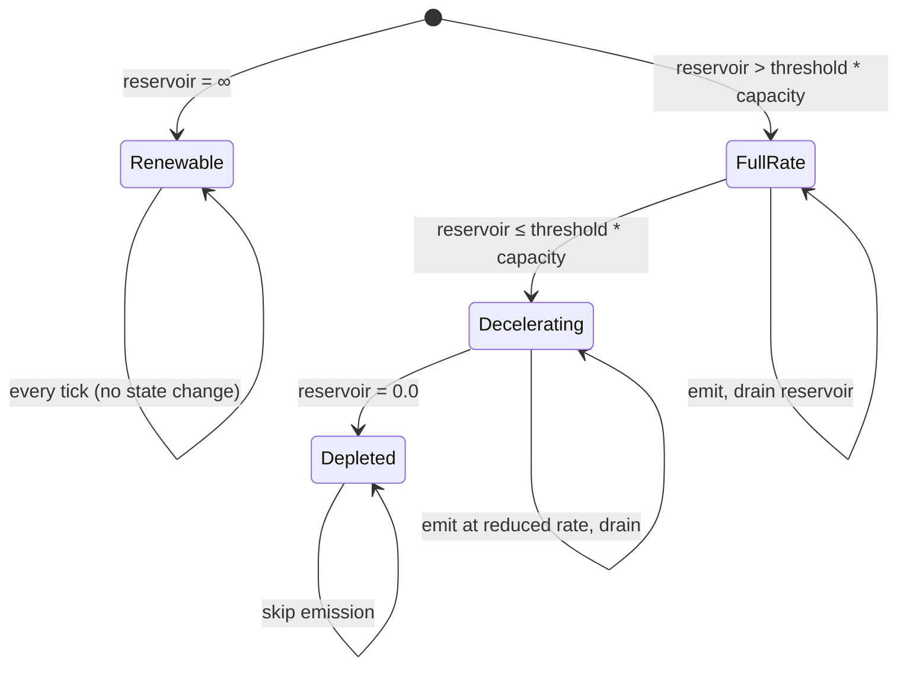

# Design Document: Source Depletion

## Overview

This design extends the existing `Source` struct and emission system to support finite reservoirs and emission deceleration. The core change is adding reservoir state to each source, modifying `run_emission` to drain reservoirs and compute effective emission rates, and extending `WorldInitConfig` to parameterize renewability.

The emission phase remains WARM path. The per-source computation adds a branch (renewable vs. non-renewable) and a multiply (deceleration), both trivial relative to the field buffer write that already dominates. No new allocations, no dynamic dispatch, no iteration order changes.

### Design Rationale

The current model creates a degenerate equilibrium: actors park on infinite sources indefinitely. Finite reservoirs introduce temporal resource pressure — sources deplete, gradients flatten, and actors must migrate. This is the minimal change that breaks the stalemate while preserving the existing emission architecture.

Key decisions:
- **Inline reservoir state in `Source`** rather than a parallel SoA array. Source count is small (tens, not thousands), the emission loop is WARM not HOT, and keeping fields co-located simplifies the registry's slot-based storage. If source counts grow to thousands, SoA extraction is a straightforward follow-up.
- **Renewable sources use `f32::INFINITY`** for reservoir/initial_capacity rather than an `Option` or enum wrapper. This eliminates branching in the emission loop — the deceleration math works identically (threshold check always passes when reservoir is infinite). Single code path, no branch misprediction.
- **Deceleration is linear ramp**, not exponential or sigmoid. Linear is deterministic under floating-point, trivial to reason about, and sufficient for the gameplay goal. The formula: when `reservoir <= threshold * initial_capacity`, effective rate = `base_rate * (reservoir / (threshold * initial_capacity))`. When threshold is 0.0, no deceleration occurs (full rate until exhaustion).
- **Depleted sources remain in the registry** as inert slots (reservoir = 0.0). They are skipped during emission via a simple `> 0.0` check. No removal, no free-list churn, no generation bump. This keeps the registry stable for any external `SourceId` references.

## Architecture



The emission phase structure is unchanged — `run_emission_phase` in `tick.rs` still does copy-read-to-write, calls emission, clamps, validates, swaps. The only change is inside `run_emission`: it now computes effective rate and mutates reservoir state per source.

## Components and Interfaces

### Modified: `Source` struct (`src/grid/source.rs`)

```rust
/// A persistent emitter that injects a value into a grid field each tick.
///
/// Plain data struct. Negative `emission_rate` values represent drains (sinks).
/// Renewable sources use `f32::INFINITY` for `reservoir` and `initial_capacity`.
#[derive(Debug, Clone, Copy, PartialEq)]
pub struct Source {
    pub cell_index: usize,
    pub field: SourceField,
    /// Base emission rate (units per tick). May be negative for sinks.
    pub emission_rate: f32,
    /// Remaining emittable quantity. `f32::INFINITY` for renewable sources.
    pub reservoir: f32,
    /// Total capacity at creation. `f32::INFINITY` for renewable sources.
    /// Used as denominator in deceleration computation.
    pub initial_capacity: f32,
    /// Fraction of initial_capacity below which emission decelerates.
    /// 0.0 = no deceleration (full rate until exhaustion).
    /// 1.0 = deceleration begins immediately.
    pub deceleration_threshold: f32,
}
```

### Modified: `SourceRegistry` (`src/grid/source.rs`)

New methods:

```rust
impl SourceRegistry {
    /// Returns true if the source identified by `id` is depleted (reservoir == 0.0).
    pub fn is_depleted(&self, id: SourceId) -> Result<bool, SourceError>;

    /// Count of active sources with reservoir > 0.0 (or renewable).
    pub fn active_emitting_count(&self) -> usize;

    /// Mutable iteration over active sources in deterministic slot order.
    /// Required by run_emission to mutate reservoir state.
    pub fn iter_mut(&mut self) -> impl Iterator<Item = &mut Source>;
}
```

### Modified: `run_emission` (`src/grid/source.rs`)

Signature changes from `&SourceRegistry` to `&mut SourceRegistry` to allow reservoir mutation:

```rust
pub fn run_emission(grid: &mut Grid, registry: &mut SourceRegistry);
```

### Modified: `WorldInitConfig` (`src/grid/world_init.rs`)

New fields:

```rust
pub struct WorldInitConfig {
    // ... existing fields ...

    /// Fraction of sources that are renewable (infinite reservoir).
    /// 0.0 = all finite, 1.0 = all renewable.
    pub renewable_fraction: f32,

    /// Range for initial reservoir capacity of non-renewable sources.
    pub min_reservoir_capacity: f32,
    pub max_reservoir_capacity: f32,

    /// Range for deceleration threshold of non-renewable sources.
    /// Each value in [0.0, 1.0].
    pub min_deceleration_threshold: f32,
    pub max_deceleration_threshold: f32,
}
```

### Modified: `SourceError` (`src/grid/source.rs`)

New variant:

```rust
pub enum SourceError {
    // ... existing variants ...

    #[error("invalid reservoir: finite source requires reservoir > 0.0, got {reservoir}")]
    InvalidReservoir { reservoir: f32 },

    #[error("deceleration threshold {threshold} out of range [0.0, 1.0]")]
    InvalidDecelerationThreshold { threshold: f32 },
}
```

### Modified: `run_emission_phase` (`src/grid/tick.rs`)

Minimal change: `take_sources` returns `SourceRegistry` which is now passed as `&mut` to `run_emission`. The rest of the phase (copy-read-to-write, clamp, validate, swap) is unchanged.

## Data Models

### Source State Transitions



### Effective Emission Rate Formula

For a non-renewable source with `emission_rate = R`, `reservoir = r`, `initial_capacity = C`, `deceleration_threshold = T`:

```
threshold_capacity = T * C

if T == 0.0 or r > threshold_capacity:
    effective_rate = R
else:
    effective_rate = R * (r / threshold_capacity)

actual_emission = min(effective_rate, r)   // clamp to remaining reservoir
new_reservoir = r - actual_emission
```

For renewable sources (`reservoir = ∞`, `initial_capacity = ∞`):
- `effective_rate = R` (threshold check always passes since ∞ > any finite value)
- No reservoir mutation (∞ - R = ∞)

This means the `f32::INFINITY` representation gives us a single code path with no branching on renewability.

### Validation Rules

| Field | Constraint | When |
|---|---|---|
| `reservoir` | `> 0.0` or `f32::INFINITY` | At `SourceRegistry::add()` |
| `initial_capacity` | `> 0.0` or `f32::INFINITY` | At `SourceRegistry::add()` |
| `reservoir` | `≤ initial_capacity` | At `SourceRegistry::add()` |
| `deceleration_threshold` | `∈ [0.0, 1.0]` | At `SourceRegistry::add()` |
| `renewable_fraction` | `∈ [0.0, 1.0]` | At `validate_config()` |
| `min_reservoir_capacity` | `> 0.0` | At `validate_config()` |
| `max_reservoir_capacity` | `≥ min_reservoir_capacity` | At `validate_config()` |


## Correctness Properties

*A property is a characteristic or behavior that should hold true across all valid executions of a system — essentially, a formal statement about what the system should do. Properties serve as the bridge between human-readable specifications and machine-verifiable correctness guarantees.*

### Property 1: Invalid reservoir rejection

*For any* `Source` with a finite (non-INFINITY) reservoir value ≤ 0.0, `SourceRegistry::add()` SHALL return `Err(SourceError::InvalidReservoir)`.

**Validates: Requirements 1.3**

### Property 2: Renewable source invariance

*For any* renewable source (reservoir = `f32::INFINITY`) and any number of emission ticks, the source's reservoir SHALL remain `f32::INFINITY` and the effective emission rate SHALL equal the base `emission_rate` every tick.

**Validates: Requirements 1.4, 2.4**

### Property 3: Non-renewable emission drains reservoir

*For any* non-renewable source with reservoir > 0.0, after one emission tick, the new reservoir SHALL equal `old_reservoir - actual_emission`, where `actual_emission = min(effective_rate, old_reservoir)`.

**Validates: Requirements 2.1**

### Property 4: Depleted sources produce zero emission

*For any* source with reservoir = 0.0, running the emission system SHALL not modify the target field buffer at that source's cell index (zero contribution).

**Validates: Requirements 2.2, 4.1, 4.2**

### Property 5: Full rate above deceleration threshold

*For any* non-renewable source where `reservoir > deceleration_threshold * initial_capacity`, the effective emission rate SHALL equal the base `emission_rate`.

**Validates: Requirements 3.2**

### Property 6: Decelerated rate below threshold

*For any* non-renewable source where `reservoir ≤ deceleration_threshold * initial_capacity` and `deceleration_threshold > 0.0`, the effective emission rate SHALL equal `emission_rate * (reservoir / (deceleration_threshold * initial_capacity))`.

**Validates: Requirements 3.3**

### Property 7: Generated source parameters within configured range

*For any* `WorldInitConfig` and seeded RNG, every non-renewable source produced by `generate_sources` SHALL have `reservoir ∈ [min_reservoir_capacity, max_reservoir_capacity]` and `deceleration_threshold ∈ [min_deceleration_threshold, max_deceleration_threshold]`.

**Validates: Requirements 5.5, 5.6**

### Property 8: Renewable fraction approximation

*For any* `WorldInitConfig` with `renewable_fraction = F` and a sufficiently large source count (≥ 20), the fraction of generated sources that are renewable SHALL be within a reasonable tolerance of `F`.

**Validates: Requirements 5.4**

### Property 9: Deterministic emission

*For any* identical initial grid state and source configuration, running the emission system for N ticks SHALL produce identical reservoir values and field buffer contents on every execution.

**Validates: Requirements 6.1**

## Error Handling

All error handling uses `thiserror` domain error types. No panics in simulation logic.

| Error Condition | Error Type | Handling |
|---|---|---|
| Finite reservoir ≤ 0.0 at registration | `SourceError::InvalidReservoir` | Reject at `add()` |
| `deceleration_threshold` outside [0.0, 1.0] | `SourceError::InvalidDecelerationThreshold` | Reject at `add()` |
| `reservoir > initial_capacity` | `SourceError::InvalidReservoir` | Reject at `add()` |
| `initial_capacity` ≤ 0.0 for finite source | `SourceError::InvalidReservoir` | Reject at `add()` |
| `renewable_fraction` outside [0.0, 1.0] | `WorldInitError::InvalidConfig` | Reject at `validate_config()` |
| `min_reservoir_capacity` ≤ 0.0 | `WorldInitError::InvalidConfig` | Reject at `validate_config()` |
| `max < min` for reservoir/threshold ranges | `WorldInitError::InvalidConfig` | Reject at `validate_config()` |
| NaN/Infinity in field buffer post-emission | `TickError::InvalidFieldValue` | Existing validation in `run_emission_phase` catches this |

Depletion itself is not an error — it is normal simulation behavior. Depleted sources remain in the registry as inert slots.

## Testing Strategy

### Property-Based Testing

Use the `proptest` crate for property-based testing. Each property test runs a minimum of 100 iterations.

Each correctness property maps to a single `proptest` test function, tagged with a comment referencing the design property:

```rust
// Feature: source-depletion, Property 1: Invalid reservoir rejection
// Validates: Requirements 1.3
```

Generators needed:
- `arb_source()`: generates valid `Source` structs with random field, cell_index, emission_rate, reservoir, initial_capacity, deceleration_threshold
- `arb_renewable_source()`: generates sources with `reservoir = f32::INFINITY`, `initial_capacity = f32::INFINITY`
- `arb_finite_source()`: generates non-renewable sources with finite positive reservoir
- `arb_world_init_config()`: generates valid `WorldInitConfig` with reservoir/threshold ranges

### Unit Tests

Unit tests cover specific examples and edge cases not suited to property-based testing:

- Deceleration threshold = 0.0 (no deceleration, full rate until exhaustion) — edge case from Req 3.4
- Reservoir exactly equal to one tick's emission (drains to zero in one tick) — edge case from Req 2.3
- Reservoir less than one tick's emission (partial emission, then depleted) — edge case from Req 2.3
- Negative emission_rate (sink) with finite reservoir — verify drain still applies
- Mixed renewable and non-renewable sources in same registry — verify independent behavior
- `active_emitting_count` accuracy after partial depletion

### Test Organization

Tests live in `src/grid/source.rs` as `#[cfg(test)] mod tests` (unit + property tests for Source/SourceRegistry) and in `src/grid/world_init.rs` for initialization property tests (Property 7, 8).
