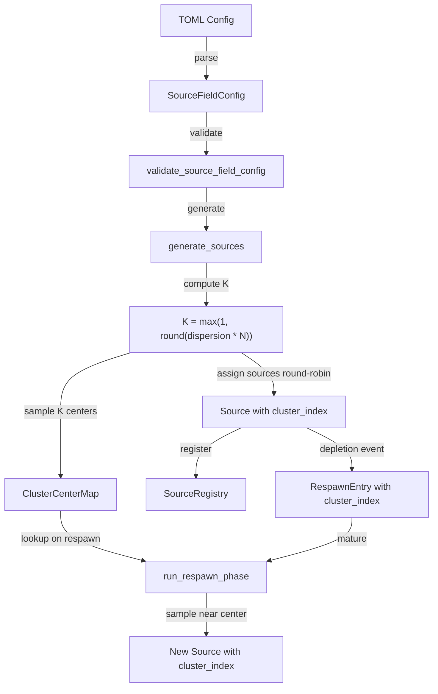

# Design Document: Source Dispersion

## Overview

This feature adds a `source_dispersion: f32` parameter to `SourceFieldConfig` that controls how many distinct cluster centers sources are distributed across for a given field type. It works orthogonally to the existing `source_clustering` parameter:

- `source_clustering` controls intra-cluster tightness (sigma of the 2D normal offset around a center).
- `source_dispersion` controls inter-cluster count (how many centers exist).

The formula: `num_clusters = max(1, round(source_dispersion * num_sources))`.

At `dispersion=0.0` (default), all sources share one center — identical to current behavior. At `dispersion=1.0`, each source gets its own independent center. Intermediate values interpolate linearly.

The key architectural change is that `ClusterCenterMap` must support multiple centers per field type (currently it stores at most one), and each `Source` must track which cluster center it belongs to so that respawn can sample near the correct center.

## Architecture

### Path Classification

| Operation | Path | Rationale |
|---|---|---|
| Config parsing + validation | COLD | Once at startup |
| `generate_sources` | COLD | Once at startup |
| `run_respawn_phase` | WARM | Once per tick, small data |
| `run_emission` | WARM | Unchanged — no dispersion logic in emission |

### Data Flow



### Interaction Matrix

| dispersion | clustering | Behavior |
|---|---|---|
| 0.0 | 0.0 | Uniform random placement (legacy) |
| 0.0 | 1.0 | All sources stacked on one cell |
| 0.5 | 0.5 | ~N/2 centers, moderate spread around each |
| 1.0 | 0.0 | N independent centers, each source samples uniformly (effectively uniform random) |
| 1.0 | 1.0 | N sources each pinned to their own random cell |

## Components and Interfaces

### Modified: `SourceFieldConfig` (src/grid/world_init.rs)

Add field:
```rust
/// Inter-cluster dispersion. Controls how many distinct cluster centers
/// sources are distributed across. [0.0, 1.0]. Default: 0.0.
/// 0.0 = one shared center (current behavior).
/// 1.0 = one center per source.
/// Formula: num_clusters = max(1, round(source_dispersion * num_sources)).
pub source_dispersion: f32,
```

Default value: `0.0`. Serde: `#[serde(default)]` on the struct handles this.

### Modified: `validate_source_field_config()` (src/grid/world_init.rs)

Add validation for `source_dispersion`:
- Must be finite.
- Must be in `[0.0, 1.0]`.

Uses the same `SourceFieldLabels` pattern — add two new label fields: `source_dispersion_range` and `source_dispersion_finite`.

### Modified: `Source` (src/grid/source.rs)

Add field:
```rust
/// Index of the cluster center this source belongs to.
/// Used by respawn to sample near the correct center.
/// Always 0 when source_dispersion is 0.0 (single center).
pub cluster_index: u8,
```

`u8` is sufficient — max sources per field type is bounded by `max_sources: u32`, but in practice never exceeds 255 clusters. If `num_sources > 255`, clamp to 255 clusters.

### Modified: `RespawnEntry` (src/grid/source.rs)

Add field:
```rust
/// Cluster center index of the depleted source, for respawn placement.
pub cluster_index: u8,
```

### Modified: `ClusterCenterMap` type (src/grid/source.rs)

Change from `SmallVec<[(SourceField, ClusterCenter); 4]>` to a structure that supports multiple centers per field:

```rust
/// Maps (SourceField, cluster_index) → ClusterCenter.
/// Stack-allocated for typical cardinality.
pub type ClusterCenterMap = SmallVec<[(SourceField, u8, ClusterCenter); 8]>;
```

Update `lookup_cluster_center` to accept a `cluster_index: u8` parameter:
```rust
pub fn lookup_cluster_center(
    map: &ClusterCenterMap,
    field: SourceField,
    cluster_index: u8,
) -> Option<ClusterCenter> {
    map.iter()
        .find(|(f, idx, _)| *f == field && *idx == cluster_index)
        .map(|(_, _, c)| *c)
}
```

### Modified: `generate_sources()` (src/grid/world_init.rs)

For each field batch (heat, each chemical species):

1. Sample `num_sources` from `[min_sources, max_sources]`.
2. Compute `K = max(1, round(source_dispersion * num_sources))`. Clamp K to `min(K, 255)`.
3. Sample K independent cluster center positions `(col, row)` uniformly at random.
4. Store all K centers in `ClusterCenterMap` as `(field, cluster_idx, center)` — but only when `source_clustering > 0.0` OR `source_dispersion > 0.0` (i.e., when centers are meaningful).
5. For each source `i` in `0..num_sources`:
   - Assign `cluster_index = (i % K) as u8` (round-robin).
   - Sample position via `sample_clustered_position(rng, centers[cluster_index].col, centers[cluster_index].row, ...)`.
   - Set `source.cluster_index = cluster_index`.

When `source_dispersion == 0.0`, K=1, and the logic collapses to the current single-center behavior.

### Modified: `run_respawn_phase()` (src/grid/source.rs)

When looking up the cluster center for a respawn entry, use `entry.cluster_index`:

```rust
let center = lookup_cluster_center(grid.cluster_centers(), entry.field, entry.cluster_index);
```

When creating the replacement source, set `cluster_index` to `entry.cluster_index`.

### Modified: Depletion → Respawn Entry Creation (src/grid/tick.rs)

When creating a `RespawnEntry` from a `DepletionEvent`, look up the depleted source's `cluster_index` from the registry before removing it. Pass `cluster_index` into the `RespawnEntry`.

This requires accessing the source data before `registry.remove()`. The current code already has access to the source via `event.source_id` — we need to read `cluster_index` from the source slot before removal.

### Modified: `format_config_info()` (src/viz_bevy/setup.rs)

Add `source_dispersion` display line after `source_clustering` for both heat and each chemical species.

### Modified: `example_config.toml`

Add `source_dispersion` field with comment in both `[world_init.heat_source_config]` and `[world_init.chemical_species_configs.source_config]` sections.

### Modified: `config-documentation.md` steering file

Add `source_dispersion` row to the `SourceFieldConfig` table.

## Data Models

### SourceFieldConfig (updated)

```rust
pub struct SourceFieldConfig {
    // ... existing fields ...
    pub source_clustering: f32,
    /// Inter-cluster dispersion. [0.0, 1.0]. Default: 0.0.
    pub source_dispersion: f32,
}
```

### Source (updated)

```rust
pub struct Source {
    pub cell_index: usize,
    pub field: SourceField,
    pub emission_rate: f32,
    pub reservoir: f32,
    pub initial_capacity: f32,
    pub deceleration_threshold: f32,
    pub cluster_index: u8,
}
```

### RespawnEntry (updated)

```rust
pub struct RespawnEntry {
    pub field: SourceField,
    pub respawn_tick: u64,
    pub cluster_index: u8,
}
```

### ClusterCenterMap (updated)

```rust
pub type ClusterCenterMap = SmallVec<[(SourceField, u8, ClusterCenter); 8]>;
```

Bumped from 4 to 8 inline capacity to accommodate multi-center scenarios without heap allocation in typical configs.

### Cluster Count Formula

```
num_clusters = max(1, round(source_dispersion * num_sources))
num_clusters = min(num_clusters, 255)  // u8 bound
```

| num_sources | dispersion | num_clusters |
|---|---|---|
| 6 | 0.0 | 1 |
| 6 | 0.5 | 3 |
| 6 | 1.0 | 6 |
| 1 | 1.0 | 1 |
| 10 | 0.3 | 3 |
| 10 | 0.1 | 1 |

