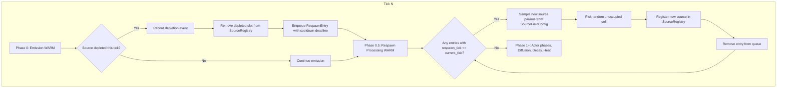
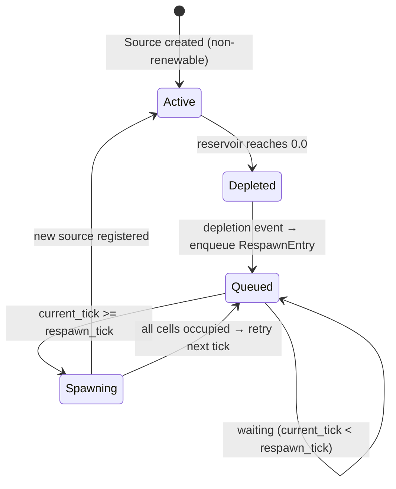

# Design Document: Source Respawn Cycling

## Overview

This design adds a respawn cycle for depleted non-renewable sources. The core mechanism: when `run_emission` drains a source's reservoir to zero, the system records a depletion event, removes the inert slot from the `SourceRegistry`, and enqueues a respawn entry with a cooldown deadline. A new `run_respawn_phase` function, executing after emission in the tick sequence, processes mature entries by spawning fresh non-renewable sources at random unoccupied cells.

The respawn queue is a pre-allocated `Vec<RespawnEntry>` stored on `Grid`. Processing is WARM path — it iterates a small queue (bounded by total source count) and only does work when entries mature. No heap allocations in the per-tick path. All randomness uses the simulation's seeded RNG for deterministic replay.

### Design Rationale

Key decisions:

- **Depletion detection inside `run_emission`** rather than a separate scan pass. The emission loop already touches every source and checks `reservoir == 0.0`. Adding a "just depleted" check (reservoir was positive, now zero) is a single branch in the existing loop — zero additional iteration cost.

- **Immediate removal of depleted slots** after queuing the respawn. The source-depletion spec left depleted sources as inert slots to avoid registry churn. With respawning, those slots are dead weight — removing them frees the slot for the replacement source and keeps `active_emitting_count` accurate. The generational index on `SourceId` prevents stale-reference issues.

- **Respawn config on `SourceFieldConfig`** rather than a separate top-level struct. Respawn behavior is inherently per-field-type (heat vs. chemical may have different cooldowns). Adding three fields to the existing struct keeps the config hierarchy flat and the TOML nesting natural (`[world_init.heat_source_config]` already exists).

- **`RespawnQueue` as a `Vec<RespawnEntry>` on `Grid`** rather than a standalone struct. The queue is small (bounded by initial source count), iterated linearly, and needs access to `Grid` for spawning. Storing it on `Grid` alongside `SourceRegistry` keeps the borrow-splitting pattern simple: `take_respawn_queue` / `put_respawn_queue` mirrors the existing `take_sources` / `put_sources`.

- **Replacement sources are always non-renewable**. Renewable sources don't deplete, so they never trigger respawns. Spawning a renewable replacement would break the cycle — the replacement would never deplete, and the respawn mechanic would be a one-shot. Non-renewable replacements maintain the depletion→cooldown→respawn loop indefinitely.

- **Respawn disabled by default** (`respawn_enabled: false`). This preserves backward compatibility — existing configs produce identical behavior. Users opt in explicitly.

## Architecture



### Tick Phase Integration

The respawn phase slots between emission and actor phases. This ensures:
1. Depletion events from the current emission are captured immediately.
2. Newly spawned sources don't emit until the next tick (they miss the current emission phase).

Updated tick sequence in `TickOrchestrator::step`:

```
Phase 0:   Emission (WARM) — inject source values, detect depletions
Phase 0.5: Respawn (WARM) — process mature queue entries, spawn replacements
Phase 1-4: Actor phases (WARM)
Phase 5:   Chemical diffusion (HOT)
Phase 6:   Chemical decay (HOT)
Phase 7:   Heat radiation (HOT)
```

## Components and Interfaces

### New: `RespawnEntry`

```rust
/// A pending source respawn. Stored in the RespawnQueue.
/// Plain data struct — no methods.
#[derive(Debug, Clone, Copy, PartialEq)]
pub struct RespawnEntry {
    /// Which field type to respawn (Heat or Chemical(species)).
    pub field: SourceField,
    /// The tick at which the replacement source should spawn.
    pub respawn_tick: u64,
}
```

### New: `RespawnQueue`

```rust
/// Pre-allocated queue of pending source respawns.
/// Stored on Grid. Iterated once per tick during the respawn phase.
pub struct RespawnQueue {
    entries: Vec<RespawnEntry>,
}
```

Methods:

```rust
impl RespawnQueue {
    /// Create an empty queue with pre-allocated capacity.
    pub fn with_capacity(cap: usize) -> Self;

    /// Add a pending respawn entry.
    pub fn push(&mut self, entry: RespawnEntry);

    /// Number of pending entries.
    pub fn len(&self) -> usize;

    /// Whether the queue is empty.
    pub fn is_empty(&self) -> bool;

    /// Drain all entries whose respawn_tick <= current_tick.
    /// Returns them in deterministic order (by respawn_tick, then insertion order).
    /// Entries not yet mature remain in the queue.
    pub fn drain_mature(&mut self, current_tick: u64) -> Vec<RespawnEntry>;
}
```

Note on `drain_mature` returning a `Vec`: this is COLD-frequency (called once per tick, returns at most a handful of entries). The `Vec` is bounded by total source count. If profiling shows this matters, it can be replaced with a swap-remove iteration pattern, but for a queue of <20 entries this is negligible.

### Modified: `SourceFieldConfig` (`src/grid/world_init.rs`)

Three new fields:

```rust
pub struct SourceFieldConfig {
    // ... existing fields ...

    /// Whether depleted sources of this field type trigger respawns.
    /// Default: false (backward compatible).
    pub respawn_enabled: bool,
    /// Minimum cooldown ticks before a depleted source respawns.
    pub min_respawn_cooldown_ticks: u32,
    /// Maximum cooldown ticks before a depleted source respawns.
    pub max_respawn_cooldown_ticks: u32,
}
```

### Modified: `run_emission` (`src/grid/source.rs`)

Signature gains a `current_tick` parameter and returns depletion events:

```rust
/// Depletion event emitted when a non-renewable source's reservoir hits zero.
#[derive(Debug, Clone, Copy, PartialEq)]
pub struct DepletionEvent {
    pub source_id: SourceId,
    pub field: SourceField,
    pub tick: u64,
}

pub fn run_emission(
    grid: &mut Grid,
    registry: &mut SourceRegistry,
    current_tick: u64,
) -> SmallVec<[DepletionEvent; 8]>;
```

`SmallVec<[DepletionEvent; 8]>` avoids heap allocation for the common case (≤8 depletions per tick). `DepletionEvent` is 24 bytes, so 8 entries = 192 bytes on the stack — well within reason.

The emission loop adds a check after draining the reservoir:

```rust
// After reservoir drain:
if source.reservoir == 0.0 && !was_already_depleted {
    depletions.push(DepletionEvent {
        source_id: /* current slot's SourceId */,
        field: source.field,
        tick: current_tick,
    });
}
```

This requires `iter_mut` to also yield the `SourceId` for each active source. A new method `iter_mut_with_ids` on `SourceRegistry` provides `impl Iterator<Item = (SourceId, &mut Source)>`.

### Modified: `SourceRegistry` (`src/grid/source.rs`)

New method:

```rust
impl SourceRegistry {
    /// Mutable iteration yielding (SourceId, &mut Source) pairs.
    /// Deterministic slot order. Required by run_emission for depletion tracking.
    pub fn iter_mut_with_ids(&mut self) -> impl Iterator<Item = (SourceId, &mut Source)>;
}
```

### New: `run_respawn_phase` (`src/grid/source.rs`)

```rust
/// WARM PATH: Process mature respawn entries and spawn replacement sources.
/// Called after emission, before actor phases.
///
/// For each mature entry:
/// 1. Sample source parameters from the corresponding SourceFieldConfig.
/// 2. Pick a random cell not occupied by an active source of the same field type.
/// 3. Register the new source in the SourceRegistry.
/// 4. Remove the entry from the queue.
///
/// If all cells are occupied for a given field type, the entry is re-queued
/// with respawn_tick incremented by 1 (retry next tick).
pub fn run_respawn_phase(
    grid: &mut Grid,
    rng: &mut impl Rng,
    current_tick: u64,
    heat_config: &SourceFieldConfig,
    chemical_config: &SourceFieldConfig,
    num_chemicals: usize,
);
```

### Modified: `run_emission_phase` (`src/grid/tick.rs`)

After calling `run_emission`, processes depletion events:

```rust
fn run_emission_phase(
    grid: &mut Grid,
    config: &GridConfig,
    rng: &mut impl Rng,
    current_tick: u64,
    heat_config: &SourceFieldConfig,
    chemical_config: &SourceFieldConfig,
) -> Result<(), TickError> {
    // ... existing copy-read-to-write, run_emission ...

    let depletions = run_emission(grid, &mut registry, current_tick);

    // Process depletion events: remove depleted slots, enqueue respawns.
    for event in &depletions {
        let field_config = match event.field {
            SourceField::Heat => heat_config,
            SourceField::Chemical(_) => chemical_config,
        };
        if field_config.respawn_enabled {
            let cooldown = rng.random_range(
                field_config.min_respawn_cooldown_ticks..=field_config.max_respawn_cooldown_ticks
            );
            grid.respawn_queue_mut().push(RespawnEntry {
                field: event.field,
                respawn_tick: current_tick + u64::from(cooldown),
            });
        }
        registry.remove(event.source_id).ok(); // Slot freed for reuse
    }

    // ... existing clamp, validate, swap ...
    grid.put_sources(registry);

    // Respawn phase: spawn replacements for mature entries.
    run_respawn_phase(grid, rng, current_tick, heat_config, chemical_config, num_chemicals);

    Ok(())
}
```

### Modified: `Grid` (`src/grid/mod.rs`)

New field and accessors:

```rust
pub struct Grid {
    // ... existing fields ...
    respawn_queue: RespawnQueue,
}

impl Grid {
    pub fn respawn_queue(&self) -> &RespawnQueue;
    pub fn respawn_queue_mut(&mut self) -> &mut RespawnQueue;
}
```

### Modified: `TickOrchestrator::step` (`src/grid/tick.rs`)

Signature gains `rng`, `current_tick`, and config references. The `run_emission_phase` call passes these through. The tick number was already a parameter.

### Modified: `validate_source_field_config` (`src/grid/world_init.rs`)

Add validation for the new respawn fields:

```rust
// Only validate cooldown range when respawn is enabled.
if config.respawn_enabled {
    if config.max_respawn_cooldown_ticks == 0 {
        return Err(WorldInitError::InvalidConfig {
            reason: labels.respawn_zero_cooldown,
        });
    }
    if config.min_respawn_cooldown_ticks > config.max_respawn_cooldown_ticks {
        return Err(WorldInitError::InvalidRange {
            field: labels.respawn_cooldown,
            min: f64::from(config.min_respawn_cooldown_ticks),
            max: f64::from(config.max_respawn_cooldown_ticks),
        });
    }
}
```

## Data Models

### RespawnEntry Layout

```
RespawnEntry (12 bytes)
├── field: SourceField (8 bytes — enum with usize payload)
└── respawn_tick: u64 (8 bytes)
```

Stored contiguously in `Vec<RespawnEntry>`. For a simulation with 10 sources, the queue is at most 10 entries = 120 bytes. Trivial memory footprint.

### Respawn Queue Lifecycle



### Cell Occupancy Check

To find an unoccupied cell for a given field type, the respawn system:

1. Collects the set of cell indices occupied by active sources of the target field type (iterate `SourceRegistry`, filter by field, collect into a `HashSet<usize>` — this is COLD frequency, small set).
2. If `occupied.len() >= cell_count`, defer the entry (all cells occupied).
3. Otherwise, sample random cell indices from `[0, cell_count)` using the seeded RNG until finding one not in the occupied set. For sparse grids (typical case: <20 sources on a 3600-cell grid), this terminates in 1-2 samples.

For pathological cases (nearly full grid), a fallback: build a `Vec` of unoccupied indices and sample uniformly from it. This is bounded by `cell_count` and only triggers when the random sampling would be inefficient (occupancy > 50%).

### Source Parameter Sampling

Replacement sources reuse the existing `sample_reservoir_params` function with `renewable_prob = 0.0` (replacements are always non-renewable). Emission rate is sampled from the field config's `[min_emission_rate, max_emission_rate]` range.

### Configuration Defaults

| Field | Type | Default | Description |
|---|---|---|---|
| `respawn_enabled` | `bool` | `false` | Whether depleted sources trigger respawns. |
| `min_respawn_cooldown_ticks` | `u32` | `50` | Minimum ticks before a depleted source respawns. |
| `max_respawn_cooldown_ticks` | `u32` | `150` | Maximum ticks before a depleted source respawns. |


## Correctness Properties

*A property is a characteristic or behavior that should hold true across all valid executions of a system — essentially, a formal statement about what the system should do. Properties serve as the bridge between human-readable specifications and machine-verifiable correctness guarantees.*

### Property 1: Depletion events are correct and trigger slot removal

*For any* set of sources (mix of renewable and non-renewable) and any number of emission ticks, a depletion event SHALL be generated if and only if a non-renewable source's reservoir transitions from positive to zero on that tick. Renewable sources SHALL never produce depletion events. Each source SHALL produce at most one depletion event. When a depletion event is generated and respawn is enabled, the depleted source SHALL be removed from the SourceRegistry.

**Validates: Requirements 1.1, 1.2, 1.3, 8.1**

### Property 2: Respawn cooldown is within configured range

*For any* depletion event processed with a `SourceFieldConfig` where `respawn_enabled` is true, the resulting `RespawnEntry.respawn_tick` SHALL equal `depletion_tick + cooldown` where `cooldown` is in `[min_respawn_cooldown_ticks, max_respawn_cooldown_ticks]`.

**Validates: Requirements 2.1, 2.2**

### Property 3: Respawn disabled produces no queue entries and no respawns

*For any* configuration where `respawn_enabled` is false for a given field type, depleting sources of that field type SHALL produce zero `RespawnEntry` additions to the queue, and no replacement sources SHALL be spawned for that field type regardless of tick count.

**Validates: Requirements 2.4, 4.3**

### Property 4: Mature entries spawn exactly one source and are removed from queue

*For any* `RespawnQueue` with pending entries and a current tick >= the entry's `respawn_tick`, the respawn system SHALL register exactly one new source in the `SourceRegistry` per mature entry (assuming unoccupied cells exist) and remove that entry from the queue. The queue length SHALL decrease by the number of processed entries, and the registry's active count SHALL increase by the same amount.

**Validates: Requirements 3.1, 3.7**

### Property 5: Respawned sources land on unoccupied cells

*For any* grid with some cells occupied by active sources of a given field type, a respawned source of that field type SHALL be placed at a cell index that does not already contain an active source of the same field type.

**Validates: Requirements 3.2**

### Property 6: Respawned source parameters within config ranges and always non-renewable

*For any* `SourceFieldConfig` and any respawned source, the source's emission rate SHALL be in `[min_emission_rate, max_emission_rate]`, its reservoir capacity SHALL be in `[min_reservoir_capacity, max_reservoir_capacity]`, its deceleration threshold SHALL be in `[min_deceleration_threshold, max_deceleration_threshold]`, and its reservoir SHALL be finite (non-renewable).

**Validates: Requirements 3.4, 3.5, 3.6**

### Property 7: Respawn config validation

*For any* `SourceFieldConfig` where `respawn_enabled` is true, validation SHALL reject configs with `min_respawn_cooldown_ticks > max_respawn_cooldown_ticks` or `max_respawn_cooldown_ticks == 0`. *For any* `SourceFieldConfig` where `respawn_enabled` is false, validation SHALL accept any cooldown range values.

**Validates: Requirements 5.1, 5.2, 5.3**

### Property 8: Deterministic respawn

*For any* identical initial grid state, configuration, and seed, running the simulation for N ticks SHALL produce identical `RespawnQueue` contents, `SourceRegistry` state, and field buffer values on every execution.

**Validates: Requirements 6.1**

## Error Handling

No new error enums are introduced. Existing error types are extended:

| Error Condition | Error Type | Handling |
|---|---|---|
| `min_respawn_cooldown_ticks > max_respawn_cooldown_ticks` (when enabled) | `WorldInitError::InvalidRange` | Reject at `validate_config()` |
| `max_respawn_cooldown_ticks == 0` (when enabled) | `WorldInitError::InvalidConfig` | Reject at `validate_config()` |
| All cells occupied during respawn | No error — deferred | Entry re-queued with `respawn_tick += 1` |
| `SourceRegistry::add()` fails for respawned source | `SourceError` | Log warning, discard the respawn entry (should not happen with valid cell selection) |
| `SourceRegistry::remove()` fails for depleted source | `SourceError` | Log warning, continue (defensive — should not happen if depletion detection is correct) |

All error types remain `Send + Sync + 'static`. No panics, no `unwrap()`, no `expect()` in simulation logic. The respawn phase propagates errors via `Result<(), TickError>` through the existing tick error chain.

## Testing Strategy

### Property-Based Testing

Use the `proptest` crate. Each property test runs a minimum of 100 iterations.

Generators needed:
- `arb_source_field_config_with_respawn()`: generates valid `SourceFieldConfig` with `respawn_enabled = true` and valid cooldown ranges
- `arb_source_field_config_no_respawn()`: generates valid `SourceFieldConfig` with `respawn_enabled = false`
- `arb_finite_source(cell_count)`: generates non-renewable sources with finite positive reservoirs (small enough to deplete in a few ticks)
- `arb_renewable_source(cell_count)`: generates renewable sources
- `arb_respawn_entry(max_tick)`: generates `RespawnEntry` with random field type and respawn_tick
- `arb_small_grid_config()`: generates small grid configs (width/height 3–10) for fast test execution

Each property test is tagged:
```rust
// Feature: source-respawn-cycling, Property N: [title]
// Validates: Requirements X.Y
```

### Unit Tests

Unit tests cover specific examples and edge cases:

- Default `SourceFieldConfig` has `respawn_enabled = false`, `min_respawn_cooldown_ticks = 50`, `max_respawn_cooldown_ticks = 150` (Req 4.4, 4.5)
- All cells occupied → respawn deferred (edge case, Req 3.3)
- Source spawned by respawn emits on next tick, not current tick (Req 7.2)
- Zero cooldown with respawn enabled rejected by validation (edge case, Req 5.2)
- Mixed heat/chemical respawn configs — heat enabled, chemical disabled — only heat sources respawn

### Test Organization

Tests live in `src/grid/source.rs` as `#[cfg(test)] mod tests` for source-level properties (Properties 1, 4, 5, 6) and in `src/grid/world_init.rs` for config validation properties (Property 7). Integration tests for the full respawn cycle (Properties 2, 3, 8) live in `src/grid/tick.rs` tests or a dedicated `tests/respawn_integration.rs`.
