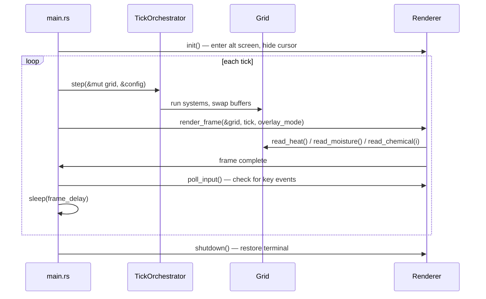

# Design Document: Terminal Visualization

## Overview

A COLD-path terminal renderer that reads the `Grid`'s read buffers after each `TickOrchestrator::step()` and draws a character+color heatmap to the terminal via `crossterm 0.28`. The renderer lives in `src/viz/` as a standalone module with no coupling back into the simulation core. It owns no simulation state — it borrows `&Grid` immutably for each frame.

Key design decisions:
- **Separation of concerns**: The `viz` module depends on `grid` (read-only), never the reverse. `main.rs` orchestrates the tick loop and calls the renderer.
- **crossterm for terminal control**: Already in `Cargo.toml`. Provides cursor movement, alternate screen, raw mode, color output, and non-blocking key event polling.
- **Per-frame normalization**: Each frame normalizes against the current field buffer's max, so the visualization auto-scales as values diffuse.
- **No threads for rendering**: Rendering is synchronous, called after each tick in the main loop. The simulation itself may use rayon internally, but the render call is single-threaded COLD-path code.

## Architecture

```
┌─────────────┐      ┌──────────────────┐      ┌─────────────┐
│  main.rs    │─────▶│ TickOrchestrator │─────▶│    Grid     │
│ (loop)      │      │   ::step()       │      │ (read bufs) │
│             │      └──────────────────┘      └──────┬──────┘
│             │                                       │ &Grid (immutable borrow)
│             │──────────────────────────────────────▶ │
│             │      ┌──────────────────┐             │
│             │─────▶│   Renderer       │◀────────────┘
│             │      │ (src/viz/)       │
│             │      └──────────────────┘
└─────────────┘
```



## Components and Interfaces

### Module: `src/viz/mod.rs`

Re-exports submodules.

```rust
pub mod color;
pub mod glyph;
pub mod input;
pub mod renderer;
pub mod stats;
```

### `OverlayMode` enum

```rust
/// Which field layer is currently being visualized.
#[derive(Debug, Clone, Copy, PartialEq, Eq)]
pub enum OverlayMode {
    Chemical(usize),  // species index (0-based internally)
    Heat,
    Moisture,
}

impl OverlayMode {
    pub fn label(&self) -> String {
        match self {
            Self::Chemical(i) => format!("Chemical {}", i),
            Self::Heat => "Heat".into(),
            Self::Moisture => "Moisture".into(),
        }
    }
}
```

### `RendererConfig` struct

```rust
pub struct RendererConfig {
    /// Milliseconds to sleep between frames.
    pub frame_delay_ms: u64,
    /// Initial overlay mode.
    pub initial_overlay: OverlayMode,
}
```

### `Renderer` struct — `src/viz/renderer.rs`

```rust
pub struct Renderer {
    config: RendererConfig,
    overlay: OverlayMode,
    terminal_width: u16,
    terminal_height: u16,
    stdout: std::io::Stdout,
}

impl Renderer {
    /// Enter alternate screen, enable raw mode, hide cursor.
    pub fn init(config: RendererConfig) -> anyhow::Result<Self>;

    /// Draw one frame: normalize field, map to glyphs+colors, write to terminal.
    pub fn render_frame(&mut self, grid: &Grid, tick: u64) -> anyhow::Result<()>;

    /// Poll for a single key event (non-blocking). Returns updated OverlayMode or quit signal.
    pub fn poll_input(&mut self, num_chemicals: usize) -> anyhow::Result<InputAction>;

    /// Restore terminal: leave alternate screen, disable raw mode, show cursor.
    pub fn shutdown(&mut self) -> anyhow::Result<()>;
}
```

### `InputAction` enum — `src/viz/input.rs`

```rust
pub enum InputAction {
    None,
    SwitchOverlay(OverlayMode),
    Quit,
}
```

Handles key mapping:
- `q` / `Esc` → `Quit`
- `1`–`9` → `SwitchOverlay(Chemical(n-1))` if `n-1 < num_chemicals`
- `h` → `SwitchOverlay(Heat)`
- `m` → `SwitchOverlay(Moisture)`
- Anything else → `None`

### `glyph` module — `src/viz/glyph.rs`

```rust
/// Map a normalized value [0.0, 1.0] to a display character.
pub fn value_to_glyph(normalized: f32) -> char {
    match normalized {
        v if v < 0.01 => ' ',
        v if v < 0.25 => '.',
        v if v < 0.50 => ':',
        v if v < 0.75 => '*',
        _ => '#',
    }
}
```

Threshold boundaries: `[0.0, 0.01)` → space, `[0.01, 0.25)` → `.`, `[0.25, 0.50)` → `:`, `[0.50, 0.75)` → `*`, `[0.75, 1.0]` → `#`.

### `color` module — `src/viz/color.rs`

```rust
use crossterm::style::Color;

/// Map a normalized value [0.0, 1.0] to a foreground color for heat overlay.
/// Blue → Cyan → Green → Yellow → Red gradient.
pub fn heat_color(normalized: f32) -> Color;

/// Map a normalized value [0.0, 1.0] to a background color for moisture overlay.
/// Dark blue → bright blue single-hue gradient.
pub fn moisture_bg_color(normalized: f32) -> Color;

/// Map a normalized value [0.0, 1.0] to a foreground color for chemical overlay.
/// Green-scale gradient (dark → bright).
pub fn chemical_color(normalized: f32) -> Color;
```

Heat color implementation uses `Color::Rgb` with interpolation across 5 stops:
| Range | From | To |
|-------|------|----|
| 0.00–0.25 | Blue (0,0,255) | Cyan (0,255,255) |
| 0.25–0.50 | Cyan (0,255,255) | Green (0,255,0) |
| 0.50–0.75 | Green (0,255,0) | Yellow (255,255,0) |
| 0.75–1.00 | Yellow (255,255,0) | Red (255,0,0) |

Fallback: if `Color::Rgb` is not supported, use `Color::Blue`, `Color::Cyan`, `Color::Green`, `Color::Yellow`, `Color::Red` at the 5 breakpoints.

### `stats` module — `src/viz/stats.rs`

```rust
pub struct FieldStats {
    pub total: f32,
    pub min: f32,
    pub max: f32,
    pub center: f32,
}

/// Compute stats from a field buffer slice.
/// `center_index` is the flat index of the grid center cell.
pub fn compute_stats(buffer: &[f32], center_index: usize) -> FieldStats;

/// Format the stats bar string for display.
pub fn format_stats_bar(tick: u64, overlay: &OverlayMode, stats: &FieldStats) -> String;
```

### Normalization logic (inside `renderer.rs`)

```rust
/// Normalize a field buffer in-place into a pre-allocated output Vec.
/// Returns the max value used for normalization.
fn normalize_field(raw: &[f32], out: &mut Vec<f32>) -> f32 {
    let max_val = raw.iter().copied().fold(f32::NEG_INFINITY, f32::max);
    let divisor = if max_val.abs() < 1e-9 { 1.0 } else { max_val };
    out.clear();
    out.reserve(raw.len());
    for &v in raw {
        out.push(v / divisor);
    }
    max_val
}
```

When all values are identical and non-zero, `max_val == that_value`, so `v / max_val == 1.0` for all cells. When max is near zero, all cells normalize to 0.0.

### Render loop in `main.rs`

```rust
fn run_visualization(config: GridConfig, defaults: CellDefaults, viz_config: RendererConfig) -> anyhow::Result<()> {
    let mut grid = Grid::new(config.clone(), defaults)?;
    // ... seed initial state ...

    let mut renderer = Renderer::init(viz_config)?;
    let mut tick: u64 = 0;

    loop {
        TickOrchestrator::step(&mut grid, &config)?;
        tick += 1;
        renderer.render_frame(&grid, tick)?;

        match renderer.poll_input(config.num_chemicals)? {
            InputAction::Quit => break,
            InputAction::SwitchOverlay(mode) => renderer.set_overlay(mode),
            InputAction::None => {}
        }

        std::thread::sleep(std::time::Duration::from_millis(viz_config.frame_delay_ms));
    }

    renderer.shutdown()?;
    Ok(())
}
```

### Terminal clipping logic

At startup, `Renderer::init()` calls `crossterm::terminal::size()` to get `(cols, rows)`. During `render_frame()`:
- `render_width = min(grid.width(), terminal_width as u32)`
- `render_height = min(grid.height(), (terminal_height - stats_lines) as u32)` where `stats_lines` accounts for the Stats_Bar.
- Only cells within `[0..render_width) × [0..render_height)` are drawn.

## Data Models

### Field buffer access pattern

The Renderer reads field data through the Grid's public read API:

```
Grid::read_chemical(species) -> &[f32]   // flat array, row-major
Grid::read_heat()            -> &[f32]
Grid::read_moisture()        -> &[f32]
Grid::width()                -> u32
Grid::height()               -> u32
Grid::index(x, y)            -> Result<usize, GridError>
```

Cell at `(x, y)` is at flat index `y * width + x`.

### Internal render buffer

The Renderer pre-allocates a `Vec<f32>` for normalized values, reused across frames to avoid per-frame allocation:

```rust
struct Renderer {
    // ...
    norm_buffer: Vec<f32>,  // capacity = grid.cell_count(), reused each frame
}
```

### Stats computation

Stats are computed from the raw (un-normalized) field buffer to give meaningful physical values. The center cell index is computed once at init: `center_index = (height / 2) * width + (width / 2)`.


## Correctness Properties

*A property is a characteristic or behavior that should hold true across all valid executions of a system — essentially, a formal statement about what the system should do. Properties serve as the bridge between human-readable specifications and machine-verifiable correctness guarantees.*

The following properties were derived from the acceptance criteria prework analysis. Each property is universally quantified and references the requirement it validates.

### Property 1: Glyph threshold correctness

*For any* f32 value `v` in `[0.0, 1.0]`, `value_to_glyph(v)` SHALL return:
- `' '` when `v < 0.01`
- `'.'` when `0.01 <= v < 0.25`
- `':'` when `0.25 <= v < 0.50`
- `'*'` when `0.50 <= v < 0.75`
- `'#'` when `0.75 <= v <= 1.0`

and the result is always exactly one of these five characters.

**Validates: Requirements 1.1, 1.4**

### Property 2: Normalization bounds

*For any* non-negative f32 slice (representing a field buffer) where at least one value exceeds 1e-9, every element of the normalized output SHALL be in `[0.0, 1.0]`.

**Validates: Requirements 1.2**

### Property 3: Heat color gradient monotonicity

*For any* two normalized values `a` and `b` where `0.0 <= a < b <= 1.0`, the red channel of `heat_color(b)` SHALL be greater than or equal to the red channel of `heat_color(a)`, and the blue channel of `heat_color(a)` SHALL be greater than or equal to the blue channel of `heat_color(b)`.

**Validates: Requirements 2.1**

### Property 4: Moisture blue-channel dominance

*For any* normalized value `v` in `[0.0, 1.0]`, the `moisture_bg_color(v)` result SHALL have a blue channel value greater than or equal to both its red and green channel values.

**Validates: Requirements 3.2**

### Property 5: Key-to-overlay mapping correctness

*For any* digit character `c` in `'1'..='9'` and any `num_chemicals: usize`, the input mapping function SHALL return `SwitchOverlay(Chemical(c - 1))` if `(c as usize - 1) < num_chemicals`, and `None` otherwise.

**Validates: Requirements 6.1, 6.4**

### Property 6: Stats bar completeness

*For any* valid `tick: u64`, `OverlayMode`, and `FieldStats { total, min, max, center }`, the string returned by `format_stats_bar()` SHALL contain: the tick number as a substring, the overlay mode label as a substring, and string representations of total, min, max, and center values.

**Validates: Requirements 5.4, 6.5, 7.1**

### Property 7: Viewport clipping

*For any* grid dimensions `(gw, gh)` and terminal dimensions `(tw, th)` where all are positive, the computed render dimensions SHALL satisfy `render_width <= min(gw, tw)` and `render_height <= min(gh, th - stats_lines)`.

**Validates: Requirements 8.2**

### Property 8: Glyph round-trip consistency

*For any* normalized value `v` in `[0.0, 1.0]`, the glyph returned by `value_to_glyph(v)` corresponds to a threshold range `[lo, hi)`, and `v` SHALL fall within that range. That is, the mapping does not misclassify any value.

**Validates: Requirements 9.2**

## Error Handling

This is COLD-path application-boundary code. `anyhow::Result` is used throughout the `viz` module.

| Error Source | Handling |
|---|---|
| `crossterm` terminal operations fail (enter alt screen, raw mode, cursor) | Propagate via `anyhow`. The render loop in `main.rs` catches the error, attempts `shutdown()` for cleanup, then exits with an error message. |
| `Grid::read_chemical(species)` returns `Err(InvalidChemicalSpecies)` | Should not occur if `OverlayMode` is validated against `config.num_chemicals` at key-press time. If it does, propagate the error and exit the render loop. |
| Terminal size query fails | Fall back to a default size (80×24). Log a warning if `tracing` is enabled. |
| `TickOrchestrator::step()` returns `Err(TickError)` | Propagate to `main`. The render loop exits, `shutdown()` restores terminal state, and the error is printed. |
| Normalization division by zero | Handled by the epsilon guard (1e-9). Not an error — all cells normalize to 0.0. |

Cleanup invariant: `Renderer::shutdown()` MUST be called on all exit paths (normal exit, error, Ctrl+C). Use a `Drop` impl or a scope guard (`scopeguard` crate or manual `defer` pattern) to guarantee terminal restoration.

## Testing Strategy

### Property-Based Tests

Use `proptest` (already in `dev-dependencies`) with minimum 100 iterations per property.

Each property test is tagged with a comment:
```rust
// Feature: terminal-visualization, Property N: <property_text>
```

Properties to implement as `proptest` tests:
1. **Glyph threshold correctness** — generate `f32` in `[0.0, 1.0]`, verify glyph matches threshold bucket.
2. **Normalization bounds** — generate `Vec<f32>` of non-negative values with at least one > 1e-9, verify all normalized outputs in `[0.0, 1.0]`.
3. **Heat color gradient monotonicity** — generate pairs `(a, b)` where `a < b` in `[0.0, 1.0]`, verify red channel non-decreasing and blue channel non-increasing.
4. **Moisture blue-channel dominance** — generate `f32` in `[0.0, 1.0]`, verify blue >= red and blue >= green.
5. **Key-to-overlay mapping** — generate `(digit: 1..=9, num_chemicals: 0..=9)`, verify correct `InputAction`.
6. **Stats bar completeness** — generate random `tick`, `OverlayMode`, `FieldStats`, verify all fields present in output string.
7. **Viewport clipping** — generate `(gw, gh, tw, th)` as positive u32/u16, verify render dimensions are clamped.
8. **Glyph round-trip consistency** — generate `f32` in `[0.0, 1.0]`, verify value falls within the threshold range of its assigned glyph.

### Unit Tests

Unit tests cover specific examples and edge cases not handled by properties:

- **Normalization edge case**: buffer of all zeros → all normalized to 0.0 (Req 1.3)
- **Normalization edge case**: buffer of identical non-zero values → all normalized to 1.0 (Req 9.3)
- **Key mapping examples**: `'h'` → `Heat`, `'m'` → `Moisture`, `'q'` → `Quit`, `Esc` → `Quit` (Req 5.3, 6.2, 6.3)
- **Stats bar with tick 0**: verify tick 0 renders correctly
- **Glyph boundary values**: test exact boundary values 0.0, 0.01, 0.25, 0.50, 0.75, 1.0

### Integration Considerations

Terminal rendering (alternate screen, cursor movement, color output) cannot be property-tested in CI. These are verified manually during development. The design isolates pure logic (normalization, glyph mapping, color mapping, stats formatting, input mapping, clipping) from terminal I/O so that all testable behavior lives in pure functions.
