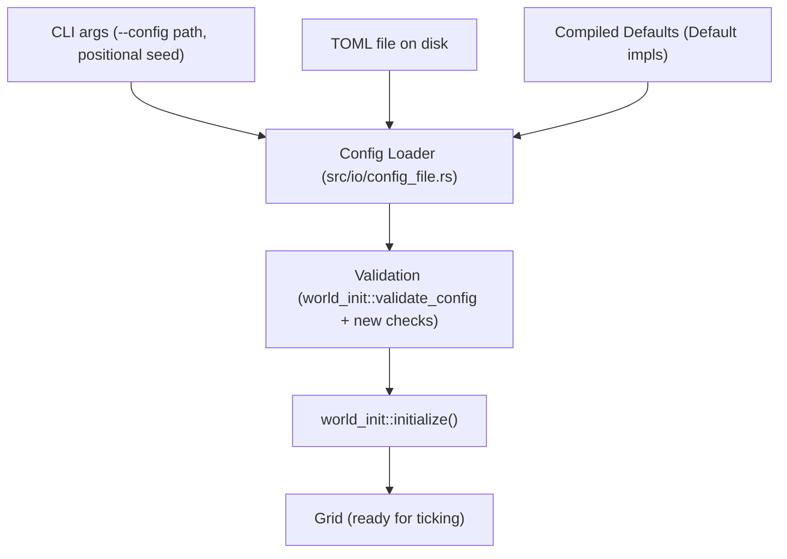

# Design Document: TOML World Configuration

## Overview

This feature adds file-based configuration to the simulation engine via TOML. A new `src/io/` module handles deserialization, validation, and CLI argument parsing. Both binaries (`main.rs`, `bevy_viz.rs`) gain a `--config <path>` flag. The entire feature is COLD path — runs once at startup — so allocations, `String`, and dynamic dispatch are all permitted.

The design introduces a single top-level `WorldConfig` struct that aggregates `seed`, `GridConfig`, `WorldInitConfig`, and `ActorConfig`. Serde's `#[serde(default)]` provides partial-override semantics: any field omitted from the TOML falls back to the compiled default. The existing `validate_config` pipeline runs after deserialization, so invalid parameter combinations are caught before the simulation starts.

## Architecture



The data flow is linear and unidirectional:

1. CLI parser extracts `--config` path and optional positional seed.
2. Config loader reads the TOML file (if provided), deserializes into `WorldConfig`, merges with defaults.
3. Validator runs existing range checks plus new cross-field checks (decay rates length, removal threshold sign).
4. Validated config is destructured and passed to `world_init::initialize()`.

Both binaries share the same loader and validator. The only divergence is that `bevy_viz.rs` also reads Bevy-specific fields (`tick_hz`, `zoom_min`, etc.) from an optional `[bevy]` TOML section, falling back to its own hardcoded defaults.

## Components and Interfaces

### New Module: `src/io/config_file.rs`

This module lives under `src/io/` (the application-boundary I/O module referenced in the project structure). It contains:

**`WorldConfig`** — Top-level serde struct mapping to the TOML document:

```rust
#[derive(Debug, Clone, PartialEq, Serialize, Deserialize)]
#[serde(deny_unknown_fields)]
pub struct WorldConfig {
    #[serde(default = "default_seed")]
    pub seed: u64,
    #[serde(default)]
    pub grid: GridConfig,
    #[serde(default)]
    pub world_init: WorldInitConfig,
    #[serde(default)]
    pub actor: Option<ActorConfig>,
}
```

**`BevyExtras`** — Optional Bevy-specific section, only consumed by `bevy_viz.rs`:

```rust
#[derive(Debug, Clone, PartialEq, Serialize, Deserialize)]
#[serde(deny_unknown_fields)]
pub struct BevyExtras {
    #[serde(default = "default_tick_hz")]
    pub tick_hz: f64,
    #[serde(default = "default_zoom_min")]
    pub zoom_min: f32,
    #[serde(default = "default_zoom_max")]
    pub zoom_max: f32,
    #[serde(default = "default_zoom_speed")]
    pub zoom_speed: f32,
    #[serde(default = "default_pan_speed")]
    pub pan_speed: f32,
    #[serde(default = "default_color_scale_max")]
    pub color_scale_max: f32,
}
```

**`BevyWorldConfig`** — Extended top-level struct for the Bevy binary:

```rust
#[derive(Debug, Clone, PartialEq, Serialize, Deserialize)]
#[serde(deny_unknown_fields)]
pub struct BevyWorldConfig {
    #[serde(flatten)]
    pub world: WorldConfig,
    #[serde(default)]
    pub bevy: BevyExtras,
}
```

**Public functions:**

```rust
/// Load a WorldConfig from a TOML file path. Returns ConfigError on I/O or parse failure.
pub fn load_world_config(path: &Path) -> Result<WorldConfig, ConfigError>;

/// Load a BevyWorldConfig from a TOML file path.
pub fn load_bevy_config(path: &Path) -> Result<BevyWorldConfig, ConfigError>;

/// Validate a WorldConfig beyond serde: cross-field invariants.
pub fn validate_world_config(config: &WorldConfig) -> Result<(), ConfigError>;

/// Serialize a WorldConfig to a TOML string (pretty-printer).
pub fn to_toml_string(config: &WorldConfig) -> Result<String, ConfigError>;
```

### New Module: `src/io/cli.rs`

Minimal CLI argument parser. No external crate dependency — the argument surface is small enough for manual parsing.

```rust
pub struct CliArgs {
    pub config_path: Option<PathBuf>,
    pub seed_override: Option<u64>,
}

/// Parse CLI arguments. Returns ConfigError on malformed input.
pub fn parse_cli_args() -> Result<CliArgs, ConfigError>;
```

Argument grammar:
- `--config <path>` — optional, path to TOML file
- Positional `<seed>` — optional u64, overrides TOML seed if both present
- Order-independent: `--config` can appear before or after the positional seed

### New Error Type: `src/io/config_error.rs`

```rust
#[derive(Debug, thiserror::Error)]
pub enum ConfigError {
    #[error("failed to read config file '{path}': {source}")]
    Io { path: PathBuf, source: std::io::Error },

    #[error("TOML parse error: {0}")]
    Parse(#[from] toml::de::Error),

    #[error("TOML serialization error: {0}")]
    Serialize(#[from] toml::ser::Error),

    #[error("validation failed: {reason}")]
    Validation { reason: String },

    #[error("CLI argument error: {reason}")]
    CliError { reason: String },
}
```

This is a domain error type using `thiserror`, consistent with the project convention. `anyhow` is used only at the binary entry points to wrap `ConfigError` for final reporting.

### Modified Module: `src/io/mod.rs`

New submodule that re-exports the public API:

```rust
pub mod cli;
pub mod config_error;
pub mod config_file;
```

### Serde Derives on Existing Structs

`GridConfig`, `WorldInitConfig`, `SourceFieldConfig`, `ActorConfig`, and `CellDefaults` all gain `#[derive(Serialize, Deserialize)]` with `#[serde(default)]` on each field. This is additive — no existing behavior changes. The `serde` dependency is feature-gated behind a `serde` feature flag on the library crate, though both binaries enable it.

`Default` implementations are added to `GridConfig` and `ActorConfig` (they currently lack them). `WorldInitConfig` and `SourceFieldConfig` already have `Default`.

## Data Models

### TOML Document Structure

```toml
# Seed for deterministic world generation. Default: 42
seed = 99

[grid]
width = 128
height = 128
num_chemicals = 1
diffusion_rate = 0.05
thermal_conductivity = 0.05
ambient_heat = 0.0
tick_duration = 1.0
num_threads = 4
chemical_decay_rates = [0.05]

[world_init]
min_initial_heat = 0.0
max_initial_heat = 1.0
min_initial_concentration = 0.0
max_initial_concentration = 0.5
min_actors = 5
max_actors = 10

[world_init.heat_source_config]
min_sources = 1
max_sources = 5
min_emission_rate = 0.1
max_emission_rate = 5.0
renewable_fraction = 0.3
min_reservoir_capacity = 50.0
max_reservoir_capacity = 200.0
min_deceleration_threshold = 0.1
max_deceleration_threshold = 0.5

[world_init.chemical_source_config]
min_sources = 1
max_sources = 3
min_emission_rate = 0.1
max_emission_rate = 5.0
renewable_fraction = 0.3
min_reservoir_capacity = 50.0
max_reservoir_capacity = 200.0
min_deceleration_threshold = 0.1
max_deceleration_threshold = 0.5

[actor]
consumption_rate = 1.5
energy_conversion_factor = 2.0
base_energy_decay = 0.05
initial_energy = 10.0
initial_actor_capacity = 64
movement_cost = 0.5
removal_threshold = -5.0

# Bevy-only section (ignored by terminal binary)
[bevy]
tick_hz = 10.0
zoom_min = 0.1
zoom_max = 10.0
zoom_speed = 0.1
pan_speed = 1.0
color_scale_max = 10.0
```

### Default Value Strategy

Each config struct implements `Default` with values matching the current hardcoded constants in the binaries. Serde's `#[serde(default)]` at the struct level means any omitted TOML section or field falls back to `Default::default()`. This gives partial-override semantics for free.

The `[actor]` section is `Option<ActorConfig>` — if the entire section is absent, it deserializes to `None`, which means no actor systems. If the section is present (even empty), it deserializes to `Some(ActorConfig::default())`.

### Validation Pipeline

After deserialization, validation runs in order:

1. **Cross-field check**: `grid.chemical_decay_rates.len() == grid.num_chemicals`
2. **Sign check**: `actor.removal_threshold <= 0.0` (if actor config present)
3. **Existing range validation**: `world_init::validate_config(&config.world_init)`

All validation errors are surfaced as `ConfigError::Validation` with a human-readable reason string.

### Seed Override Precedence

When both a TOML file and a positional CLI seed are provided:

1. TOML file is loaded (seed from file or default 42)
2. CLI positional seed overwrites `config.seed`

This lets operators share a base config file while varying the seed per run.


## Correctness Properties

*A property is a characteristic or behavior that should hold true across all valid executions of a system — essentially, a formal statement about what the system should do. Properties serve as the bridge between human-readable specifications and machine-verifiable correctness guarantees.*

The following properties are derived from the acceptance criteria. Each is universally quantified and suitable for property-based testing with `proptest`.

### Property 1: TOML round-trip consistency

*For any* valid `WorldConfig` value, serializing it to a TOML string and then deserializing that string back into a `WorldConfig` SHALL produce a value equal to the original.

This is the canonical round-trip property for serialization. It validates that the serializer produces valid TOML (Requirement 1.4), that the deserializer recovers the original structure (Requirement 1.1), and that the two operations are inverses (Requirement 1.5). It also subsumes loading determinism (Requirement 5.1) — if serialize→deserialize is identity, then deserialize is a pure function.

**Validates: Requirements 1.1, 1.4, 1.5, 5.1**

### Property 2: Default fallback for omitted fields

*For any* valid `WorldConfig` and any subset of its fields, serializing only that subset to TOML and deserializing the result SHALL produce a `WorldConfig` where the omitted fields equal `Default::default()` and the included fields equal their serialized values.

This validates the partial-override semantics: operators can specify only the fields they care about, and everything else falls back to compiled defaults.

**Validates: Requirements 1.2**

### Property 3: Unknown key rejection

*For any* valid TOML representation of a `WorldConfig` and any key name that is not a recognized field, inserting that key into the TOML document and attempting deserialization SHALL produce an error.

This validates `#[serde(deny_unknown_fields)]` — typos and stale keys are caught at load time rather than silently ignored.

**Validates: Requirements 1.3**

### Property 4: Invalid range detection

*For any* `WorldInitConfig` where at least one min/max range pair has min strictly greater than max, validation SHALL return an error identifying the invalid range.

This validates that the existing `validate_config` pipeline catches all inverted ranges, not just specific ones.

**Validates: Requirements 2.1**

### Property 5: Type mismatch rejection

*For any* valid TOML representation of a `WorldConfig` and any field, replacing that field's value with a value of an incompatible TOML type SHALL produce a deserialization error.

This validates serde's type checking — a string where a number is expected, a table where a scalar is expected, etc.

**Validates: Requirements 2.4**

### Property 6: CLI --config path extraction

*For any* valid filesystem path string, constructing an argument vector containing `--config <path>` and parsing it SHALL produce `CliArgs` with `config_path` equal to that path.

This validates that the CLI parser correctly extracts the config file path without mangling it.

**Validates: Requirements 3.1**

### Property 7: CLI seed override precedence

*For any* `WorldConfig` with seed S₁ and any CLI positional seed S₂ where S₁ ≠ S₂, loading the config and applying the CLI override SHALL produce a final seed equal to S₂.

This validates that the positional seed always wins when both sources are present.

**Validates: Requirements 3.4**

## Error Handling

All errors in the config loading pipeline are represented by `ConfigError` (defined in `src/io/config_error.rs`), a `thiserror`-derived enum. This follows the project convention: domain errors use `thiserror`, `anyhow` only at binary entry points.

### Error Categories

| Variant | Trigger | Recovery |
|---------|---------|----------|
| `ConfigError::Io` | File not found, permission denied, read failure | Report path and OS error, exit non-zero |
| `ConfigError::Parse` | Malformed TOML syntax, unknown keys, type mismatches | Report toml crate's error (includes line/column), exit non-zero |
| `ConfigError::Serialize` | Serialization failure (unlikely in practice) | Report error, exit non-zero |
| `ConfigError::Validation` | Cross-field invariant violation (decay rates length, removal threshold sign, min > max ranges) | Report which field failed and why, exit non-zero |
| `ConfigError::CliError` | Malformed CLI arguments (e.g., `--config` without a path, non-numeric seed) | Report usage hint, exit non-zero |

### Error Flow

1. `parse_cli_args()` returns `Result<CliArgs, ConfigError>`.
2. `load_world_config(path)` returns `Result<WorldConfig, ConfigError>` — wraps I/O and parse errors.
3. `validate_world_config(&config)` returns `Result<(), ConfigError>` — wraps validation errors.
4. In `main()`, all three are chained with `?` under `anyhow`, producing a single human-readable error message on failure.

### Existing Validation Integration

`world_init::validate_config` returns `WorldInitError`. The new `validate_world_config` function calls it internally and maps `WorldInitError` into `ConfigError::Validation`. This avoids changing the existing error type's public API.

## Testing Strategy

### Property-Based Testing

Use `proptest` (already in `dev-dependencies`) for all correctness properties. Each property test runs a minimum of 100 iterations with generated inputs.

**Generator strategy**: Implement `Arbitrary` (via `proptest::arbitrary`) for `WorldConfig`, `GridConfig`, `WorldInitConfig`, `SourceFieldConfig`, and `ActorConfig`. Generators constrain values to valid ranges (positive dimensions, non-negative rates, decay rates in [0,1], etc.) to produce structurally valid configs.

Each property test is tagged with a comment referencing the design property:

```rust
// Feature: toml-world-config, Property 1: TOML round-trip consistency
// Validates: Requirements 1.1, 1.4, 1.5, 5.1
proptest! {
    #[test]
    fn round_trip(config in arb_world_config()) {
        let toml_str = to_toml_string(&config).unwrap();
        let recovered: WorldConfig = toml::from_str(&toml_str).unwrap();
        prop_assert_eq!(config, recovered);
    }
}
```

**Property test file**: `tests/config_properties.rs` (integration test, accesses public API only).

### Unit Testing

Unit tests complement property tests by covering specific examples and edge cases:

- **Decay rates length mismatch** (Requirement 2.2): `num_chemicals = 2`, `chemical_decay_rates = [0.05]` → validation error.
- **Positive removal threshold** (Requirement 2.3): `removal_threshold = 1.0` → validation error.
- **Empty args** (Requirement 3.2): `parse_cli_args` with no args → `config_path: None, seed_override: None`.
- **Missing file** (Requirement 3.3): `load_world_config("/nonexistent.toml")` → `ConfigError::Io`.
- **Default backward compatibility** (Requirements 4.1–4.4): `WorldConfig::default()` matches current hardcoded values.
- **Bevy defaults** (Requirement 6.3): Deserialize TOML without `[bevy]` section → `BevyExtras::default()` matches current hardcoded Bevy values.

**Unit test location**: `src/io/config_file.rs` (module-level `#[cfg(test)]` block) and `src/io/cli.rs`.

### Test Configuration

- `proptest`: minimum 100 cases per property (default `PROPTEST_CASES=256`).
- All tests run with `cargo test` — no watch mode, no external services.
- Property tests are integration tests in `tests/` to exercise the public API surface.
- Unit tests are co-located with the module they test.
