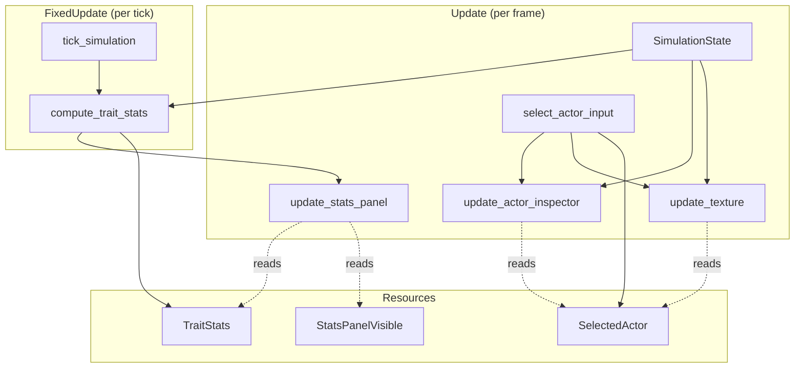

# Design Document: Trait Visualization

## Overview

This feature adds two COLD-path visualization systems to the Bevy viewer: a population statistics panel and an actor inspection mechanism. Both are read-only consumers of `SimulationState` — no simulation core modifications required. All new code lives in `src/viz_bevy/`.

The design follows existing patterns: marker components for UI entities, Bevy resources for state, `is_changed()` gating to avoid unnecessary work, and pure formatting functions for testability.

## Architecture



### System Registration

All new systems register in `BevyVizPlugin::build`:

| System | Schedule | Classification | Description |
|---|---|---|---|
| `compute_trait_stats` | `FixedUpdate` | COLD | Collects trait values from all living actors, sorts, computes stats. Runs after `tick_simulation`. |
| `stats_panel_input` | `Update` | COLD | Toggles `StatsPanelVisible` on `T` key press. |
| `update_stats_panel` | `Update` | COLD | Syncs panel text + visibility from `TraitStats` and `StatsPanelVisible`. |
| `select_actor_input` | `Update` | COLD | Handles left-click selection and Escape deselection. Writes `SelectedActor`. |
| `update_actor_inspector` | `Update` | COLD | Syncs inspector panel text + visibility from `SelectedActor` and `SimulationState`. |

The existing `update_texture` system is modified (not replaced) to read `SelectedActor` and render the highlight color.

The existing `handle_input` system is modified so that `Escape` deselects before triggering app exit.

### Ordering Constraints

- `compute_trait_stats` runs after `tick_simulation` in `FixedUpdate` (use `.after()`).
- `select_actor_input` must run before `update_texture` in `Update` so the highlight reflects the current selection in the same frame.

## Components and Interfaces

### New Bevy Resources

```rust
/// Pre-computed population statistics for heritable traits.
/// Recomputed every tick in FixedUpdate. COLD path.
#[derive(Resource, Debug, Clone)]
pub struct TraitStats {
    pub actor_count: usize,
    pub tick: u64,
    /// Per-trait statistics. Array order: [consumption_rate, base_energy_decay,
    /// levy_exponent, reproduction_threshold].
    /// None when actor_count == 0.
    pub traits: Option<[SingleTraitStats; 4]>,
}

#[derive(Debug, Clone, Copy)]
pub struct SingleTraitStats {
    pub min: f32,
    pub max: f32,
    pub mean: f32,
    pub p25: f32,
    pub p50: f32,
    pub p75: f32,
}

/// Tracks the currently selected actor for inspection.
/// None = no selection.
#[derive(Resource, Default)]
pub struct SelectedActor(pub Option<usize>); // slot index

/// Tracks whether the stats panel is visible.
/// Default: hidden.
#[derive(Resource)]
pub struct StatsPanelVisible(pub bool);
```

### New Marker Components

```rust
/// Marker for the population stats panel text entity.
#[derive(Component)]
pub struct StatsPanel;

/// Marker for the actor inspector panel text entity.
#[derive(Component)]
pub struct ActorInspector;
```

### Pure Formatting Functions

```rust
/// Format TraitStats into a display string for the stats panel.
/// Pure function, testable in isolation.
pub fn format_trait_stats(stats: &TraitStats) -> String;

/// Format a single selected actor's state into a display string.
/// Pure function, testable in isolation.
pub fn format_actor_info(
    actor: &Actor,
    slot_index: usize,
    grid_width: u32,
) -> String;
```

### Modified Existing Systems

`handle_input`: Add a guard — when `SelectedActor` is `Some`, consume `Escape` to deselect instead of exiting. Only exit on `Escape` when nothing is selected.

`update_texture`: After painting all actors white, check `SelectedActor`. If `Some(slot_index)`, find the actor's `cell_index` and overwrite that pixel with cyan `[0, 255, 255, 255]`.

## Data Models

### TraitStats Computation

`compute_trait_stats` collects trait values from living actors into four `Vec<f32>` buffers (one per trait), sorts each, then derives statistics. This is a COLD path — heap allocation is acceptable.

```
Algorithm: compute_trait_stats
  Input: ActorRegistry (via SimulationState), current tick
  Output: TraitStats resource

  1. Count living actors (not inert).
  2. If count == 0: write TraitStats { actor_count: 0, tick, traits: None }. Return.
  3. Collect four Vec<f32> from living actors' HeritableTraits fields.
  4. Sort each Vec<f32> (total_cmp for NaN safety).
  5. For each sorted vec, compute:
     - min = first element
     - max = last element
     - mean = sum / count
     - p25 = element at index (count - 1) * 25 / 100
     - p50 = element at index (count - 1) * 50 / 100
     - p75 = element at index (count - 1) * 75 / 100
  6. Write TraitStats with the four SingleTraitStats.
```

Percentile computation uses nearest-rank method (floor index). For a single actor, all percentile indices resolve to 0, satisfying Requirement 1.5.

### Coordinate Mapping for Click Selection

The `select_actor_input` system reuses the same cursor → world → grid cell math from `update_hover_tooltip`:

```
1. Get cursor screen position from Window.
2. Project to world 2D via Camera::viewport_to_world_2d.
3. Compute local position relative to sprite origin.
4. Floor to grid (gx, gy), flip y for row-major indexing.
5. Compute cell_index = gy * width + gx.
6. Look up occupancy[cell_index] for slot index.
```

### Stats Panel Layout

The stats panel is positioned at `top: 40px, right: 80px` — to the left of the scale bar and below the rate label. Format:

```
Tick: 1234  |  Actors: 567

consumption_rate     min: 0.12  p25: 0.45  p50: 0.78  p75: 1.23  max: 2.34  mean: 0.89
base_energy_decay    min: 0.01  p25: 0.03  p50: 0.05  p75: 0.08  max: 0.15  mean: 0.06
levy_exponent        min: 1.10  p25: 1.35  p50: 1.50  p75: 1.72  max: 2.10  mean: 1.52
reproduction_thresh  min: 5.00  p25: 12.0  p50: 18.5  p75: 25.0  max: 40.0  mean: 19.2
```

### Actor Inspector Layout

Positioned at `bottom: 40px, left: 10px` — above the hover tooltip. Format:

```
Actor [slot 42] — active
Position: (15, 22)
Energy: 23.45

consumption_rate:        1.2345
base_energy_decay:       0.0456
levy_exponent:           1.5678
reproduction_threshold: 18.9012
```

### Highlight Color

Selected actor cell: cyan `[0, 255, 255, 255]`. Chosen for high contrast against both the white default actor color and the warm heat/chemical color maps.


## Correctness Properties

*A property is a characteristic or behavior that should hold true across all valid executions of a system — essentially, a formal statement about what the system should do. Properties serve as the bridge between human-readable specifications and machine-verifiable correctness guarantees.*

### Property 1: Stats reflect living actors only

*For any* actor population (including mixtures of active and inert actors), `compute_trait_stats` should produce a `TraitStats` where `actor_count` equals the number of non-inert actors, and all statistical values (min, max, mean, p25, p50, p75) are computed exclusively from non-inert actors' trait values. Edge cases: zero actors yields `traits: None` with `actor_count: 0`; one actor yields all stats equal to that actor's values.

**Validates: Requirements 1.1, 1.3, 1.4, 1.5**

### Property 2: Stats panel formatting completeness

*For any* valid `TraitStats` (with `actor_count > 0`), `format_trait_stats` should produce a string that contains: the tick number, the actor count, and for each of the four trait names (`consumption_rate`, `base_energy_decay`, `levy_exponent`, `reproduction_threshold`) the min, max, mean, p25, p50, and p75 values.

**Validates: Requirements 2.2, 2.3**

### Property 3: Click selection matches occupancy

*For any* grid cell index within bounds and any occupancy map, when a click resolves to that cell, the resulting `SelectedActor` value should equal `occupancy[cell_index]` — `Some(slot_index)` if occupied, `None` if empty.

**Validates: Requirements 3.1, 3.2**

### Property 4: Stale selection cleared

*For any* `SelectedActor` holding `Some(slot_index)`, if the actor registry no longer contains a living actor at that slot index (slot is empty or actor is inert), the system should clear `SelectedActor` to `None`.

**Validates: Requirements 3.4**

### Property 5: Actor inspector formatting completeness

*For any* valid `Actor` and grid width, `format_actor_info` should produce a string that contains: the slot index, the actor's energy, the grid position (column, row) derived from `cell_index` and `grid_width`, the state ("active" or "inert"), and all four heritable trait values.

**Validates: Requirements 4.1, 4.2**

### Property 6: Highlight color correctness

*For any* occupancy map and optional `SelectedActor`, after the actor overlay pass in `update_texture`: every occupied cell should have white pixels `[255, 255, 255, 255]` except the cell of the selected actor (if any), which should have cyan pixels `[0, 255, 255, 255]`.

**Validates: Requirements 5.1, 5.2**

### Property 7: Escape dispatch by selection state

*For any* `SelectedActor` state, pressing Escape should: if `SelectedActor` is `Some`, clear it to `None` without triggering `AppExit`; if `SelectedActor` is `None`, trigger `AppExit`.

**Validates: Requirements 6.3, 6.4**

### Property 8: Stats panel toggle

*For any* initial `StatsPanelVisible` boolean state, pressing `T` should produce the logical negation of that state.

**Validates: Requirements 2.1**

## Error Handling

All new systems are COLD-path visualization code. Error handling follows existing patterns:

| Scenario | Handling |
|---|---|
| Zero living actors | `TraitStats.traits` set to `None`. Stats panel shows "No living actors." |
| Selected actor removed mid-tick | `update_actor_inspector` detects stale slot, clears `SelectedActor` to `None`, hides inspector. |
| Click outside grid bounds | `select_actor_input` ignores the click (same bounds check as hover tooltip). |
| Camera query fails (`single()` returns `Err`) | Early return, matching existing system patterns. |
| Actors disabled (`ActorConfig` is `None`) | `compute_trait_stats` sees zero actors, writes empty stats. Stats panel shows count 0. Selection is never populated. |

No panics in any new system. All `single()` / `single_mut()` calls use `let Ok(...) = ... else { return; }` guards.

## Testing Strategy

### Property-Based Tests

Use the `proptest` crate (already idiomatic for Rust property testing). Each property test runs a minimum of 100 iterations.

The pure functions `compute_trait_stats_from_actors`, `format_trait_stats`, and `format_actor_info` are extracted as free functions with no Bevy dependencies, making them directly testable without a Bevy `App` harness.

| Property | Test Target | Generator Strategy |
|---|---|---|
| Property 1 | `compute_trait_stats_from_actors` | Random `Vec<Actor>` with random `inert` flags, 0..200 actors |
| Property 2 | `format_trait_stats` | Random `TraitStats` with `actor_count > 0` |
| Property 3 | Selection logic (extracted helper) | Random occupancy `Vec<Option<usize>>`, random cell index |
| Property 4 | Stale selection check (extracted helper) | Random slot index, random actor registry state |
| Property 5 | `format_actor_info` | Random `Actor`, random grid width 1..1000 |
| Property 6 | Actor overlay pixel logic (extracted helper) | Random occupancy map, random optional selection |
| Property 7 | Escape dispatch logic (extracted helper) | Random `Option<usize>` for selection state |
| Property 8 | Toggle logic | Random bool |

### Unit Tests

- `format_trait_stats` with zero actors → "No living actors" message
- `format_trait_stats` with one actor → all stats equal
- `format_actor_info` with inert actor → shows "inert"
- `format_actor_info` with active actor → shows "active"
- Percentile edge cases: 2 actors, 3 actors, 100 actors
- Highlight pixel buffer: selected actor at corner cells (0, width*height-1)

### Test Organization

All tests live in `src/viz_bevy/` alongside the implementation, in `#[cfg(test)]` modules. Property tests use `proptest!` macro with `ProptestConfig { cases: 100, .. }`.
